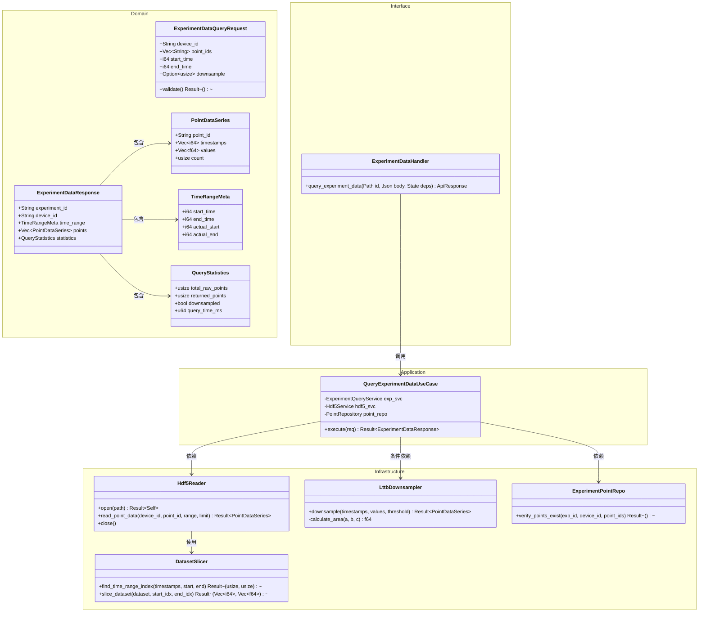
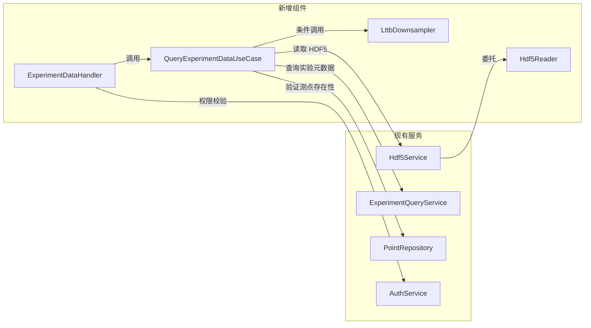
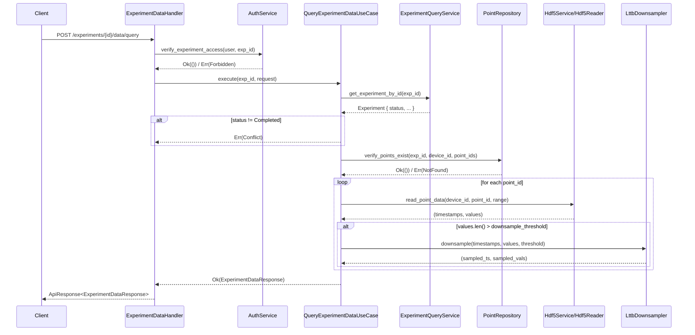
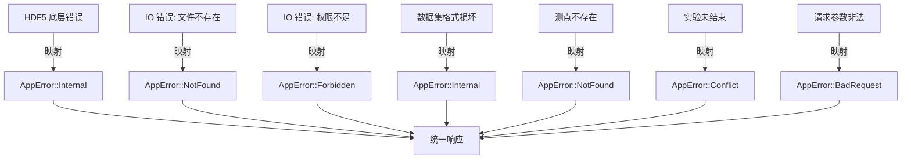
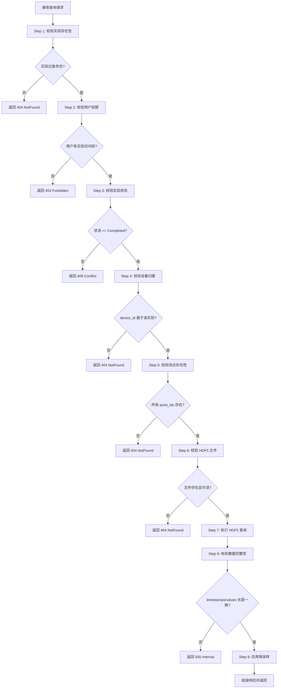

# R2-S1-001-B HDF5 时序数据查询 API 详细设计

## 1. API 端点设计

### 1.1 端点定义

```
POST /api/v1/experiments/{id}/data/query
```

**Content-Type**: `application/json`  
**认证**: Bearer Token (JWT)

### 1.2 请求 DTO

```rust
/// 实验数据查询请求
#[derive(Debug, Deserialize, Validate)]
pub struct ExperimentDataQueryRequest {
    /// 目标设备 ID
    #[validate(length(min = 1, max = 64))]
    pub device_id: String,
    
    /// 目标测点 ID 列表（至少一个）
    #[validate(length(min = 1))]
    pub point_ids: Vec<String>,
    
    /// 起始时间戳（Unix 毫秒，包含）
    #[validate(range(min = 0))]
    pub start_time: i64,
    
    /// 结束时间戳（Unix 毫秒，包含）
    #[validate(range(min = 0))]
    pub end_time: i64,
    
    /// 降采样目标点数（可选，默认 2000，范围 100-10000）
    #[validate(range(min = 100, max = 10000))]
    pub downsample: Option<usize>,
}
```

**校验规则**：
- `start_time` 必须小于等于 `end_time`
- `point_ids` 去重后数量不超过 50
- 时间窗口跨度不超过 30 天（`end_time - start_time <= 30 * 24 * 3600 * 1000`）

### 1.3 响应 DTO

```rust
/// 实验数据查询响应
#[derive(Debug, Serialize)]
pub struct ExperimentDataResponse {
    /// 实验 ID
    pub experiment_id: String,
    /// 设备 ID
    pub device_id: String,
    /// 查询时间范围
    pub time_range: TimeRangeMeta,
    /// 各测点数据
    pub points: Vec<PointDataSeries>,
    /// 采样统计信息
    pub statistics: QueryStatistics,
}

#[derive(Debug, Serialize)]
pub struct TimeRangeMeta {
    pub start_time: i64,
    pub end_time: i64,
    pub actual_start: i64,
    pub actual_end: i64,
}

#[derive(Debug, Serialize)]
pub struct PointDataSeries {
    pub point_id: String,
    pub timestamps: Vec<i64>,
    pub values: Vec<f64>,
    pub count: usize,
}

#[derive(Debug, Serialize)]
pub struct QueryStatistics {
    /// 原始总数据点数（降采样前）
    pub total_raw_points: usize,
    /// 返回数据点数（降采样后）
    pub returned_points: usize,
    /// 是否经过降采样
    pub downsampled: bool,
    /// 查询耗时（毫秒）
    pub query_time_ms: u64,
}
```

### 1.4 错误码映射表

| HTTP Status | `code` 字段 | 场景 | 说明 |
|------------|------------|------|------|
| 200 | `Ok` | 查询成功 | 正常返回，可能为空数据 |
| 400 | `BadRequest` | 请求参数校验失败 | 时间范围非法、point_ids 为空等 |
| 400 | `BadRequest` | 时间窗口超过 30 天 | 防止超大范围查询拖垮系统 |
| 403 | `Forbidden` | 无实验访问权限 | 用户不属于该实验所属项目 |
| 404 | `NotFound` | 实验不存在 | `experiment_id` 未找到 |
| 404 | `NotFound` | HDF5 文件不存在 | 实验状态非 `Completed`，或文件丢失 |
| 404 | `NotFound` | 设备不存在于实验中 | `device_id` 在该实验无记录 |
| 404 | `NotFound` | 测点不存在 | 部分或全部 `point_ids` 无效 |
| 409 | `Conflict` | 实验尚未完成 | 实验状态为 `Running`/`Paused` 等，数据未写入 HDF5 |
| 500 | `Internal` | HDF5 读取失败 | IO 错误、数据集损坏等 |
| 500 | `Internal` | 降采样计算异常 | 内存分配失败等 |

---

## 2. 模块结构

### 2.1 新增文件列表

```
kayak-backend/src/
├── domain/
│   └── experiment/
│       ├── query/
│       │   ├── mod.rs                 # 查询领域模型聚合
│       │   ├── request.rs             # ExperimentDataQueryRequest DTO
│       │   ├── response.rs            # ExperimentDataResponse DTO
│       │   └── statistics.rs          # QueryStatistics, TimeRangeMeta
│       └── data/
│           ├── mod.rs
│           └── point_series.rs        # PointDataSeries 值对象
│
├── application/
│   └── experiment/
│       ├── mod.rs
│       └── query_experiment_data.rs   # QueryExperimentDataUseCase
│
├── infrastructure/
│   ├── hdf5/
│   │   ├── mod.rs
│   │   ├── reader.rs                  # Hdf5Reader 核心读取器
│   │   ├── slicer.rs                  # 数据集切片与索引定位
│   │   └── downsampler.rs             # LTTB 降采样实现
│   └── repository/
│       └── experiment_point_repo.rs   # 实验测点存在性验证（扩展）
│
├── interfaces/
│   └── http/
│       └── handlers/
│           └── experiment_data.rs     # POST /experiments/{id}/data/query
│
└── shared/
    └── validation/
        └── time_range.rs              # 时间范围跨域校验规则
```

### 2.2 模块划分类图



---

## 3. HDF5 读取方案

### 3.1 文件定位

```
路径规则: {DATA_DIR}/experiments/{experiment_id}.h5
示例:     ./data/experiments/exp_20240510_001.h5
```

**前置校验**：
1. 从 SQLite 查询 `experiment_id` 存在性
2. 确认实验状态为 `Completed`（仅已完成实验才有 HDF5 文件）
3. 文件系统校验 `.h5` 文件存在且可读

### 3.2 内部结构导航

```
HDF5 文件结构:
/
├── {device_id_1}/
│   ├── {point_id_1}/
│   │   ├── timestamps  (Dataset: i64[N])
│   │   └── values      (Dataset: f64[N])
│   ├── {point_id_2}/
│   │   ├── timestamps
│   │   └── values
│   └── ...
├── {device_id_2}/
│   └── ...
```

### 3.3 数据集切片与时间范围过滤

```mermaid
flowchart TD
    A[打开 HDF5 文件] --> B[定位 /{device_id}/{point_id} 组]
    B --> C{组是否存在?}
    C -->|否| D[返回 NotFound: 设备或测点不存在]
    C -->|是| E[读取 timestamps 数据集]
    E --> F[二分查找 start_time 对应索引]
    E --> G[二分查找 end_time 对应索引]
    F --> H[计算切片范围 start_idx..end_idx]
    G --> H
    H --> I{切片大小 > downsample阈值?}
    I -->|是| J[读取完整切片到内存]
    I -->|否| J
    J --> K[关闭数据集引用]
    K --> L[返回原始数据或进入降采样]
```

**切片读取 Rust 伪代码**：

```rust
impl Hdf5Reader {
    pub fn read_point_data(
        &self,
        device_id: &str,
        point_id: &str,
        start_time: i64,
        end_time: i64,
    ) -> Result<(Vec<i64>, Vec<f64>), AppError> {
        let group_path = format!("/{}/{}", device_id, point_id);
        let group = self.file.group(&group_path)
            .map_err(|_| AppError::NotFound(format!("测点 {} 不存在", point_id)))?;
        
        let timestamps_ds = group.dataset("timestamps")?;
        let values_ds = group.dataset("values")?;
        
        // 读取全部时间戳以定位索引（HDF5 不支持直接按值索引）
        let all_timestamps: ndarray::Array1<i64> = timestamps_ds.read_1d()?;
        
        let start_idx = all_timestamps.iter()
            .position(|&t| t >= start_time)
            .unwrap_or(all_timestamps.len());
            
        let end_idx = all_timestamps.iter()
            .rposition(|&t| t <= end_time)
            .map(|i| i + 1)
            .unwrap_or(0);
        
        if start_idx >= end_idx {
            return Ok((vec![], vec![]));
        }
        
        // 使用 HDF5 hyperslab 按索引切片，避免读取全部数据
        let slice_size = end_idx - start_idx;
        let ts_slice = timestamps_ds.read_slice_1d(
            ndarray::s![start_idx..end_idx]
        )?;
        let val_slice = values_ds.read_slice_1d(
            ndarray::s![start_idx..end_idx]
        )?;
        
        Ok((ts_slice.to_vec(), val_slice.to_vec()))
    }
}
```

**优化说明**：
- 首次读取需加载完整 `timestamps` 数组以定位索引，后续可缓存索引映射
- 实际数据读取使用 `read_slice` 仅加载目标区间
- 对多 `point_ids` 查询，复用同一文件句柄，避免重复打开

---

## 4. LTTB 降采样算法

### 4.1 算法原理

LTTB（Largest Triangle Three Buckets）是一种保持视觉形状的时序数据降采样算法。它将数据分为 `D` 个桶，每个桶选择能与前一个已选点和桶平均值形成最大三角形的点。

### 4.2 Rust 实现

```rust
pub struct LttbDownsampler;

impl LttbDownsampler {
    /// 执行 LTTB 降采样
    /// 
    /// # 边界条件
    /// - 若 N < D：返回全部 N 个点（无需降采样）
    /// - 若 N >= D：返回恰好 D 个点（含首尾）
    pub fn downsample(
        timestamps: &[i64],
        values: &[f64],
        threshold: usize,
    ) -> Result<(Vec<i64>, Vec<f64>), AppError> {
        let n = timestamps.len();
        
        // 边界条件 1: 数据点数少于阈值，无需降采样
        if n < threshold {
            return Ok((timestamps.to_vec(), values.to_vec()));
        }
        
        // 边界条件 2: 数据点数等于阈值，直接返回
        if n == threshold {
            return Ok((timestamps.to_vec(), values.to_vec()));
        }
        
        let mut sampled_ts = Vec::with_capacity(threshold);
        let mut sampled_vals = Vec::with_capacity(threshold);
        
        // 桶大小（浮点数以均匀分配）
        let bucket_size = (n - 2) as f64 / (threshold - 2) as f64;
        
        // 第一个点必定选中
        sampled_ts.push(timestamps[0]);
        sampled_vals.push(values[0]);
        
        let mut last_selected_idx = 0;
        
        for i in 1..(threshold - 1) {
            // 计算当前桶的边界
            let bucket_start = ((i - 1) as f64 * bucket_size).floor() as usize + 1;
            let bucket_end = (i as f64 * bucket_size).floor() as usize + 1;
            let bucket_end = bucket_end.min(n - 1);
            
            // 计算下一个桶的平均点（作为三角形的一个顶点）
            let next_bucket_start = bucket_end;
            let next_bucket_end = ((i + 1) as f64 * bucket_size).floor() as usize + 1;
            let next_bucket_end = next_bucket_end.min(n - 1);
            
            let avg_idx = next_bucket_start + (next_bucket_end - next_bucket_start) / 2;
            let avg_x = timestamps[avg_idx] as f64;
            let avg_y = values[avg_idx];
            
            // 在当前桶中寻找与前一个点和平均点形成最大三角形的点
            let mut max_area = -1.0;
            let mut max_idx = bucket_start;
            
            let last_x = timestamps[last_selected_idx] as f64;
            let last_y = sampled_vals[last_selected_idx];
            
            for j in bucket_start..bucket_end {
                let area = Self::triangle_area(
                    last_x, last_y,
                    timestamps[j] as f64, values[j],
                    avg_x, avg_y,
                );
                if area > max_area {
                    max_area = area;
                    max_idx = j;
                }
            }
            
            sampled_ts.push(timestamps[max_idx]);
            sampled_vals.push(values[max_idx]);
            last_selected_idx = sampled_vals.len() - 1;
        }
        
        // 最后一个点必定选中
        sampled_ts.push(timestamps[n - 1]);
        sampled_vals.push(values[n - 1]);
        
        debug_assert_eq!(sampled_ts.len(), threshold);
        
        Ok((sampled_ts, sampled_vals))
    }
    
    /// 计算三角形面积（叉积公式）
    #[inline]
    fn triangle_area(ax: f64, ay: f64, bx: f64, by: f64, cx: f64, cy: f64) -> f64 {
        ((ax - cx) * (by - ay) - (ax - bx) * (cy - ay)).abs()
    }
}
```

### 4.3 边界条件说明

| 条件 | 行为 | 原因 |
|------|------|------|
| `N < D` | 返回全部 N 个点 | 数据量已小于目标，降采样无意义且会破坏数据完整性 |
| `N == D` | 返回全部 N 个点 | 无需计算，避免无意义的桶划分 |
| `N > D` | 返回恰好 D 个点 | 标准 LTTB 流程，含强制首尾点 |
| `D < 3` | 拒绝请求（BadRequest） | LTTB 算法至少需要 3 个点（两个端点 + 至少一个中间桶）|

---

## 5. 与现有服务集成方案

### 5.1 依赖关系



### 5.2 集成时序



### 5.3 服务扩展点

**Hdf5Service 扩展**：

```rust
impl Hdf5Service {
    /// 新增：批量读取多个测点数据
    pub fn read_experiment_points(
        &self,
        experiment_id: &str,
        device_id: &str,
        point_ids: &[String],
        time_range: (i64, i64),
    ) -> Result<Vec<PointDataSeries>, AppError> {
        let path = self.resolve_hdf5_path(experiment_id);
        let reader = Hdf5Reader::open(&path)?;
        
        let mut results = Vec::with_capacity(point_ids.len());
        for point_id in point_ids {
            let (ts, vals) = reader.read_point_data(device_id, point_id, time_range.0, time_range.1)?;
            results.push(PointDataSeries {
                point_id: point_id.clone(),
                timestamps: ts,
                values: vals,
                count: vals.len(),
            });
        }
        
        reader.close();
        Ok(results)
    }
}
```

---

## 6. 错误处理策略

### 6.1 分层错误转换



### 6.2 错误处理映射表

| 层级 | 原始错误 | 转换目标 | 日志级别 |
|------|---------|---------|---------|
| HDF5 C API | `hdf5::Error::Internal` | `AppError::Internal("HDF5 读取失败")` | ERROR |
| 文件系统 | `std::io::ErrorKind::NotFound` | `AppError::NotFound("实验数据文件不存在")` | WARN |
| 文件系统 | `std::io::ErrorKind::PermissionDenied` | `AppError::Forbidden("无权访问数据文件")` | WARN |
| 数据校验 | timestamps/values 长度不一致 | `AppError::Internal("数据集格式异常")` | ERROR |
| 业务校验 | 实验状态非 Completed | `AppError::Conflict("实验尚未完成，数据不可用")` | INFO |
| 业务校验 | 测点 ID 不存在于实验 | `AppError::NotFound("测点 {} 不存在于该实验")` | INFO |
| 请求校验 | start_time > end_time | `AppError::BadRequest("时间范围非法")` | INFO |
| 请求校验 | 时间窗口 > 30 天 | `AppError::BadRequest("查询时间范围不得超过 30 天")` | INFO |

### 6.3 降级策略

- **部分测点失败**：若多 `point_ids` 查询中部分测点不存在，返回 `NotFound` 并指明具体测点，不返回部分成功状态
- **HDF5 文件损坏**：记录 ERROR 日志，返回 `Internal`，触发运维告警
- **内存限制**：单次查询原始数据总量上限 100MB，超出时返回 `BadRequest("查询范围过大，请缩小时间范围")`

---

## 7. 数据库查询验证流程

### 7.1 验证流程图



### 7.2 数据库查询明细

**Step 1: 实验存在性查询**

```sql
SELECT id, status, project_id FROM experiments WHERE id = ?;
```

**Step 2: 用户权限查询**

```sql
SELECT 1 FROM project_members 
WHERE project_id = (SELECT project_id FROM experiments WHERE id = ?) 
  AND user_id = ?;
```

**Step 4: 设备归属查询**

```sql
SELECT 1 FROM experiment_devices 
WHERE experiment_id = ? AND device_id = ?;
```

**Step 5: 测点存在性查询**

```sql
SELECT point_id FROM experiment_points 
WHERE experiment_id = ? AND device_id = ? AND point_id IN (?, ?, ...);
```

**优化**：上述查询可合并为一次 JOIN 以减少往返：

```sql
SELECT 
    e.id as exp_id,
    e.status,
    e.project_id,
    pm.user_id as has_access,
    ed.device_id as has_device,
    ep.point_id as valid_point
FROM experiments e
LEFT JOIN project_members pm ON pm.project_id = e.project_id AND pm.user_id = ?
LEFT JOIN experiment_devices ed ON ed.experiment_id = e.id AND ed.device_id = ?
LEFT JOIN experiment_points ep ON ep.experiment_id = e.id 
    AND ep.device_id = ? 
    AND ep.point_id IN (...)
WHERE e.id = ?;
```

### 7.3 验证顺序设计 rationale

| 顺序 | 校验项 | 前置条件 | 原因 |
|------|--------|---------|------|
| 1 | 实验存在性 | 无 | 快速失败，避免无效查询 |
| 2 | 用户权限 | 实验存在 | 安全优先，未授权数据不可泄露 |
| 3 | 实验状态 | 权限通过 | 状态判断依赖实验记录 |
| 4 | 设备归属 | 状态通过 | 设备校验在测点之前 |
| 5 | 测点存在性 | 设备归属确认 | 测点依赖设备 |
| 6 | HDF5 文件 | 全部逻辑校验通过 | IO 操作成本高，最后执行 |

---

## 附录 A: 接口契约摘要

### Handler 函数签名

```rust
pub async fn query_experiment_data(
    Path(experiment_id): Path<String>,
    State(state): State<AppState>,
    claims: JwtClaims,
    Json(body): Json<ExperimentDataQueryRequest>,
) -> Result<ApiResponse<ExperimentDataResponse>, AppError>
```

### UseCase 函数签名

```rust
#[async_trait]
pub trait QueryExperimentData: Send + Sync {
    async fn execute(
        &self,
        experiment_id: &str,
        request: ExperimentDataQueryRequest,
    ) -> Result<ExperimentDataResponse, AppError>;
}
```

### Repository 扩展接口

```rust
#[async_trait]
pub trait ExperimentPointRepository: Send + Sync {
    async fn verify_points_exist(
        &self,
        experiment_id: &str,
        device_id: &str,
        point_ids: &[String],
    ) -> Result<(), AppError>;
}
```

---

## 附录 B: 性能考量

| 场景 | 策略 | 预期延迟 |
|------|------|---------|
| 单测点，1 小时，无降采样 | 直接切片读取 | < 50ms |
| 单测点，24 小时，降采样到 2000 | LTTB 计算 | < 200ms |
| 10 测点，7 天，全部降采样 | 顺序读取，内存内计算 | < 1s |
| 50 测点，30 天 | 拒绝请求（BadRequest） | — |

**建议前端默认 `downsample = 2000`，仅在放大到较小时间窗口时关闭降采样。**
