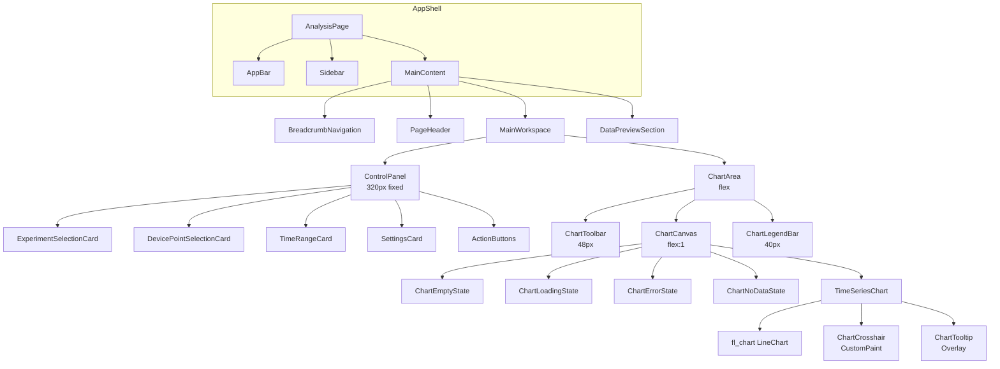
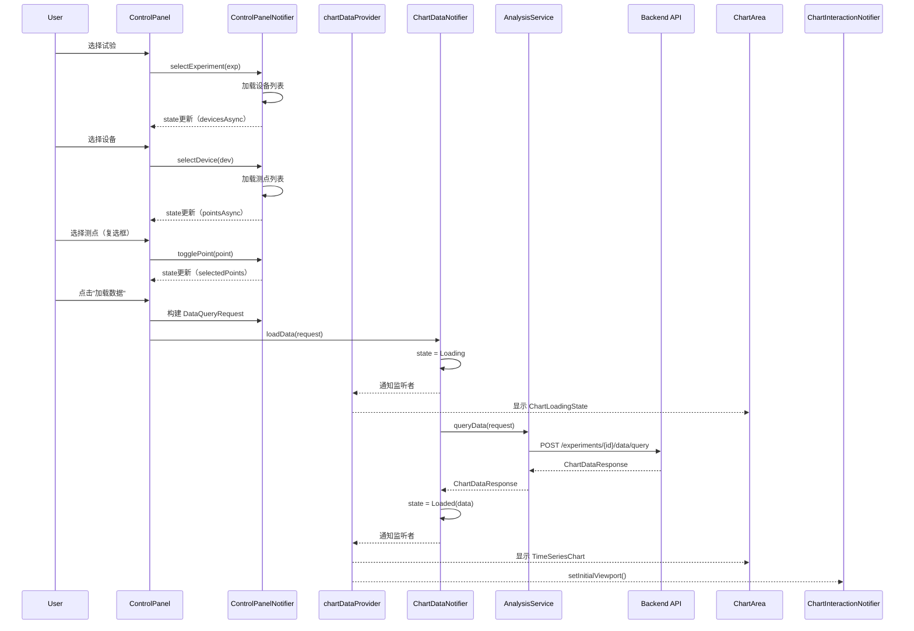
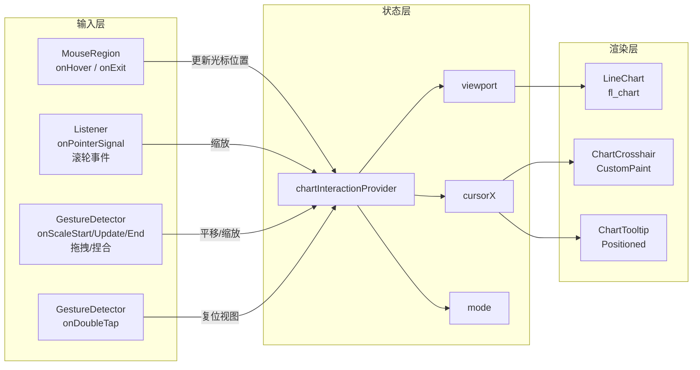
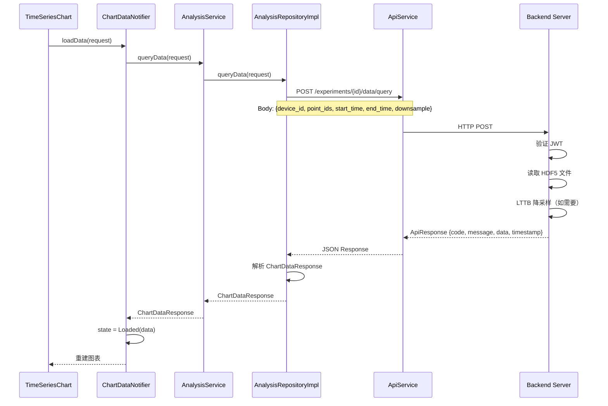
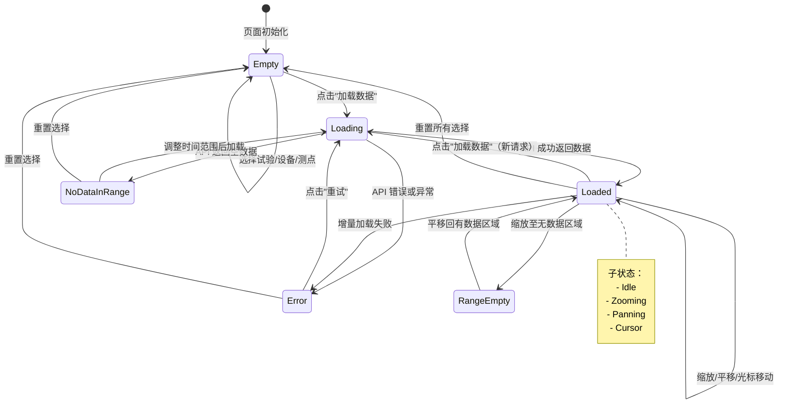

# R2-S1-002-C 时序图表组件 — 详细设计文档

**任务ID**: R2-S1-002-C
**文档类型**: 详细设计 (Detailed Design)
**作者**: sw-jerry
**日期**: 2026-05-10
**状态**: 初稿
**适用范围**: Release 2 Sprint 1 — 分析页面时序图表组件
**依赖文档**:
- PRD: `log/release_2/prd.md` §2.1
- UI原型: `log/release_2/ui/figma/analysis_page.md`
- 设计规范: `log/release_2/ui/specifications/analysis_page_spec.md`
- 测试用例: `log/release_2/test/R2-S1-002-B_test_cases.md`

---

## 1. 设计概述

### 1.1 设计目标

为 Kayak 平台分析页面 (`/analysis`) 设计完整的时序数据可视化方案，实现：
- 试验时序数据的单/多曲线渲染（最多 4 条）
- 缩放、平移、光标测量等交互功能
- 基于时间范围的分段数据加载
- 自动适配 Material Design 3 深色/浅色主题
- 空状态、加载状态、错误状态的完整用户体验

### 1.2 设计原则

| 原则 | 说明 |
|------|------|
| **Interface-Driven Development** | 先定义领域接口（Repository、Service），再实现具体类 |
| **Single Responsibility** | 每个 Widget/Provider 只负责一个明确的职责 |
| **Dependency Inversion** | 高层模块依赖抽象接口，不依赖具体实现 |
| **State Hoisting** | 状态向 Provider 提升，UI 层保持无状态（Stateless-first） |
| **Testability** | 所有业务逻辑通过接口可 Mock，支持 Widget 测试注入 |

### 1.3 技术约束

- **Flutter Web** 为唯一部署目标（桌面浏览器优先）
- **fl_chart ^0.66.0**：图表渲染引擎，已验证 Web 支持
- **flutter_riverpod**：全局状态管理，使用 `StateNotifierProvider` 模式
- **go_router**：声明式路由，`/analysis` 为新路由
- **Material Design 3**：主题系统，复用现有 `color_schemes.dart`

---

## 2. 目录结构与模块划分

基于 DDD 分层架构和 Interface-Driven Development 原则，前端模块按以下结构组织：

```
lib/features/analysis/
├── domain/                          # 领域层：实体、值对象、接口契约
│   ├── entities/
│   │   ├── chart_data_response.dart       # 图表数据响应实体
│   │   ├── chart_point_series.dart        # 单测点序列实体
│   │   ├── time_range.dart                # 时间范围值对象
│   │   └── chart_viewport.dart            # 视图窗口值对象
│   └── interfaces/
│       ├── analysis_service.dart          # 分析服务接口
│       ├── experiment_repository.dart     # 试验仓库接口（复用或扩展）
│       └── device_repository.dart         # 设备仓库接口（复用或扩展）
├── application/                     # 应用层：用例编排、状态管理
│   ├── providers/
│   │   ├── analysis_page_provider.dart    # 页面级状态管理
│   │   ├── chart_data_provider.dart       # 图表数据加载状态
│   │   ├── chart_interaction_provider.dart # 图表交互状态（缩放/平移/光标）
│   │   ├── chart_config_provider.dart     # 图表配置状态（降采样/显示设置）
│   │   ├── control_panel_provider.dart    # 控制面板状态（选择器）
│   │   └── providers.dart                 # Provider 导出 barrel 文件
│   ├── state/
│   │   ├── chart_state.dart               # 图表状态枚举 + Freezed
│   │   ├── chart_data_state.dart          # 图表数据状态（含加载/错误）
│   │   ├── chart_interaction_state.dart   # 交互状态（视图窗口/光标位置）
│   │   ├── chart_config_state.dart        # 配置状态
│   │   └── control_panel_state.dart       # 控制面板状态
│   └── services/
│       └── analysis_service_impl.dart     # AnalysisService 实现
├── presentation/                    # 表现层：UI 组件
│   ├── screens/
│   │   └── analysis_page.dart             # 分析页面 Screen
│   ├── widgets/
│   │   ├── time_series_chart.dart         # 核心图表组件
│   │   ├── chart_container.dart           # 图表容器（背景/边框/尺寸）
│   │   ├── chart_toolbar.dart             # 图表工具栏
│   │   ├── chart_legend_bar.dart          # 图例栏
│   │   ├── chart_tooltip.dart             # 自定义数据提示框
│   │   ├── chart_crosshair.dart           # 十字光标绘制
│   │   ├── chart_empty_state.dart         # 空状态
│   │   ├── chart_loading_state.dart       # 加载状态
│   │   ├── chart_error_state.dart         # 错误状态
│   │   ├── chart_no_data_state.dart       # 时间范围内无数据状态
│   │   ├── control_panel.dart             # 控制面板容器
│   │   ├── control_cards.dart             # 控制面板卡片（试验/设备/时间/设置）
│   │   ├── point_selector.dart            # 测点选择器（Checkbox List）
│   │   ├── time_range_selector.dart       # 时间范围选择器
│   │   ├── data_preview_section.dart      # 数据预览区容器
│   │   └── data_preview_table.dart        # 数据表格
│   └── theme/
│       ├── chart_colors.dart              # 图表专用颜色
│       ├── chart_theme.dart               # 图表主题扩展
│       └── chart_text_styles.dart         # 图表字体样式
└── data/                            # 数据层：API 调用、数据转换
    ├── models/
    │   ├── chart_data_dto.dart            # 后端 API 响应 DTO
    │   └── data_query_request_dto.dart    # 查询请求 DTO
    └── repositories/
        └── analysis_repository_impl.dart  # 分析仓库实现
```

### 2.1 与现有代码的集成点

| 现有模块 | 集成方式 | 说明 |
|---------|---------|------|
| `lib/core/theme/color_schemes.dart` | 扩展 | 通过 `ChartColors` 和 `ColorScheme` extension 新增图表专用色 |
| `lib/core/router/app_router.dart` | 新增路由 | 添加 `/analysis` 路由配置 |
| `lib/core/widgets/app_shell.dart` | 复用 | 分析页面作为 `AppShell` 的子页面 |
| `lib/features/experiments/` | 依赖接口 | 复用 `ExperimentRepository` 接口获取试验列表 |
| `lib/features/devices/` | 依赖接口 | 复用 `DeviceRepository` 接口获取设备和测点列表 |
| `lib/core/services/api_service.dart` | 依赖实现 | 通过 `ApiService` 发送 HTTP 请求 |

---

## 3. 页面结构组件树（Widget 层级）

### 3.1 顶层结构



### 3.2 AnalysisPage 构建方法结构

```dart
class AnalysisPage extends ConsumerWidget {
  const AnalysisPage({super.key});

  @override
  Widget build(BuildContext context, WidgetRef ref) {
    return AppShell(
      child: Scaffold(
        body: Padding(
          padding: const EdgeInsets.all(24),
          child: Column(
            children: [
              // 面包屑导航
              BreadcrumbNavigation(
                items: const [
                  BreadcrumbItem(label: '首页', route: '/'),
                  BreadcrumbItem(label: '分析', route: '/analysis'),
                ],
              ),
              const SizedBox(height: 8),
              // 页面头部
              PageHeader(
                title: '数据分析',
                subtitle: '查看试验时序数据',
              ),
              const SizedBox(height: 16),
              // 主工作区
              Expanded(
                child: LayoutBuilder(
                  builder: (context, constraints) {
                    final isDesktop = constraints.maxWidth >= 1280;
                    return Row(
                      crossAxisAlignment: CrossAxisAlignment.start,
                      children: [
                        // 控制面板
                        SizedBox(
                          width: isDesktop ? 320 : 280,
                          child: ControlPanel(
                            compact: !isDesktop,
                          ),
                        ),
                        const SizedBox(width: 16),
                        // 图表区域
                        Expanded(
                          child: ChartArea(),
                        ),
                      ],
                    );
                  },
                ),
              ),
              const SizedBox(height: 16),
              // 数据预览区（可折叠）
              Consumer(
                builder: (context, ref, child) {
                  final showTable = ref.watch(
                    chartConfigProvider.select((s) => s.showDataTable),
                  );
                  return showTable ? DataPreviewSection() : const SizedBox.shrink();
                },
              ),
            ],
          ),
        ),
      ),
    );
  }
}
```

### 3.3 ChartArea 内部结构

```dart
class ChartArea extends ConsumerWidget {
  const ChartArea({super.key});

  @override
  Widget build(BuildContext context, WidgetRef ref) {
    final chartState = ref.watch(chartDataProvider);

    return Container(
      decoration: BoxDecoration(
        color: Theme.of(context).colorScheme.chartCanvasBackground,
        borderRadius: BorderRadius.circular(12),
        border: Border.all(color: Theme.of(context).colorScheme.outlineVariant),
      ),
      child: Column(
        children: [
          // 工具栏
          ChartToolbar(),
          // 图表画布
          Expanded(
            child: chartState.when(
              empty: () => ChartEmptyState(),
              loading: () => ChartLoadingState(),
              loaded: (data) => TimeSeriesChart(data: data),
              error: (message, retry) => ChartErrorState(
                message: message,
                onRetry: retry,
              ),
              noDataInRange: () => ChartNoDataState(),
            ),
          ),
          // 图例栏
          ChartLegendBar(),
        ],
      ),
    );
  }
}
```

---

## 4. 状态管理设计（Riverpod Provider 架构）

### 4.1 Provider 架构图

```mermaid
graph TB
    subgraph DomainLayer["领域层 (Domain Layer)"]
        D1[AnalysisService Interface]
        D2[ExperimentRepository Interface]
        D3[DeviceRepository Interface]
    end

    subgraph DataLayer["数据层 (Data Layer)"]
        DL1[AnalysisRepositoryImpl]
        DL2[ExperimentRepositoryImpl]
        DL3[DeviceRepositoryImpl]
    end

    subgraph ApplicationLayer["应用层 (Application Layer)"]
        A1[analysisPageProvider<br/>StateNotifierProvider]
        A2[chartDataProvider<br/>StateNotifierProvider]
        A3[chartInteractionProvider<br/>StateNotifierProvider]
        A4[chartConfigProvider<br/>StateNotifierProvider]
        A5[controlPanelProvider<br/>StateNotifierProvider]
    end

    subgraph PresentationLayer["表现层 (Presentation Layer)"]
        P1[AnalysisPage]
        P2[ControlPanel]
        P3[TimeSeriesChart]
        P4[ChartToolbar]
        P5[ChartLegendBar]
    end

    P1 --> A1
    P2 --> A5
    P3 --> A2
    P3 --> A3
    P4 --> A3
    P4 --> A4
    P5 --> A2
    P5 --> A3

    A1 --> D1
    A1 --> D2
    A1 --> D3
    A2 --> D1
    A5 --> D2
    A5 --> D3

    D1 --> DL1
    D2 --> DL2
    D3 --> DL3

    DL1 --> API[POST /api/v1/experiments/{id}/data/query]
    DL2 --> API2[GET /api/v1/experiments]
    DL3 --> API3[GET /api/v1/devices / points]
```

### 4.2 Provider 详细定义

#### 4.2.1 chartDataProvider — 图表数据核心状态

```dart
/// 图表数据状态（Freezed 生成）
@freezed
class ChartDataState with _$ChartDataState {
  const factory ChartDataState.empty() = _Empty;
  const factory ChartDataState.loading() = _Loading;
  const factory ChartDataState.loaded({
    required ChartDataResponse data,
    @Default({}) Set<String> hiddenPointIds,
  }) = _Loaded;
  const factory ChartDataState.error({
    required String message,
    required VoidCallback onRetry,
  }) = _Error;
  const factory ChartDataState.noDataInRange() = _NoDataInRange;
}

/// 图表数据 StateNotifier
class ChartDataNotifier extends StateNotifier<ChartDataState> {
  ChartDataNotifier({
    required AnalysisService analysisService,
  })  : _analysisService = analysisService,
        super(const ChartDataState.empty());

  final AnalysisService _analysisService;

  /// 加载数据
  Future<void> loadData(DataQueryRequest request) async {
    state = const ChartDataState.loading();
    try {
      final response = await _analysisService.queryData(request);
      if (response.points.isEmpty) {
        state = const ChartDataState.noDataInRange();
      } else {
        state = ChartDataState.loaded(data: response);
      }
    } on ApiException catch (e) {
      state = ChartDataState.error(
        message: e.message,
        onRetry: () => loadData(request),
      );
    } catch (e) {
      state = ChartDataState.error(
        message: '数据加载失败: $e',
        onRetry: () => loadData(request),
      );
    }
  }

  /// 切换曲线显示/隐藏
  void toggleCurveVisibility(String pointId) {
    state.maybeWhen(
      loaded: (data, hiddenPointIds) {
        final newHidden = Set<String>.from(hiddenPointIds);
        if (newHidden.contains(pointId)) {
          newHidden.remove(pointId);
        } else {
          newHidden.add(pointId);
        }
        state = ChartDataState.loaded(
          data: data,
          hiddenPointIds: newHidden,
        );
      },
      orElse: () {},
    );
  }

  /// Solo 模式：仅显示指定曲线
  void soloCurve(String pointId) {
    state.maybeWhen(
      loaded: (data, _) {
        final allPointIds = data.points.map((p) => p.pointId).toSet();
        state = ChartDataState.loaded(
          data: data,
          hiddenPointIds: allPointIds.difference({pointId}),
        );
      },
      orElse: () {},
    );
  }

  /// 重置视图
  void resetView() {
    // 触发交互 Provider 重置
    // 通过 ref.read 在 Provider 外部调用
  }
}

/// Provider 定义
final chartDataProvider = StateNotifierProvider<ChartDataNotifier, ChartDataState>(
  (ref) => ChartDataNotifier(
    analysisService: ref.watch(analysisServiceProvider),
  ),
);
```

#### 4.2.2 chartInteractionProvider — 图表交互状态

```dart
/// 图表交互状态（Freezed 生成）
@freezed
class ChartInteractionState with _$ChartInteractionState {
  const factory ChartInteractionState({
    /// 当前视图窗口 X 轴范围（毫秒时间戳）
    @Default(ChartViewport.zero) ChartViewport viewport,
    /// 初始完整数据视图范围（用于复位）
    @Default(ChartViewport.zero) ChartViewport initialViewport,
    /// 光标位置（null = 隐藏）
    @Default(null) double? cursorX,
    /// 当前交互模式
    @Default(ChartInteractionMode.cursor) ChartInteractionMode mode,
    /// 是否正在拖拽
    @Default(false) bool isPanning,
    /// 是否正在缩放
    @Default(false) bool isZooming,
  }) = _ChartInteractionState;
}

enum ChartInteractionMode {
  zoom,    // 缩放模式（滚轮缩放 + 左键拖拽平移）
  pan,     // 平移模式（左键拖拽平移）
  cursor,  // 光标模式（十字光标 + 提示框）
}

class ChartInteractionNotifier extends StateNotifier<ChartInteractionState> {
  ChartInteractionNotifier() : super(const ChartInteractionState());

  /// 设置初始视图范围（数据加载完成后调用）
  void setInitialViewport(ChartViewport viewport) {
    state = state.copyWith(
      initialViewport: viewport,
      viewport: viewport,
    );
  }

  /// 缩放操作（以指定中心点缩放）
  void zoom(double factor, double centerX) {
    final current = state.viewport;
    final range = current.maxX - current.minX;
    final newRange = range * factor;
    final centerRatio = (centerX - current.minX) / range;

    state = state.copyWith(
      viewport: ChartViewport(
        minX: centerX - newRange * centerRatio,
        maxX: centerX + newRange * (1 - centerRatio),
      ),
    );
  }

  /// 平移操作
  void pan(double deltaX) {
    final current = state.viewport;
    state = state.copyWith(
      viewport: ChartViewport(
        minX: current.minX + deltaX,
        maxX: current.maxX + deltaX,
      ),
    );
  }

  /// 更新光标位置
  void updateCursor(double? x) {
    state = state.copyWith(cursorX: x);
  }

  /// 切换交互模式
  void setMode(ChartInteractionMode mode) {
    state = state.copyWith(mode: mode);
  }

  /// 复位视图
  void resetView() {
    state = state.copyWith(viewport: state.initialViewport);
  }
}

final chartInteractionProvider = StateNotifierProvider<ChartInteractionNotifier, ChartInteractionState>(
  (ref) => ChartInteractionNotifier(),
);
```

#### 4.2.3 chartConfigProvider — 图表配置状态

```dart
@freezed
class ChartConfigState with _$ChartConfigState {
  const factory ChartConfigState({
    /// 降采样点数
    @Default(1000) int downsample,
    /// 显示数据表格
    @Default(false) bool showDataTable,
    /// 自动刷新（仅运行中试验可用）
    @Default(false) bool autoRefresh,
  }) = _ChartConfigState;
}

class ChartConfigNotifier extends StateNotifier<ChartConfigState> {
  ChartConfigNotifier() : super(const ChartConfigState());

  void setDownsample(int value) => state = state.copyWith(downsample: value);
  void toggleDataTable() => state = state.copyWith(showDataTable: !state.showDataTable);
  void toggleAutoRefresh() => state = state.copyWith(autoRefresh: !state.autoRefresh);
}

final chartConfigProvider = StateNotifierProvider<ChartConfigNotifier, ChartConfigState>(
  (ref) => ChartConfigNotifier(),
);
```

#### 4.2.4 controlPanelProvider — 控制面板状态

```dart
@freezed
class ControlPanelState with _$ControlPanelState {
  const factory ControlPanelState({
    /// 已选试验
    Experiment? selectedExperiment,
    /// 已选设备
    Device? selectedDevice,
    /// 已选测点（最多4个，有序列表）
    @Default([]) List<Point> selectedPoints,
    /// 时间范围
    @Default(TimeRange.all) TimeRange timeRange,
    /// 自定义开始时间
    DateTime? customStartTime,
    /// 自定义结束时间
    DateTime? customEndTime,
    /// 设备列表（加载中/已加载）
    @Default(AsyncValue.loading()) AsyncValue<List<Device>> devicesAsync,
    /// 测点列表
    @Default(AsyncValue.loading()) AsyncValue<List<Point>> pointsAsync,
  }) = _ControlPanelState;
}

class ControlPanelNotifier extends StateNotifier<ControlPanelState> {
  ControlPanelNotifier({
    required ExperimentRepository experimentRepository,
    required DeviceRepository deviceRepository,
  })  : _experimentRepository = experimentRepository,
        _deviceRepository = deviceRepository,
        super(const ControlPanelState());

  final ExperimentRepository _experimentRepository;
  final DeviceRepository _deviceRepository;

  /// 选择试验
  Future<void> selectExperiment(Experiment experiment) async {
    state = state.copyWith(
      selectedExperiment: experiment,
      selectedDevice: null,
      selectedPoints: [],
      devicesAsync: const AsyncValue.loading(),
      pointsAsync: const AsyncValue.loading(),
    );
    await _loadDevices(experiment.id);
  }

  /// 选择设备
  Future<void> selectDevice(Device device) async {
    state = state.copyWith(
      selectedDevice: device,
      selectedPoints: [],
      pointsAsync: const AsyncValue.loading(),
    );
    await _loadPoints(device.id);
  }

  /// 切换测点选择
  void togglePoint(Point point) {
    final current = state.selectedPoints;
    if (current.any((p) => p.id == point.id)) {
      state = state.copyWith(
        selectedPoints: current.where((p) => p.id != point.id).toList(),
      );
    } else if (current.length < 4) {
      state = state.copyWith(
        selectedPoints: [...current, point],
      );
    }
  }

  /// 设置预设时间范围
  void setPresetTimeRange(TimeRange preset) {
    state = state.copyWith(timeRange: preset);
  }

  /// 设置自定义时间范围
  void setCustomTimeRange(DateTime start, DateTime end) {
    state = state.copyWith(
      timeRange: TimeRange.custom,
      customStartTime: start,
      customEndTime: end,
    );
  }

  Future<void> _loadDevices(String experimentId) async {
    try {
      final devices = await _deviceRepository.getDevicesByExperiment(experimentId);
      state = state.copyWith(devicesAsync: AsyncValue.data(devices));
    } catch (e) {
      state = state.copyWith(devicesAsync: AsyncValue.error(e, StackTrace.current));
    }
  }

  Future<void> _loadPoints(String deviceId) async {
    try {
      final points = await _deviceRepository.getPointsByDevice(deviceId);
      state = state.copyWith(pointsAsync: AsyncValue.data(points));
    } catch (e) {
      state = state.copyWith(pointsAsync: AsyncValue.error(e, StackTrace.current));
    }
  }
}

final controlPanelProvider = StateNotifierProvider<ControlPanelNotifier, ControlPanelState>(
  (ref) => ControlPanelNotifier(
    experimentRepository: ref.watch(experimentRepositoryProvider),
    deviceRepository: ref.watch(deviceRepositoryProvider),
  ),
);
```

### 4.3 状态数据流图



---

## 5. TimeSeriesChart 组件详细设计

### 5.1 组件接口定义

```dart
/// TimeSeriesChart 组件 Props
class TimeSeriesChart extends ConsumerStatefulWidget {
  const TimeSeriesChart({
    super.key,
    required this.data,
    this.hiddenPointIds = const {},
    this.animationDuration = const Duration(milliseconds: 800),
  });

  /// 图表数据响应
  final ChartDataResponse data;

  /// 隐藏的测点 ID 集合
  final Set<String> hiddenPointIds;

  /// 初始加载动画时长
  final Duration animationDuration;

  @override
  ConsumerState<TimeSeriesChart> createState() => _TimeSeriesChartState();
}
```

### 5.2 状态管理

```dart
class _TimeSeriesChartState extends ConsumerState<TimeSeriesChart>
    with TickerProviderStateMixin {
  late AnimationController _animationController;

  @override
  void initState() {
    super.initState();
    _animationController = AnimationController(
      vsync: this,
      duration: widget.animationDuration,
    );
    _animationController.forward();
  }

  @override
  void dispose() {
    _animationController.dispose();
    super.dispose();
  }

  @override
  Widget build(BuildContext context) {
    final interactionState = ref.watch(chartInteractionProvider);
    final colorScheme = Theme.of(context).colorScheme;
    final chartColors = ChartColors.getCurves(colorScheme.brightness);

    // 构建 LineChartData
    final lineChartData = _buildLineChartData(
      context: context,
      data: widget.data,
      hiddenPointIds: widget.hiddenPointIds,
      viewport: interactionState.viewport,
      cursorX: interactionState.cursorX,
      chartColors: chartColors,
    );

    return MouseRegion(
      onHover: _onMouseHover,
      onExit: _onMouseExit,
      child: GestureDetector(
        onScaleStart: _onScaleStart,
        onScaleUpdate: _onScaleUpdate,
        onScaleEnd: _onScaleEnd,
        onDoubleTap: _onDoubleTap,
        child: Listener(
          onPointerSignal: _onPointerSignal,
          child: Stack(
            children: [
              // fl_chart LineChart
              LineChart(
                lineChartData,
                duration: Duration.zero, // 禁用 fl_chart 内置动画，使用自定义
              ),
              // 自定义十字光标
              if (interactionState.cursorX != null)
                ChartCrosshair(
                  cursorX: interactionState.cursorX!,
                  data: widget.data,
                  viewport: interactionState.viewport,
                  hiddenPointIds: widget.hiddenPointIds,
                  chartColors: chartColors,
                ),
              // 自定义提示框
              if (interactionState.cursorX != null)
                ChartTooltip(
                  cursorX: interactionState.cursorX!,
                  data: widget.data,
                  viewport: interactionState.viewport,
                  hiddenPointIds: widget.hiddenPointIds,
                  chartColors: chartColors,
                ),
            ],
          ),
        ),
      ),
    );
  }
```

### 5.3 事件处理

```dart
  /// 鼠标滚轮缩放
  void _onPointerSignal(PointerSignalEvent event) {
    if (event is PointerScrollEvent) {
      final interactionNotifier = ref.read(chartInteractionProvider.notifier);
      final chartBox = context.findRenderObject() as RenderBox?;
      if (chartBox == null) return;

      final localPosition = chartBox.globalToLocal(event.position);
      final chartWidth = chartBox.size.width;
      final viewport = ref.read(chartInteractionProvider).viewport;

      // 将鼠标 X 像素位置转换为数据坐标
      final centerX = viewport.minX + (localPosition.dx / chartWidth) * (viewport.maxX - viewport.minX);

      // 滚轮向上 = 放大 (factor < 1)，向下 = 缩小 (factor > 1)
      final factor = event.scrollDelta.dy < 0 ? 0.8 : 1.25;
      interactionNotifier.zoom(factor, centerX);
    }
  }

  /// 鼠标移动 - 更新光标位置
  void _onMouseHover(PointerHoverEvent event) {
    final interactionNotifier = ref.read(chartInteractionProvider.notifier);
    final chartBox = context.findRenderObject() as RenderBox?;
    if (chartBox == null) return;

    final localPosition = chartBox.globalToLocal(event.position);
    final chartWidth = chartBox.size.width;
    final viewport = ref.read(chartInteractionProvider).viewport;

    final dataX = viewport.minX + (localPosition.dx / chartWidth) * (viewport.maxX - viewport.minX);
    interactionNotifier.updateCursor(dataX);
  }

  /// 鼠标离开 - 隐藏光标
  void _onMouseExit(PointerExitEvent event) {
    ref.read(chartInteractionProvider.notifier).updateCursor(null);
  }

  /// 双击 - 复位视图
  void _onDoubleTap() {
    ref.read(chartInteractionProvider.notifier).resetView();
  }

  /// 缩放/平移手势开始
  void _onScaleStart(ScaleStartDetails details) {
    // 记录初始状态
  }

  /// 缩放/平移手势更新
  void _onScaleUpdate(ScaleUpdateDetails details) {
    final interactionNotifier = ref.read(chartInteractionProvider.notifier);
    final mode = ref.read(chartInteractionProvider).mode;

    if (mode == ChartInteractionMode.pan || details.scale == 1.0) {
      // 平移
      final chartBox = context.findRenderObject() as RenderBox?;
      if (chartBox == null) return;
      final viewport = ref.read(chartInteractionProvider).viewport;
      final range = viewport.maxX - viewport.minX;
      final deltaX = -(details.focalPointDelta.dx / chartBox.size.width) * range;
      interactionNotifier.pan(deltaX);
    } else {
      // 缩放手势
      final factor = 1.0 / details.scale;
      // 以手势中心缩放
    }
  }

  void _onScaleEnd(ScaleEndDetails details) {
    // 检查是否需要增量加载数据
    _checkIncrementalLoad();
  }

  /// 检查当前视图是否需要加载更多数据
  void _checkIncrementalLoad() {
    final viewport = ref.read(chartInteractionProvider).viewport;
    final data = widget.data;

    // 获取当前已加载数据的时间范围
    double loadedMinX = double.infinity;
    double loadedMaxX = double.negativeInfinity;
    for (final point in data.points) {
      if (point.timestamps.isNotEmpty) {
        loadedMinX = math.min(loadedMinX, point.timestamps.first.toDouble());
        loadedMaxX = math.max(loadedMaxX, point.timestamps.last.toDouble());
      }
    }

    // 如果视口超出已加载范围超过 20%，触发增量加载
    final viewRange = viewport.maxX - viewport.minX;
    final buffer = viewRange * 0.2;

    if (viewport.minX < loadedMinX + buffer || viewport.maxX > loadedMaxX - buffer) {
      // 触发增量加载请求（通过 Provider 或回调）
      // 实际实现中通过 chartDataProvider 的增量加载方法
    }
  }
```

### 5.4 LineChartData 构建

```dart
  LineChartData _buildLineChartData({
    required BuildContext context,
    required ChartDataResponse data,
    required Set<String> hiddenPointIds,
    required ChartViewport viewport,
    required double? cursorX,
    required List<Color> chartColors,
  }) {
    final colorScheme = Theme.of(context).colorScheme;
    final textTheme = Theme.of(context).textTheme;

    return LineChartData(
      // 网格线
      gridData: FlGridData(
        show: true,
        drawHorizontalLine: true,
        drawVerticalLine: true,
        horizontalInterval: _calculateNiceInterval(viewport.yRange),
        verticalInterval: _calculateNiceInterval(viewport.xRange),
        getDrawingHorizontalLine: (value) => FlLine(
          color: colorScheme.chartGridLine,
          strokeWidth: 1,
        ),
        getDrawingVerticalLine: (value) => FlLine(
          color: colorScheme.chartGridLine,
          strokeWidth: 1,
        ),
      ),

      // 坐标轴标题
      titlesData: FlTitlesData(
        show: true,
        bottomTitles: AxisTitles(
          sideTitles: SideTitles(
            showTitles: true,
            reservedSize: 32,
            interval: _calculateNiceInterval(viewport.xRange),
            getTitlesWidget: (value, meta) => Text(
              _formatTimestamp(value),
              style: textTheme.bodySmall?.copyWith(
                color: colorScheme.onSurfaceVariant,
              ),
            ),
          ),
        ),
        leftTitles: AxisTitles(
          sideTitles: SideTitles(
            showTitles: true,
            reservedSize: 56,
            interval: _calculateNiceInterval(viewport.yRange),
            getTitlesWidget: (value, meta) => Text(
              _formatValue(value),
              style: textTheme.bodySmall?.copyWith(
                color: colorScheme.onSurfaceVariant,
                fontFamily: 'monospace',
              ),
            ),
          ),
        ),
        rightTitles: const AxisTitles(sideTitles: SideTitles(showTitles: false)),
        topTitles: const AxisTitles(sideTitles: SideTitles(showTitles: false)),
      ),

      // 坐标轴范围
      minX: viewport.minX,
      maxX: viewport.maxX,
      minY: viewport.minY,
      maxY: viewport.maxY,

      // 曲线数据
      lineBarsData: _buildLineBarsData(
        data: data,
        hiddenPointIds: hiddenPointIds,
        chartColors: chartColors,
        animationProgress: _animationController.value,
      ),

      // 触摸交互（禁用 fl_chart 内置触摸，使用自定义实现）
      lineTouchData: const LineTouchData(enabled: false),

      // 边框
      borderData: FlBorderData(show: false),

      // 背景
      backgroundColor: Colors.transparent,
    );
  }

  List<LineChartBarData> _buildLineBarsData({
    required ChartDataResponse data,
    required Set<String> hiddenPointIds,
    required List<Color> chartColors,
    required double animationProgress,
  }) {
    final List<LineChartBarData> bars = [];

    for (int i = 0; i < data.points.length; i++) {
      final series = data.points[i];
      final isVisible = !hiddenPointIds.contains(series.pointId);
      final color = chartColors[i % chartColors.length];

      // 计算动画截断点（从左到右绘制效果）
      final spotCount = series.timestamps.length;
      final visibleCount = (spotCount * animationProgress).ceil();

      final spots = <FlSpot>[];
      for (int j = 0; j < visibleCount; j++) {
        spots.add(FlSpot(
          series.timestamps[j].toDouble(),
          series.values[j],
        ));
      }

      bars.add(LineChartBarData(
        spots: spots,
        color: color,
        barWidth: 2,
        isCurved: false, // 时序数据使用折线而非曲线
        dotData: const FlDotData(show: false),
        belowBarData: BarAreaData(show: false),
        show: isVisible,
      ));
    }

    return bars;
  }
```

---

## 6. fl_chart 集成方案

### 6.1 集成架构

`fl_chart` 的 `LineChart` 作为核心渲染引擎，`TimeSeriesChart` 作为包装层，处理以下自定义需求：

| fl_chart 内置功能 | 使用策略 | 自定义实现 |
|------------------|---------|-----------|
| `LineChart` 渲染 | ✅ 直接使用 | — |
| `FlGridData` 网格线 | ✅ 直接使用 | 颜色绑定主题 |
| `FlTitlesData` 坐标轴 | ✅ 直接使用 | 时间格式化、等宽字体 |
| `LineTouchData` 触摸 | ❌ 禁用内置 | 自定义 `MouseRegion` + `GestureDetector` |
| `LineTouchTooltipData` 提示框 | ❌ 禁用内置 | 自定义 `ChartTooltip` Widget |
| 动画系统 | ⚠️ 部分使用 | 禁用内置，使用 `AnimationController` 控制绘制进度 |

### 6.2 交互事件绑定



### 6.3 自定义提示框实现

由于 fl_chart 内置 `LineTouchTooltipData` 在 Web 环境下的定位灵活性不足，采用完全自定义实现：

```dart
/// ChartTooltip 组件
class ChartTooltip extends StatelessWidget {
  const ChartTooltip({
    super.key,
    required this.cursorX,
    required this.data,
    required this.viewport,
    required this.hiddenPointIds,
    required this.chartColors,
  });

  final double cursorX;
  final ChartDataResponse data;
  final ChartViewport viewport;
  final Set<String> hiddenPointIds;
  final List<Color> chartColors;

  @override
  Widget build(BuildContext context) {
    final colorScheme = Theme.of(context).colorScheme;
    final textTheme = Theme.of(context).textTheme;

    // 查找光标位置最近的各曲线数据点
    final tooltipData = _buildTooltipData();

    // 计算屏幕位置
    final chartWidth = context.size?.width ?? 0;
    final chartHeight = context.size?.height ?? 0;
    final pixelX = ((cursorX - viewport.minX) / (viewport.maxX - viewport.minX)) * chartWidth;

    // 定位：默认右下方，边界检测后翻转
    double left = pixelX + 16;
    double top = 16;
    if (left + 280 > chartWidth) {
      left = pixelX - 280 - 16; // 翻转到左侧
    }

    return Positioned(
      left: left,
      top: top,
      child: Container(
        constraints: const BoxConstraints(minWidth: 180, maxWidth: 280),
        padding: const EdgeInsets.symmetric(horizontal: 16, vertical: 12),
        decoration: BoxDecoration(
          color: colorScheme.surfaceContainerHigh,
          borderRadius: BorderRadius.circular(8),
          border: Border.all(color: colorScheme.outline),
          boxShadow: [
            BoxShadow(
              color: Colors.black.withOpacity(0.12),
              blurRadius: 8,
              offset: const Offset(0, 4),
            ),
          ],
        ),
        child: Column(
          mainAxisSize: MainAxisSize.min,
          crossAxisAlignment: CrossAxisAlignment.start,
          children: [
            // 时间戳标题
            Text(
              _formatFullTimestamp(cursorX),
              style: textTheme.labelMedium?.copyWith(color: colorScheme.onSurface),
            ),
            const Divider(height: 16),
            // 数据行
            ...tooltipData.map((row) => _buildTooltipRow(context, row)),
          ],
        ),
      ),
    );
  }
```

### 6.4 自定义十字光标实现

```dart
/// ChartCrosshair 组件
class ChartCrosshair extends StatelessWidget {
  const ChartCrosshair({
    super.key,
    required this.cursorX,
    required this.data,
    required this.viewport,
    required this.hiddenPointIds,
    required this.chartColors,
  });

  @override
  Widget build(BuildContext context) {
    final colorScheme = Theme.of(context).colorScheme;

    // 计算垂直线位置
    final chartWidth = context.size?.width ?? 0;
    final chartHeight = context.size?.height ?? 0;
    final pixelX = ((cursorX - viewport.minX) / (viewport.maxX - viewport.minX)) * chartWidth;

    return Stack(
      children: [
        // 垂直光标线
        Positioned(
          left: pixelX,
          top: 0,
          bottom: 0,
          child: Container(
            width: 1,
            color: colorScheme.onSurfaceVariant.withOpacity(0.5),
            child: CustomPaint(
              painter: DashedLinePainter(),
            ),
          ),
        ),
        // 各曲线水平光标线和交点圆点
        ..._buildHorizontalLinesAndDots(chartHeight),
      ],
    );
  }
}
```

---

## 7. 与后端 API 的集成

### 7.1 API 接口定义

```dart
/// 分析服务接口（领域层）
abstract class AnalysisService {
  /// 查询试验时序数据
  Future<ChartDataResponse> queryData(DataQueryRequest request);
}

/// 数据查询请求
class DataQueryRequest {
  const DataQueryRequest({
    required this.experimentId,
    required this.deviceId,
    required this.pointIds,
    required this.startTime,
    required this.endTime,
    this.downsample = 1000,
  });

  final String experimentId;
  final String deviceId;
  final List<String> pointIds;
  final DateTime startTime;
  final DateTime endTime;
  final int downsample;

  Map<String, dynamic> toJson() => {
    'device_id': deviceId,
    'point_ids': pointIds,
    'start_time': startTime.toUtc().toIso8601String(),
    'end_time': endTime.toUtc().toIso8601String(),
    'downsample': downsample,
  };
}
```

### 7.2 Repository 实现

```dart
/// 分析仓库实现（数据层）
class AnalysisRepositoryImpl implements AnalysisService {
  AnalysisRepositoryImpl({required ApiService apiService})
      : _apiService = apiService;

  final ApiService _apiService;

  @override
  Future<ChartDataResponse> queryData(DataQueryRequest request) async {
    final response = await _apiService.post(
      '/api/v1/experiments/${request.experimentId}/data/query',
      body: request.toJson(),
    );

    // 解析标准 ApiResponse 格式
    final apiResponse = ApiResponse<Map<String, dynamic>>.fromJson(response);
    if (apiResponse.code != 200) {
      throw ApiException(code: apiResponse.code, message: apiResponse.message);
    }

    return ChartDataResponse.fromJson(apiResponse.data!);
  }
}
```

### 7.3 API 调用序列图



### 7.4 数据模型定义

```dart
/// 图表数据响应实体（领域层）
class ChartDataResponse {
  const ChartDataResponse({
    required this.experimentId,
    required this.deviceId,
    required this.points,
    required this.totalSamples,
    required this.returnedSamples,
  });

  final String experimentId;
  final String deviceId;
  final List<ChartPointSeries> points;
  final int totalSamples;
  final int returnedSamples;

  factory ChartDataResponse.fromJson(Map<String, dynamic> json) =>
      ChartDataResponse(
        experimentId: json['experiment_id'] as String,
        deviceId: json['device_id'] as String,
        points: (json['points'] as List)
            .map((e) => ChartPointSeries.fromJson(e as Map<String, dynamic>))
            .toList(),
        totalSamples: json['total_samples'] as int,
        returnedSamples: json['returned_samples'] as int,
      );
}

/// 单测点序列实体
class ChartPointSeries {
  const ChartPointSeries({
    required this.pointId,
    required this.pointName,
    required this.unit,
    required this.dataType,
    required this.timestamps,
    required this.values,
  });

  final String pointId;
  final String pointName;
  final String unit;
  final String dataType;
  final List<int> timestamps; // Unix 毫秒时间戳
  final List<double> values;

  factory ChartPointSeries.fromJson(Map<String, dynamic> json) =>
      ChartPointSeries(
        pointId: json['point_id'] as String,
        pointName: json['point_name'] as String,
        unit: json['unit'] as String,
        dataType: json['data_type'] as String,
        timestamps: (json['timestamps'] as List).cast<int>(),
        values: (json['values'] as List).cast<double>(),
      );
}
```

### 7.5 增量加载策略

```dart
/// 增量加载控制器
class IncrementalLoadController {
  IncrementalLoadController({
    required this.analysisService,
    required this.onDataMerged,
  });

  final AnalysisService analysisService;
  final ValueChanged<ChartDataResponse> onDataMerged;

  /// 已加载的数据片段集合（按时间范围）
  final List<TimeRange> _loadedRanges = [];
  ChartDataResponse? _currentData;

  /// 检查并执行增量加载
  Future<void> checkAndLoad(DataQueryRequest baseRequest, ChartViewport viewport) async {
    final neededRange = TimeRange(
      start: DateTime.fromMillisecondsSinceEpoch(viewport.minX.toInt()),
      end: DateTime.fromMillisecondsSinceEpoch(viewport.maxX.toInt()),
    );

    // 检查已有数据是否覆盖当前视口
    if (_isRangeCovered(neededRange)) return;

    // 计算未覆盖的区间
    final uncoveredRanges = _calculateUncoveredRanges(neededRange);

    for (final range in uncoveredRanges) {
      final request = DataQueryRequest(
        experimentId: baseRequest.experimentId,
        deviceId: baseRequest.deviceId,
        pointIds: baseRequest.pointIds,
        startTime: range.start,
        endTime: range.end,
        downsample: baseRequest.downsample,
      );

      final response = await analysisService.queryData(request);
      _mergeData(response);
      _loadedRanges.add(range);
    }
  }

  bool _isRangeCovered(TimeRange range) {
    for (final loaded in _loadedRanges) {
      if (loaded.start.isBefore(range.start) && loaded.end.isAfter(range.end)) {
        return true;
      }
    }
    return false;
  }

  void _mergeData(ChartDataResponse newData) {
    if (_currentData == null) {
      _currentData = newData;
      onDataMerged(newData);
      return;
    }

    // 合并同测点数据（按时间戳去重合并）
    final mergedPoints = <ChartPointSeries>[];
    for (final existing in _currentData!.points) {
      final incoming = newData.points.firstWhere(
        (p) => p.pointId == existing.pointId,
        orElse: () => existing,
      );

      if (incoming.pointId == existing.pointId && incoming != existing) {
        mergedPoints.add(_mergeSeries(existing, incoming));
      } else {
        mergedPoints.add(existing);
      }
    }

    _currentData = ChartDataResponse(
      experimentId: _currentData!.experimentId,
      deviceId: _currentData!.deviceId,
      points: mergedPoints,
      totalSamples: _currentData!.totalSamples + newData.totalSamples,
      returnedSamples: mergedPoints.fold(0, (sum, p) => sum + p.timestamps.length),
    );

    onDataMerged(_currentData!);
  }

  ChartPointSeries _mergeSeries(ChartPointSeries a, ChartPointSeries b) {
    // 使用 Map 去重合并，按时间戳排序
    final merged = <int, double>{};
    for (int i = 0; i < a.timestamps.length; i++) {
      merged[a.timestamps[i]] = a.values[i];
    }
    for (int i = 0; i < b.timestamps.length; i++) {
      merged[b.timestamps[i]] = b.values[i];
    }

    final sortedTimestamps = merged.keys.toList()..sort();
    return ChartPointSeries(
      pointId: a.pointId,
      pointName: a.pointName,
      unit: a.unit,
      dataType: a.dataType,
      timestamps: sortedTimestamps,
      values: sortedTimestamps.map((t) => merged[t]!).toList(),
    );
  }
}
```

---

## 8. 主题适配方案

### 8.1 主题扩展设计

```dart
/// lib/features/analysis/theme/chart_colors.dart

/// 图表专用颜色常量
class ChartColors {
  static const List<Color> lightCurves = [
    Color(0xFF1976D2), // Primary
    Color(0xFF00838F), // Tertiary
    Color(0xFFC62828), // Error
    Color(0xFF2E7D32), // Success
  ];

  static const List<Color> darkCurves = [
    Color(0xFF90CAF9), // Primary (dark)
    Color(0xFF80DEEA), // Tertiary (dark)
    Color(0xFFEF5350), // Error Light
    Color(0xFF66BB6A), // Success Light
  ];

  static List<Color> getCurves(Brightness brightness) =>
      brightness == Brightness.light ? lightCurves : darkCurves;
}

/// ColorScheme 扩展 — 图表背景色
extension ChartTheme on ColorScheme {
  Color get chartCanvasBackground => brightness == Brightness.light
      ? const Color(0xFFFFFFFF)
      : const Color(0xFF0A0A0A);

  Color get chartToolbarBackground => brightness == Brightness.light
      ? const Color(0xFFFAFAFA)
      : const Color(0xFF1A1A1A);

  Color get chartLegendBarBackground => brightness == Brightness.light
      ? const Color(0xFFFAFAFA)
      : const Color(0xFF1A1A1A);

  Color get chartGridLine => brightness == Brightness.light
      ? const Color(0xFFEEEEEE)
      : const Color(0xFF1E1E1E);

  Color get chartGridLineMajor => brightness == Brightness.light
      ? const Color(0xFFE0E0E0)
      : const Color(0xFF2D2D2D);

  Color get chartTooltipBackground => brightness == Brightness.light
      ? const Color(0xFFE0E0E0)
      : const Color(0xFF3D3D3D);
}
```

### 8.2 主题切换机制

图表主题不维护独立状态，完全依赖 Flutter 的 `Theme.of(context)` 机制：

```dart
class TimeSeriesChart extends ConsumerStatefulWidget {
  // ...
  @override
  Widget build(BuildContext context) {
    final colorScheme = Theme.of(context).colorScheme;
    final chartColors = ChartColors.getCurves(colorScheme.brightness);

    // 所有颜色均从 colorScheme 或 ChartColors 获取
    // 当 MaterialApp 主题切换时，整个 Widget 树自动重建
    return Container(
      color: colorScheme.chartCanvasBackground,
      child: LineChart(
        _buildLineChartData(colorScheme: colorScheme, chartColors: chartColors),
      ),
    );
  }
}
```

### 8.3 主题过渡动画

```dart
/// 图表容器带动画背景色过渡
class ChartContainer extends StatelessWidget {
  const ChartContainer({super.key, required this.child});

  final Widget child;

  @override
  Widget build(BuildContext context) {
    final colorScheme = Theme.of(context).colorScheme;

    return AnimatedContainer(
      duration: const Duration(milliseconds: 300),
      curve: Curves.easeInOut,
      decoration: BoxDecoration(
        color: colorScheme.chartCanvasBackground,
        borderRadius: BorderRadius.circular(12),
        border: Border.all(color: colorScheme.outlineVariant),
      ),
      child: child,
    );
  }
}
```

---

## 9. 性能优化策略

### 9.1 渲染性能优化

| 优化策略 | 实现方式 | 预期收益 |
|---------|---------|---------|
| **RepaintBoundary** | 图表区域包裹 `RepaintBoundary`，隔离重绘 | 控制面板交互不触发图表重绘 |
| **const 构造函数** | 状态无关的子 Widget 使用 `const` | 减少不必要的重建 |
| **select 精准监听** | Provider 使用 `.select()` 只监听必要字段 | 避免大范围重建 |
| **动画进度控制** | 使用 `AnimationController` 控制曲线绘制进度 | 避免 fl_chart 内置动画开销 |
| **数据点上限控制** | 超过 10,000 点时强制降采样或隐藏点标记 | 保持 60fps 交互帧率 |
| **CustomPaint 光标** | 十字光标使用 `CustomPaint` 而非 Widget 树 | 减少布局计算 |

```dart
/// 图表区域使用 RepaintBoundary 隔离
RepaintBoundary(
  child: TimeSeriesChart(
    data: data,
    hiddenPointIds: hiddenPointIds,
  ),
)
```

```dart
/// Provider 精准选择，避免不必要重建
final viewport = ref.watch(
  chartInteractionProvider.select((s) => s.viewport),
);
```

### 9.2 数据加载优化

| 优化策略 | 实现方式 | 预期收益 |
|---------|---------|---------|
| **后端降采样** | LTTB 算法在后端 Rust 实现 | 减少网络传输和前端渲染压力 |
| **增量加载** | 视口移动时只请求未加载区域 | 避免重复加载大量数据 |
| **数据缓存** | `IncrementalLoadController` 维护已加载片段 | 平移/缩放回已浏览区域时零延迟 |
| **请求防抖** | 缩放/平移操作结束后 300ms 再触发加载 | 减少高频操作下的请求数量 |
| **内存管理** | 超出视口过远的数据片段释放 | 控制内存占用 < 200MB |

```dart
/// 防抖加载
Timer? _loadDebounceTimer;

void _scheduleIncrementalLoad() {
  _loadDebounceTimer?.cancel();
  _loadDebounceTimer = Timer(const Duration(milliseconds: 300), () {
    _performIncrementalLoad();
  });
}
```

### 9.3 降级策略

| 场景 | 检测方式 | 降级行为 |
|------|---------|---------|
| 数据点 > 10,000 | 检查 `returnedSamples` | 显示警告 Snackbar，强制降采样至 10,000 |
| 渲染卡顿 (> 33ms/帧) | `PerformanceOverlay` 或帧时间检测 | 自动隐藏数据点标记，仅显示连线 |
| 严重卡顿 (> 100ms/帧) | 帧时间检测 | 切换至简化渲染模式（减少网格线密度） |
| API 超时 (> 10s) | HTTP 客户端超时配置 | 显示部分已缓存数据 + 错误提示 + "继续加载"按钮 |

```dart
/// 性能监控（可选，生产环境可关闭）
class ChartPerformanceMonitor {
  static void onFrame(FrameTiming timing) {
    final buildTime = timing.buildDuration.inMilliseconds;
    final rasterTime = timing.rasterDuration.inMilliseconds;

    if (rasterTime > 100) {
      // 触发严重降级
      eventBus.fire(ChartPerformanceEvent.severeFrameDrop);
    } else if (rasterTime > 33) {
      // 触发轻度降级
      eventBus.fire(ChartPerformanceEvent.frameDrop);
    }
  }
}
```

### 9.4 Web 特定优化

| 优化项 | 策略 |
|-------|------|
| CanvasKit 渲染 | Flutter Web 使用 CanvasKit 后端，`fl_chart` 的 `CustomPaint` 性能更优 |
| 字体加载 | 等宽字体使用系统默认 `monospace`，避免网络字体加载延迟 |
| 内存限制 | Web 环境内存受限，数据缓存策略更激进（只保留当前视口 ±2 倍范围） |
| 滚轮事件 | 使用 `PointerSignalEvent` 而非 `ScrollNotification`，更精确控制缩放比例 |

---

## 10. 响应式布局设计

### 10.1 断点策略

```dart
/// 响应式断点工具
class AnalysisBreakpoints {
  static bool isDesktop(BuildContext context) =>
      MediaQuery.of(context).size.width >= 1280;

  static bool isTablet(BuildContext context) =>
      MediaQuery.of(context).size.width >= 768 &&
      MediaQuery.of(context).size.width < 1280;

  static bool isMobile(BuildContext context) =>
      MediaQuery.of(context).size.width < 768;
}
```

### 10.2 各断点布局差异

| 元素 | Desktop (>=1280) | Tablet (>=768) |
|------|-----------------|----------------|
| 侧边栏 | 240px 展开 | 72px 折叠 |
| 控制面板 | 320px, padding 16px | 280px, padding 12px |
| 图例栏 | 水平排列 | 水平滚动或折叠 |
| 数据预览 | 可展开 | 默认收起 |
| 工具栏 | 图标+文字（可选） | 仅图标 |
| 提示框 | maxWidth 280px | maxWidth 200px |

### 10.3 LayoutBuilder 实现

```dart
LayoutBuilder(
  builder: (context, constraints) {
    final isDesktop = constraints.maxWidth >= 1280;
    final isTablet = constraints.maxWidth >= 768;

    return Row(
      crossAxisAlignment: CrossAxisAlignment.start,
      children: [
        SizedBox(
          width: isDesktop ? 320 : 280,
          child: ControlPanel(
            compact: !isDesktop,
            cardPadding: isDesktop ? 16 : 12,
          ),
        ),
        const SizedBox(width: 16),
        Expanded(
          child: ChartArea(
            showLegendInDropdown: !isDesktop && isTablet,
          ),
        ),
      ],
    );
  },
)
```

---

## 11. 测试支持设计

### 11.1 依赖注入配置

```dart
/// Provider 覆盖（用于测试）
final analysisServiceProvider = Provider<AnalysisService>((ref) {
  return AnalysisRepositoryImpl(apiService: ref.watch(apiServiceProvider));
});

/// 测试中使用 Mock 覆盖
/// ```dart
/// ProviderScope(
///   overrides: [
///     analysisServiceProvider.overrideWithValue(mockAnalysisService),
///   ],
///   child: AnalysisPage(),
/// )
/// ```
```

### 11.2 测试时禁用动画

```dart
/// 测试构建辅助函数
Widget buildChartForTest({
  required ChartDataResponse data,
  required Brightness brightness,
  List<Override> overrides = const [],
}) {
  return ProviderScope(
    overrides: overrides,
    child: MaterialApp(
      theme: ThemeData(
        brightness: brightness,
        colorScheme: brightness == Brightness.light
            ? lightColorScheme
            : darkColorScheme,
        useMaterial3: true,
      ),
      home: Scaffold(
        body: TimeSeriesChart(
          data: data,
          animationDuration: Duration.zero, // 测试中禁用动画
        ),
      ),
    ),
  );
}
```

### 11.3 fl_chart 测试策略

| 测试目标 | 策略 |
|---------|------|
| 曲线颜色验证 | 通过 `LineChartData.lineBarsData[index].color` 断言 |
| 数据点数量验证 | 通过 `LineChartData.lineBarsData[index].spots.length` 断言 |
| 坐标轴配置验证 | 通过 `LineChartData.gridData`、`titlesData` 属性断言 |
| 可见性验证 | 通过 `LineChartBarData.show` 属性断言 |
| 渲染结果验证 | Golden Test（`flutter test --update-goldens`）|
| 手势交互验证 | 通过 Provider 状态变更模拟，跳过真实手势 |

---

## 12. 关键接口汇总

### 12.1 领域接口

```dart
/// 分析服务接口
abstract class AnalysisService {
  Future<ChartDataResponse> queryData(DataQueryRequest request);
}

/// 试验仓库接口（扩展）
abstract class ExperimentRepository {
  Future<List<Experiment>> getExperiments();
  Future<Experiment> getExperiment(String id);
}

/// 设备仓库接口（扩展）
abstract class DeviceRepository {
  Future<List<Device>> getDevicesByExperiment(String experimentId);
  Future<List<Point>> getPointsByDevice(String deviceId);
}
```

### 12.2 状态接口

```dart
/// 图表数据状态（Freezed）
@freezed
class ChartDataState with _$ChartDataState {
  const factory ChartDataState.empty() = _Empty;
  const factory ChartDataState.loading() = _Loading;
  const factory ChartDataState.loaded({
    required ChartDataResponse data,
    @Default({}) Set<String> hiddenPointIds,
  }) = _Loaded;
  const factory ChartDataState.error({
    required String message,
    required VoidCallback onRetry,
  }) = _Error;
  const factory ChartDataState.noDataInRange() = _NoDataInRange;
}

/// 图表交互状态（Freezed）
@freezed
class ChartInteractionState with _$ChartInteractionState {
  const factory ChartInteractionState({
    @Default(ChartViewport.zero) ChartViewport viewport,
    @Default(ChartViewport.zero) ChartViewport initialViewport,
    @Default(null) double? cursorX,
    @Default(ChartInteractionMode.cursor) ChartInteractionMode mode,
    @Default(false) bool isPanning,
    @Default(false) bool isZooming,
  }) = _ChartInteractionState;
}
```

### 12.3 Widget 接口

```dart
/// 核心图表组件
class TimeSeriesChart extends ConsumerStatefulWidget {
  const TimeSeriesChart({
    super.key,
    required this.data,
    this.hiddenPointIds = const {},
    this.animationDuration = const Duration(milliseconds: 800),
  });

  final ChartDataResponse data;
  final Set<String> hiddenPointIds;
  final Duration animationDuration;
}

/// 图表容器（状态切换）
class ChartArea extends ConsumerWidget {
  const ChartArea({super.key});
}

/// 控制面板
class ControlPanel extends ConsumerWidget {
  const ControlPanel({super.key, this.compact = false});
  final bool compact;
}
```

---

## 13. 状态转换图



---

## 14. 风险与缓解

| 风险 | 影响 | 缓解策略 |
|------|------|---------|
| fl_chart Web 性能不足 | 高 | 已准备 CustomPainter 降级方案；使用 RepaintBoundary 隔离；控制数据点上限 |
| 大数据量内存溢出 | 高 | 后端 LTTB 降采样；前端只缓存视口附近数据；超出范围自动释放 |
| 时间戳精度问题 | 中 | 统一使用 Unix 毫秒（double），避免 DateTime 序列化开销 |
| 主题切换闪烁 | 低 | AnimatedContainer 300ms 过渡；所有颜色从 Theme 动态获取 |
| 跨浏览器滚轮事件差异 | 低 | 使用 Flutter 的 PointerSignalEvent，屏蔽浏览器原生差异 |

---

## 15. 实现检查清单

### 15.1 开发前准备

- [ ] 确认 `fl_chart: ^0.66.0` 已加入 `pubspec.yaml`
- [ ] 确认 `freezed` / `json_serializable` 代码生成配置正确
- [ ] 确认后端 API 接口已定义（POST /api/v1/experiments/{id}/data/query）
- [ ] 确认 `ChartColors` 颜色值通过 WCAG 2.1 AA 对比度检查

### 15.2 开发顺序建议

1. **领域层**：定义 `AnalysisService` 接口、`ChartDataResponse` / `ChartPointSeries` 实体
2. **数据层**：实现 `AnalysisRepositoryImpl`，对接 `ApiService`
3. **应用层**：实现 `chartDataProvider`、`chartInteractionProvider`、`chartConfigProvider`、`controlPanelProvider`
4. **表现层 - 状态组件**：`ChartEmptyState`、`ChartLoadingState`、`ChartErrorState`、`ChartNoDataState`
5. **表现层 - 控制面板**：`ControlPanel` 及各卡片组件
6. **表现层 - 图表核心**：`TimeSeriesChart` + fl_chart 集成
7. **表现层 - 交互增强**：`ChartCrosshair`、`ChartTooltip`、`ChartLegendBar`
8. **表现层 - 数据预览**：`DataPreviewSection`、`DataPreviewTable`
9. **主题适配**：`ChartColors`、`ColorScheme` 扩展
10. **路由集成**：`go_router` 添加 `/analysis` 路由，侧边栏添加"分析"导航项

### 15.3 验收标准

- [ ] 单曲线/多曲线（最多4条）正确渲染
- [ ] 滚轮缩放、拖拽平移、光标跟随正常工作
- [ ] 图例点击隐藏/显示、双击 solo 正常工作
- [ ] 深色/浅色主题自动适配，切换动画 300ms
- [ ] 空状态/加载状态/错误状态/无数据状态正确显示
- [ ] 控制面板试验/设备/测点选择流程正常
- [ ] 数据预览区展开/收起正常工作
- [ ] 所有 25 个 Widget 测试用例通过
- [ ] `flutter analyze --fatal-infos` 无问题
- [ ] `flutter build web --release` 成功

---

**文档结束**

*本文档基于 PRD `log/release_2/prd.md`、UI 原型 `log/release_2/ui/figma/analysis_page.md`、设计规范 `log/release_2/ui/specifications/analysis_page_spec.md` 和测试用例 `log/release_2/test/R2-S1-002-B_test_cases.md` 编制。任何实现细节变更需同步更新本文档。*
