# R2-S1-002-C: 时序图表组件详细设计文档

**版本**: v1.0  
**作者**: sw-jerry (软件架构师)  
**日期**: 2026-05-10  
**关联任务**: R2-S1-002-C — 时序图表组件实现  
**关联 PRD**: `log/release_2/prd.md`

---

## 目录

1. [概述](#1-概述)
2. [页面结构组件树](#2-页面结构组件树)
3. [状态管理设计](#3-状态管理设计)
4. [TimeSeriesChart 组件详细设计](#4-timeserieschart-组件详细设计)
5. [fl_chart 集成方案](#5-fl_chart-集成方案)
6. [后端 API 集成](#6-后端-api-集成)
7. [主题适配方案](#7-主题适配方案)
8. [性能优化策略](#8-性能优化策略)
9. [错误处理与边界情况](#9-错误处理与边界情况)
10. [测试策略](#10-测试策略)

---

## 1. 概述

### 1.1 设计目标

本文档定义了 Kayak 平台分析页面 (`/analysis`) 中时序图表组件的详细技术设计方案。该组件是实验数据分析的核心可视化界面，支持多通道时序数据的交互式浏览、缩放、平移和数据探查。

### 1.2 设计原则

- **单一职责**：每个 Widget 只负责一个明确的渲染或交互职责
- **状态外置**：所有业务状态由 Riverpod Provider 管理，Widget 保持无状态或轻状态
- **接口隔离**：图表组件通过明确的配置接口与外部交互，不依赖具体业务逻辑
- **依赖倒置**：图表库集成通过适配层封装，便于未来替换底层库
- **可测试性**：所有业务逻辑单元可独立测试，不依赖 Flutter 渲染树

### 1.3 技术栈

| 层级 | 技术 |
|------|------|
| 框架 | Flutter 3.19+ (Web 目标) |
| UI 组件 | Material Design 3 |
| 图表库 | fl_chart ^0.66.0 |
| 状态管理 | flutter_riverpod |
| 路由 | go_router |
| 数据序列化 | freezed + json_serializable |
| 代码生成 | build_runner |

### 1.4 术语表

| 术语 | 定义 |
|------|------|
| TimeSeries | 按时间顺序排列的数据点序列，每个点包含 timestamp 和 value |
| Channel | 一个数据通道，对应实验中的一个测量点 (point_name) |
| Viewport | 图表当前可见的时间范围 [start, end] |
| Crosshair | 十字光标，鼠标悬停时显示垂直参考线和数据标签 |
| Legend | 图例，显示各通道名称及对应颜色，支持点击切换可见性 |
| Segment | 数据分段加载的最小时间单位（默认 1 小时） |

---

## 2. 页面结构组件树

### 2.1 整体布局

分析页面采用经典的双栏布局：左侧固定宽度的控制面板（320px），右侧自适应宽度的图表区。整体嵌套在 `Scaffold` 中，支持响应式适配（当屏幕宽度小于 1024px 时，控制面板变为可折叠抽屉）。

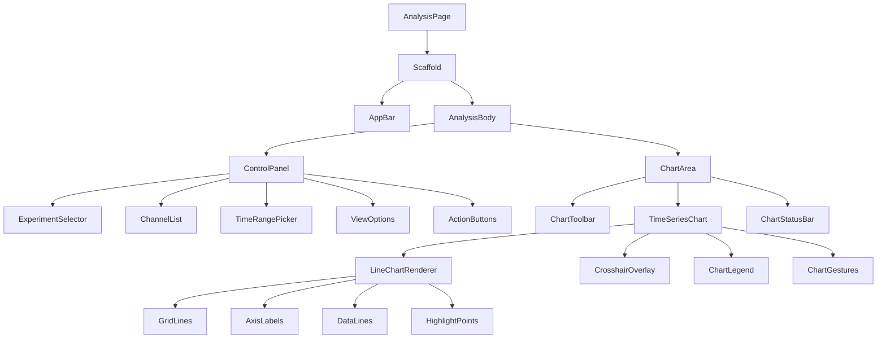

### 2.2 组件职责说明

#### AnalysisPage
- **类型**: `ConsumerWidget`
- **职责**: 页面入口，监听 URL 参数（experiment_id），初始化页面级 Provider
- **路由**: `/analysis?experiment_id={id}`
- **状态依赖**: `analysisPageControllerProvider`

#### AnalysisBody
- **类型**: `ConsumerWidget`
- **职责**: 布局容器，管理左右分栏的响应式行为
- **布局规则**:
  - 屏幕宽度 >= 1024px: `Row` 水平排列，左侧 320px，右侧 `Expanded`
  - 屏幕宽度 < 1024px: `Column` 垂直排列，控制面板可折叠

#### ControlPanel
- **类型**: `ConsumerWidget`
- **职责**: 左侧控制面板容器，聚合所有控制子组件
- **子组件**:
  - `ExperimentSelector`: 实验下拉选择（当无 URL 参数时显示）
  - `ChannelList`: 通道多选列表，带颜色指示器
  - `TimeRangePicker`: 时间范围选择，支持预设和自定义
  - `ViewOptions`: 图表视图选项（网格、插值模式等）
  - `ActionButtons`: 刷新、导出、重置视图按钮

#### ChartArea
- **类型**: `ConsumerWidget`
- **职责**: 右侧图表区容器，管理图表状态与工具栏
- **子组件**:
  - `ChartToolbar`: 顶部工具栏（缩放控制、复位、全屏）
  - `TimeSeriesChart`: 核心图表组件
  - `ChartStatusBar`: 底部状态栏（数据点数、加载状态、时间范围）

#### TimeSeriesChart
- **类型**: `StatefulWidget`（需要管理手势状态）
- **职责**: 核心图表渲染与交互
- **子组件**:
  - `LineChartRenderer`: fl_chart 的 `LineChart` 包装器
  - `CrosshairOverlay`: 自定义绘制的十字光标层
  - `ChartLegend`: 自定义图例（fl_chart 内置图例功能有限）
  - `ChartGestures`: 手势识别与处理（缩放、平移）

### 2.3 Widget 层级详细图

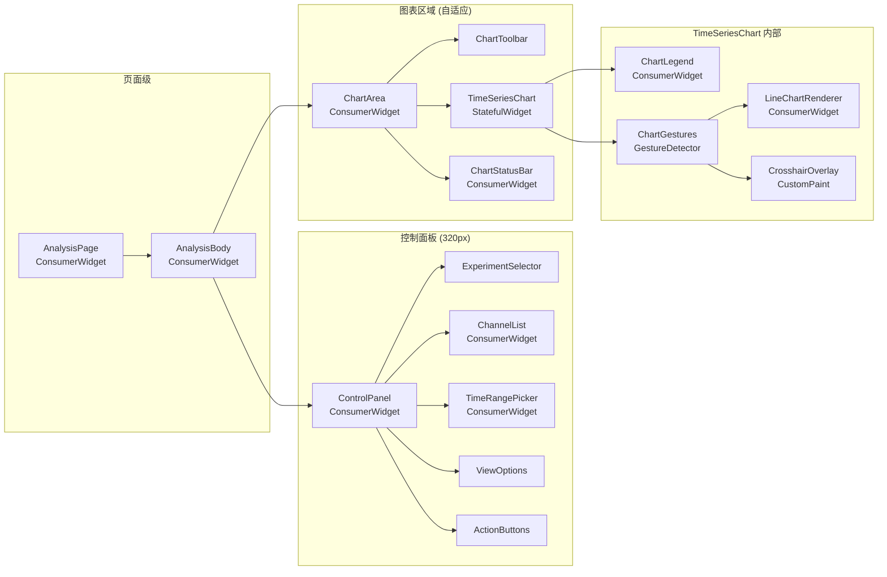

### 2.4 响应式断点设计

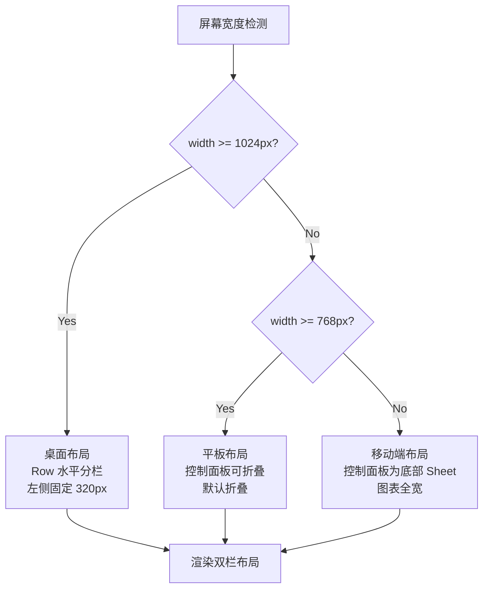

---

## 3. 状态管理设计

### 3.1 架构概述

采用 Riverpod 的分层 Provider 架构，将状态按职责和生命周期分层管理。所有图表相关状态集中在 `analysis` 功能模块下。

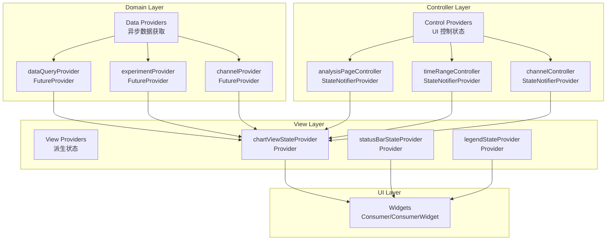

### 3.2 Provider 详细定义

#### 3.2.1 数据层 Provider

```dart
/// 当前选中的实验 ID，从 URL 参数或用户选择派生
final selectedExperimentIdProvider = StateProvider<String?>((ref) => null);

/// 实验详情数据
final experimentProvider = FutureProvider.family<Experiment, String>(
  (ref, experimentId) async {
    final api = ref.watch(experimentApiProvider);
    return api.getExperiment(experimentId);
  },
);

/// 实验通道列表
final channelsProvider = FutureProvider.family<List<Channel>, String>(
  (ref, experimentId) async {
    final api = ref.watch(experimentApiProvider);
    return api.getChannels(experimentId);
  },
);

/// 图表数据查询（核心数据 Provider）
final chartDataProvider = FutureProvider.family<ChartData, ChartQueryParams>(
  (ref, params) async {
    final api = ref.watch(dataApiProvider);
    return api.queryData(
      experimentId: params.experimentId,
      startTime: params.startTime,
      endTime: params.endTime,
      channels: params.channels,
      resolution: params.resolution,
    );
  },
);
```

#### 3.2.2 控制层 Provider

```dart
/// 分析页面控制器
/// 管理页面级状态：选中实验、选中通道、时间范围、视图配置
@riverpod
class AnalysisPageController extends _$AnalysisPageController {
  @override
  AnalysisPageState build() {
    return const AnalysisPageState();
  }

  void selectExperiment(String experimentId) {
    state = state.copyWith(selectedExperimentId: experimentId);
  }

  void toggleChannel(String channelId) {
    final current = Set<String>.from(state.selectedChannels);
    if (current.contains(channelId)) {
      current.remove(channelId);
    } else {
      if (current.length < 4) {
        current.add(channelId);
      }
    }
    state = state.copyWith(selectedChannels: current);
  }

  void setTimeRange(DateTime start, DateTime end) {
    state = state.copyWith(
      startTime: start,
      endTime: end,
    );
  }

  void setViewport(DateTime visibleStart, DateTime visibleEnd) {
    state = state.copyWith(
      viewportStart: visibleStart,
      viewportEnd: visibleEnd,
    );
  }

  void resetViewport() {
    state = state.copyWith(
      viewportStart: null,
      viewportEnd: null,
    );
  }

  void toggleLegendVisibility(String channelId) {
    final current = Set<String>.from(state.hiddenChannels);
    if (current.contains(channelId)) {
      current.remove(channelId);
    } else {
      current.add(channelId);
    }
    state = state.copyWith(hiddenChannels: current);
  }

  void setZoomScale(double scale) {
    state = state.copyWith(zoomScale: scale.clamp(0.01, 100.0));
  }

  void setPanOffset(Duration offset) {
    state = state.copyWith(panOffset: offset);
  }
}
```

#### 3.2.3 状态模型

```dart
@freezed
class AnalysisPageState with _$AnalysisPageState {
  const factory AnalysisPageState({
    String? selectedExperimentId,
    @Default({}) Set<String> selectedChannels,
    @Default({}) Set<String> hiddenChannels,
    DateTime? startTime,
    DateTime? endTime,
    DateTime? viewportStart,
    DateTime? viewportEnd,
    @Default(1.0) double zoomScale,
    @Default(Duration.zero) Duration panOffset,
    @Default(ChartViewConfig()) ChartViewConfig viewConfig,
  }) = _AnalysisPageState;
}

@freezed
class ChartViewConfig with _$ChartViewConfig {
  const factory ChartViewConfig({
    @Default(true) bool showGrid,
    @Default(true) bool showDots,
    @Default(1.5) double lineWidth,
    @Default(InterpolationMode.linear) InterpolationMode interpolation,
    @Default(true) bool showCrosshair,
    @Default(true) bool showLegend,
    @Default(100) int targetDataPoints,
  }) = _ChartViewConfig;
}

enum InterpolationMode { linear, smooth, step }
```

### 3.3 状态流图

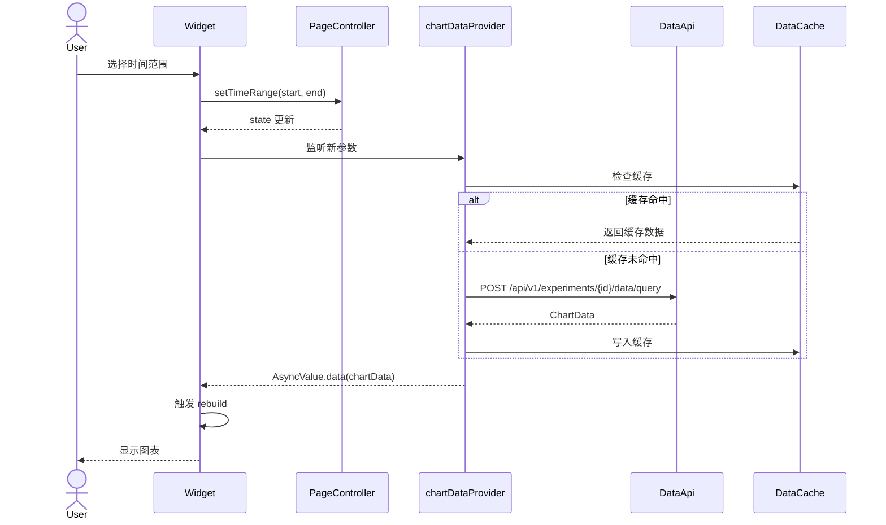

### 3.4 派生状态设计

```dart
/// 当前有效的图表查询参数
/// 当任何依赖变化时自动重新计算
final chartQueryParamsProvider = Provider<ChartQueryParams?>((ref) {
  final experimentId = ref.watch(
    analysisPageControllerProvider.select((s) => s.selectedExperimentId),
  );
  final startTime = ref.watch(
    analysisPageControllerProvider.select((s) => s.startTime),
  );
  final endTime = ref.watch(
    analysisPageControllerProvider.select((s) => s.endTime),
  );
  final channels = ref.watch(
    analysisPageControllerProvider.select((s) => s.selectedChannels),
  );
  final config = ref.watch(
    analysisPageControllerProvider.select((s) => s.viewConfig),
  );

  if (experimentId == null || startTime == null || endTime == null) {
    return null;
  }

  if (channels.isEmpty) {
    return null;
  }

  return ChartQueryParams(
    experimentId: experimentId,
    startTime: startTime,
    endTime: endTime,
    channels: channels.toList(),
    resolution: _calculateResolution(startTime, endTime, config.targetDataPoints),
  );
});

/// 计算时间分辨率（数据降采样级别）
int _calculateResolution(DateTime start, DateTime end, int targetPoints) {
  final totalDuration = end.difference(start);
  final totalSeconds = totalDuration.inSeconds;
  final secondsPerPoint = totalSeconds ~/ targetPoints;
  
  if (secondsPerPoint <= 1) return 1;
  if (secondsPerPoint <= 10) return 10;
  if (secondsPerPoint <= 60) return 60;
  if (secondsPerPoint <= 300) return 300;
  if (secondsPerPoint <= 900) return 900;
  if (secondsPerPoint <= 3600) return 3600;
  return 86400;
}

/// 图表可见数据（考虑 viewport 缩放和平移）
final visibleChartDataProvider = Provider<AsyncValue<ChartData>>((ref) {
  final params = ref.watch(chartQueryParamsProvider);
  if (params == null) {
    return const AsyncValue.loading();
  }

  final chartDataAsync = ref.watch(chartDataProvider(params));
  final pageState = ref.watch(analysisPageControllerProvider);

  return chartDataAsync.when(
    data: (chartData) {
      // 应用 viewport 裁剪
      final effectiveStart = pageState.viewportStart ?? params.startTime;
      final effectiveEnd = pageState.viewportEnd ?? params.endTime;
      return AsyncValue.data(
        chartData.filtered(effectiveStart, effectiveEnd),
      );
    },
    loading: () => const AsyncValue.loading(),
    error: (err, stack) => AsyncValue.error(err, stack),
  );
});

/// 图例状态
final legendStateProvider = Provider<List<LegendItem>>((ref) {
  final channelsAsync = ref.watch(channelsProvider(
    ref.watch(analysisPageControllerProvider.select((s) => s.selectedExperimentId ?? '')),
  ));
  final hiddenChannels = ref.watch(
    analysisPageControllerProvider.select((s) => s.hiddenChannels),
  );
  final selectedChannels = ref.watch(
    analysisPageControllerProvider.select((s) => s.selectedChannels),
  );

  return channelsAsync.when(
    data: (channels) {
      return channels
          .where((c) => selectedChannels.contains(c.id))
          .map((c) => LegendItem(
                channelId: c.id,
                name: c.name,
                color: c.color,
                isVisible: !hiddenChannels.contains(c.id),
              ))
          .toList();
    },
    loading: () => [],
    error: (_, __) => [],
  );
});
```

### 3.5 Provider 依赖关系图

```mermaid
digraph ProviderGraph {
    rankdir=TB;
    node [shape=box, style=rounded];
    
    // 输入层
    urlParams [label="urlParamsProvider\n(URI 参数)"];
    
    // 控制器层
    pageController [label="analysisPageController\n(StateNotifier)", fillcolor=lightblue, style="rounded,filled"];
    
    // 数据层
    expApi [label="experimentApiProvider"];
    dataApi [label="dataApiProvider"];
    expData [label="experimentProvider\n(FutureProvider)", fillcolor=lightyellow, style="rounded,filled"];
    chData [label="channelsProvider\n(FutureProvider)", fillcolor=lightyellow, style="rounded,filled"];
    
    // 查询参数
    queryParams [label="chartQueryParamsProvider\n(Provider)", fillcolor=lightgreen, style="rounded,filled"];
    
    // 核心数据
    chartData [label="chartDataProvider\n(FutureProvider)", fillcolor=lightyellow, style="rounded,filled"];
    
    // 派生状态
    visibleData [label="visibleChartDataProvider\n(Provider)", fillcolor=lightgreen, style="rounded,filled"];
    legendState [label="legendStateProvider\n(Provider)", fillcolor=lightgreen, style="rounded,filled"];
    statusState [label="statusBarStateProvider\n(Provider)", fillcolor=lightgreen, style="rounded,filled"];
    
    // 依赖关系
    urlParams -> pageController;
    pageController -> queryParams;
    expApi -> expData;
    expApi -> chData;
    pageController -> expData [style=dashed, label="expId"];
    pageController -> chData [style=dashed, label="expId"];
    queryParams -> chartData;
    dataApi -> chartData;
    chartData -> visibleData;
    pageController -> visibleData [style=dashed, label="viewport"];
    pageController -> legendState;
    chData -> legendState;
    visibleData -> statusState;
    pageController -> statusState [style=dashed];
}
```

---

## 4. TimeSeriesChart 组件详细设计

### 4.1 组件接口定义

```dart
/// 时序图表组件
/// 
/// 这是一个有状态组件，管理手势交互的本地状态（如当前鼠标位置、
/// 拖拽起始点等）。业务状态（数据、配置）通过 Riverpod 注入。
class TimeSeriesChart extends ConsumerStatefulWidget {
  const TimeSeriesChart({
    super.key,
    required this.experimentId,
    this.height = 500,
    this.minHeight = 300,
    this.maxHeight = 800,
    this.padding = const EdgeInsets.all(16),
  });

  final String experimentId;
  final double height;
  final double minHeight;
  final double maxHeight;
  final EdgeInsets padding;

  @override
  ConsumerState<TimeSeriesChart> createState() => _TimeSeriesChartState();
}
```

### 4.2 内部状态设计

```dart
class _TimeSeriesChartState extends ConsumerState<TimeSeriesChart> {
  /// 当前鼠标/指针在图表区域内的本地坐标
  Offset? _pointerPosition;
  
  /// 是否正在拖拽平移
  bool _isPanning = false;
  
  /// 拖拽起始点对应的数据时间
  DateTime? _panStartTime;
  
  /// 拖拽起始时的 viewport
  DateTimeRange? _panStartViewport;
  
  /// 当前缩放比例（由滚轮手势累积）
  double _zoomAccumulation = 1.0;
  
  /// 十字光标最近的数据点索引（每通道）
  Map<String, int>? _nearestPointIndices;
  
  /// 图表绘制区域大小（用于坐标转换）
  Size? _chartAreaSize;
  
  /// fl_chart 的 LineTouchData 回调控制器
  final _touchCallbackController = StreamController<LineTouchResponse>.broadcast();

  @override
  void dispose() {
    _touchCallbackController.close();
    super.dispose();
  }
  
  // ... 手势处理和渲染逻辑
}
```

### 4.3 渲染流程

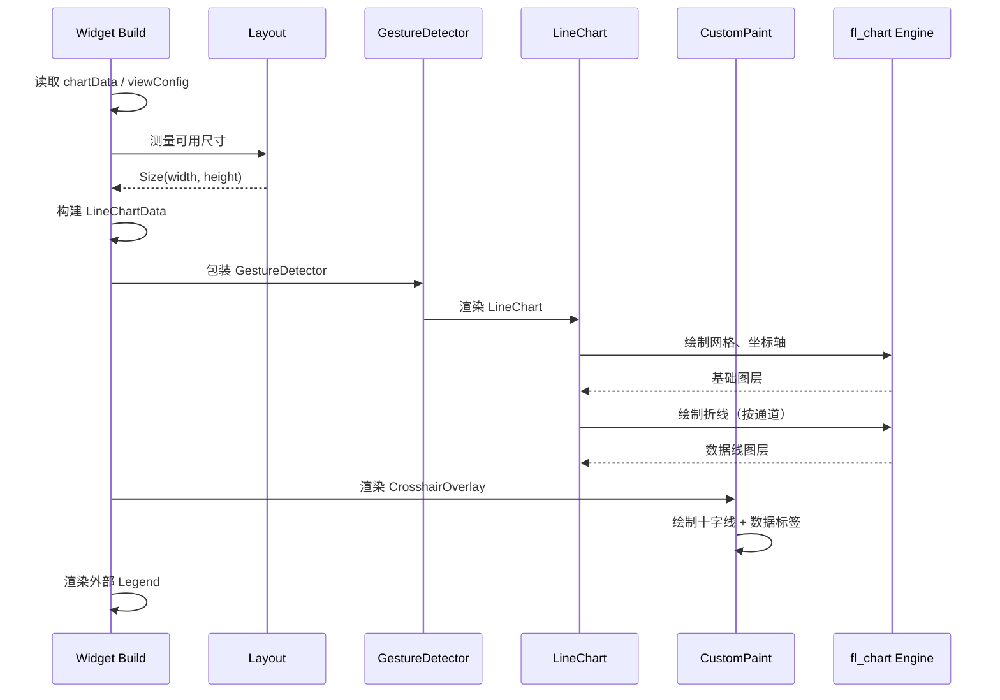

### 4.4 核心渲染方法

```dart
@override
Widget build(BuildContext context) {
  final chartDataAsync = ref.watch(visibleChartDataProvider);
  final viewConfig = ref.watch(
    analysisPageControllerProvider.select((s) => s.viewConfig),
  );
  final legendItems = ref.watch(legendStateProvider);

  return chartDataAsync.when(
    data: (chartData) => _buildChart(context, chartData, viewConfig, legendItems),
    loading: () => _buildLoadingState(),
    error: (error, _) => _buildErrorState(error),
  );
}

Widget _buildChart(
  BuildContext context,
  ChartData chartData,
  ChartViewConfig config,
  List<LegendItem> legendItems,
) {
  if (chartData.isEmpty) {
    return _buildEmptyState();
  }

  final theme = Theme.of(context);
  final colorScheme = theme.colorScheme;

  return LayoutBuilder(
    builder: (context, constraints) {
      _chartAreaSize = Size(
        constraints.maxWidth - widget.padding.horizontal,
        widget.height - widget.padding.vertical,
      );

      return Column(
        children: [
          // 图表主体
          Expanded(
            child: Padding(
              padding: widget.padding,
              child: GestureDetector(
                onPanStart: _handlePanStart,
                onPanUpdate: _handlePanUpdate,
                onPanEnd: _handlePanEnd,
                child: Listener(
                  onPointerSignal: _handlePointerSignal,
                  onPointerHover: _handlePointerHover,
                  child: Stack(
                    children: [
                      // 底层：fl_chart 折线图
                      LineChart(
                        _buildLineChartData(chartData, config, colorScheme, legendItems),
                        duration: Duration.zero, // 禁用动画以获得最佳性能
                        curve: Curves.linear,
                      ),
                      // 上层：十字光标覆盖层
                      if (config.showCrosshair && _pointerPosition != null)
                        CustomPaint(
                          size: Size.infinite,
                          painter: CrosshairPainter(
                            position: _pointerPosition!,
                            chartData: chartData,
                            visibleChannels: legendItems.where((i) => i.isVisible).map((i) => i.channelId).toList(),
                            colorScheme: colorScheme,
                            nearestIndices: _nearestPointIndices,
                          ),
                        ),
                    ],
                  ),
                ),
              ),
            ),
          ),
          // 图例区域
          if (config.showLegend)
            ChartLegend(
              items: legendItems,
              onToggle: (channelId) {
                ref.read(analysisPageControllerProvider.notifier)
                    .toggleLegendVisibility(channelId);
              },
            ),
        ],
      );
    },
  );
}
```

### 4.5 LineChartData 构建

```dart
LineChartData _buildLineChartData(
  ChartData chartData,
  ChartViewConfig config,
  ColorScheme colorScheme,
  List<LegendItem> legendItems,
) {
  final visibleChannels = legendItems
      .where((item) => item.isVisible)
      .map((item) => item.channelId)
      .toList();

  final minTs = chartData.timestamps.first.millisecondsSinceEpoch.toDouble();
  final maxTs = chartData.timestamps.last.millisecondsSinceEpoch.toDouble();
  
  // 计算 Y 轴范围（所有可见通道的最小/最大值）
  final (yMin, yMax) = _calculateYRange(chartData, visibleChannels);
  final yPadding = (yMax - yMin) * 0.1;

  return LineChartData(
    // 网格线配置
    gridData: FlGridData(
      show: config.showGrid,
      drawVerticalLine: true,
      drawHorizontalLine: true,
      verticalInterval: _calculateTimeInterval(minTs, maxTs),
      horizontalInterval: _calculateValueInterval(yMin, yMax),
      getDrawingVerticalLine: (value) => FlLine(
        color: colorScheme.outlineVariant.withOpacity(0.3),
        strokeWidth: 0.5,
      ),
      getDrawingHorizontalLine: (value) => FlLine(
        color: colorScheme.outlineVariant.withOpacity(0.3),
        strokeWidth: 0.5,
      ),
    ),
    
    // 标题配置（轴标签）
    titlesData: FlTitlesData(
      show: true,
      bottomTitles: AxisTitles(
        sideTitles: SideTitles(
          showTitles: true,
          reservedSize: 40,
          interval: _calculateTimeInterval(minTs, maxTs),
          getTitlesWidget: (value, meta) {
            final date = DateTime.fromMillisecondsSinceEpoch(value.toInt());
            return Padding(
              padding: const EdgeInsets.only(top: 8),
              child: Text(
                _formatTimestamp(date, maxTs - minTs),
                style: theme.textTheme.bodySmall?.copyWith(
                  color: colorScheme.onSurfaceVariant,
                  fontSize: 10,
                ),
              ),
            );
          },
        ),
      ),
      leftTitles: AxisTitles(
        sideTitles: SideTitles(
          showTitles: true,
          reservedSize: 56,
          interval: _calculateValueInterval(yMin, yMax),
          getTitlesWidget: (value, meta) {
            return Text(
              value.toStringAsFixed(2),
              style: theme.textTheme.bodySmall?.copyWith(
                color: colorScheme.onSurfaceVariant,
                fontSize: 10,
              ),
            );
          },
        ),
      ),
      rightTitles: const AxisTitles(sideTitles: SideTitles(showTitles: false)),
      topTitles: const AxisTitles(sideTitles: SideTitles(showTitles: false)),
    ),
    
    // 边框配置
    borderData: FlBorderData(
      show: true,
      border: Border.all(
        color: colorScheme.outlineVariant.withOpacity(0.5),
        width: 0.5,
      ),
    ),
    
    // X 轴范围（时间轴）
    minX: minTs,
    maxX: maxTs,
    
    // Y 轴范围（数值轴）
    minY: yMin - yPadding,
    maxY: yMax + yPadding,
    
    // 折线数据
    lineBarsData: _buildLineBarsData(chartData, visibleChannels, config, legendItems),
    
    // 交互配置
    lineTouchData: LineTouchData(
      enabled: false, // 禁用内置触摸，使用自定义覆盖层
    ),
    
    // 背景
    backgroundColor: Colors.transparent,
  );
}

List<LineChartBarData> _buildLineBarsData(
  ChartData chartData,
  List<String> visibleChannels,
  ChartViewConfig config,
  List<LegendItem> legendItems,
) {
  return visibleChannels.map((channelId) {
    final channelData = chartData.getChannelData(channelId);
    final color = legendItems.firstWhere((i) => i.channelId == channelId).color;
    
    final spots = <FlSpot>[];
    for (int i = 0; i < chartData.timestamps.length; i++) {
      final value = channelData[i];
      if (value != null && !value.isNaN) {
        spots.add(FlSpot(
          chartData.timestamps[i].millisecondsSinceEpoch.toDouble(),
          value,
        ));
      }
    }

    return LineChartBarData(
      spots: spots,
      color: color,
      barWidth: config.lineWidth,
      isCurved: config.interpolation == InterpolationMode.smooth,
      curveSmoothness: 0.35,
      preventCurveOverShooting: true,
      dotData: FlDotData(
        show: config.showDots && spots.length < 200,
        getDotPainter: (spot, percent, bar, index) {
          return FlDotCirclePainter(
            radius: 3,
            color: color,
            strokeWidth: 1.5,
            strokeColor: colorScheme.surface,
          );
        },
      ),
      belowBarData: BarAreaData(show: false),
      aboveBarData: BarAreaData(show: false),
    );
  }).toList();
}
```

### 4.6 手势处理实现

```dart
/// 处理鼠标滚轮缩放
void _handlePointerSignal(PointerSignalEvent event) {
  if (event is PointerScrollEvent) {
    final renderBox = context.findRenderObject() as RenderBox?;
    if (renderBox == null) return;

    final localPosition = renderBox.globalToLocal(event.position);
    
    // 检查是否在图表区域内
    if (!_isWithinChartArea(localPosition)) return;

    // 计算缩放因子
    final zoomFactor = event.scrollDelta.dy > 0 ? 1.1 : 0.9;
    _zoomAccumulation *= zoomFactor;
    _zoomAccumulation = _zoomAccumulation.clamp(0.01, 100.0);

    // 以鼠标位置为中心进行缩放
    _applyZoom(localPosition, zoomFactor);
  }
}

/// 应用缩放，以指定点为中心
void _applyZoom(Offset focalPoint, double factor) {
  final controller = ref.read(analysisPageControllerProvider.notifier);
  final state = ref.read(analysisPageControllerProvider);
  
  if (state.viewportStart == null || state.viewportEnd == null) return;

  final start = state.viewportStart!;
  final end = state.viewportEnd!;
  final totalDuration = end.difference(start);
  
  // 计算焦点在 viewport 中的比例位置
  final chartWidth = _chartAreaSize?.width ?? 1;
  final focalRatio = (focalPoint.dx - widget.padding.left) / chartWidth;
  
  // 焦点对应的时间点
  final focalTime = start.add(Duration(
    milliseconds: (totalDuration.inMilliseconds * focalRatio).toInt(),
  ));

  // 新的时间范围
  final newDuration = Duration(
    milliseconds: (totalDuration.inMilliseconds * factor).toInt(),
  );
  
  final newStart = focalTime.subtract(Duration(
    milliseconds: (newDuration.inMilliseconds * focalRatio).toInt(),
  ));
  final newEnd = focalTime.add(Duration(
    milliseconds: (newDuration.inMilliseconds * (1 - focalRatio)).toInt(),
  ));

  controller.setViewport(newStart, newEnd);
}

/// 处理拖拽开始
void _handlePanStart(DragStartDetails details) {
  final state = ref.read(analysisPageControllerProvider);
  if (state.viewportStart == null || state.viewportEnd == null) return;

  setState(() {
    _isPanning = true;
    _panStartTime = DateTime.now();
    _panStartViewport = DateTimeRange(
      start: state.viewportStart!,
      end: state.viewportEnd!,
    );
  });
}

/// 处理拖拽更新（平移）
void _handlePanUpdate(DragUpdateDetails details) {
  if (!_isPanning || _panStartViewport == null) return;

  final chartWidth = _chartAreaSize?.width ?? 1;
  final dxRatio = -details.delta.dx / chartWidth;
  
  final viewportDuration = _panStartViewport!.duration;
  final timeDelta = Duration(
    milliseconds: (viewportDuration.inMilliseconds * dxRatio).toInt(),
  );

  final controller = ref.read(analysisPageControllerProvider.notifier);
  controller.setViewport(
    _panStartViewport!.start.add(timeDelta),
    _panStartViewport!.end.add(timeDelta),
  );
}

/// 处理拖拽结束
void _handlePanEnd(DragEndDetails details) {
  setState(() {
    _isPanning = false;
    _panStartTime = null;
    _panStartViewport = null;
  });
}

/// 处理鼠标悬停（更新十字光标位置）
void _handlePointerHover(PointerHoverEvent event) {
  final renderBox = context.findRenderObject() as RenderBox?;
  if (renderBox == null) return;

  final localPosition = renderBox.globalToLocal(event.position);
  
  if (!_isWithinChartArea(localPosition)) {
    setState(() {
      _pointerPosition = null;
      _nearestPointIndices = null;
    });
    return;
  }

  // 查找最近的数据点
  final chartData = ref.read(visibleChartDataProvider).valueOrNull;
  if (chartData == null) return;

  final nearestIndices = _findNearestPoints(localPosition, chartData);

  setState(() {
    _pointerPosition = localPosition;
    _nearestPointIndices = nearestIndices;
  });
}

/// 查找鼠标位置最近的数据点索引
Map<String, int> _findNearestPoints(Offset position, ChartData chartData) {
  final result = <String, int>{};
  final chartWidth = _chartAreaSize?.width ?? 1;
  final chartHeight = _chartAreaSize?.height ?? 1;
  
  // 将屏幕坐标转换为数据坐标
  final minTs = chartData.timestamps.first.millisecondsSinceEpoch;
  final maxTs = chartData.timestamps.last.millisecondsSinceEpoch;
  final timeRange = maxTs - minTs;
  
  final mouseXRatio = (position.dx - widget.padding.left) / chartWidth;
  final targetTimestamp = minTs + (timeRange * mouseXRatio).toInt();

  for (final channelId in chartData.channelIds) {
    final channelData = chartData.getChannelData(channelId);
    int nearestIndex = 0;
    int minDistance = double.maxFinite.toInt();
    
    for (int i = 0; i < chartData.timestamps.length; i++) {
      final ts = chartData.timestamps[i].millisecondsSinceEpoch;
      final distance = (ts - targetTimestamp).abs();
      if (distance < minDistance) {
        minDistance = distance;
        nearestIndex = i;
      }
    }
    
    result[channelId] = nearestIndex;
  }

  return result;
}
```

### 4.7 十字光标绘制

```dart
/// 自定义十字光标绘制器
class CrosshairPainter extends CustomPainter {
  const CrosshairPainter({
    required this.position,
    required this.chartData,
    required this.visibleChannels,
    required this.colorScheme,
    this.nearestIndices,
    this.padding = const EdgeInsets.all(16),
  });

  final Offset position;
  final ChartData chartData;
  final List<String> visibleChannels;
  final ColorScheme colorScheme;
  final Map<String, int>? nearestIndices;
  final EdgeInsets padding;

  @override
  void paint(Canvas canvas, Size size) {
    if (nearestIndices == null || nearestIndices!.isEmpty) return;

    final chartRect = Rect.fromLTWH(
      padding.left,
      padding.top,
      size.width - padding.horizontal,
      size.height - padding.vertical,
    );

    // 绘制垂直参考线
    final linePaint = Paint()
      ..color = colorScheme.primary.withOpacity(0.3)
      ..strokeWidth = 1
      ..style = PaintingStyle.stroke;

    canvas.drawLine(
      Offset(position.dx, chartRect.top),
      Offset(position.dx, chartRect.bottom),
      linePaint,
    );

    // 绘制各通道的最近点高亮
    for (final channelId in visibleChannels) {
      final index = nearestIndices![channelId];
      if (index == null) continue;

      final value = chartData.getChannelData(channelId)[index];
      if (value == null || value.isNaN) continue;

      final timestamp = chartData.timestamps[index];
      final pointOffset = _dataToOffset(timestamp, value, chartRect);

      // 绘制高亮圆点
      final highlightPaint = Paint()
        ..color = _getChannelColor(channelId)
        ..style = PaintingStyle.fill;
      
      canvas.drawCircle(pointOffset, 5, highlightPaint);
      
      // 绘制外圈
      final borderPaint = Paint()
        ..color = colorScheme.surface
        ..style = PaintingStyle.stroke
        ..strokeWidth = 2;
      canvas.drawCircle(pointOffset, 5, borderPaint);
    }

    // 绘制数据标签提示框
    _drawTooltip(canvas, chartRect);
  }

  void _drawTooltip(Canvas canvas, Rect chartRect) {
    // 获取主通道（鼠标最近的那个）
    final primaryChannel = visibleChannels.first;
    final primaryIndex = nearestIndices![primaryChannel];
    if (primaryIndex == null) return;

    final timestamp = chartData.timestamps[primaryIndex];
    final textStyle = TextStyle(
      color: colorScheme.onSurface,
      fontSize: 12,
      fontFamily: 'monospace',
    );

    // 构建提示文本
    final lines = <String>[
      _formatFullTimestamp(timestamp),
      '',
    ];
    
    for (final channelId in visibleChannels) {
      final index = nearestIndices![channelId];
      if (index == null) continue;
      final value = chartData.getChannelData(channelId)[index];
      final name = chartData.getChannelName(channelId);
      lines.add('$name: ${value?.toStringAsFixed(4) ?? 'N/A'}');
    }

    // 计算提示框尺寸和位置
    final textPainter = TextPainter(
      textDirection: TextDirection.ltr,
      textAlign: TextAlign.left,
    );

    double maxWidth = 0;
    double totalHeight = 0;
    const lineHeight = 16.0;
    
    for (final line in lines) {
      textPainter.text = TextSpan(text: line, style: textStyle);
      textPainter.layout();
      maxWidth = math.max(maxWidth, textPainter.width);
      totalHeight += lineHeight;
    }

    final tooltipWidth = maxWidth + 16;
    final tooltipHeight = totalHeight + 12;
    
    // 智能定位：避免超出边界
    double tooltipLeft = position.dx + 12;
    double tooltipTop = position.dy - tooltipHeight - 8;
    
    if (tooltipLeft + tooltipWidth > chartRect.right) {
      tooltipLeft = position.dx - tooltipWidth - 12;
    }
    if (tooltipTop < chartRect.top) {
      tooltipTop = position.dy + 12;
    }

    final tooltipRect = RRect.fromRectAndRadius(
      Rect.fromLTWH(tooltipLeft, tooltipTop, tooltipWidth, tooltipHeight),
      const Radius.circular(8),
    );

    // 绘制背景
    final bgPaint = Paint()
      ..color = colorScheme.surfaceContainerHighest.withOpacity(0.95)
      ..style = PaintingStyle.fill;
    canvas.drawRRect(tooltipRect, bgPaint);

    // 绘制边框
    final borderPaint = Paint()
      ..color = colorScheme.outlineVariant
      ..style = PaintingStyle.stroke
      ..strokeWidth = 1;
    canvas.drawRRect(tooltipRect, borderPaint);

    // 绘制文本
    double textY = tooltipTop + 8;
    for (final line in lines) {
      textPainter.text = TextSpan(
        text: line,
        style: line.isEmpty 
            ? textStyle.copyWith(fontSize: 4) 
            : textStyle,
      );
      textPainter.layout();
      textPainter.paint(canvas, Offset(tooltipLeft + 8, textY));
      textY += lineHeight;
    }
  }

  Offset _dataToOffset(DateTime timestamp, double value, Rect chartRect) {
    final minTs = chartData.timestamps.first.millisecondsSinceEpoch.toDouble();
    final maxTs = chartData.timestamps.last.millisecondsSinceEpoch.toDouble();
    final (yMin, yMax) = _calculateYRange(chartData, visibleChannels);
    
    final xRatio = (timestamp.millisecondsSinceEpoch - minTs) / (maxTs - minTs);
    final yRatio = (value - yMin) / (yMax - yMin);
    
    return Offset(
      chartRect.left + chartRect.width * xRatio,
      chartRect.bottom - chartRect.height * yRatio,
    );
  }

  Color _getChannelColor(String channelId) {
    return chartData.getChannelColor(channelId);
  }

  @override
  bool shouldRepaint(covariant CrosshairPainter oldDelegate) {
    return position != oldDelegate.position ||
        nearestIndices != oldDelegate.nearestIndices ||
        visibleChannels != oldDelegate.visibleChannels;
  }
}
```

### 4.8 图例组件

```dart
/// 可交互图表图例
class ChartLegend extends ConsumerWidget {
  const ChartLegend({
    super.key,
    required this.items,
    required this.onToggle,
  });

  final List<LegendItem> items;
  final ValueChanged<String> onToggle;

  @override
  Widget build(BuildContext context, WidgetRef ref) {
    final theme = Theme.of(context);
    final colorScheme = theme.colorScheme;

    return Container(
      height: 48,
      padding: const EdgeInsets.symmetric(horizontal: 16),
      decoration: BoxDecoration(
        border: Border(
          top: BorderSide(color: colorScheme.outlineVariant),
        ),
      ),
      child: Row(
        children: [
          Text(
            '通道',
            style: theme.textTheme.labelSmall?.copyWith(
              color: colorScheme.onSurfaceVariant,
            ),
          ),
          const SizedBox(width: 12),
          Expanded(
            child: ListView.separated(
              scrollDirection: Axis.horizontal,
              itemCount: items.length,
              separatorBuilder: (_, __) => const SizedBox(width: 16),
              itemBuilder: (context, index) {
                final item = items[index];
                return _LegendItemWidget(
                  item: item,
                  onTap: () => onToggle(item.channelId),
                );
              },
            ),
          ),
        ],
      ),
    );
  }
}

class _LegendItemWidget extends StatelessWidget {
  const _LegendItemWidget({
    required this.item,
    required this.onTap,
  });

  final LegendItem item;
  final VoidCallback onTap;

  @override
  Widget build(BuildContext context) {
    final theme = Theme.of(context);
    final colorScheme = theme.colorScheme;

    return InkWell(
      onTap: onTap,
      borderRadius: BorderRadius.circular(4),
      child: Container(
        padding: const EdgeInsets.symmetric(horizontal: 8, vertical: 4),
        child: Row(
          mainAxisSize: MainAxisSize.min,
          children: [
            Container(
              width: 12,
              height: 3,
              decoration: BoxDecoration(
                color: item.isVisible ? item.color : colorScheme.outlineVariant,
                borderRadius: BorderRadius.circular(1.5),
              ),
            ),
            const SizedBox(width: 6),
            Text(
              item.name,
              style: theme.textTheme.bodySmall?.copyWith(
                color: item.isVisible 
                    ? colorScheme.onSurface 
                    : colorScheme.onSurfaceVariant,
                decoration: item.isVisible ? null : TextDecoration.lineThrough,
              ),
            ),
          ],
        ),
      ),
    );
  }
}
```

### 4.9 空状态/加载状态/错误状态

```dart
Widget _buildLoadingState() {
  return Center(
    child: Column(
      mainAxisAlignment: MainAxisAlignment.center,
      children: [
        const CircularProgressIndicator(),
        const SizedBox(height: 16),
        Text(
          '正在加载数据...',
          style: Theme.of(context).textTheme.bodyMedium,
        ),
      ],
    ),
  );
}

Widget _buildErrorState(Object error) {
  final colorScheme = Theme.of(context).colorScheme;
  
  return Center(
    child: Padding(
      padding: const EdgeInsets.all(32),
      child: Column(
        mainAxisAlignment: MainAxisAlignment.center,
        children: [
          Icon(
            Icons.error_outline,
            size: 48,
            color: colorScheme.error,
          ),
          const SizedBox(height: 16),
          Text(
            '数据加载失败',
            style: Theme.of(context).textTheme.titleMedium?.copyWith(
              color: colorScheme.error,
            ),
          ),
          const SizedBox(height: 8),
          Text(
            error.toString(),
            style: Theme.of(context).textTheme.bodySmall?.copyWith(
              color: colorScheme.onSurfaceVariant,
            ),
            textAlign: TextAlign.center,
            maxLines: 3,
            overflow: TextOverflow.ellipsis,
          ),
          const SizedBox(height: 16),
          FilledButton.icon(
            onPressed: () {
              ref.invalidate(chartDataProvider);
            },
            icon: const Icon(Icons.refresh),
            label: const Text('重试'),
          ),
        ],
      ),
    ),
  );
}

Widget _buildEmptyState() {
  return Center(
    child: Column(
      mainAxisAlignment: MainAxisAlignment.center,
      children: [
        Icon(
          Icons.show_chart,
          size: 48,
          color: Theme.of(context).colorScheme.onSurfaceVariant.withOpacity(0.5),
        ),
        const SizedBox(height: 16),
        Text(
          '暂无数据',
          style: Theme.of(context).textTheme.titleMedium?.copyWith(
            color: Theme.of(context).colorScheme.onSurfaceVariant,
          ),
        ),
        const SizedBox(height: 8),
        Text(
          '请选择时间范围并至少选择一个数据通道',
          style: Theme.of(context).textTheme.bodySmall?.copyWith(
            color: Theme.of(context).colorScheme.onSurfaceVariant,
          ),
        ),
      ],
    ),
  );
}
```

---

## 5. fl_chart 集成方案

### 5.1 库版本与依赖

```yaml
# kayak-frontend/pubspec.yaml
dependencies:
  fl_chart: ^0.66.0
```

### 5.2 集成架构

采用适配器模式封装 fl_chart，将第三方库的 API 与项目内部的数据模型隔离。这样在需要更换图表库时，只需修改适配层，不影响业务逻辑。

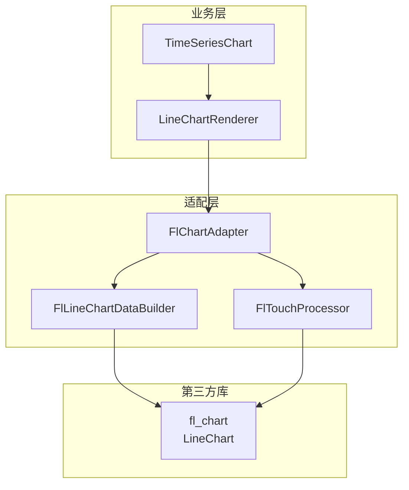

### 5.3 适配器实现

```dart
/// fl_chart 适配器
/// 负责将内部 ChartData 模型转换为 fl_chart 的 LineChartData
class FlChartAdapter {
  const FlChartAdapter();

  /// 构建 fl_chart 的 LineChartData
  LineChartData buildLineChartData({
    required ChartData chartData,
    required ChartViewConfig config,
    required List<LegendItem> visibleLegendItems,
    required ColorScheme colorScheme,
    required TextTheme textTheme,
  }) {
    final builder = FlLineChartDataBuilder(
      chartData: chartData,
      config: config,
      colorScheme: colorScheme,
      textTheme: textTheme,
    );

    return builder.build();
  }

  /// 将屏幕坐标转换为数据时间戳
  DateTime? screenToTimestamp(
    Offset localPosition,
    Size chartSize,
    EdgeInsets padding,
    DateTime start,
    DateTime end,
  ) {
    final chartWidth = chartSize.width - padding.horizontal;
    final dx = localPosition.dx - padding.left;
    final ratio = dx / chartWidth;
    
    if (ratio < 0 || ratio > 1) return null;

    final duration = end.difference(start);
    return start.add(Duration(
      milliseconds: (duration.inMilliseconds * ratio).toInt(),
    ));
  }

  /// 将数据时间戳转换为屏幕 X 坐标
  double timestampToScreenX(
    DateTime timestamp,
    Size chartSize,
    EdgeInsets padding,
    DateTime start,
    DateTime end,
  ) {
    final chartWidth = chartSize.width - padding.horizontal;
    final duration = end.difference(start).inMilliseconds;
    final offset = timestamp.difference(start).inMilliseconds;
    final ratio = offset / duration;
    return padding.left + chartWidth * ratio;
  }
}
```

### 5.4 fl_chart 已知限制与对策

| 限制 | 影响 | 对策 |
|------|------|------|
| 大数据集性能下降（>10k 点） | 页面卡顿 | 数据降采样 + 分段加载 |
| 内置十字光标功能有限 | 无法满足悬停显示多通道数据 | 禁用内置 touch，使用 CustomPaint 覆盖层 |
| 内置图例不支持点击切换 | 无法交互 | 外部实现自定义图例组件 |
| 滚轮缩放非原生支持 | 需要额外手势处理 | 使用 `Listener` + `onPointerSignal` 实现 |
| 动画默认开启 | 大数据量时性能损耗 | 设置 `duration: Duration.zero` |
| Y 轴多单位支持弱 | 不同通道单位可能不同 | 当前限制为同单位通道，或标准化显示 |

### 5.5 数据降采样策略

当数据点数量超过阈值时，在进入 fl_chart 之前进行降采样，保持视觉保真度的同时减少渲染负载。

```dart
/// LTTB (Largest Triangle Three Buckets) 降采样算法
/// 在保留视觉特征的同时减少数据点数量
class LttbDownsampler {
  /// 降采样到目标点数
  static List<TimeSeriesPoint> downsample(
    List<TimeSeriesPoint> data,
    int threshold,
  ) {
    if (data.length <= threshold) return data;

    final sampled = <TimeSeriesPoint>[];
    sampled.add(data.first); // 保留第一个点

    final bucketSize = (data.length - 2) / (threshold - 2);
    var a = 0; // 上一个选中点的索引

    for (var i = 0; i < threshold - 2; i++) {
      final avgRangeStart = ((i + 1) * bucketSize).floor() + 1;
      final avgRangeEnd = ((i + 2) * bucketSize).floor() + 1;
      
      final avgRange = data.sublist(
        avgRangeStart,
        math.min(avgRangeEnd, data.length),
      );
      
      final avgPoint = _averagePoint(avgRange);
      
      final rangeOffs = avgRangeStart;
      final rangeTo = math.min(avgRangeEnd, data.length);
      
      var maxArea = -1.0;
      var maxIdx = rangeOffs;
      
      for (var j = rangeOffs; j < rangeTo; j++) {
        final area = _triangleArea(
          data[a].value,
          avgPoint,
          data[j].value,
        );
        if (area > maxArea) {
          maxArea = area;
          maxIdx = j;
        }
      }
      
      sampled.add(data[maxIdx]);
      a = maxIdx;
    }

    sampled.add(data.last); // 保留最后一个点
    return sampled;
  }

  static double _averagePoint(List<TimeSeriesPoint> points) {
    if (points.isEmpty) return 0;
    return points.map((p) => p.value).reduce((a, b) => a + b) / points.length;
  }

  static double _triangleArea(double a, double b, double c) {
    return (a - b).abs() + (b - c).abs() - (a - c).abs();
  }
}
```

---

## 6. 后端 API 集成

### 6.1 API 端点

```
POST /api/v1/experiments/{id}/data/query
```

### 6.2 请求模型

```dart
@freezed
class ChartQueryRequest with _$ChartQueryRequest {
  const factory ChartQueryRequest({
    required String experimentId,
    required DateTime startTime,
    required DateTime endTime,
    required List<String> channels,
    @Default(3600) int resolution,
    @Default(10000) int maxPoints,
  }) = _ChartQueryRequest;

  factory ChartQueryRequest.fromJson(Map<String, dynamic> json) =>
      _$ChartQueryRequestFromJson(json);
}
```

### 6.3 响应模型

```dart
@freezed
class ChartData with _$ChartData {
  const factory ChartData({
    required String experimentId,
    required List<DateTime> timestamps,
    required Map<String, List<double?>> channelData,
    required Map<String, ChannelMetadata> channelMetadata,
    required QueryStatistics statistics,
  }) = _ChartData;

  factory ChartData.fromJson(Map<String, dynamic> json) =>
      _$ChartDataFromJson(json);

  const ChartData._();

  List<String> get channelIds => channelData.keys.toList();

  List<double?> getChannelData(String channelId) => channelData[channelId] ?? [];

  String getChannelName(String channelId) => 
      channelMetadata[channelId]?.name ?? channelId;

  Color getChannelColor(String channelId) =>
      channelMetadata[channelId]?.color ?? Colors.grey;

  bool get isEmpty => timestamps.isEmpty || channelData.isEmpty;

  /// 按时间范围过滤数据（用于 viewport 裁剪）
  ChartData filtered(DateTime start, DateTime end) {
    final startIdx = timestamps.indexWhere((t) => t.isAfter(start) || t.isAtSameMomentAs(start));
    final endIdx = timestamps.lastIndexWhere((t) => t.isBefore(end) || t.isAtSameMomentAs(end));
    
    if (startIdx == -1 || endIdx == -1 || startIdx > endIdx) {
      return ChartData(
        experimentId: experimentId,
        timestamps: [],
        channelData: {for (var k in channelData.keys) k: []},
        channelMetadata: channelMetadata,
        statistics: statistics,
      );
    }

    final filteredTimestamps = timestamps.sublist(startIdx, endIdx + 1);
    final filteredChannelData = <String, List<double?>>{};
    
    for (final entry in channelData.entries) {
      filteredChannelData[entry.key] = entry.value.sublist(startIdx, endIdx + 1);
    }

    return ChartData(
      experimentId: experimentId,
      timestamps: filteredTimestamps,
      channelData: filteredChannelData,
      channelMetadata: channelMetadata,
      statistics: statistics,
    );
  }
}

@freezed
class ChannelMetadata with _$ChannelMetadata {
  const factory ChannelMetadata({
    required String id,
    required String name,
    required String unit,
    required Color color,
    double? minValue,
    double? maxValue,
  }) = _ChannelMetadata;

  factory ChannelMetadata.fromJson(Map<String, dynamic> json) =>
      _$ChannelMetadataFromJson(json);
}

@freezed
class QueryStatistics with _$QueryStatistics {
  const factory QueryStatistics({
    required int totalPoints,
    required int returnedPoints,
    required Duration queryTime,
    required DateTime serverTime,
  }) = _QueryStatistics;

  factory QueryStatistics.fromJson(Map<String, dynamic> json) =>
      _$QueryStatisticsFromJson(json);
}
```

### 6.4 API 客户端实现

```dart
/// 数据查询 API 客户端
class DataApiClient {
  const DataApiClient({required this.dio});

  final Dio dio;

  Future<ChartData> queryData({
    required String experimentId,
    required DateTime startTime,
    required DateTime endTime,
    required List<String> channels,
    int resolution = 3600,
    int maxPoints = 10000,
  }) async {
    final response = await dio.post<Map<String, dynamic>>(
      '/api/v1/experiments/$experimentId/data/query',
      data: {
        'start_time': startTime.toIso8601String(),
        'end_time': endTime.toIso8601String(),
        'channels': channels,
        'resolution': resolution,
        'max_points': maxPoints,
      },
    );

    if (response.data == null) {
      throw ApiException('Empty response');
    }

    return ChartData.fromJson(response.data!);
  }
}
```

### 6.5 数据加载时序图

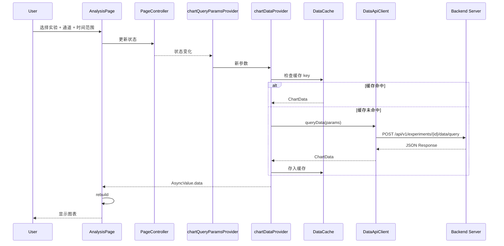

### 6.6 分段加载策略

当用户选择的时间范围很大（如 7 天），而数据采样率很高时，采用分段加载策略：

1. **初始加载**：加载整个时间范围的低分辨率概览数据（如 1 小时平均）
2. **按需细化**：当用户缩放（zoom in）到特定时间段时，加载该区间的原始分辨率数据
3. **缓存管理**：使用 LRU 缓存策略，最多保留 10 个时间段的数据段
4. **预加载**：在当前 viewport 两侧各预加载 1 个视口宽度的数据，保证平滑平移

```dart
/// 数据段缓存管理器
class ChartDataCache {
  final _cache = <String, CacheEntry>{};
  static const int _maxEntries = 10;

  String _makeKey(String experimentId, DateTime start, DateTime end, List<String> channels) {
    final channelHash = channels.join(',').hashCode;
    return '$experimentId:${start.millisecondsSinceEpoch}:${end.millisecondsSinceEpoch}:$channelHash';
  }

  ChartData? get(String experimentId, DateTime start, DateTime end, List<String> channels) {
    final key = _makeKey(experimentId, start, end, channels);
    final entry = _cache[key];
    if (entry != null && !entry.isExpired) {
      entry.lastAccessed = DateTime.now();
      return entry.data;
    }
    return null;
  }

  void put(String experimentId, DateTime start, DateTime end, List<String> channels, ChartData data) {
    final key = _makeKey(experimentId, start, end, channels);
    
    if (_cache.length >= _maxEntries) {
      _evictOldest();
    }
    
    _cache[key] = CacheEntry(
      data: data,
      createdAt: DateTime.now(),
      lastAccessed: DateTime.now(),
    );
  }

  void _evictOldest() {
    final oldest = _cache.entries.reduce((a, b) => 
        a.value.lastAccessed.isBefore(b.value.lastAccessed) ? a : b);
    _cache.remove(oldest.key);
  }

  void invalidate(String experimentId) {
    _cache.removeWhere((key, _) => key.startsWith('$experimentId:'));
  }
}

class CacheEntry {
  CacheEntry({
    required this.data,
    required this.createdAt,
    required this.lastAccessed,
  });

  final ChartData data;
  final DateTime createdAt;
  DateTime lastAccessed;
  
  static const _ttl = Duration(minutes: 5);
  
  bool get isExpired => DateTime.now().difference(createdAt) > _ttl;
}
```

---

## 7. 主题适配方案

### 7.1 主题感知架构

图表组件完全依赖 Flutter 的 `Theme` 系统，不硬编码任何颜色值。通过 `Theme.of(context)` 或 Riverpod 的 `themeProvider` 获取当前主题配置。

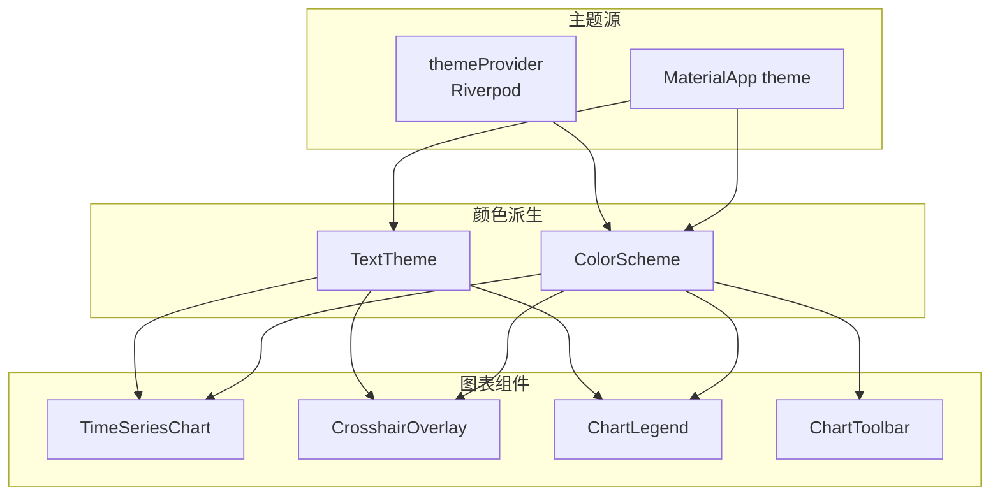

### 7.2 颜色映射表

| 图表元素 | 浅色主题 | 深色主题 | ColorScheme 来源 |
|---------|---------|---------|----------------|
| 网格线 | `outlineVariant` @ 30% | `outlineVariant` @ 20% | `ColorScheme.outlineVariant` |
| 坐标轴文字 | `onSurfaceVariant` | `onSurfaceVariant` | `ColorScheme.onSurfaceVariant` |
| 轴线/边框 | `outlineVariant` @ 50% | `outlineVariant` @ 40% | `ColorScheme.outlineVariant` |
| 十字线 | `primary` @ 30% | `primary` @ 30% | `ColorScheme.primary` |
| 提示框背景 | `surfaceContainerHighest` @ 95% | `surfaceContainerHighest` @ 95% | `ColorScheme.surfaceContainerHighest` |
| 提示框边框 | `outlineVariant` | `outlineVariant` | `ColorScheme.outlineVariant` |
| 加载指示器 | `primary` | `primary` | `ColorScheme.primary` |
| 错误图标 | `error` | `error` | `ColorScheme.error` |
| 通道颜色 | 动态生成 | 动态生成 | HSL 色环分配 |

### 7.3 动态通道颜色生成

```dart
/// 通道颜色生成器
/// 使用 HSL 色环均匀分布颜色，确保在深浅主题下均有良好对比度
class ChannelColorGenerator {
  static const List<Color> _defaultPalette = [
    Color(0xFF2196F3), // Blue
    Color(0xFF4CAF50), // Green
    Color(0xFFF44336), // Red
    Color(0xFFFF9800), // Orange
    Color(0xFF9C27B0), // Purple
    Color(0xFF00BCD4), // Cyan
    Color(0xFFFFEB3B), // Yellow
    Color(0xFFE91E63), // Pink
  ];

  /// 获取通道颜色（基于通道索引）
  static Color getColor(int index, {ColorScheme? colorScheme}) {
    if (index < _defaultPalette.length) {
      return _defaultPalette[index];
    }
    
    // 超出预设 palette 时，在色环上均匀分布
    final hue = (index * 137.5) % 360; // 黄金角分布
    return HSLColor.fromAHSL(1.0, hue, 0.7, 0.5).toColor();
  }

  /// 根据主题调整颜色亮度，确保对比度
  static Color adaptForTheme(Color color, Brightness brightness) {
    if (brightness == Brightness.dark) {
      // 深色主题下稍微提高亮度
      final hsl = HSLColor.fromColor(color);
      return hsl.withLightness((hsl.lightness + 0.1).clamp(0.0, 1.0)).toColor();
    }
    return color;
  }
}
```

### 7.4 主题切换响应

图表组件通过 Riverpod 监听主题变化，当系统主题切换时自动重建：

```dart
final themeModeProvider = StateProvider<ThemeMode>((ref) => ThemeMode.system);

final effectiveThemeProvider = Provider<ThemeData>((ref) {
  final mode = ref.watch(themeModeProvider);
  final platformBrightness = WidgetsBinding.instance.platformDispatcher.platformBrightness;
  
  final isDark = mode == ThemeMode.dark || 
      (mode == ThemeMode.system && platformBrightness == Brightness.dark);
  
  return isDark ? AppThemes.dark : AppThemes.light;
});
```

图表组件内部不直接监听主题，而是通过 `Theme.of(context)` 在 build 时获取当前主题。由于主题变化会触发重建，图表会自动更新颜色。

### 7.5 Material 3 动态颜色支持

当平台支持 Material 3 动态颜色（Android 12+ 或 Web 通过 `dynamic_color` 插件）时，图表颜色应适配动态颜色方案：

```dart
/// 在应用启动时初始化动态颜色
Future<ColorScheme> getDynamicColorScheme() async {
  try {
    final corePalette = await DynamicColorPlugin.getCorePalette();
    if (corePalette != null) {
      return corePalette.toColorScheme(brightness: Brightness.light);
    }
  } catch (e) {
    debugPrint('Dynamic color not available: $e');
  }
  return AppThemes.light.colorScheme;
}
```

---

## 8. 性能优化策略

### 8.1 渲染优化

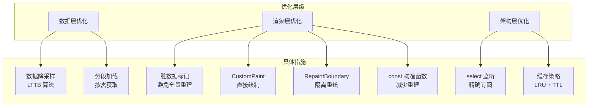

### 8.2 数据层优化

#### 8.2.1 降采样阈值

| 数据点数量 | 处理策略 |
|-----------|---------|
| < 1,000 | 直接渲染，不降采样 |
| 1,000 - 10,000 | LTTB 降采样到 1,000 点 |
| 10,000 - 100,000 | LTTB 降采样到 2,000 点 |
| > 100,000 | 请求后端预聚合，或分段加载 |

#### 8.2.2 分段加载参数

```dart
class SegmentLoader {
  static const Duration _defaultSegmentSize = Duration(hours: 1);
  static const int _maxSegmentsInMemory = 24;
  
  /// 计算需要加载的数据段
  List<TimeRange> calculateSegments(DateTime viewportStart, DateTime viewportEnd) {
    final segments = <TimeRange>[];
    var current = viewportStart;
    
    while (current.isBefore(viewportEnd)) {
      final segmentEnd = current.add(_defaultSegmentSize);
      segments.add(TimeRange(
        start: current,
        end: segmentEnd.isBefore(viewportEnd) ? segmentEnd : viewportEnd,
      ));
      current = segmentEnd;
    }
    
    return segments;
  }
}
```

### 8.3 渲染层优化

#### 8.3.1 RepaintBoundary 隔离

```dart
@override
Widget build(BuildContext context) {
  return Column(
    children: [
      // 工具栏：独立重绘边界
      RepaintBoundary(
        child: ChartToolbar(...),
      ),
      // 图表主体：独立重绘边界
      Expanded(
        child: RepaintBoundary(
          child: TimeSeriesChart(...),
        ),
      ),
      // 状态栏：独立重绘边界
      RepaintBoundary(
        child: ChartStatusBar(...),
      ),
    ],
  );
}
```

#### 8.3.2 避免不必要的重建

```dart
// 好的做法：使用 select 精确监听
final isLoading = ref.watch(
  chartDataProvider(params).select((async) => async.isLoading),
);

// 避免：监听整个状态对象
final state = ref.watch(chartDataProvider(params)); // 会重建所有变化
```

#### 8.3.3 const 构造函数

```dart
// 子组件使用 const 构造函数
const ChartLegend({
  super.key,
  required this.items,
  required this.onToggle,
});

// 在 build 中 const 实例化
return const ChartStatusBar(); // 不需要重建时保持 const
```

### 8.4 架构层优化

#### 8.4.1 Provider 选择器

```dart
// TimeSeriesChart 只监听需要的状态片段
@override
Widget build(BuildContext context, WidgetRef ref) {
  // 只监听数据变化
  final chartData = ref.watch(visibleChartDataProvider);
  
  // 只监听 viewConfig 变化，不监听其他 page state
  final viewConfig = ref.watch(
    analysisPageControllerProvider.select((s) => s.viewConfig),
  );
  
  // 只监听 hiddenChannels 变化
  final hiddenChannels = ref.watch(
    analysisPageControllerProvider.select((s) => s.hiddenChannels),
  );

  return ...;
}
```

#### 8.4.2 防抖处理

对于高频触发的事件（如快速缩放、拖拽），使用防抖避免频繁请求：

```dart
/// 防抖的 viewport 更新
final debouncedViewportProvider = Provider<DateTimeRange?>((ref) {
  final state = ref.watch(analysisPageControllerProvider);
  
  // 使用 Riverpod 的防抖扩展或自定义实现
  return ref.debounce(
    Duration(milliseconds: 100),
    () => state.viewportStart != null && state.viewportEnd != null
        ? DateTimeRange(start: state.viewportStart!, end: state.viewportEnd!)
        : null,
  );
});
```

### 8.5 Web 特定优化

由于目标平台是 Flutter Web，需额外关注以下性能点：

| 优化项 | 策略 |
|-------|------|
| CanvasKit vs HTML 渲染 | 强制使用 CanvasKit 渲染模式（`flutter build web --web-renderer canvaskit`）以获得最佳性能 |
| 内存管理 | 大数据集及时释放，避免 JS 堆溢出 |
| 滚动性能 | 图表区域使用 `AbsorbPointer` 在拖拽时阻止浏览器默认滚动行为 |
| 文本渲染 | 坐标轴标签使用 `Text` widget 而非自定义绘制，利用浏览器文本渲染优化 |
| 图片缓存 | 不使用图片资源，纯矢量绘制 |

### 8.6 性能监控

```dart
/// 图表性能监控
class ChartPerformanceMonitor {
  static final _buildTimes = <int>[];
  static final _frameTimes = <int>[];
  
  static void recordBuildTime(Duration duration) {
    _buildTimes.add(duration.inMilliseconds);
    if (_buildTimes.length > 100) _buildTimes.removeAt(0);
  }
  
  static void recordFrameTime(Duration duration) {
    _frameTimes.add(duration.inMilliseconds);
    if (_frameTimes.length > 100) _frameTimes.removeAt(0);
  }
  
  static double get averageBuildTime {
    if (_buildTimes.isEmpty) return 0;
    return _buildTimes.reduce((a, b) => a + b) / _buildTimes.length;
  }
  
  static double get averageFrameTime {
    if (_frameTimes.isEmpty) return 0;
    return _frameTimes.reduce((a, b) => a + b) / _frameTimes.length;
  }
  
  static bool get isPerformanceDegraded {
    return averageFrameTime > 16.67; // 低于 60fps
  }
}
```

---

## 9. 错误处理与边界情况

### 9.1 错误场景矩阵

| 场景 | 检测方式 | 用户反馈 | 恢复策略 |
|------|---------|---------|---------|
| API 请求失败 | try-catch + Dio 拦截器 | 错误状态 UI + 重试按钮 | 自动重试 3 次，指数退避 |
| 数据解析失败 | JSON 序列化异常 | 错误提示 | 记录日志，提示联系管理员 |
| 通道数据为空 | 响应数据校验 | 空状态 UI | 提示选择其他通道或时间范围 |
| 所有值均为 NaN | 数据预处理检查 | 空状态 UI | 提示数据质量问题 |
| 时间范围无效（start >= end） | 客户端校验 | 表单验证错误 | 阻止提交，提示修正 |
| 选择超过 4 个通道 | UI 层限制 | Toast 提示 | 禁止选择第 5 个 |
| 缩放范围过小 | Viewport 校验 | 忽略操作 | 限制最小缩放范围为 1 秒 |
| 缩放范围过大 | Viewport 校验 | 忽略操作 | 限制最大缩放范围为 30 天 |
| 网络断开 | Connectivity 监听 | 离线状态指示 | 缓存数据仍可查看，操作队列化 |

### 9.2 边界情况处理

```dart
/// Viewport 边界校验
DateTimeRange _clampViewport(DateTimeRange viewport, DateTime dataStart, DateTime dataEnd) {
  const minDuration = Duration(seconds: 1);
  const maxDuration = Duration(days: 30);
  
  var start = viewport.start;
  var end = viewport.end;
  var duration = end.difference(start);
  
  // 最小范围限制
  if (duration < minDuration) {
    final center = start.add(duration ~/ 2);
    start = center.subtract(minDuration ~/ 2);
    end = center.add(minDuration ~/ 2);
  }
  
  // 最大范围限制
  if (duration > maxDuration) {
    final center = start.add(duration ~/ 2);
    start = center.subtract(maxDuration ~/ 2);
    end = center.add(maxDuration ~/ 2);
  }
  
  // 边界对齐
  if (start.isBefore(dataStart)) {
    start = dataStart;
    end = start.add(duration);
  }
  if (end.isAfter(dataEnd)) {
    end = dataEnd;
    start = end.subtract(duration);
  }
  
  return DateTimeRange(start: start, end: end);
}
```

### 9.3 错误边界

```dart
/// 图表错误边界
class ChartErrorBoundary extends StatefulWidget {
  const ChartErrorBoundary({
    super.key,
    required this.child,
    this.onError,
  });

  final Widget child;
  final void Object? error, StackTrace? stack)? onError;

  @override
  State<ChartErrorBoundary> createState() => _ChartErrorBoundaryState();
}

class _ChartErrorBoundaryState extends State<ChartErrorBoundary> {
  Object? _error;
  StackTrace? _stackTrace;

  @override
  void didChangeDependencies() {
    super.didChangeDependencies();
    // 重置错误状态当依赖变化时
    if (_error != null) {
      setState(() {
        _error = null;
        _stackTrace = null;
      });
    }
  }

  @override
  Widget build(BuildContext context) {
    if (_error != null) {
      return _buildErrorUI();
    }
    return widget.child;
  }

  Widget _buildErrorUI() {
    return Center(
      child: Column(
        mainAxisSize: MainAxisSize.min,
        children: [
          const Icon(Icons.broken_image, size: 48),
          const SizedBox(height: 16),
          const Text('图表渲染出错'),
          TextButton(
            onPressed: () {
              setState(() {
                _error = null;
              });
            },
            child: const Text('重试'),
          ),
        ],
      ),
    );
  }
}
```

---

## 10. 测试策略

### 10.1 测试层级

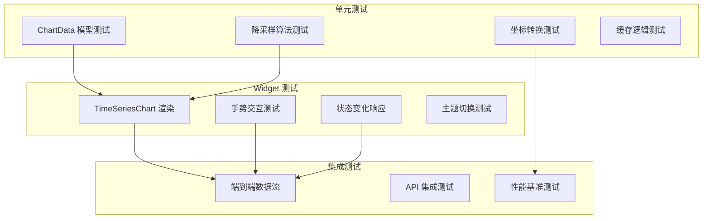

### 10.2 关键测试用例

#### 10.2.1 数据模型测试

```dart
void main() {
  group('ChartData', () {
    test('filtered returns correct subrange', () {
      final data = ChartData(...);
      final filtered = data.filtered(
        DateTime(2024, 1, 1, 6),
        DateTime(2024, 1, 1, 12),
      );
      expect(filtered.timestamps.length, equals(7));
    });

    test('isEmpty returns true for no timestamps', () {
      final data = ChartData(
        experimentId: 'test',
        timestamps: [],
        channelData: {},
        channelMetadata: {},
        statistics: QueryStatistics(...),
      );
      expect(data.isEmpty, isTrue);
    });
  });

  group('LttbDownsampler', () {
    test('preserves first and last points', () {
      final data = List.generate(1000, (i) => 
        TimeSeriesPoint(
          timestamp: DateTime(2024, 1, 1).add(Duration(minutes: i)),
          value: i.toDouble(),
        ),
      );
      final sampled = LttbDownsampler.downsample(data, 100);
      expect(sampled.first, equals(data.first));
      expect(sampled.last, equals(data.last));
    });

    test('returns original when below threshold', () {
      final data = List.generate(50, (i) => 
        TimeSeriesPoint(
          timestamp: DateTime(2024, 1, 1).add(Duration(minutes: i)),
          value: i.toDouble(),
        ),
      );
      final sampled = LttbDownsampler.downsample(data, 100);
      expect(sampled.length, equals(50));
    });
  });
}
```

#### 10.2.2 Widget 测试

```dart
void main() {
  group('TimeSeriesChart', () {
    testWidgets('renders loading state initially', (tester) async {
      await tester.pumpWidget(
        ProviderScope(
          child: MaterialApp(
            home: TimeSeriesChart(experimentId: 'test'),
          ),
        ),
      );

      expect(find.byType(CircularProgressIndicator), findsOneWidget);
    });

    testWidgets('renders empty state when no channels selected', (tester) async {
      // 设置 mock 数据为无通道
      final container = ProviderContainer(
        overrides: [
          visibleChartDataProvider.overrideWithValue(
            const AsyncValue.data(ChartData(...)),
          ),
        ],
      );

      await tester.pumpWidget(
        UncontrolledProviderScope(
          container: container,
          child: const MaterialApp(
            home: TimeSeriesChart(experimentId: 'test'),
          ),
        ),
      );

      expect(find.text('暂无数据'), findsOneWidget);
    });

    testWidgets('responds to tap on legend item', (tester) async {
      // 测试图例点击切换可见性
    });

    testWidgets('mouse hover shows crosshair', (tester) async {
      // 测试悬停十字光标显示
    });
  });
}
```

### 10.3 性能测试

```dart
void main() {
  group('Performance', () {
    testWidgets('renders 10k points within 100ms', (tester) async {
      final stopwatch = Stopwatch()..start();
      
      await tester.pumpWidget(...);
      
      stopwatch.stop();
      expect(stopwatch.elapsedMilliseconds, lessThan(100));
    });

    test('downsample 100k points within 50ms', () {
      final data = List.generate(100000, (i) => 
        TimeSeriesPoint(...),
      );
      
      final stopwatch = Stopwatch()..start();
      LttbDownsampler.downsample(data, 1000);
      stopwatch.stop();
      
      expect(stopwatch.elapsedMilliseconds, lessThan(50));
    });
  });
}
```

---

## 11. 文件结构

```
kayak-frontend/lib/
├── src/
│   ├── features/
│   │   └── analysis/
│   │       ├── analysis_page.dart              # 分析页面入口
│   │       ├── widgets/
│   │       │   ├── analysis_body.dart          # 页面主体布局
│   │       │   ├── control_panel.dart          # 左侧控制面板
│   │       │   ├── chart_area.dart             # 右侧图表区域
│   │       │   ├── chart_toolbar.dart          # 图表工具栏
│   │       │   ├── chart_status_bar.dart       # 状态栏
│   │       │   └── time_series_chart/
│   │       │       ├── time_series_chart.dart          # 主组件
│   │       │       ├── line_chart_renderer.dart        # fl_chart 渲染器
│   │       │       ├── crosshair_overlay.dart          # 十字光标
│   │       │       ├── chart_legend.dart               # 图例组件
│   │       │       ├── chart_gestures.dart             # 手势处理
│   │       │       └── fl_chart_adapter.dart           # fl_chart 适配器
│   │       ├── controllers/
│   │       │   └── analysis_page_controller.dart       # 页面控制器
│   │       ├── providers/
│   │       │   ├── chart_data_provider.dart            # 数据 Provider
│   │       │   ├── chart_query_params_provider.dart    # 查询参数
│   │       │   ├── visible_chart_data_provider.dart    # 可见数据
│   │       │   └── legend_state_provider.dart          # 图例状态
│   │       └── models/
│   │           ├── chart_data.dart             # 图表数据模型
│   │           ├── chart_query_params.dart     # 查询参数模型
│   │           ├── chart_view_config.dart      # 视图配置模型
│   │           ├── analysis_page_state.dart    # 页面状态模型
│   │           └── legend_item.dart            # 图例项模型
│   ├── core/
│   │   ├── theme/
│   │   │   └── channel_color_generator.dart    # 通道颜色生成
│   │   └── utils/
│   │       ├── lttb_downsampler.dart           # 降采样算法
│   │       └── chart_performance_monitor.dart  # 性能监控
│   └── services/
│       └── api/
│           └── data_api_client.dart            # 数据 API 客户端
```

---

## 12. 附录

### 12.1 变更日志

| 版本 | 日期 | 变更内容 | 作者 |
|------|------|---------|------|
| v1.0 | 2026-05-10 | 初始版本 | sw-jerry |

### 12.2 参考文档

- [fl_chart 官方文档](https://github.com/imaNNeo/fl_chart)
- [Flutter Riverpod 文档](https://riverpod.dev/)
- [Material Design 3 规范](https://m3.material.io/)
- [Kayak 架构文档](../../arch.md)

### 12.3 待决策事项

1. **多 Y 轴支持**：当前设计假设所有通道使用同一 Y 轴。若后续需要支持不同单位的通道同屏显示，需增加多 Y 轴设计。
2. **实时数据模式**：当前设计为离线分析模式。若需支持实时数据流，需增加 WebSocket 数据推送和增量渲染机制。
3. **数据导出**：图表数据导出（CSV/PNG）功能待后续版本实现。

---

*本文档由 sw-jerry 编写，作为 R2-S1-002-C 任务的技术设计依据。如有疑问，请联系架构团队。*
