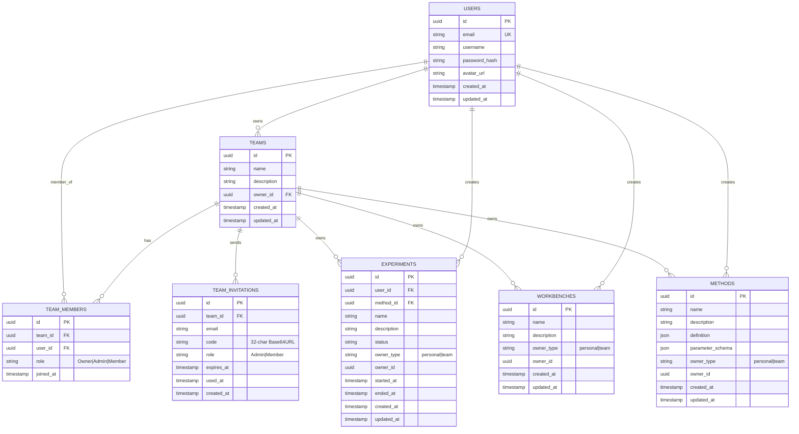
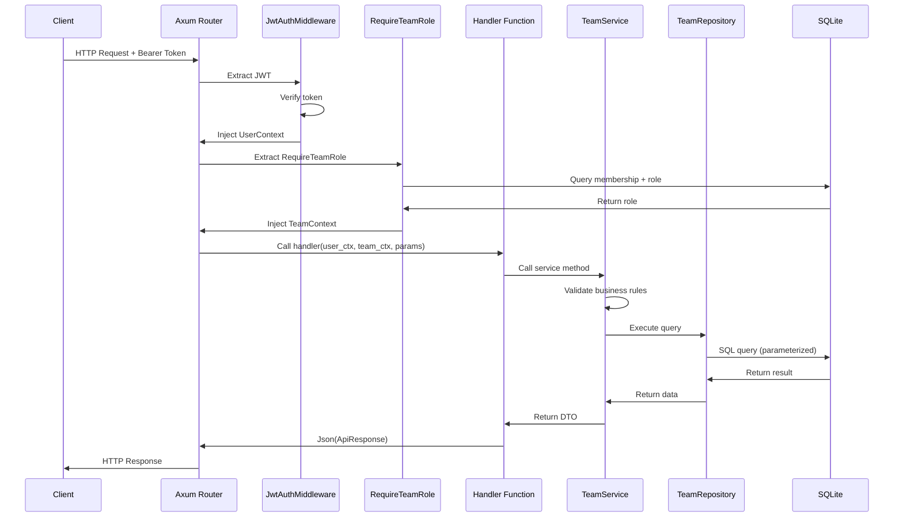
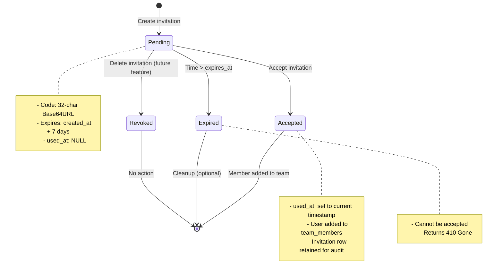

# Detailed Design — Team Management Backend (R2-S2-001-B)

## Design Information
- **Task**: R2-S2-001-B — Team Management Backend Detailed Design
- **Designer**: sw-jerry
- **Date**: 2026-05-11
- **Status**: Draft
- **Dependencies**: R2-S2-001-A (Test Cases)

---

## Table of Contents

1. [Overview](#1-overview)
2. [Database Design](#2-database-design)
3. [Migration Design](#3-migration-design)
4. [API Endpoint Design](#4-api-endpoint-design)
5. [Middleware Design](#5-middleware-design)
6. [Service Layer Design](#6-service-layer-design)
7. [Resource Isolation Design](#7-resource-isolation-design)
8. [Security Considerations](#8-security-considerations)
9. [Appendix](#9-appendix)

---

## 1. Overview

### 1.1 Purpose
This document provides the detailed technical design for the Team Management Backend feature (R2-S2-001). It specifies the database schema, migration strategy, API contracts, middleware behavior, service layer architecture, and security considerations.

### 1.2 Design Principles
- **Interface-Driven Development**: Define `TeamService` trait before implementation
- **Dependency Inversion**: Handlers depend on `TeamService` trait, not concrete implementation
- **Single Responsibility**: Each module has one clear purpose
- **Defense in Depth**: Authorization checks at middleware, service, and repository layers

### 1.3 Scope
- 4 new database tables: `teams`, `team_members`, `team_invitations`, `team_resources` (implicit)
- 10 new API endpoints
- 1 new middleware extractor: `RequireTeamRole`
- 1 new service trait: `TeamService`
- 1 new repository trait: `TeamRepository`
- Modifications to existing APIs for resource isolation

---

## 2. Database Design

### 2.1 Entity Relationship Diagram



### 2.2 Table Specifications

#### 2.2.1 `teams` Table

```sql
CREATE TABLE teams (
    id TEXT PRIMARY KEY NOT NULL,           -- UUID v4
    name TEXT NOT NULL,                      -- Team name (1-255 chars)
    description TEXT,                        -- Optional description
    owner_id TEXT NOT NULL,                  -- FK to users.id
    created_at TEXT NOT NULL,                -- ISO 8601 timestamp
    updated_at TEXT NOT NULL,                -- ISO 8601 timestamp
    FOREIGN KEY (owner_id) REFERENCES users(id) ON DELETE RESTRICT
);
```

**Indexes:**
```sql
CREATE INDEX idx_teams_owner ON teams(owner_id);
CREATE INDEX idx_teams_name ON teams(name);
```

**Constraints:**
- `name`: NOT NULL, length 1-255
- `owner_id`: NOT NULL, references `users(id)`
- Single owner per team (enforced by application logic, not DB constraint)

#### 2.2.2 `team_members` Table

```sql
CREATE TABLE team_members (
    id TEXT PRIMARY KEY NOT NULL,           -- UUID v4
    team_id TEXT NOT NULL,                   -- FK to teams.id
    user_id TEXT NOT NULL,                   -- FK to users.id
    role TEXT NOT NULL CHECK (role IN ('Owner', 'Admin', 'Member')),
    joined_at TEXT NOT NULL,                 -- ISO 8601 timestamp
    FOREIGN KEY (team_id) REFERENCES teams(id) ON DELETE CASCADE,
    FOREIGN KEY (user_id) REFERENCES users(id) ON DELETE CASCADE,
    UNIQUE(team_id, user_id)                 -- Prevent duplicate memberships
);
```

**Indexes:**
```sql
CREATE INDEX idx_team_members_team ON team_members(team_id);
CREATE INDEX idx_team_members_user ON team_members(user_id);
CREATE INDEX idx_team_members_role ON team_members(team_id, role);
```

**Constraints:**
- `role`: CHECK constraint allows only 'Owner', 'Admin', 'Member'
- `UNIQUE(team_id, user_id)`: One membership per user per team
- `ON DELETE CASCADE`: When team is deleted, all memberships are removed

#### 2.2.3 `team_invitations` Table

```sql
CREATE TABLE team_invitations (
    id TEXT PRIMARY KEY NOT NULL,           -- UUID v4
    team_id TEXT NOT NULL,                   -- FK to teams.id
    email TEXT NOT NULL,                     -- Invitee email
    code TEXT NOT NULL UNIQUE,               -- 32-char Base64URL
    role TEXT NOT NULL CHECK (role IN ('Admin', 'Member')),
    expires_at TEXT NOT NULL,                -- ISO 8601 timestamp
    used_at TEXT,                            -- ISO 8601 timestamp (NULL = unused)
    created_at TEXT NOT NULL,                -- ISO 8601 timestamp
    FOREIGN KEY (team_id) REFERENCES teams(id) ON DELETE CASCADE
);
```

**Indexes:**
```sql
CREATE INDEX idx_invitations_code ON team_invitations(code);
CREATE INDEX idx_invitations_team ON team_invitations(team_id);
CREATE INDEX idx_invitations_expires ON team_invitations(expires_at);
CREATE INDEX idx_invitations_used ON team_invitations(used_at) WHERE used_at IS NULL;
```

**Constraints:**
- `code`: UNIQUE, 32-character Base64URL string
- `role`: CHECK constraint allows only 'Admin', 'Member' (Owner cannot be invited)
- `used_at`: NULL means unused; set to timestamp when accepted
- `expires_at`: Must be in the future at creation time

#### 2.2.4 `experiments` Table — Extended

Existing table with two new columns:

```sql
-- Added via migration (see Section 3)
ALTER TABLE experiments ADD COLUMN owner_type TEXT;
ALTER TABLE experiments ADD COLUMN owner_id TEXT;

-- After data migration:
ALTER TABLE experiments ADD CHECK (owner_type IN ('personal', 'team'));
-- NOT NULL constraint added after data backfill
```

**Notes:**
- `owner_type`: 'personal' for user-owned, 'team' for team-owned
- `owner_id`: User ID when `owner_type='personal'`, Team ID when `owner_type='team'`
- Existing rows migrated: `owner_type='personal'`, `owner_id=user_id`
- `user_id` column retained for audit trail (who created the experiment)

### 2.3 Normalization Analysis

| Table | 1NF | 2NF | 3NF | Notes |
|-------|-----|-----|-----|-------|
| `teams` | ✓ | ✓ | ✓ | All attributes depend on `id` only |
| `team_members` | ✓ | ✓ | ✓ | Composite key `(team_id, user_id)`; `role` depends on full key |
| `team_invitations` | ✓ | ✓ | ✓ | `id` is PK; all attributes atomic |
| `experiments` | ✓ | ✓ | ✓ | `owner_type` + `owner_id` correctly model polymorphic ownership |

---

## 3. Migration Design

### 3.1 Migration Files

All migrations use `sqlx migrate add` naming convention.

#### Migration 1: `20260511000001_create_teams_table.sql`

```sql
-- Migration: Create teams table
-- Created: 2026-05-11

PRAGMA foreign_keys = ON;

CREATE TABLE teams (
    id TEXT PRIMARY KEY NOT NULL,
    name TEXT NOT NULL,
    description TEXT,
    owner_id TEXT NOT NULL,
    created_at TEXT NOT NULL,
    updated_at TEXT NOT NULL,
    FOREIGN KEY (owner_id) REFERENCES users(id) ON DELETE RESTRICT
);

CREATE INDEX idx_teams_owner ON teams(owner_id);
CREATE INDEX idx_teams_name ON teams(name);
```

#### Migration 2: `20260511000002_create_team_members_table.sql`

```sql
-- Migration: Create team_members table
-- Created: 2026-05-11

PRAGMA foreign_keys = ON;

CREATE TABLE team_members (
    id TEXT PRIMARY KEY NOT NULL,
    team_id TEXT NOT NULL,
    user_id TEXT NOT NULL,
    role TEXT NOT NULL CHECK (role IN ('Owner', 'Admin', 'Member')),
    joined_at TEXT NOT NULL,
    FOREIGN KEY (team_id) REFERENCES teams(id) ON DELETE CASCADE,
    FOREIGN KEY (user_id) REFERENCES users(id) ON DELETE CASCADE,
    UNIQUE(team_id, user_id)
);

CREATE INDEX idx_team_members_team ON team_members(team_id);
CREATE INDEX idx_team_members_user ON team_members(user_id);
CREATE INDEX idx_team_members_role ON team_members(team_id, role);
```

#### Migration 3: `20260511000003_create_team_invitations_table.sql`

```sql
-- Migration: Create team_invitations table
-- Created: 2026-05-11

PRAGMA foreign_keys = ON;

CREATE TABLE team_invitations (
    id TEXT PRIMARY KEY NOT NULL,
    team_id TEXT NOT NULL,
    email TEXT NOT NULL,
    code TEXT NOT NULL UNIQUE,
    role TEXT NOT NULL CHECK (role IN ('Admin', 'Member')),
    expires_at TEXT NOT NULL,
    used_at TEXT,
    created_at TEXT NOT NULL,
    FOREIGN KEY (team_id) REFERENCES teams(id) ON DELETE CASCADE
);

CREATE INDEX idx_invitations_code ON team_invitations(code);
CREATE INDEX idx_invitations_team ON team_invitations(team_id);
CREATE INDEX idx_invitations_expires ON team_invitations(expires_at);
```

#### Migration 4: `20260511000004_add_experiment_ownership.sql`

```sql
-- Migration: Add owner_type and owner_id to experiments table
-- Strategy: Three-step safe migration
-- Created: 2026-05-11

PRAGMA foreign_keys = ON;

-- Step 1: Add columns allowing NULL (backward compatible)
ALTER TABLE experiments ADD COLUMN owner_type TEXT;
ALTER TABLE experiments ADD COLUMN owner_id TEXT;

-- Step 2: Backfill existing data
-- All existing experiments are personal resources owned by the user who created them
UPDATE experiments
SET owner_type = 'personal',
    owner_id = user_id
WHERE owner_type IS NULL;

-- Step 3: Add constraints after data is valid
-- SQLite doesn't support ALTER TABLE ADD CONSTRAINT, so we recreate the table

-- Create new table with constraints
CREATE TABLE experiments_new (
    id TEXT PRIMARY KEY NOT NULL,
    user_id TEXT NOT NULL,
    method_id TEXT,
    name TEXT NOT NULL,
    description TEXT,
    status TEXT NOT NULL DEFAULT 'IDLE' CHECK (status IN ('IDLE', 'RUNNING', 'PAUSED', 'COMPLETED', 'ABORTED')),
    owner_type TEXT NOT NULL CHECK (owner_type IN ('personal', 'team')),
    owner_id TEXT NOT NULL,
    started_at TEXT,
    ended_at TEXT,
    created_at TEXT NOT NULL,
    updated_at TEXT NOT NULL,
    FOREIGN KEY (user_id) REFERENCES users(id),
    FOREIGN KEY (method_id) REFERENCES methods(id)
);

-- Copy data
INSERT INTO experiments_new
SELECT id, user_id, method_id, name, description, status,
       owner_type, owner_id, started_at, ended_at, created_at, updated_at
FROM experiments;

-- Drop old table and rename
DROP TABLE experiments;
ALTER TABLE experiments_new RENAME TO experiments;

-- Recreate indexes
CREATE INDEX idx_experiments_user_id ON experiments(user_id);
CREATE INDEX idx_experiments_status ON experiments(status);
CREATE INDEX idx_experiments_started_at ON experiments(started_at);
CREATE INDEX idx_experiments_method_id ON experiments(method_id);
CREATE INDEX idx_experiments_owner ON experiments(owner_type, owner_id);
```

### 3.2 Migration Safety Analysis

| Risk | Mitigation |
|------|-----------|
| Data loss during experiments table recreation | Full data copy before DROP; transaction wrap (SQLite single-writer ensures atomicity) |
| Foreign key violations | PRAGMA foreign_keys = ON; backfill uses existing valid user_id |
| Concurrent access during migration | sqlx migrations run sequentially at startup; single instance deployment ensures no concurrent writes |
| Rollback | SQLite backup before migration (application-level); migration is idempotent (CREATE IF NOT EXISTS) |

### 3.3 Application Startup

```rust
// In main.rs — runs automatically on startup
sqlx::migrate!("./migrations")
    .run(&pool)
    .await
    .expect("Failed to run database migrations");
```

---

## 4. API Endpoint Design

### 4.1 API Flow Diagram



### 4.2 Common Response Format

**Success Response (200/201):**
```json
{
  "code": 200,
  "message": "success",
  "data": { ... },
  "timestamp": "2026-05-11T10:30:00Z"
}
```

**Error Response:**
```json
{
  "code": 403,
  "message": "Forbidden: Admin cannot remove Owner",
  "timestamp": "2026-05-11T10:30:00Z"
}
```

**Validation Error (422):**
```json
{
  "code": 422,
  "message": "Validation error",
  "details": [
    {"field": "name", "message": "Name is required"}
  ],
  "timestamp": "2026-05-11T10:30:00Z"
}
```

### 4.3 Endpoint Specifications

#### 4.3.1 POST /api/v1/teams — Create Team

**Description**: Create a new team. Creator automatically becomes Owner.

**Request DTO:**
```rust
#[derive(Debug, Deserialize, Validate)]
pub struct CreateTeamRequest {
    #[validate(length(min = 1, max = 255, message = "Name must be 1-255 characters"))]
    pub name: String,
    pub description: Option<String>,
}
```

**Response DTO (201 Created):**
```rust
#[derive(Debug, Serialize)]
pub struct TeamResponse {
    pub id: Uuid,
    pub name: String,
    pub description: Option<String>,
    pub owner_id: Uuid,
    pub created_at: DateTime<Utc>,
    pub updated_at: DateTime<Utc>,
}
```

**Status Codes:**
| Code | Condition |
|------|-----------|
| 201 | Team created successfully |
| 401 | Unauthorized (no valid JWT) |
| 422 | Validation error (name missing/too long) |
| 409 | Team name already exists for this user |

---

#### 4.3.2 GET /api/v1/teams — List My Teams

**Description**: List all teams where the authenticated user is a member.

**Query Parameters:**
| Param | Type | Required | Description |
|-------|------|----------|-------------|
| page | u32 | No | Page number (default: 1) |
| size | u32 | No | Page size (default: 20, max: 100) |

**Response DTO (200 OK):**
```rust
#[derive(Debug, Serialize)]
pub struct TeamListResponse {
    pub items: Vec<TeamWithRoleResponse>,
    pub total: u64,
    pub page: u32,
    pub size: u32,
}

#[derive(Debug, Serialize)]
pub struct TeamWithRoleResponse {
    pub id: Uuid,
    pub name: String,
    pub description: Option<String>,
    pub owner_id: Uuid,
    pub role: TeamRole,       // User's role in this team
    pub member_count: u32,    // Total members
    pub created_at: DateTime<Utc>,
    pub updated_at: DateTime<Utc>,
}
```

**Status Codes:**
| Code | Condition |
|------|-----------|
| 200 | Success (may be empty array) |
| 401 | Unauthorized |

---

#### 4.3.3 GET /api/v1/teams/:id — Get Team Details

**Description**: Get detailed information about a specific team.

**Path Parameters:**
| Param | Type | Description |
|-------|------|-------------|
| id | Uuid | Team ID |

**Response DTO (200 OK):**
```rust
#[derive(Debug, Serialize)]
pub struct TeamDetailResponse {
    pub id: Uuid,
    pub name: String,
    pub description: Option<String>,
    pub owner_id: Uuid,
    pub role: TeamRole,           // Current user's role
    pub member_count: u32,
    pub created_at: DateTime<Utc>,
    pub updated_at: DateTime<Utc>,
}
```

**Status Codes:**
| Code | Condition |
|------|-----------|
| 200 | Success |
| 401 | Unauthorized |
| 403 | Forbidden (not a team member) |
| 404 | Team not found |

---

#### 4.3.4 PUT /api/v1/teams/:id — Update Team

**Description**: Update team name and/or description. Owner or Admin only.

**Path Parameters:**
| Param | Type | Description |
|-------|------|-------------|
| id | Uuid | Team ID |

**Request DTO:**
```rust
#[derive(Debug, Deserialize, Validate)]
pub struct UpdateTeamRequest {
    #[validate(length(min = 1, max = 255))]
    pub name: Option<String>,
    pub description: Option<String>,
}
```

**Response DTO (200 OK):** `TeamResponse`

**Status Codes:**
| Code | Condition |
|------|-----------|
| 200 | Updated successfully |
| 401 | Unauthorized |
| 403 | Forbidden (Member or non-member) |
| 404 | Team not found |
| 422 | Validation error |

---

#### 4.3.5 DELETE /api/v1/teams/:id — Delete Team

**Description**: Delete a team. Owner only. Returns 409 if team has resources.

**Path Parameters:**
| Param | Type | Description |
|-------|------|-------------|
| id | Uuid | Team ID |

**Response:** 204 No Content (no body)

**Status Codes:**
| Code | Condition |
|------|-----------|
| 204 | Deleted successfully |
| 401 | Unauthorized |
| 403 | Forbidden (Admin/Member/non-member) |
| 404 | Team not found |
| 409 | Conflict — team has resources (experiments, workbenches, methods) |

**Resource Check Query:**
```sql
SELECT EXISTS(
    SELECT 1 FROM experiments WHERE owner_type = 'team' AND owner_id = ?
    UNION ALL
    SELECT 1 FROM workbenches WHERE owner_type = 'team' AND owner_id = ?
    UNION ALL
    SELECT 1 FROM methods WHERE owner_type = 'team' AND owner_id = ?
) AS has_resources;
```

---

#### 4.3.6 GET /api/v1/teams/:id/members — List Members

**Description**: List all members of a team. Any team member can access.

**Path Parameters:**
| Param | Type | Description |
|-------|------|-------------|
| id | Uuid | Team ID |

**Query Parameters:**
| Param | Type | Required | Description |
|-------|------|----------|-------------|
| page | u32 | No | Page number (default: 1) |
| size | u32 | No | Page size (default: 20) |

**Response DTO (200 OK):**
```rust
#[derive(Debug, Serialize)]
pub struct MemberListResponse {
    pub items: Vec<MemberResponse>,
    pub total: u64,
    pub page: u32,
    pub size: u32,
}

#[derive(Debug, Serialize)]
pub struct MemberResponse {
    pub id: Uuid,                  // membership id
    pub user_id: Uuid,
    pub email: String,
    pub username: Option<String>,
    pub role: TeamRole,
    pub joined_at: DateTime<Utc>,
}
```

**Status Codes:**
| Code | Condition |
|------|-----------|
| 200 | Success |
| 401 | Unauthorized |
| 403 | Forbidden (non-member) |
| 404 | Team not found |

---

#### 4.3.7 DELETE /api/v1/teams/:id/members/:user_id — Remove Member

**Description**: Remove a member from the team. Owner/Admin only. Admin cannot remove Owner.

**Path Parameters:**
| Param | Type | Description |
|-------|------|-------------|
| id | Uuid | Team ID |
| user_id | Uuid | User ID to remove |

**Response:** 204 No Content

**Status Codes:**
| Code | Condition |
|------|-----------|
| 204 | Member removed |
| 401 | Unauthorized |
| 403 | Forbidden (insufficient role, or removing owner, or self-removal) |
| 404 | Team not found, or user not a member |

**Business Rules:**
- Owner can remove anyone (including Admin, Member, but not themselves)
- Admin can remove Member only
- Admin cannot remove Owner
- Member cannot remove anyone
- Self-removal must use `POST /teams/:id/leave`

---

#### 4.3.8 POST /api/v1/teams/:id/invitations — Create Invitation

**Description**: Create an invitation to join the team. Owner/Admin only.

**Path Parameters:**
| Param | Type | Description |
|-------|------|-------------|
| id | Uuid | Team ID |

**Request DTO:**
```rust
#[derive(Debug, Deserialize, Validate)]
pub struct CreateInvitationRequest {
    #[validate(email(message = "Invalid email format"))]
    pub email: String,
    #[validate(custom = "validate_invitation_role")]
    pub role: TeamRole,  // Admin or Member only
}

fn validate_invitation_role(role: &TeamRole) -> Result<(), ValidationError> {
    match role {
        TeamRole::Owner => Err(ValidationError::new("Cannot invite as Owner")),
        _ => Ok(()),
    }
}
```

**Response DTO (201 Created):**
```rust
#[derive(Debug, Serialize)]
pub struct InvitationResponse {
    pub id: Uuid,
    pub team_id: Uuid,
    pub email: String,
    pub code: String,              // 32-char Base64URL
    pub role: TeamRole,
    pub expires_at: DateTime<Utc>,
    pub created_at: DateTime<Utc>,
}
```

**Status Codes:**
| Code | Condition |
|------|-----------|
| 201 | Invitation created |
| 401 | Unauthorized |
| 403 | Forbidden (Member or non-member) |
| 404 | Team not found |
| 409 | User is already a team member |
| 422 | Invalid email or role |

---

#### 4.3.9 POST /api/v1/invitations/:code/accept — Accept Invitation

**Description**: Accept an invitation and join the team.

**Path Parameters:**
| Param | Type | Description |
|-------|------|-------------|
| code | String | 32-char invitation code |

**Response DTO (200 OK):**
```rust
#[derive(Debug, Serialize)]
pub struct AcceptInvitationResponse {
    pub team_id: Uuid,
    pub team_name: String,
    pub role: TeamRole,
    pub joined_at: DateTime<Utc>,
}
```

**Status Codes:**
| Code | Condition |
|------|-----------|
| 200 | Successfully joined |
| 401 | Unauthorized |
| 404 | Invitation not found |
| 409 | Invitation already used |
| 410 | Invitation expired |
| 422 | User already a member of this team |

---

#### 4.3.10 POST /api/v1/teams/:id/leave — Leave Team

**Description**: Leave a team. Owner cannot leave.

**Path Parameters:**
| Param | Type | Description |
|-------|------|-------------|
| id | Uuid | Team ID |

**Response:** 204 No Content

**Status Codes:**
| Code | Condition |
|------|-----------|
| 204 | Left team successfully |
| 401 | Unauthorized |
| 403 | Forbidden (not a member, or is Owner) |
| 404 | Team not found |

**Error Message for Owner:**
```json
{
  "code": 403,
  "message": "Forbidden: Owner cannot leave team. Transfer ownership first."
}
```

### 4.4 Endpoint Summary Table

| # | Method | Path | Auth | Min Role | Status Codes |
|---|--------|------|------|----------|-------------|
| 1 | POST | /api/v1/teams | JWT | Any | 201, 401, 422, 409 |
| 2 | GET | /api/v1/teams | JWT | Any | 200, 401 |
| 3 | GET | /api/v1/teams/:id | JWT | Member | 200, 401, 403, 404 |
| 4 | PUT | /api/v1/teams/:id | JWT | Admin | 200, 401, 403, 404, 422 |
| 5 | DELETE | /api/v1/teams/:id | JWT | Owner | 204, 401, 403, 404, 409 |
| 6 | GET | /api/v1/teams/:id/members | JWT | Member | 200, 401, 403, 404 |
| 7 | DELETE | /api/v1/teams/:id/members/:user_id | JWT | Admin | 204, 401, 403, 404 |
| 8 | POST | /api/v1/teams/:id/invitations | JWT | Admin | 201, 401, 403, 404, 409, 422 |
| 9 | POST | /api/v1/invitations/:code/accept | JWT | Any | 200, 401, 404, 409, 410, 422 |
| 10 | POST | /api/v1/teams/:id/leave | JWT | Member* | 204, 401, 403, 404 |

*Owner cannot leave (enforced at service layer)

---

## 5. Middleware Design

### 5.1 RequireTeamRole Extractor

#### 5.1.1 Type Signature

```rust
use axum::async_trait;
use axum::extract::FromRequestParts;
use axum::http::request::Parts;
use std::ops::Deref;
use uuid::Uuid;

use crate::auth::UserContext;
use crate::core::error::AppError;

/// Team membership role
#[derive(Debug, Clone, Copy, PartialEq, Eq, Serialize, Deserialize)]
#[serde(rename_all = "PascalCase")]
pub enum TeamRole {
    Owner,
    Admin,
    Member,
}

impl TeamRole {
    /// Check if this role satisfies the required role
    /// Role hierarchy: Owner > Admin > Member
    pub fn satisfies(&self, required: TeamRole) -> bool {
        match (self, required) {
            (TeamRole::Owner, _) => true,
            (TeamRole::Admin, TeamRole::Admin) => true,
            (TeamRole::Admin, TeamRole::Member) => true,
            (TeamRole::Member, TeamRole::Member) => true,
            _ => false,
        }
    }
}

/// Team context injected by RequireTeamRole
#[derive(Debug, Clone)]
pub struct TeamContext {
    pub team_id: Uuid,
    pub user_id: Uuid,
    pub role: TeamRole,
}

/// RequireTeamRole extractor
/// 
/// Validates that the authenticated user is a member of the specified team
/// and has at least the required role.
/// 
/// # Usage
/// ```rust,ignore
/// async fn handler(
///     RequireTeamRole(team_ctx): RequireTeamRole,
/// ) -> impl IntoResponse {
///     // team_ctx.role is guaranteed to satisfy the required role
/// }
/// ```
pub struct RequireTeamRole {
    pub team_id: Uuid,
    pub role: TeamRole,
    pub team_ctx: TeamContext,
}

#[async_trait]
impl<S> FromRequestParts<S> for RequireTeamRole
where
    S: Send + Sync,
{
    type Rejection = AppError;

    async fn from_request_parts(parts: &mut Parts, _state: &S) -> Result<Self, Self::Rejection> {
        // 1. Extract UserContext from extensions (set by JwtAuthMiddleware)
        let user_ctx = parts
            .extensions
            .get::<UserContext>()
            .cloned()
            .ok_or_else(|| AppError::Unauthorized("Authentication required".to_string()))?;

        // 2. Extract team_id from path parameters
        let team_id = extract_team_id_from_path(parts)?;

        // 3. Query database for membership
        // Note: In actual implementation, this requires access to DbPool
        // which can be obtained via State extractor or passed through extensions
        let team_ctx = query_team_membership(team_id, user_ctx.user_id).await?;

        Ok(RequireTeamRole {
            team_id,
            role: team_ctx.role,
            team_ctx,
        })
    }
}

impl Deref for RequireTeamRole {
    type Target = TeamContext;

    fn deref(&self) -> &Self::Target {
        &self.team_ctx
    }
}
```

#### 5.1.2 Implementation Approach

The `RequireTeamRole` extractor works in two modes:

**Mode A: Generic Extractor (any team member)**
```rust
// Used for endpoints that any member can access
RequireTeamRole(team_ctx): RequireTeamRole  // checks membership only
```

**Mode B: Role-Specific Extractor**
```rust
// Used for endpoints requiring specific roles
RequireTeamRoleAdmin(team_ctx): RequireTeamRoleAdmin  // checks Admin or Owner
RequireTeamRoleOwner(team_ctx): RequireTeamRoleOwner  // checks Owner only
```

Alternative: Use a single extractor with compile-time role parameter:
```rust
pub struct RequireTeamRole<const MIN_ROLE: TeamRole>;
```

However, Rust const generics don't support enum values easily. The recommended approach is:

```rust
/// Typed wrapper for specific role requirements
pub struct RequireTeamAdmin(pub TeamContext);
pub struct RequireTeamOwner(pub TeamContext);

#[async_trait]
impl<S> FromRequestParts<S> for RequireTeamAdmin
where
    S: Send + Sync,
{
    type Rejection = AppError;

    async fn from_request_parts(parts: &mut Parts, state: &S) -> Result<Self, Self::Rejection> {
        let base = RequireTeamRole::from_request_parts(parts, state).await?;
        if !base.role.satisfies(TeamRole::Admin) {
            return Err(AppError::Forbidden("Admin role required".to_string()));
        }
        Ok(RequireTeamAdmin(base.team_ctx))
    }
}
```

#### 5.1.3 Database Query

```rust
async fn query_team_membership(
    team_id: Uuid,
    user_id: Uuid,
    pool: &DbPool,
) -> Result<TeamContext, AppError> {
    let row = sqlx::query(
        r#"
        SELECT role FROM team_members
        WHERE team_id = ? AND user_id = ?
        "#
    )
    .bind(team_id.to_string())
    .bind(user_id.to_string())
    .fetch_optional(pool)
    .await?;

    match row {
        Some(r) => {
            let role_str: String = r.get("role");
            let role = match role_str.as_str() {
                "Owner" => TeamRole::Owner,
                "Admin" => TeamRole::Admin,
                "Member" => TeamRole::Member,
                _ => return Err(AppError::InternalError("Invalid role in database".to_string())),
            };
            Ok(TeamContext { team_id, user_id, role })
        }
        None => Err(AppError::Forbidden("Not a team member".to_string())),
    }
}
```

#### 5.1.4 Error Handling

| Scenario | Error | HTTP Status |
|----------|-------|-------------|
| No JWT token | `AppError::Unauthorized` | 401 |
| Invalid team_id format | `AppError::BadRequest` | 400 |
| Not a team member | `AppError::Forbidden` | 403 |
| Role insufficient | `AppError::Forbidden` | 403 |
| Database error | `AppError::DatabaseError` | 500 |

---

## 6. Service Layer Design

### 6.1 Service Layer Class Diagram

```mermaid
classDiagram
    class TeamService {
        <<trait>>
        +create_team(req, user_id) Result~TeamDto~
        +list_my_teams(user_id, page, size) Result~TeamListResponse~
        +get_team(team_id, user_id) Result~TeamDetailResponse~
        +update_team(team_id, req, user_id) Result~TeamDto~
        +delete_team(team_id, user_id) Result~
        +list_members(team_id, user_id, page, size) Result~MemberListResponse~
        +remove_member(team_id, target_user_id, actor_id) Result~
        +create_invitation(team_id, req, actor_id) Result~InvitationDto~
        +accept_invitation(code, user_id) Result~AcceptInvitationResponse~
        +leave_team(team_id, user_id) Result~
    }

    class TeamServiceImpl {
        -team_repo: Arc~dyn TeamRepository~
        -user_repo: Arc~dyn UserRepository~
        -invitation_repo: Arc~dyn InvitationRepository~
        -resource_repo: Arc~dyn ResourceRepository~
    }

    class TeamRepository {
        <<trait>>
        +create(team) Result~Team~
        +find_by_id(id) Result~Option~Team~~
        +find_by_user_id(user_id) Result~Vec~Team~~
        +update(team) Result~Team~
        +delete(id) Result~u64~
        +exists_by_name_for_user(name, user_id) Result~bool~
    }

    class TeamMemberRepository {
        <<trait>>
        +add_member(team_id, user_id, role) Result~TeamMember~
        +find_by_team_user(team_id, user_id) Result~Option~TeamMember~~
        +find_by_team(team_id, page, size) Result~(Vec~Member~, u64)~
        +find_by_user(user_id) Result~Vec~TeamMember~~
        +remove_member(team_id, user_id) Result~u64~
        +get_role(team_id, user_id) Result~Option~TeamRole~~
        +count_members(team_id) Result~u64~
    }

    class InvitationRepository {
        <<trait>>
        +create(invitation) Result~Invitation~
        +find_by_code(code) Result~Option~Invitation~~
        +find_pending_by_team(team_id) Result~Vec~Invitation~~
        +mark_used(id) Result~
        +delete_by_team(team_id) Result~u64~
    }

    class ResourceRepository {
        <<trait>>
        +has_team_resources(team_id) Result~bool~
    }

    TeamServiceImpl ..|> TeamService
    TeamServiceImpl --> TeamRepository
    TeamServiceImpl --> TeamMemberRepository
    TeamServiceImpl --> InvitationRepository
    TeamServiceImpl --> ResourceRepository
```



### 6.2 TeamService Trait

```rust
use async_trait::async_trait;
use uuid::Uuid;
use chrono::{DateTime, Utc};

use crate::models::dto::team_dto::*;
use crate::core::error::AppError;

/// Team service error type
#[derive(Debug, thiserror::Error)]
pub enum TeamServiceError {
    #[error("Team not found")]
    NotFound,
    #[error("Not a team member")]
    NotMember,
    #[error("Insufficient permissions: {0}")]
    Forbidden(String),
    #[error("Team name already exists")]
    DuplicateName,
    #[error("User is already a member")]
    AlreadyMember,
    #[error("Invitation expired")]
    InvitationExpired,
    #[error("Invitation already used")]
    InvitationUsed,
    #[error("Owner cannot leave team")]
    OwnerCannotLeave,
    #[error("Cannot delete team with existing resources")]
    TeamHasResources,
    #[error("Repository error: {0}")]
    Repository(#[from] AppError),
}

impl From<TeamServiceError> for AppError {
    fn from(err: TeamServiceError) -> Self {
        match err {
            TeamServiceError::NotFound => AppError::NotFound("Team not found".to_string()),
            TeamServiceError::NotMember => AppError::Forbidden("Not a team member".to_string()),
            TeamServiceError::Forbidden(msg) => AppError::Forbidden(msg),
            TeamServiceError::DuplicateName => AppError::Conflict("Team name already exists".to_string()),
            TeamServiceError::AlreadyMember => AppError::Conflict("User is already a member".to_string()),
            TeamServiceError::InvitationExpired => AppError::BadRequest("Invitation has expired".to_string()),
            TeamServiceError::InvitationUsed => AppError::Conflict("Invitation has already been used".to_string()),
            TeamServiceError::OwnerCannotLeave => AppError::Forbidden("Owner cannot leave team. Transfer ownership first.".to_string()),
            TeamServiceError::TeamHasResources => AppError::Conflict("Cannot delete team with existing resources.".to_string()),
            TeamServiceError::Repository(err) => err,
        }
    }
}

#[async_trait]
pub trait TeamService: Send + Sync {
    /// Create a new team. Creator becomes Owner.
    async fn create_team(
        &self,
        req: CreateTeamRequest,
        user_id: Uuid,
    ) -> Result<TeamDto, TeamServiceError>;

    /// List teams where user is a member, with user's role in each.
    async fn list_my_teams(
        &self,
        user_id: Uuid,
        page: u32,
        size: u32,
    ) -> Result<TeamListResponse, TeamServiceError>;

    /// Get team details including user's role.
    async fn get_team(
        &self,
        team_id: Uuid,
        user_id: Uuid,
    ) -> Result<TeamDetailResponse, TeamServiceError>;

    /// Update team name/description. Requires Admin+.
    async fn update_team(
        &self,
        team_id: Uuid,
        req: UpdateTeamRequest,
        user_id: Uuid,
    ) -> Result<TeamDto, TeamServiceError>;

    /// Delete team. Requires Owner. Fails if team has resources.
    async fn delete_team(
        &self,
        team_id: Uuid,
        user_id: Uuid,
    ) -> Result<(), TeamServiceError>;

    /// List team members. Any member can access.
    async fn list_members(
        &self,
        team_id: Uuid,
        user_id: Uuid,
        page: u32,
        size: u32,
    ) -> Result<MemberListResponse, TeamServiceError>;

    /// Remove a member. Owner can remove anyone; Admin can remove Member only.
    async fn remove_member(
        &self,
        team_id: Uuid,
        target_user_id: Uuid,
        actor_id: Uuid,
    ) -> Result<(), TeamServiceError>;

    /// Create an invitation. Requires Admin+.
    async fn create_invitation(
        &self,
        team_id: Uuid,
        req: CreateInvitationRequest,
        actor_id: Uuid,
    ) -> Result<InvitationDto, TeamServiceError>;

    /// Accept an invitation by code.
    async fn accept_invitation(
        &self,
        code: String,
        user_id: Uuid,
    ) -> Result<AcceptInvitationResponse, TeamServiceError>;

    /// Leave a team. Owner cannot leave.
    async fn leave_team(
        &self,
        team_id: Uuid,
        user_id: Uuid,
    ) -> Result<(), TeamServiceError>;
}
```

### 6.3 Key Implementation Details

#### 6.3.1 create_team

```rust
async fn create_team(&self, req: CreateTeamRequest, user_id: Uuid) -> Result<TeamDto, TeamServiceError> {
    // 1. Validate name uniqueness for this user
    let exists = self.team_repo.exists_by_name_for_user(&req.name, user_id).await?;
    if exists {
        return Err(TeamServiceError::DuplicateName);
    }

    // 2. Create team entity
    let team = Team::new(req.name, req.description, user_id);

    // 3. Save team
    let created = self.team_repo.create(&team).await?;

    // 4. Create Owner membership in same transaction
    // Note: With SQLite and sqlx, use a transaction wrapper
    self.member_repo.add_member(created.id, user_id, TeamRole::Owner).await?;

    Ok(created.into())
}
```

#### 6.3.2 delete_team

```rust
async fn delete_team(&self, team_id: Uuid, user_id: Uuid) -> Result<(), TeamServiceError> {
    // 1. Verify actor is Owner
    let role = self.member_repo.get_role(team_id, user_id).await?;
    match role {
        Some(TeamRole::Owner) => {},
        Some(_) => return Err(TeamServiceError::Forbidden("Only Owner can delete team".to_string())),
        None => return Err(TeamServiceError::NotMember),
    }

    // 2. Check for resources
    let has_resources = self.resource_repo.has_team_resources(team_id).await?;
    if has_resources {
        return Err(TeamServiceError::TeamHasResources);
    }

    // 3. Delete team (cascades to members and invitations via FK)
    self.team_repo.delete(team_id).await?;

    Ok(())
}
```

#### 6.3.3 remove_member (Authorization Logic)

```rust
async fn remove_member(
    &self,
    team_id: Uuid,
    target_user_id: Uuid,
    actor_id: Uuid,
) -> Result<(), TeamServiceError> {
    // Cannot remove self via this endpoint
    if target_user_id == actor_id {
        return Err(TeamServiceError::Forbidden(
            "Use POST /teams/:id/leave to leave team".to_string()
        ));
    }

    // Get actor's role
    let actor_role = self.member_repo.get_role(team_id, actor_id).await?
        .ok_or(TeamServiceError::NotMember)?;

    // Get target's role
    let target_role = self.member_repo.get_role(team_id, target_user_id).await?
        .ok_or(TeamServiceError::NotFound)?;

    // Authorization matrix
    let can_remove = match (actor_role, target_role) {
        (TeamRole::Owner, _) => true,                    // Owner can remove anyone
        (TeamRole::Admin, TeamRole::Member) => true,     // Admin can remove Member
        (TeamRole::Admin, TeamRole::Admin) => false,     // Admin cannot remove Admin
        (TeamRole::Admin, TeamRole::Owner) => false,     // Admin cannot remove Owner
        (TeamRole::Member, _) => false,                  // Member cannot remove anyone
    };

    if !can_remove {
        return Err(TeamServiceError::Forbidden(
            "Insufficient permissions to remove this member".to_string()
        ));
    }

    self.member_repo.remove_member(team_id, target_user_id).await?;
    Ok(())
}
```

#### 6.3.4 create_invitation (Code Generation)

```rust
use base64::{engine::general_purpose::URL_SAFE_NO_PAD, Engine};
use rand::RngCore;

fn generate_invitation_code() -> String {
    let mut bytes = [0u8; 24]; // 24 bytes → 32 Base64URL chars
    rand::thread_rng().fill_bytes(&mut bytes);
    URL_SAFE_NO_PAD.encode(&bytes)
}

async fn create_invitation(
    &self,
    team_id: Uuid,
    req: CreateInvitationRequest,
    actor_id: Uuid,
) -> Result<InvitationDto, TeamServiceError> {
    // 1. Verify actor is Admin+
    let role = self.member_repo.get_role(team_id, actor_id).await?;
    match role {
        Some(r) if r.satisfies(TeamRole::Admin) => {},
        Some(_) => return Err(TeamServiceError::Forbidden("Admin role required".to_string())),
        None => return Err(TeamServiceError::NotMember),
    }

    // 2. Check if email is already a member
    // (Query users by email, then check membership)
    let user = self.user_repo.find_by_email(&req.email).await?;
    if let Some(u) = user {
        let is_member = self.member_repo.find_by_team_user(team_id, u.id).await?.is_some();
        if is_member {
            return Err(TeamServiceError::AlreadyMember);
        }
    }

    // 3. Generate code
    let code = generate_invitation_code();

    // 4. Create invitation (expires in 7 days)
    let invitation = Invitation::new(
        team_id,
        req.email,
        code,
        req.role,
        Utc::now() + chrono::Duration::days(7),
    );

    let created = self.invitation_repo.create(&invitation).await?;
    Ok(created.into())
}
```

#### 6.3.5 accept_invitation

```rust
async fn accept_invitation(
    &self,
    code: String,
    user_id: Uuid,
) -> Result<AcceptInvitationResponse, TeamServiceError> {
    // 1. Find invitation
    let invitation = self.invitation_repo.find_by_code(&code).await?
        .ok_or(TeamServiceError::NotFound)?;

    // 2. Check if already used
    if invitation.used_at.is_some() {
        return Err(TeamServiceError::InvitationUsed);
    }

    // 3. Check expiration
    if Utc::now() > invitation.expires_at {
        return Err(TeamServiceError::InvitationExpired);
    }

    // 4. Check if user is already a member
    let existing = self.member_repo.find_by_team_user(invitation.team_id, user_id).await?;
    if existing.is_some() {
        return Err(TeamServiceError::AlreadyMember);
    }

    // 5. Add member (idempotent within transaction)
    self.member_repo.add_member(invitation.team_id, user_id, invitation.role).await?;

    // 6. Mark invitation as used
    self.invitation_repo.mark_used(invitation.id).await?;

    // 7. Get team name for response
    let team = self.team_repo.find_by_id(invitation.team_id).await?
        .ok_or(TeamServiceError::NotFound)?;

    Ok(AcceptInvitationResponse {
        team_id: invitation.team_id,
        team_name: team.name,
        role: invitation.role,
        joined_at: Utc::now(),
    })
}
```

---

## 7. Resource Isolation Design

### 7.1 Overview

Existing resource APIs (workbenches, methods, experiments) are extended with:
- `scope` query parameter: `personal` | `team` | `all` (default)
- `team_id` query parameter: filter to specific team

### 7.2 Scope Parameter Handling

```rust
#[derive(Debug, Deserialize, Default)]
pub enum ResourceScope {
    #[default]
    #[serde(rename = "all")]
    All,
    #[serde(rename = "personal")]
    Personal,
    #[serde(rename = "team")]
    Team,
}

#[derive(Debug, Deserialize)]
pub struct ListExperimentsQuery {
    pub scope: Option<ResourceScope>,
    pub team_id: Option<Uuid>,
    pub status: Option<ExperimentStatus>,
    pub page: Option<u32>,
    pub size: Option<u32>,
}
```

### 7.3 SQL Query Modifications

#### 7.3.1 experiments.find_by_user_id → find_by_scope

```rust
async fn find_by_scope(
    &self,
    user_id: Uuid,
    scope: ResourceScope,
    team_id: Option<Uuid>,
) -> Result<Vec<Experiment>, ExperimentRepositoryError> {
    let user_id_str = user_id.to_string();

    let rows = match scope {
        ResourceScope::Personal => {
            // Personal resources: owner_type='personal' AND owner_id=user_id
            sqlx::query_as(
                r#"
                SELECT id, user_id, method_id, name, description, status,
                       started_at, ended_at, created_at, updated_at
                FROM experiments
                WHERE owner_type = 'personal' AND owner_id = ?
                ORDER BY created_at DESC
                "#
            )
            .bind(&user_id_str)
            .fetch_all(&self.pool)
            .await?
        }
        ResourceScope::Team => {
            // Team resources: owner_type='team' AND owner_id IN (user's teams)
            sqlx::query_as(
                r#"
                SELECT e.id, e.user_id, e.method_id, e.name, e.description, e.status,
                       e.started_at, e.ended_at, e.created_at, e.updated_at
                FROM experiments e
                WHERE e.owner_type = 'team'
                  AND e.owner_id IN (
                      SELECT team_id FROM team_members WHERE user_id = ?
                  )
                ORDER BY e.created_at DESC
                "#
            )
            .bind(&user_id_str)
            .fetch_all(&self.pool)
            .await?
        }
        ResourceScope::All => {
            // All resources: personal + team
            sqlx::query_as(
                r#"
                SELECT e.id, e.user_id, e.method_id, e.name, e.description, e.status,
                       e.started_at, e.ended_at, e.created_at, e.updated_at
                FROM experiments e
                WHERE (e.owner_type = 'personal' AND e.owner_id = ?)
                   OR (e.owner_type = 'team'
                       AND e.owner_id IN (
                           SELECT team_id FROM team_members WHERE user_id = ?
                       ))
                ORDER BY e.created_at DESC
                "#
            )
            .bind(&user_id_str)
            .bind(&user_id_str)
            .fetch_all(&self.pool)
            .await?
        }
    };

    Ok(rows.into_iter().map(|r| r.to_experiment()).collect())
}
```

#### 7.3.2 With team_id Filter

```rust
// When team_id is specified, it overrides scope behavior
if let Some(tid) = team_id {
    // Verify user is a member of this team
    let is_member = sqlx::query_scalar(
        "SELECT EXISTS(SELECT 1 FROM team_members WHERE team_id = ? AND user_id = ?)"
    )
    .bind(tid.to_string())
    .bind(user_id.to_string())
    .fetch_one(&self.pool)
    .await?;

    if !is_member {
        return Ok(vec![]); // Or return Forbidden at service layer
    }

    // Filter by specific team
    sqlx::query_as(
        "SELECT ... FROM experiments WHERE owner_type = 'team' AND owner_id = ? ORDER BY created_at DESC"
    )
    .bind(tid.to_string())
    .fetch_all(&self.pool)
    .await?
}
```

### 7.4 Resource Access Control (GET /api/v1/experiments/:id)

```rust
async fn get_experiment(&self, id: Uuid, user_id: Uuid) -> Result<ExperimentDto, ExperimentServiceError> {
    let experiment = self.repo.find_by_id(id).await?
        .ok_or(ExperimentServiceError::NotFound)?;

    // Check access based on ownership
    let has_access = match experiment.owner_type {
        OwnerType::Personal => experiment.owner_id == user_id,
        OwnerType::Team => {
            // Check if user is member of the owning team
            self.team_member_repo
                .find_by_team_user(experiment.owner_id, user_id)
                .await?
                .is_some()
        }
    };

    if !has_access {
        return Err(ExperimentServiceError::Forbidden);
    }

    Ok(experiment.into())
}
```

### 7.5 Affected Endpoints

| Endpoint | Changes |
|----------|---------|
| GET /api/v1/experiments | Add `scope`, `team_id` query params |
| GET /api/v1/experiments/:id | Check team membership for team-owned resources |
| GET /api/v1/workbenches | Add `scope`, `team_id` query params |
| GET /api/v1/workbenches/:id | Check team membership |
| GET /api/v1/methods | Add `scope`, `team_id` query params |
| GET /api/v1/methods/:id | Check team membership |

---

## 8. Security Considerations

### 8.1 SQL Injection Prevention

**Approach**: All queries use parameterized statements via sqlx.

```rust
// SAFE — parameterized query
sqlx::query("SELECT * FROM teams WHERE id = ?")
    .bind(team_id.to_string())  // String binding prevents injection
    .fetch_one(&pool)
    .await?;

// NEVER do this:
// let query = format!("SELECT * FROM teams WHERE name = '{}'", name);
```

**Validation**: Team name length is constrained (1-255 chars). No special character filtering needed since parameterized queries handle all input safely.

### 8.2 Authorization Checks

**Defense in Depth**:

| Layer | Check |
|-------|-------|
| Middleware | `RequireTeamRole` validates membership and minimum role |
| Service | Business rule validation (e.g., Admin cannot remove Owner) |
| Repository | Foreign key constraints ensure data integrity |

**Critical Authorization Matrix:**

| Operation | Owner | Admin | Member | Non-Member |
|-----------|-------|-------|--------|------------|
| View team | ✓ | ✓ | ✓ | ✗ (403) |
| Update team | ✓ | ✓ | ✗ | ✗ |
| Delete team | ✓ | ✗ | ✗ | ✗ |
| List members | ✓ | ✓ | ✓ | ✗ |
| Remove Member | ✓ | ✓ (Member only) | ✗ | ✗ |
| Remove Admin | ✓ | ✗ | ✗ | ✗ |
| Remove Owner | ✗ | ✗ | ✗ | ✗ |
| Create invitation | ✓ | ✓ | ✗ | ✗ |
| Leave team | ✗ | ✓ | ✓ | ✗ |

### 8.3 Timing Attack Prevention

**Invitation Code Lookup**:

Problem: Sequential lookup (check existence → check used → check expired) can leak information via timing.

Solution: Use constant-time single-query validation:

```rust
// Single query returns all needed information
let invitation = sqlx::query(
    "SELECT id, team_id, email, role, expires_at, used_at
     FROM team_invitations
     WHERE code = ?"
)
.bind(&code)
.fetch_optional(&pool)
.await?;

// Validation happens in-memory after fetch
match invitation {
    Some(inv) => {
        if inv.used_at.is_some() {
            return Err(AppError::Conflict("Invitation used".to_string()));
        }
        if Utc::now() > inv.expires_at {
            return Err(AppError::BadRequest("Invitation expired".to_string()));
        }
        // ... proceed
    }
    None => return Err(AppError::NotFound("Invalid invitation code".to_string())),
}
```

**Code Generation**:
- Use cryptographically secure RNG (`rand::thread_rng()` with `RngCore::fill_bytes`)
- 24 random bytes → 32 Base64URL characters
- Collision probability: ~2^-192 (negligible)

### 8.4 Invitation Security

| Threat | Mitigation |
|--------|-----------|
| Brute force code guessing | 32-char random string (192 bits entropy); rate limiting by IP |
| Code enumeration | Return same error for invalid/expired/used: "Invalid or expired invitation" |
| Replay attack | `used_at` timestamp ensures single-use |
| Email mismatch | Test case TC-INVITE-008 allows any authenticated user to accept; this is a product decision documented in test cases |
| Invitation interception | HTTPS only; codes expire in 7 days |

### 8.5 Data Exposure Prevention

- **404 vs 403**: For security by obscurity, non-members get `403 Forbidden` for team endpoints (consistent with test cases TC-TEAM-011, TC-MEMBER-004)
- **Team list**: Users only see teams they are members of
- **Resource isolation**: Team resources invisible to non-members (TC-ISOLATE-005)

---

## 9. Appendix

### 9.1 Team Invitation State Machine



### 9.2 New File Structure

```
kayak-backend/src/
├── api/
│   ├── routes.rs                    # Add team_routes()
│   └── handlers/
│       └── team.rs                  # Team handlers (10 endpoints)
├── auth/
│   └── middleware/
│       └── require_team_role.rs     # RequireTeamRole extractor
├── services/
│   └── team/
│       ├── mod.rs                   # TeamService trait
│       ├── team_service.rs          # TeamServiceImpl
│       └── error.rs                 # TeamServiceError
├── models/
│   ├── entities/
│   │   ├── team.rs                  # Team, TeamMember, Invitation entities
│   │   └── mod.rs                   # Export new entities
│   └── dto/
│       └── team_dto.rs              # Request/response DTOs
└── db/
    └── repository/
        ├── team_repo.rs             # TeamRepository trait + Sqlx impl
        ├── team_member_repo.rs      # TeamMemberRepository
        └── invitation_repo.rs       # InvitationRepository
```

### 9.3 DTO Definitions

```rust
// kayak-backend/src/models/dto/team_dto.rs

use chrono::{DateTime, Utc};
use serde::{Deserialize, Serialize};
use uuid::Uuid;
use validator::Validate;

use crate::auth::middleware::require_team_role::TeamRole;

// Request DTOs

#[derive(Debug, Deserialize, Validate)]
pub struct CreateTeamRequest {
    #[validate(length(min = 1, max = 255))]
    pub name: String,
    pub description: Option<String>,
}

#[derive(Debug, Deserialize, Validate)]
pub struct UpdateTeamRequest {
    #[validate(length(min = 1, max = 255))]
    pub name: Option<String>,
    pub description: Option<String>,
}

#[derive(Debug, Deserialize, Validate)]
pub struct CreateInvitationRequest {
    #[validate(email)]
    pub email: String,
    pub role: TeamRole,
}

// Response DTOs

#[derive(Debug, Serialize)]
pub struct TeamDto {
    pub id: Uuid,
    pub name: String,
    pub description: Option<String>,
    pub owner_id: Uuid,
    pub created_at: DateTime<Utc>,
    pub updated_at: DateTime<Utc>,
}

#[derive(Debug, Serialize)]
pub struct TeamWithRoleDto {
    pub id: Uuid,
    pub name: String,
    pub description: Option<String>,
    pub owner_id: Uuid,
    pub role: TeamRole,
    pub member_count: u64,
    pub created_at: DateTime<Utc>,
    pub updated_at: DateTime<Utc>,
}

#[derive(Debug, Serialize)]
pub struct TeamListResponse {
    pub items: Vec<TeamWithRoleDto>,
    pub total: u64,
    pub page: u32,
    pub size: u32,
}

#[derive(Debug, Serialize)]
pub struct TeamDetailResponse {
    pub id: Uuid,
    pub name: String,
    pub description: Option<String>,
    pub owner_id: Uuid,
    pub role: TeamRole,
    pub member_count: u64,
    pub created_at: DateTime<Utc>,
    pub updated_at: DateTime<Utc>,
}

#[derive(Debug, Serialize)]
pub struct MemberDto {
    pub id: Uuid,
    pub user_id: Uuid,
    pub email: String,
    pub username: Option<String>,
    pub role: TeamRole,
    pub joined_at: DateTime<Utc>,
}

#[derive(Debug, Serialize)]
pub struct MemberListResponse {
    pub items: Vec<MemberDto>,
    pub total: u64,
    pub page: u32,
    pub size: u32,
}

#[derive(Debug, Serialize)]
pub struct InvitationDto {
    pub id: Uuid,
    pub team_id: Uuid,
    pub email: String,
    pub code: String,
    pub role: TeamRole,
    pub expires_at: DateTime<Utc>,
    pub created_at: DateTime<Utc>,
}

#[derive(Debug, Serialize)]
pub struct AcceptInvitationResponse {
    pub team_id: Uuid,
    pub team_name: String,
    pub role: TeamRole,
    pub joined_at: DateTime<Utc>,
}
```

### 9.4 Entity Definitions

```rust
// kayak-backend/src/models/entities/team.rs

use chrono::{DateTime, Utc};
use serde::{Deserialize, Serialize};
use uuid::Uuid;

#[derive(Debug, Clone, Serialize, Deserialize)]
pub struct Team {
    pub id: Uuid,
    pub name: String,
    pub description: Option<String>,
    pub owner_id: Uuid,
    pub created_at: DateTime<Utc>,
    pub updated_at: DateTime<Utc>,
}

impl Team {
    pub fn new(name: String, description: Option<String>, owner_id: Uuid) -> Self {
        let now = Utc::now();
        Self {
            id: Uuid::new_v4(),
            name,
            description,
            owner_id,
            created_at: now,
            updated_at: now,
        }
    }
}

#[derive(Debug, Clone, Serialize, Deserialize)]
pub struct TeamMember {
    pub id: Uuid,
    pub team_id: Uuid,
    pub user_id: Uuid,
    pub role: TeamRole,
    pub joined_at: DateTime<Utc>,
}

#[derive(Debug, Clone, Serialize, Deserialize)]
pub struct Invitation {
    pub id: Uuid,
    pub team_id: Uuid,
    pub email: String,
    pub code: String,
    pub role: TeamRole,
    pub expires_at: DateTime<Utc>,
    pub used_at: Option<DateTime<Utc>>,
    pub created_at: DateTime<Utc>,
}

impl Invitation {
    pub fn new(
        team_id: Uuid,
        email: String,
        code: String,
        role: TeamRole,
        expires_at: DateTime<Utc>,
    ) -> Self {
        Self {
            id: Uuid::new_v4(),
            team_id,
            email,
            code,
            role,
            expires_at,
            used_at: None,
            created_at: Utc::now(),
        }
    }
}
```

### 9.5 Route Registration

```rust
// Add to kayak-backend/src/api/routes.rs

fn team_routes(team_service: Arc<dyn TeamService>) -> Router<()> {
    Router::new().nest(
        "/api/v1",
        Router::new()
            // Team CRUD
            .route("/teams", post(team::create_team))
            .route("/teams", get(team::list_teams))
            .route("/teams/{id}", get(team::get_team))
            .route("/teams/{id}", put(team::update_team))
            .route("/teams/{id}", delete(team::delete_team))
            // Members
            .route("/teams/{id}/members", get(team::list_members))
            .route("/teams/{id}/members/{user_id}", delete(team::remove_member))
            // Invitations
            .route("/teams/{id}/invitations", post(team::create_invitation))
            // Leave
            .route("/teams/{id}/leave", post(team::leave_team))
            .with_state(team_service),
    )
}

// Add invitation accept route (separate path pattern)
fn invitation_routes(team_service: Arc<dyn TeamService>) -> Router<()> {
    Router::new().route(
        "/api/v1/invitations/{code}/accept",
        post(team::accept_invitation),
    ).with_state(team_service)
}
```

### 9.6 Verification Checklist

| Requirement | Section | Verified |
|------------|---------|----------|
| teams table | 2.2.1 | ✓ |
| team_members table | 2.2.2 | ✓ |
| team_invitations table | 2.2.3 | ✓ |
| experiments.owner_type + owner_id | 2.2.4, 3.2.4 | ✓ |
| POST /api/v1/teams | 4.3.1 | ✓ |
| GET /api/v1/teams | 4.3.2 | ✓ |
| GET /api/v1/teams/:id | 4.3.3 | ✓ |
| PUT /api/v1/teams/:id | 4.3.4 | ✓ |
| DELETE /api/v1/teams/:id | 4.3.5 | ✓ |
| GET /api/v1/teams/:id/members | 4.3.6 | ✓ |
| DELETE /api/v1/teams/:id/members/:user_id | 4.3.7 | ✓ |
| POST /api/v1/teams/:id/invitations | 4.3.8 | ✓ |
| POST /api/v1/invitations/:code/accept | 4.3.9 | ✓ |
| POST /api/v1/teams/:id/leave | 4.3.10 | ✓ |
| RequireTeamRole middleware | 5.1 | ✓ |
| Role hierarchy Owner > Admin > Member | 5.1.2, 6.3.3 | ✓ |
| Owner cannot leave | 4.3.10, 6.2 | ✓ |
| Owner delete 409 if non-empty | 4.3.5, 6.3.2 | ✓ |
| Admin cannot remove Owner | 4.3.7, 6.3.3 | ✓ |
| Member can only view | 4.4 | ✓ |
| Invitation code 32-char Base64URL | 4.3.8, 6.3.4 | ✓ |
| 7-day expiry | 6.3.4 | ✓ |
| Single-use invitation | 6.3.5 | ✓ |
| scope query param | 7.2, 7.3 | ✓ |
| team_id query param | 7.3.2 | ✓ |
| SQL injection prevention | 8.1 | ✓ |
| Timing attack prevention | 8.3 | ✓ |
| Database ERD diagram | 2.1 | ✓ |
| Service class diagram | 6.1 | ✓ |
| API flow diagram | 4.1 | ✓ |
| Invitation state machine | 9.1 | ✓ |

---

*Document Version: 1.0*
*Created by: sw-jerry*
*Review Status: Ready for Implementation*
