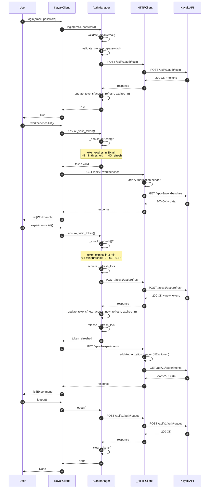
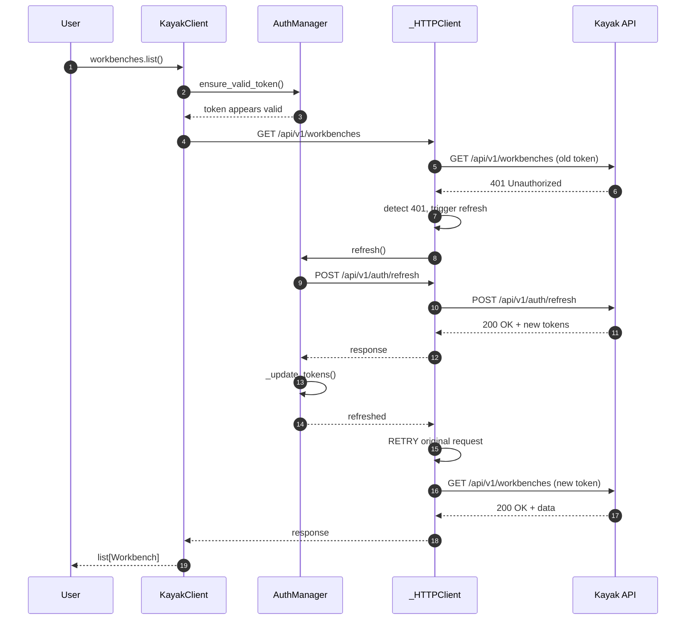
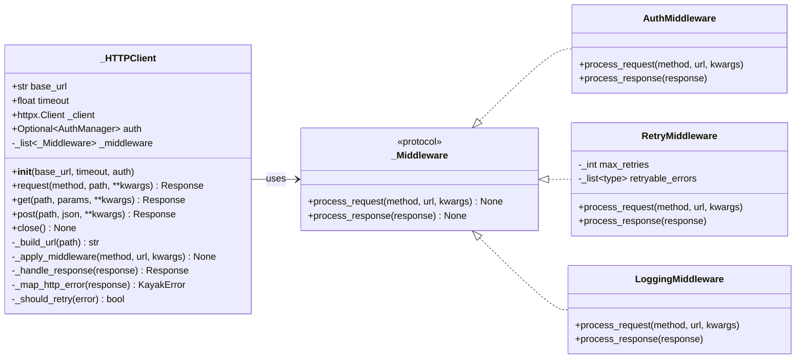
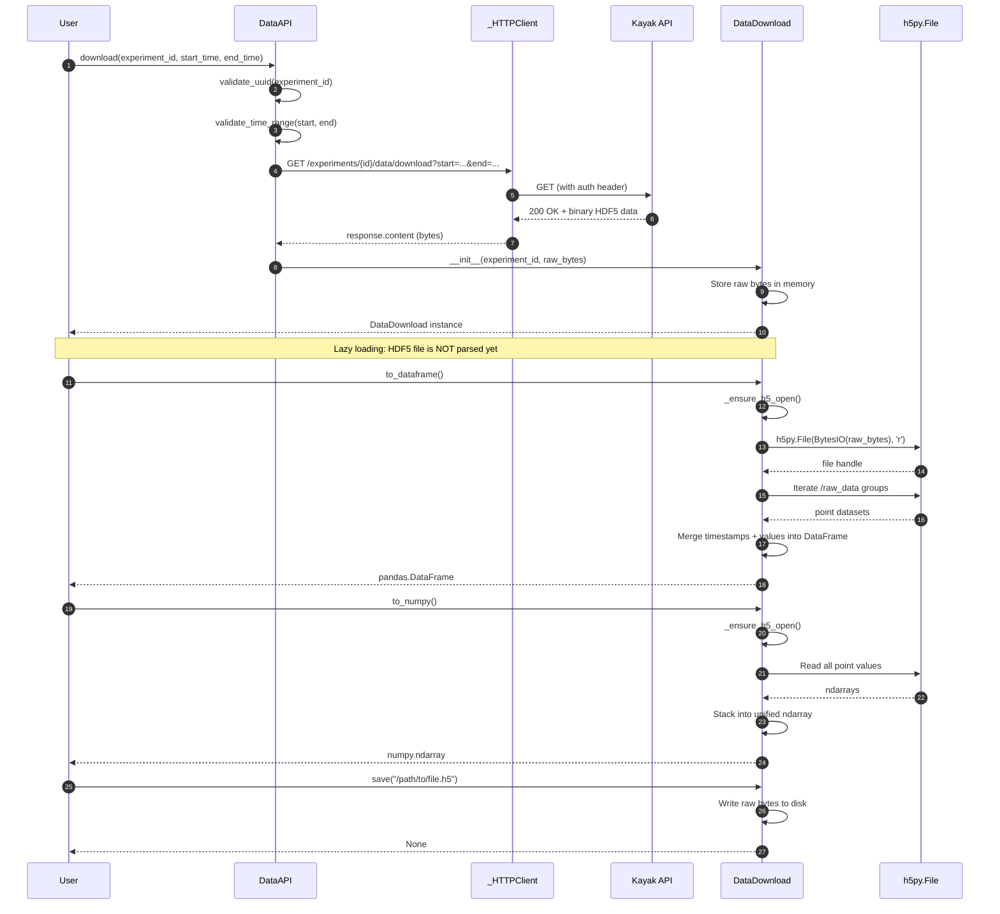
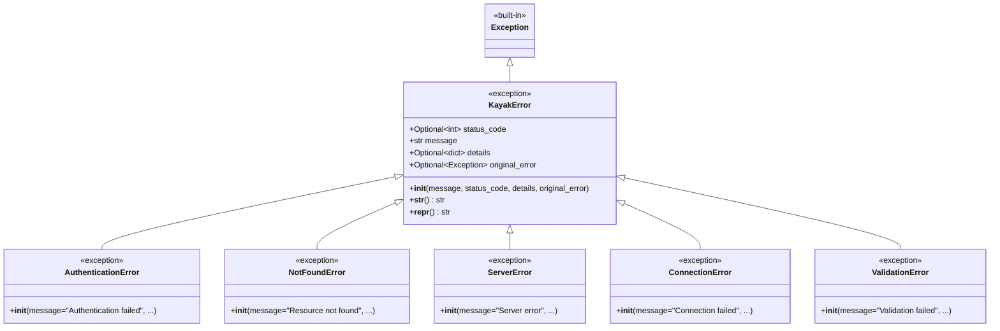
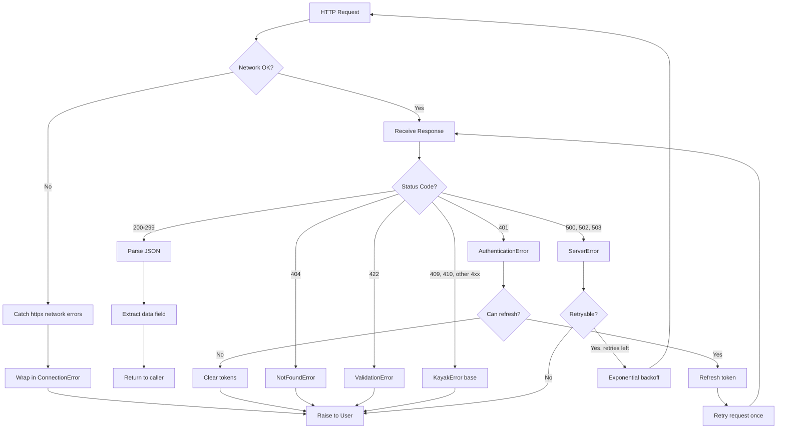
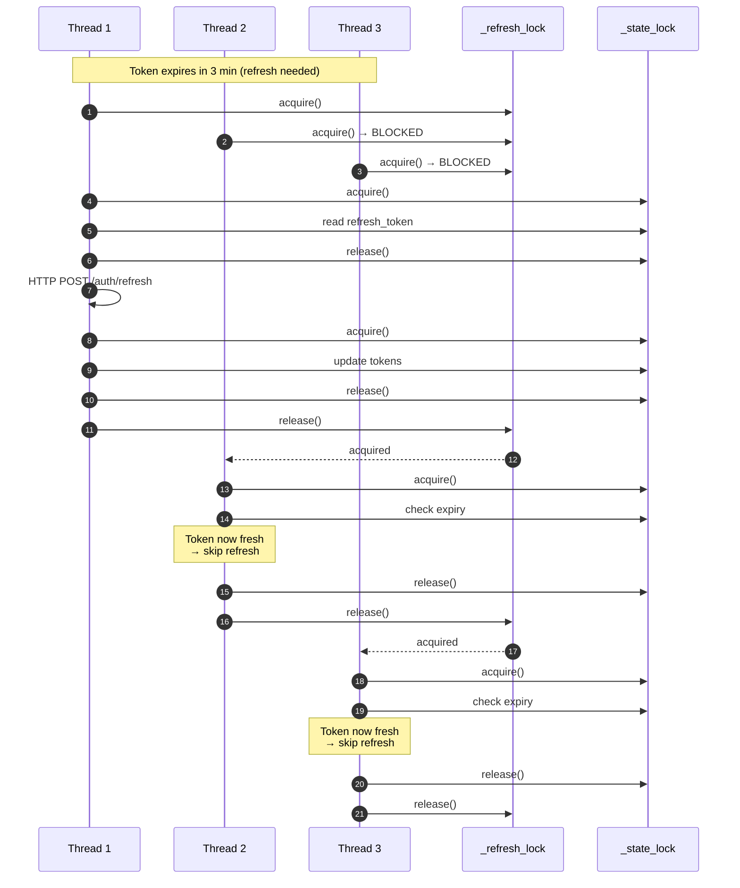

# Detailed Design — Python SDK (R2-S2-003-B)

## Design Information
- **Task**: R2-S2-003-B — Python SDK Detailed Design
- **Designer**: sw-jerry (Software Architect)
- **Date**: 2026-05-11
- **Status**: Draft
- **Target**: `kayak-python-client/` — Python SDK for Kayak REST API
- **Based On**: Test Cases R2-S2-003-A (56 test cases by sw-mike)

---

## Table of Contents

1. [Overview](#1-overview)
2. [Technology Stack Decision](#2-technology-stack-decision)
3. [Package Structure](#3-package-structure)
4. [Class Architecture](#4-class-architecture)
5. [Authentication Flow](#5-authentication-flow)
6. [HTTP Client Design](#6-http-client-design)
7. [Resource API Design](#7-resource-api-design)
8. [Data Download & Conversion Design](#8-data-download--conversion-design)
9. [Error Handling Strategy](#9-error-handling-strategy)
10. [Type Safety & Pydantic Models](#10-type-safety--pydantic-models)
11. [Thread Safety Design](#11-thread-safety-design)
12. [Session Persistence](#12-session-persistence)
13. [Feature Coverage Verification](#13-feature-coverage-verification)

---

## 1. Overview

### 1.1 Purpose
This document provides the detailed architecture and design specifications for the Kayak Python SDK (`kayak-python-client`). The SDK provides a type-safe, thread-safe Python interface to the Kayak REST API for authentication, resource management, scientific data download, and HDF5 data conversion.

### 1.2 Design Goals
1. **Type Safety**: Full type annotations with Pydantic models for all API responses
2. **Thread Safety**: Safe concurrent usage across multiple threads
3. **Automatic Token Management**: Transparent token refresh 5 minutes before expiry
4. **Memory Efficiency**: Lazy data loading for large HDF5 datasets
5. **Developer Experience**: Context manager support, clear error messages, intuitive API
6. **Testability**: Designed for easy mocking with `pytest-httpx`

### 1.3 API Target
The SDK communicates with the Kayak backend via RESTful API on port 8080 (single-port deployment):
- Base URL: `http://localhost:8080` (configurable)
- API Prefix: `/api/v1/`
- Response Format: `{ "code": 200, "message": "...", "data": {...} }`

---

## 2. Technology Stack Decision

### 2.1 HTTP Client: `httpx` (Selected)

**Decision**: Use `httpx` as the underlying HTTP client.

**Rationale**:

| Criterion | `httpx` | `requests` |
|-----------|---------|------------|
| **Test mocking** | Native `pytest-httpx` support (test cases require this) | Requires `responses` library |
| **Sync API** | ✅ `httpx.Client()` | ✅ `requests.Session()` |
| **Async API** | ✅ `httpx.AsyncClient()` | ❌ Requires `aiohttp` |
| **HTTP/2** | ✅ Built-in | ❌ Requires extra packages |
| **Type hints** | ✅ First-class | Partial (via stubs) |
| **Timeout handling** | Granular (connect/read/pool) | Limited |
| **Streaming** | ✅ Native | ✅ Native |

**Key Reason**: Test cases (TC-SDK-001 through TC-SDK-056) explicitly specify `pytest-httpx` as the mock dependency. `httpx` provides a unified sync/async API, making the SDK future-proof if async support is added later.

**Trade-off**: `httpx` is a newer library with a smaller ecosystem than `requests`, but it is production-ready (v0.27+) and actively maintained.

### 2.2 Core Dependencies

| Package | Version | Purpose |
|---------|---------|---------|
| `httpx` | `>=0.27,<1.0` | HTTP client |
| `pydantic` | `>=2.0,<3.0` | Data validation and serialization |
| `h5py` | `>=3.10,<4.0` | HDF5 file reading |
| `typing-extensions` | `>=4.0` | Backport type hints for Python <3.11 |

### 2.3 Optional Dependencies

| Extra | Packages | Purpose |
|-------|----------|---------|
| `pandas` | `pandas>=2.0` | `DataDownload.to_dataframe()` |
| `numpy` | `numpy>=1.24` | `DataDownload.to_numpy()` |
| `dev` | `pytest`, `pytest-httpx`, `freezegun`, `mypy`, `ruff` | Development and testing |

### 2.4 Python Version Support
- **Minimum**: Python 3.9 (type hint syntax, `typing.Annotated`)
- **Recommended**: Python 3.11+ (better `typing` support, performance)

---

## 3. Package Structure

```
kayak-python-client/
├── kayak/
│   ├── __init__.py           # Public API exports
│   ├── client.py             # KayakClient (main entry point)
│   ├── auth.py               # AuthManager (token management)
│   ├── exceptions.py         # Exception hierarchy
│   ├── models.py             # Pydantic models for API responses
│   ├── protocols.py          # Protocol classes (interfaces)
│   ├── http_client.py        # HTTPClient wrapper (httpx + middleware)
│   ├── resources/
│   │   ├── __init__.py       # Resource module exports
│   │   ├── base.py           # BaseResource (CRUD foundation)
│   │   ├── workbenches.py    # WorkbenchesAPI
│   │   ├── devices.py        # DevicesAPI
│   │   ├── methods.py        # MethodsAPI
│   │   ├── experiments.py    # ExperimentsAPI
│   │   └── data.py           # DataAPI + DataDownload
│   └── utils.py              # Validation utilities, URL helpers
├── tests/
│   ├── __init__.py
│   ├── conftest.py           # Shared fixtures (client, auth_state)
│   ├── test_auth.py          # TC-SDK-001 ~ 012, 053 ~ 056
│   ├── test_client.py        # TC-SDK-013 ~ 016
│   ├── test_resources.py     # TC-SDK-017 ~ 026
│   ├── test_data_download.py # TC-SDK-027 ~ 031
│   ├── test_data_conversion.py # TC-SDK-032 ~ 037
│   ├── test_errors.py        # TC-SDK-038 ~ 043
│   ├── test_validation.py    # TC-SDK-044 ~ 049
│   └── test_concurrent.py    # TC-SDK-050 ~ 052
├── examples/
│   └── basic_usage.py        # Example script
├── pyproject.toml            # Poetry configuration
└── README.md
```

**Poetry Configuration (`pyproject.toml`)**:
```toml
[tool.poetry]
name = "kayak-python-client"
version = "0.1.0"
description = "Python SDK for Kayak scientific research platform"
python = "^3.9"

[tool.poetry.dependencies]
httpx = "^0.27"
pydantic = "^2.0"
h5py = "^3.10"
typing-extensions = "^4.0"

[tool.poetry.extras]
pandas = ["pandas"]
numpy = ["numpy"]
all = ["pandas", "numpy"]

[tool.poetry.group.dev.dependencies]
pytest = "^8.0"
pytest-httpx = "^0.30"
freezegun = "^1.0"
mypy = "^1.0"
ruff = "^0.4"
```

---

## 4. Class Architecture

### 4.1 Class Diagram

```mermaid
classDiagram
    direction TB
    
    class KayakClient {
        +str base_url
        +AuthManager auth
        +WorkbenchesAPI workbenches
        +DevicesAPI devices
        +MethodsAPI methods
        +ExperimentsAPI experiments
        +DataAPI data
        -_HTTPClient _http
        -_bool _entered
        +__init__(base_url: str, timeout: float)
        +__enter__() KayakClient
        +__exit__(exc_type, exc_val, exc_tb) bool
        +login(email: str, password: str) bool
        +logout() None
        +close() None
    }
    
    class AuthManager {
        +Optional~str~ access_token
        +Optional~str~ refresh_token
        +Optional~datetime~ token_expires_at
        -_HTTPClient _http
        -_RLock _state_lock
        -_Lock _refresh_lock
        -_bool _is_refreshing
        +__init__(http_client: _HTTPClient)
        +is_authenticated() bool
        +login(email: str, password: str) bool
        +logout() None
        +refresh() bool
        +ensure_valid_token() None
        +get_auth_header() Optional~dict~
        +save_session(path: str) None
        +load_session(path: str) None
        -_update_tokens(access: str, refresh: str, expires_in: int) None
        -_clear_tokens() None
        -_should_refresh() bool
    }
    
    class _HTTPClient {
        +str base_url
        +httpx.Client _client
        +AuthManager auth
        -_list~_Middleware~ _middleware
        +__init__(base_url: str, timeout: float)
        +request(method: str, path: str, **kwargs) httpx.Response
        +get(path: str, **kwargs) httpx.Response
        +post(path: str, **kwargs) httpx.Response
        +close() None
        -_apply_middleware(request) None
        -_handle_response(response) None
        -_map_http_error(response) KayakError
    }
    
    class BaseResource {
        <<abstract>>
        #_http: _HTTPClient
        #_base_path: str
        +__init__(http_client: _HTTPClient)
        #_request(method: str, path: str, **kwargs) httpx.Response
        #_list(path: str, params: dict) list~BaseModel~
        #_get(path: str) BaseModel
    }
    
    class WorkbenchesAPI {
        +list(scope: Optional~str~, team_id: Optional~str~) list~Workbench~
        +get(workbench_id: str) Workbench
    }
    
    class DevicesAPI {
        +list(workbench_id: Optional~str~) list~Device~
        +get(device_id: str) Device
    }
    
    class MethodsAPI {
        +list() list~Method~
        +get(method_id: str) Method
    }
    
    class ExperimentsAPI {
        +list(status: Optional~str~) list~Experiment~
        +get(experiment_id: str) Experiment
    }
    
    class DataAPI {
        +download(experiment_id: str, start_time: Optional~str~, end_time: Optional~str~) DataDownload
    }
    
    class DataDownload {
        +str experiment_id
        +bytes raw_data
        -_Optional~h5py.File~ _h5_file
        +__init__(experiment_id: str, raw_data: bytes)
        +save(path: str) None
        +to_dataframe() DataFrame
        +to_numpy() ndarray
        +list_points() list~str~
        +get_point_data(point_path: str) tuple~ndarray, ndarray~
        +close() None
        -_ensure_h5_open() h5py.File
    }
    
    class KayakError {
        <<exception>>
        +Optional~int~ status_code
        +str message
        +Optional~dict~ details
        +__init__(message: str, status_code: Optional~int~, details: Optional~dict~)
    }
    
    class AuthenticationError {
        <<exception>>
    }
    
    class NotFoundError {
        <<exception>>
    }
    
    class ServerError {
        <<exception>>
    }
    
    class ConnectionError {
        <<exception>>
    }
    
    class ValidationError {
        <<exception>>
    }
    
    KayakClient *-- AuthManager
    KayakClient *-- WorkbenchesAPI
    KayakClient *-- DevicesAPI
    KayakClient *-- MethodsAPI
    KayakClient *-- ExperimentsAPI
    KayakClient *-- DataAPI
    KayakClient *-- _HTTPClient
    
    AuthManager --> _HTTPClient : uses
    
    BaseResource <-- WorkbenchesAPI : extends
    BaseResource <-- DevicesAPI : extends
    BaseResource <-- MethodsAPI : extends
    BaseResource <-- ExperimentsAPI : extends
    BaseResource <-- DataAPI : extends
    
    DataAPI ..> DataDownload : creates
    
    KayakError <|-- AuthenticationError
    KayakError <|-- NotFoundError
    KayakError <|-- ServerError
    KayakError <|-- ConnectionError
    KayakError <|-- ValidationError
```



### 4.2 Component Responsibilities

| Component | Responsibility | SRP Justification |
|-----------|---------------|-------------------|
| `KayakClient` | Main entry point, lifecycle management, resource API aggregation | Orchestrates but does not implement business logic |
| `AuthManager` | Token state, refresh logic, session persistence | Single reason to change: authentication mechanism |
| `_HTTPClient` | HTTP transport, middleware chain, error mapping | Single reason to change: HTTP transport layer |
| `BaseResource` | Common CRUD patterns, path construction | Shared resource behavior |
| `*API` classes | Domain-specific API operations | Each handles one resource type |
| `DataDownload` | HDF5 data access, format conversion | Single reason to change: data conversion logic |
| `models.py` | Pydantic models | Data schema definitions |
| `exceptions.py` | Exception hierarchy | Error taxonomy |

---

## 5. Authentication Flow

### 5.1 Sequence Diagram: Login → API Call → Auto-Refresh → Logout



### 5.2 Sequence Diagram: 401 Response with Retry



### 5.3 Token Refresh Timing Logic

```python
# Token refresh threshold: 5 minutes before expiry
REFRESH_THRESHOLD_SECONDS = 300  # 5 minutes

def _should_refresh(self) -> bool:
    """Determine if token should be refreshed.
    
    Returns True if:
    - Token expiry is known AND
    - Current time is within REFRESH_THRESHOLD_SECONDS of expiry
    """
    if self.token_expires_at is None:
        return False
    
    now = datetime.now(timezone.utc)
    refresh_due = self.token_expires_at - timedelta(seconds=REFRESH_THRESHOLD_SECONDS)
    return now >= refresh_due
```

### 5.4 Thread-Safe Token Storage

**Problem**: Multiple threads may simultaneously:
1. Read the access token to make API calls
2. Trigger a token refresh
3. Update token state after refresh

**Solution**: Dual-lock strategy

| Lock | Type | Purpose |
|------|------|---------|
| `_state_lock` | `threading.RLock` | Protects token state reads/writes (access_token, refresh_token, expires_at) |
| `_refresh_lock` | `threading.Lock` | Ensures only ONE refresh request is in flight at a time |

**Why two locks?**
- `_refresh_lock` prevents redundant refresh requests when multiple threads detect expiry simultaneously
- `_state_lock` ensures token state is consistent when read by API request threads
- Using `RLock` for state allows nested acquisition (e.g., refresh() calls _update_tokens())

**Refresh Synchronization Pattern**:
```python
def refresh(self) -> bool:
    with self._refresh_lock:  # Only one thread enters
        with self._state_lock:
            refresh_token = self.refresh_token
            if not refresh_token:
                raise AuthenticationError("No refresh token available")
        
        # HTTP request is OUTSIDE state lock to avoid blocking other threads
        response = self._http.post("/auth/refresh", json={"refresh_token": refresh_token})
        
        with self._state_lock:
            self._update_tokens_from_response(response)
    return True
```

---

## 6. HTTP Client Design

### 6.1 Architecture



### 6.2 Base URL Configuration

```python
class _HTTPClient:
    def __init__(self, base_url: str, timeout: float = 30.0, auth: Optional['AuthManager'] = None):
        self.base_url = self._normalize_url(base_url)
        self.timeout = timeout
        self.auth = auth
        self._client = httpx.Client(timeout=timeout)
        self._middleware: list[_Middleware] = []
        
    def _normalize_url(self, url: str) -> str:
        """Normalize base URL:
        - Require scheme (http:// or https://)
        - Strip trailing slash
        - Validate URL format
        """
        parsed = urllib.parse.urlparse(url)
        if not parsed.scheme:
            raise ValidationError(f"Base URL must include scheme (http:// or https://): {url}")
        if not parsed.netloc:
            raise ValidationError(f"Invalid base URL: {url}")
        return url.rstrip("/")
```

### 6.3 Request Flow

```
User Code
    ↓
ResourceAPI.method() — validate inputs, build params
    ↓
_HTTPClient.request(method, path, **kwargs)
    ↓
1. Build full URL: base_url + "/api/v1" + path
2. Apply middleware chain:
   a. AuthMiddleware: inject Authorization header if authenticated
   b. RetryMiddleware: configure retry policy
   c. LoggingMiddleware: log request
    ↓
httpx.Client.request() — actual HTTP call
    ↓
_HTTPClient._handle_response()
    ↓
1. Log response
2. Check status code:
   - 2xx: return response
   - 401: trigger refresh + retry (once)
   - 4xx/5xx: map to exception
    ↓
Return response OR raise KayakError subclass
```

### 6.4 Retry Logic

**Retryable Conditions**:
- `ConnectionError` (network failure)
- `httpx.ConnectTimeout`, `httpx.ReadTimeout`
- `httpx.NetworkError`
- `ServerError` (5xx responses) — max 3 retries with exponential backoff

**Non-Retryable Conditions**:
- `AuthenticationError` (401) — except when triggered by expired token (one retry after refresh)
- `NotFoundError` (404)
- `ValidationError` (422)
- Client errors (4xx except 401)

**Retry Configuration**:
```python
class RetryMiddleware:
    MAX_RETRIES = 3
    BASE_DELAY = 1.0  # seconds
    MAX_DELAY = 10.0  # seconds
    
    def calculate_delay(self, attempt: int) -> float:
        """Exponential backoff with jitter."""
        import random
        delay = min(self.BASE_DELAY * (2 ** attempt), self.MAX_DELAY)
        return delay * (0.5 + random.random() * 0.5)  # Add ±50% jitter
```

---

## 7. Resource API Design

### 7.1 BaseResource Abstract Class

```python
from abc import ABC
from typing import Any, Optional

class BaseResource(ABC):
    """Base class for all resource APIs.
    
    Provides common CRUD patterns and path construction.
    Follows Interface Segregation Principle: each resource API
    exposes only the methods relevant to that resource type.
    """
    
    def __init__(self, http_client: '_HTTPClient') -> None:
        self._http = http_client
        self._base_path = "/"  # Override in subclasses
    
    def _request(
        self,
        method: str,
        path: str,
        params: Optional[dict] = None,
        **kwargs: Any
    ) -> httpx.Response:
        """Make an authenticated request."""
        full_path = f"{self._base_path}{path}"
        return self._http.request(method, full_path, params=params, **kwargs)
    
    def _list(
        self,
        path: str = "",
        params: Optional[dict] = None,
        model_class: type = BaseModel
    ) -> list[BaseModel]:
        """List resources with optional filtering."""
        response = self._request("GET", path, params=params)
        data = response.json()["data"]
        return [model_class(**item) for item in data]
    
    def _get(self, path: str, model_class: type = BaseModel) -> BaseModel:
        """Get a single resource by path."""
        response = self._request("GET", path)
        data = response.json()["data"]
        return model_class(**data)
```

### 7.2 Resource API Implementations

**WorkbenchesAPI**:
```python
class WorkbenchesAPI(BaseResource):
    _base_path = "/workbenches"
    
    def list(
        self,
        *,
        scope: Optional[str] = None,
        team_id: Optional[str] = None
    ) -> list[Workbench]:
        params = {}
        if scope is not None:
            params["scope"] = scope
        if team_id is not None:
            params["team_id"] = team_id
        return self._list("", params=params, model_class=Workbench)
    
    def get(self, workbench_id: str) -> Workbench:
        validate_uuid(workbench_id)
        return self._get(f"/{workbench_id}", model_class=Workbench)
```

**DevicesAPI**:
```python
class DevicesAPI(BaseResource):
    _base_path = "/devices"
    
    def list(
        self,
        *,
        workbench_id: Optional[str] = None
    ) -> list[Device]:
        params = {}
        if workbench_id is not None:
            params["workbench_id"] = workbench_id
        return self._list("", params=params, model_class=Device)
    
    def get(self, device_id: str) -> Device:
        validate_uuid(device_id)
        return self._get(f"/{device_id}", model_class=Device)
```

**ExperimentsAPI**:
```python
class ExperimentsAPI(BaseResource):
    _base_path = "/experiments"
    
    def list(
        self,
        *,
        status: Optional[str] = None
    ) -> list[Experiment]:
        params = {}
        if status is not None:
            params["status"] = status
        return self._list("", params=params, model_class=Experiment)
    
    def get(self, experiment_id: str) -> Experiment:
        validate_uuid(experiment_id)
        return self._get(f"/{experiment_id}", model_class=Experiment)
```

**DataAPI**:
```python
class DataAPI(BaseResource):
    _base_path = "/experiments"
    
    def download(
        self,
        experiment_id: str,
        *,
        start_time: Optional[str] = None,
        end_time: Optional[str] = None
    ) -> DataDownload:
        validate_uuid(experiment_id)
        
        if start_time and end_time:
            validate_time_range(start_time, end_time)
        
        params = {}
        if start_time:
            params["start_time"] = start_time
        if end_time:
            params["end_time"] = end_time
        
        response = self._request(
            "GET",
            f"/{experiment_id}/data/download",
            params=params
        )
        return DataDownload(experiment_id, response.content)
```

### 7.3 Input Validation

**Validation Rules** (enforced locally before HTTP request):

| Input | Validation | Error Raised |
|-------|-----------|--------------|
| `base_url` | Must have scheme (http/https) | `ValidationError` |
| `email` | Non-empty, valid email format | `ValidationError` |
| `password` | Non-empty | `ValidationError` |
| `experiment_id` | Valid UUID format | `ValidationError` |
| `device_id` | Valid UUID format | `ValidationError` |
| `workbench_id` | Valid UUID format | `ValidationError` |
| `start_time` / `end_time` | ISO 8601 format, start ≤ end | `ValidationError` |

---

## 8. Data Download & Conversion Design

### 8.1 Data Download Flow



### 8.2 HDF5 Structure Mapping

Based on `arch.md` section 5.2, the HDF5 file structure is:

```
experiment_{id}.h5
├── @metadata (attributes)
│   ├── experiment_id
│   ├── method_id
│   ├── user_id
│   ├── parameters (JSON)
│   ├── start_time
│   └── end_time
├── raw_data/
│   ├── {device_id}/
│   │   ├── {point_id} (dataset: N×2 [timestamp, value])
│   │   └── {point_id}_meta (attributes: unit, data_type)
│   └── ...
├── parameters/
├── logs/
└── processed/
```

### 8.3 DataDownload Class Design

```python
import io
from typing import Optional, Union

class DataDownload:
    """Represents downloaded experiment data.
    
    Provides lazy access to HDF5 contents with format conversion.
    Memory-efficient: raw bytes stored in memory; HDF5 parsed on demand.
    """
    
    def __init__(self, experiment_id: str, raw_data: bytes) -> None:
        self.experiment_id = experiment_id
        self._raw_data = raw_data
        self._h5_file: Optional[h5py.File] = None
        self._h5_io: Optional[io.BytesIO] = None
    
    def _ensure_h5_open(self) -> h5py.File:
        """Lazy initialization of HDF5 file handle."""
        if self._h5_file is None:
            self._h5_io = io.BytesIO(self._raw_data)
            self._h5_file = h5py.File(self._h5_io, 'r')
        return self._h5_file
    
    def save(self, path: str) -> None:
        """Save raw HDF5 data to local file."""
        with open(path, 'wb') as f:
            f.write(self._raw_data)
    
    def list_points(self) -> list[str]:
        """List all available measurement point paths."""
        h5 = self._ensure_h5_open()
        points = []
        if 'raw_data' in h5:
            for device_id in h5['raw_data'].keys():
                device_group = h5['raw_data'][device_id]
                for key in device_group.keys():
                    if not key.endswith('_meta'):
                        points.append(f"{device_id}/{key}")
        return points
    
    def get_point_data(self, point_path: str) -> tuple:
        """Get timestamps and values for a specific point.
        
        Returns:
            Tuple of (timestamps: ndarray, values: ndarray)
        """
        import numpy as np
        h5 = self._ensure_h5_open()
        dataset = h5[f"raw_data/{point_path}"]
        data = dataset[:]
        return data[:, 0], data[:, 1]  # timestamp, value
    
    def to_dataframe(self) -> 'pd.DataFrame':
        """Convert HDF5 data to pandas DataFrame.
        
        Columns: timestamp, {point_name_1}, {point_name_2}, ...
        Rows aligned by timestamp (outer join).
        
        Requires `pandas` extra to be installed.
        """
        try:
            import pandas as pd
        except ImportError as e:
            raise ImportError(
                "pandas is required for to_dataframe(). "
                "Install with: pip install kayak[pandas]"
            ) from e
        
        h5 = self._ensure_h5_open()
        
        if 'raw_data' not in h5 or not list(h5['raw_data'].keys()):
            return pd.DataFrame(columns=['timestamp'])
        
        # Build DataFrame by merging all points on timestamp
        df = None
        for device_id in h5['raw_data'].keys():
            device_group = h5['raw_data'][device_id]
            for key in device_group.keys():
                if key.endswith('_meta'):
                    continue
                
                point_data = device_group[key][:]
                timestamps = point_data[:, 0]
                values = point_data[:, 1]
                
                point_df = pd.DataFrame({
                    'timestamp': pd.to_datetime(timestamps, unit='ms'),
                    key: values
                })
                
                if df is None:
                    df = point_df
                else:
                    df = pd.merge(df, point_df, on='timestamp', how='outer')
        
        if df is None:
            return pd.DataFrame(columns=['timestamp'])
        
        df = df.sort_values('timestamp').reset_index(drop=True)
        return df
    
    def to_numpy(self) -> 'np.ndarray':
        """Convert HDF5 data to numpy ndarray.
        
        Returns ndarray with shape (samples, 1 + n_points).
        Column 0 is timestamp, columns 1..N are point values.
        Missing values filled with NaN.
        
        Requires `numpy` extra to be installed.
        """
        try:
            import numpy as np
        except ImportError as e:
            raise ImportError(
                "numpy is required for to_numpy(). "
                "Install with: pip install kayak[numpy]"
            ) from e
        
        h5 = self._ensure_h5_open()
        
        if 'raw_data' not in h5 or not list(h5['raw_data'].keys()):
            return np.array([]).reshape(0, 0)
        
        # Collect all point data
        all_data = {}
        for device_id in h5['raw_data'].keys():
            device_group = h5['raw_data'][device_id]
            for key in device_group.keys():
                if key.endswith('_meta'):
                    continue
                data = device_group[key][:]
                all_data[key] = data
        
        if not all_data:
            return np.array([]).reshape(0, 0)
        
        # Get union of all timestamps
        all_timestamps = set()
        for data in all_data.values():
            all_timestamps.update(data[:, 0])
        timestamps = np.array(sorted(all_timestamps))
        
        # Build output array
        n_samples = len(timestamps)
        n_points = len(all_data)
        result = np.full((n_samples, 1 + n_points), np.nan)
        result[:, 0] = timestamps
        
        for col_idx, (point_name, data) in enumerate(all_data.items(), start=1):
            # Map each timestamp to its value
            ts_to_val = dict(zip(data[:, 0], data[:, 1]))
            for row_idx, ts in enumerate(timestamps):
                if ts in ts_to_val:
                    result[row_idx, col_idx] = ts_to_val[ts]
        
        return result
    
    def close(self) -> None:
        """Close HDF5 file handle and free resources."""
        if self._h5_file is not None:
            self._h5_file.close()
            self._h5_file = None
        if self._h5_io is not None:
            self._h5_io.close()
            self._h5_io = None
    
    def __enter__(self) -> 'DataDownload':
        return self
    
    def __exit__(self, exc_type, exc_val, exc_tb) -> None:
        self.close()
```

### 8.4 Memory Efficiency Strategy

| Strategy | Implementation | Benefit |
|----------|---------------|---------|
| **Lazy loading** | HDF5 parsed only when `to_dataframe()`/`to_numpy()` called | Zero overhead if user only calls `save()` |
| **Streaming download** | `httpx` streams response into `bytes` | Avoids double buffering |
| **Memory-mapped IO** | `h5py.File(BytesIO)` | HDF5 reads only accessed datasets |
| **Chunked conversion** | Time-range filtering at API level | Reduces data transferred |
| **Explicit cleanup** | `close()` + `__exit__` context manager | Prevents memory leaks |

### 8.5 Time Range Filtering

Time range filtering is applied at **two levels**:

1. **API Level** (primary): Server filters data before sending
   ```python
   params = {"start_time": "2026-05-01T00:00:00Z", "end_time": "2026-05-01T23:59:59Z"}
   ```

2. **Client Validation** (guard): Ensure `start_time ≤ end_time` before request
   ```python
   def validate_time_range(start: str, end: str) -> None:
       start_dt = datetime.fromisoformat(start.replace('Z', '+00:00'))
       end_dt = datetime.fromisoformat(end.replace('Z', '+00:00'))
       if start_dt > end_dt:
           raise ValidationError("start_time must be before end_time")
   ```

---

## 9. Error Handling Strategy

### 9.1 Exception Hierarchy



### 9.2 Error Handling Flow



### 9.3 HTTP Status Code Mapping

| Status Code | Exception Class | Retryable | User Message Example |
|-------------|-----------------|-----------|---------------------|
| `400` Bad Request | `KayakError` | No | "Bad request: {server_message}" |
| `401` Unauthorized | `AuthenticationError` | Yes (with refresh) | "Authentication failed: Invalid or expired token" |
| `404` Not Found | `NotFoundError` | No | "Resource not found: {resource_type} '{id}'" |
| `409` Conflict | `KayakError` | No | "Conflict: {server_message}" (e.g., experiment still running) |
| `422` Unprocessable Entity | `ValidationError` | No | "Validation failed: {field_errors}" |
| `500` Internal Server Error | `ServerError` | Yes | "Server error (500). Please try again later." |
| `502` Bad Gateway | `ServerError` | Yes | "Server temporarily unavailable (502)" |
| `503` Service Unavailable | `ServerError` | Yes | "Service unavailable (503). Retrying..." |
| Network errors | `ConnectionError` | Yes | "Failed to connect to {base_url}: {original_error}" |

### 9.4 Error Message Design

**Principles**:
1. **Actionable**: Tell user what went wrong AND what to do
2. **Contextual**: Include resource IDs, endpoint paths
3. **Chain-aware**: Preserve original exception via `__cause__`
4. **Consistent**: Same format across all exception types

**Implementation**:
```python
class KayakError(Exception):
    """Base exception for all Kayak SDK errors."""
    
    def __init__(
        self,
        message: str,
        status_code: Optional[int] = None,
        details: Optional[dict] = None,
        original_error: Optional[Exception] = None
    ):
        super().__init__(message)
        self.message = message
        self.status_code = status_code
        self.details = details or {}
        self.original_error = original_error
    
    def __str__(self) -> str:
        parts = [self.message]
        if self.status_code:
            parts.append(f"(HTTP {self.status_code})")
        if self.details:
            parts.append(f"Details: {self.details}")
        return " ".join(parts)
    
    def __repr__(self) -> str:
        return f"{self.__class__.__name__}(message={self.message!r}, status_code={self.status_code})"

class AuthenticationError(KayakError):
    def __init__(self, message: str = "Authentication failed", **kwargs):
        super().__init__(message, status_code=401, **kwargs)

class NotFoundError(KayakError):
    def __init__(self, resource_type: str = "Resource", resource_id: str = "", **kwargs):
        message = f"{resource_type} not found"
        if resource_id:
            message += f": '{resource_id}'"
        super().__init__(message, status_code=404, **kwargs)
```

---

## 10. Type Safety & Pydantic Models

### 10.1 Pydantic Models

```python
from pydantic import BaseModel, Field, field_validator
from datetime import datetime
from typing import Optional, Any

class KayakBaseModel(BaseModel):
    """Base model with common configuration."""
    
    class Config:
        populate_by_name = True
        str_strip_whitespace = True

class Workbench(KayakBaseModel):
    id: str = Field(..., description="Workbench UUID")
    name: str = Field(..., description="Workbench name")
    description: Optional[str] = Field(None, description="Workbench description")
    owner_type: Optional[str] = None
    owner_id: Optional[str] = None
    created_at: Optional[datetime] = None
    updated_at: Optional[datetime] = None

class Device(KayakBaseModel):
    id: str
    name: str
    workbench_id: Optional[str] = None
    parent_id: Optional[str] = None
    protocol_type: Optional[str] = None
    protocol_params: Optional[dict[str, Any]] = None
    manufacturer: Optional[str] = None
    model: Optional[str] = None
    sn: Optional[str] = None
    created_at: Optional[datetime] = None

class Method(KayakBaseModel):
    id: str
    name: str
    description: Optional[str] = None
    definition: Optional[dict[str, Any]] = None
    parameter_schema: Optional[dict[str, Any]] = None
    owner_type: Optional[str] = None
    owner_id: Optional[str] = None
    created_at: Optional[datetime] = None
    updated_at: Optional[datetime] = None

class Experiment(KayakBaseModel):
    id: str
    name: Optional[str] = None
    method_id: Optional[str] = None
    user_id: Optional[str] = None
    parameters: Optional[dict[str, Any]] = None
    status: Optional[str] = None
    started_at: Optional[datetime] = None
    ended_at: Optional[datetime] = None
    created_at: Optional[datetime] = None
    
    @field_validator('status')
    @classmethod
    def validate_status(cls, v: Optional[str]) -> Optional[str]:
        valid = {'idle', 'loaded', 'running', 'paused', 'completed', 'error'}
        if v is not None and v not in valid:
            raise ValueError(f"Invalid status: {v}")
        return v

class TokenResponse(KayakBaseModel):
    access_token: str
    refresh_token: str
    token_type: str = "Bearer"
    expires_in: int = Field(..., description="Token lifetime in seconds")
```

### 10.2 Protocol Classes (Structural Subtyping)

```python
from typing import Protocol, runtime_checkable

@runtime_checkable
class _Middleware(Protocol):
    """Protocol for HTTP middleware."""
    
    def process_request(self, method: str, url: str, kwargs: dict) -> None:
        """Modify request before sending."""
        ...
    
    def process_response(self, response: httpx.Response) -> None:
        """Process response after receiving."""
        ...

@runtime_checkable
class Authenticator(Protocol):
    """Protocol for authentication providers."""
    
    def is_authenticated(self) -> bool:
        ...
    
    def get_auth_header(self) -> Optional[dict[str, str]]:
        ...
    
    def ensure_valid_token(self) -> None:
        ...
```

### 10.3 Type-Safe Public API

```python
# kayak/__init__.py
from kayak.client import KayakClient
from kayak.auth import AuthManager
from kayak.exceptions import (
    KayakError,
    AuthenticationError,
    NotFoundError,
    ServerError,
    ConnectionError,
    ValidationError,
)
from kayak.models import (
    Workbench,
    Device,
    Method,
    Experiment,
)
from kayak.resources.data import DataDownload

__all__ = [
    "KayakClient",
    "AuthManager",
    "KayakError",
    "AuthenticationError",
    "NotFoundError",
    "ServerError",
    "ConnectionError",
    "ValidationError",
    "Workbench",
    "Device",
    "Method",
    "Experiment",
    "DataDownload",
]

__version__ = "0.1.0"
```

---

## 11. Thread Safety Design

### 11.1 Thread Safety Analysis

| Component | Thread Safety | Mechanism |
|-----------|--------------|-----------|
| `KayakClient` | ✅ Safe | Immutable after init (except `_entered` flag) |
| `AuthManager` | ✅ Safe | `_state_lock` (RLock) + `_refresh_lock` (Lock) |
| `_HTTPClient` | ✅ Safe | `httpx.Client` is thread-safe |
| `BaseResource` | ✅ Safe | Stateless, uses thread-safe `_HTTPClient` |
| `DataDownload` | ⚠️ Caution | User must not share across threads without sync |
| `h5py.File` | ❌ Not safe | `h5py` is NOT thread-safe; `DataDownload` should be per-thread |

### 11.2 Concurrent Token Refresh Pattern



**Design insight**: After Thread 1 completes the refresh, Threads 2 and 3 check the token again and find it fresh. Only one HTTP refresh request is made.

### 11.3 Recommendation for DataDownload Threading

`DataDownload` instances should NOT be shared across threads. If concurrent data processing is needed:

```python
# GOOD: Each thread gets its own DataDownload
with ThreadPoolExecutor(max_workers=4) as executor:
    futures = []
    for exp_id in experiment_ids:
        data = client.data.download(exp_id)
        futures.append(executor.submit(process_data, data))

# BAD: Sharing DataDownload across threads
data = client.data.download(exp_id)  # DON'T share this
```

---

## 12. Session Persistence

### 12.1 Session File Format

```json
{
  "version": 1,
  "base_url": "http://localhost:8080",
  "access_token": "eyJhbGciOiJIUzI1NiIs...",
  "refresh_token": "dGhpcyBpcyBhIHJlZnJlc2g...",
  "token_expires_at": "2026-05-11T12:00:00+00:00",
  "created_at": "2026-05-11T10:00:00+00:00"
}
```

### 12.2 Session Management API

```python
class AuthManager:
    def save_session(self, path: str) -> None:
        """Save current session to a JSON file.
        
        Raises:
            AuthenticationError: If not currently authenticated.
        """
        with self._state_lock:
            if not self.is_authenticated():
                raise AuthenticationError("Cannot save session: not authenticated")
            
            session = {
                "version": 1,
                "base_url": self._http.base_url,
                "access_token": self.access_token,
                "refresh_token": self.refresh_token,
                "token_expires_at": self.token_expires_at.isoformat() if self.token_expires_at else None,
                "created_at": datetime.now(timezone.utc).isoformat(),
            }
        
        with open(path, 'w') as f:
            json.dump(session, f, indent=2)
    
    def load_session(self, path: str) -> None:
        """Restore session from a JSON file.
        
        Raises:
            FileNotFoundError: If session file does not exist.
            ValidationError: If session file is corrupted or invalid.
        """
        try:
            with open(path, 'r') as f:
                session = json.load(f)
        except json.JSONDecodeError as e:
            raise ValidationError(f"Invalid session file format: {e}") from e
        
        if session.get("version") != 1:
            raise ValidationError(f"Unsupported session version: {session.get('version')}")
        
        with self._state_lock:
            self.access_token = session.get("access_token")
            self.refresh_token = session.get("refresh_token")
            expires_at = session.get("token_expires_at")
            if expires_at:
                self.token_expires_at = datetime.fromisoformat(expires_at)
```

### 12.3 Auto-Refresh on Session Restore

When a session is loaded with an expired token, the first API call will:
1. Call `ensure_valid_token()`
2. Detect `_should_refresh()` is True (token expired)
3. Trigger automatic refresh
4. Proceed with the API call using the new token

---

## 13. Feature Coverage Verification

### 13.1 Requirements → Design Mapping

| # | Requirement | Design Section | Test Cases | Status |
|---|------------|----------------|------------|--------|
| **1** | **Authentication** | | | |
| 1.1 | Login with email/password | §5.1, §5.3 | TC-SDK-001, 002, 003, 004 | ✅ Covered |
| 1.2 | Token storage | §5.3, §11 | TC-SDK-001 | ✅ Covered |
| 1.3 | Automatic refresh (5 min before expiry) | §5.1, §5.3 | TC-SDK-007, 008 | ✅ Covered |
| 1.4 | Refresh on 401 response | §5.2 | TC-SDK-009 | ✅ Covered |
| 1.5 | Refresh token expired handling | §5.2 | TC-SDK-010 | ✅ Covered |
| 1.6 | Manual refresh | §5.1 | TC-SDK-011, 012 | ✅ Covered |
| 1.7 | Logout | §5.1 | TC-SDK-005, 006 | ✅ Covered |
| 1.8 | Context manager support | §4.1 | TC-SDK-013 ~ 016 | ✅ Covered |
| **2** | **Resource APIs** | | | |
| 2.1 | List workbenches | §7.2 | TC-SDK-017, 018 | ✅ Covered |
| 2.2 | List devices | §7.2 | TC-SDK-019, 020 | ✅ Covered |
| 2.3 | List methods | §7.2 | TC-SDK-021 | ✅ Covered |
| 2.4 | List experiments | §7.2 | TC-SDK-022, 023 | ✅ Covered |
| 2.5 | Get experiment details | §7.2 | TC-SDK-024, 025 | ✅ Covered |
| **3** | **Data Download** | | | |
| 3.1 | Download experiment data as HDF5 | §8.1, §8.3 | TC-SDK-027 | ✅ Covered |
| 3.2 | Time range filtering | §8.5 | TC-SDK-028 | ✅ Covered |
| 3.3 | Save to local path | §8.3 | TC-SDK-029 | ✅ Covered |
| 3.4 | Not found handling | §9.3 | TC-SDK-030 | ✅ Covered |
| 3.5 | Running experiment handling | §9.3 | TC-SDK-031 | ✅ Covered |
| **4** | **Data Conversion** | | | |
| 4.1 | HDF5 → pandas DataFrame | §8.3 | TC-SDK-032, 033 | ✅ Covered |
| 4.2 | HDF5 → numpy ndarray | §8.3 | TC-SDK-034, 035 | ✅ Covered |
| 4.3 | Empty HDF5 handling | §8.3 | TC-SDK-036 | ✅ Covered |
| 4.4 | Single point dataset | §8.3 | TC-SDK-037 | ✅ Covered |
| **5** | **Error Handling** | | | |
| 5.1 | AuthenticationError (401) | §9.1, §9.3 | TC-SDK-038 | ✅ Covered |
| 5.2 | NotFoundError (404) | §9.1, §9.3 | TC-SDK-039 | ✅ Covered |
| 5.3 | ServerError (5xx) | §9.1, §9.3 | TC-SDK-040 | ✅ Covered |
| 5.4 | ConnectionError | §9.1, §9.3 | TC-SDK-041 | ✅ Covered |
| 5.5 | ValidationError (422) | §9.1, §9.3 | TC-SDK-042 | ✅ Covered |
| 5.6 | Unknown 4xx fallback | §9.1, §9.3 | TC-SDK-043 | ✅ Covered |
| **6** | **Input Validation** | | | |
| 6.1 | Base URL validation | §6.2, §7.3 | TC-SDK-044, 045 | ✅ Covered |
| 6.2 | UUID validation | §7.3 | TC-SDK-046 | ✅ Covered |
| 6.3 | Time range validation | §8.5 | TC-SDK-047 | ✅ Covered |
| 6.4 | Email validation | §7.3 | TC-SDK-048 | ✅ Covered |
| **7** | **Concurrent Usage** | | | |
| 7.1 | Thread-safe API calls | §11 | TC-SDK-050 | ✅ Covered |
| 7.2 | Token refresh during concurrency | §11.2 | TC-SDK-051 | ✅ Covered |
| 7.3 | Concurrent login safety | §11 | TC-SDK-052 | ✅ Covered |
| **8** | **Session Persistence** | | | |
| 8.1 | Save session | §12 | TC-SDK-053 | ✅ Covered |
| 8.2 | Load + auto-refresh expired | §12.3 | TC-SDK-054 | ✅ Covered |
| 8.3 | Corrupted session file | §12.2 | TC-SDK-055 | ✅ Covered |
| 8.4 | Missing session file | §12.2 | TC-SDK-056 | ✅ Covered |

### 13.2 Mermaid Diagrams Checklist

| Diagram | Section | Coverage |
|---------|---------|----------|
| ✅ Class Architecture | §4.1 | All components, inheritance, composition |
| ✅ Authentication Sequence (Login → Refresh → Logout) | §5.1 | Full auth lifecycle |
| ✅ 401 Retry Sequence | §5.2 | Token expiry recovery |
| ✅ Data Download & Conversion Flow | §8.1 | Download → lazy load → conversion |
| ✅ Error Handling Flow | §9.2 | Decision tree for all error paths |
| ✅ Concurrent Token Refresh | §11.2 | Multi-thread refresh synchronization |

### 13.3 Design Principles Compliance

| Principle | Evidence |
|-----------|----------|
| **Single Responsibility** | Each class has one reason to change (§4.2) |
| **Open/Closed** | `BaseResource` extensible via inheritance; `_Middleware` protocol |
| **Liskov Substitution** | All `KayakError` subclasses can replace base exception |
| **Interface Segregation** | `Authenticator` protocol defines minimal auth interface |
| **Dependency Inversion** | `BaseResource` depends on `_HTTPClient` abstraction, not `httpx` directly |
| **Interface-Driven** | `_Middleware` and `Authenticator` protocols defined before implementation |

---

*End of Document*

**Next Steps**:
1. sw-prod to review this detailed design
2. sw-tom to implement according to this design and test cases (R2-S2-003-A)
3. sw-jerry to perform code review after implementation
