# Release 2 可行性评估报告

**评估人**: sw-jerry (软件架构师)  
**日期**: 2026-05-10  
**版本**: 1.0  
**状态**: Draft — 待 sw-prod 评审  

---

## 目录

1. [执行摘要](#1-执行摘要)
2. [容量分析](#2-容量分析)
3. [任务工作量重估（含模拟设备）](#3-任务工作量重估含模拟设备)
4. [依赖关系分析](#4-依赖关系分析)
5. [Release 2 范围建议](#5-release-2-范围建议)
6. [Release 3+ 剩余任务清单](#6-release-3-剩余任务清单)
7. [风险评估与缓解策略](#7-风险评估与缓解策略)
8. [模拟设备框架建议](#8-模拟设备框架建议)
9. [结论与建议](#9-结论与建议)

---

## 1. 执行摘要

### 1.1 核心结论

**Release 2 原始剩余任务总工作量约 755h，远超 2 周（2 Sprint）的团队容量（约 180h 总开发工时）。在严格的两周限制下，无法完成所有 P1 任务，必须进行大幅范围削减。**

### 1.2 关键发现

| 发现项 | 详情 |
|--------|------|
| 容量缺口 | 原始任务量 755h vs 可用容量 180h，缺口达 **~75%** |
| P1 任务不可全部完成 | 6 个 P1 任务原始工时 216h，全部完成需要 **至少 3 周** |
| 模拟设备显著放大工作量 | 3 个协议驱动任务的模拟设备需求使工作量增加 **50%~80%** |
| 可视化编辑器是最大单点风险 | 48h 原始估算，实际可能需要 **56~64h**（Flutter Web Canvas 自定义开发复杂） |
| 最务实策略 | 2 周内完整实现 **2 个 P1 任务**，而非 4~5 个任务的 MVP |

### 1.3 推荐范围（2 周内可交付）

**Sprint 1 — 数据分析基础**：时序数据绘图工具（完整实现）  
**Sprint 2 — 协作与集成**：团队管理功能（后端+前端完整实现）+ Python SDK（核心功能）

**必须移到 Release 3 的 P1 任务**：
- 可视化流程图编辑器（56h）及其高级节点类型（48h）
- 分析工作区（32h，依赖其他分析任务）

### 1.4 一句话总结

> **在 2 周约束下，选择「少而精」优于「多而糙」。建议完整交付时序数据绘图 + 团队管理 + Python SDK，将可视化编辑器和高阶协议驱动移至 Release 3。**

---

## 2. 容量分析

### 2.1 时间约束

| 参数 | 数值 |
|------|------|
| Release 2 Sprint 数 | 2 个 |
| 每个 Sprint 时长 | 1 周 |
| 总时长 | 2 周 = 10 个工作日 |
| 每个 Sprint 任务上限 | ~15 个 |

### 2.2 团队容量估算

基于 Release 0/1 的实际产出速率，考虑任务切换、代码审查、Bug 修复和集成测试开销：

| 角色 | 日可用工时 | 总可用工时 | 有效开发容量（×0.7 效率系数） |
|------|-----------|-----------|---------------------------|
| sw-tom (全栈开发) | 8h | 80h | **~56h** |
| sw-anna (UI/前端) | 8h | 80h | **~56h** |
| sw-mike (测试) | 穿插 | 30h | **~20h** |
| sw-jerry (架构/审查) | 穿插 | 20h | **~14h** |
| **合计** | — | **210h** | **~146h** |

> **有效开发容量约 140~160h**。这是所有设计、开发、测试、审查、修复的总预算。

### 2.3 容量对比

```
原始任务总量:  755h  ████████████████████████████████████████████████████████████████████
可用容量:      150h  █████████████
                        
差距:          605h  (仅能满足 ~20% 的原始需求)
```

---

## 3. 任务工作量重估（含模拟设备）

### 3.1 重估方法论

- **协议驱动类任务**：原始估算 × **1.7~2.0**（模拟设备设计、集成测试、多平台验证）
- **前端可视化类任务**：原始估算 × **1.2~1.3**（Flutter Web Canvas/自定义绘制复杂度高）
- **后端业务类任务**：原始估算 × **1.1~1.2**（API + 单元测试 + 集成测试）
- **Python SDK**：原始估算 × **1.1**（测试环境搭建、多版本兼容）

### 3.2 协议支持模块重估

| 任务ID | 任务名称 | 原始工时 | 模拟设备复杂度 | 重估工时 | 说明 |
|--------|----------|----------|---------------|----------|------|
| R2-PROTO-003 | CAN/CAN-FD 驱动 | 32h | 🔴 高 | **58h** | SocketCAN仅限Linux；模拟设备需vcan内核模块或UDP模拟；DBC解析额外工作量 |
| R2-PROTO-004 | VISA 驱动 (GPIB/USB/Serial) | 24h | 🔴 高 | **42h** | Rust无成熟VISA绑定，可能需手写FFI；模拟设备需TCP仿真或虚拟仪器框架 |
| R3-PROTO-005 | MQTT 驱动 | 16h | 🟡 中 | **26h** | Rust有rumqttc；模拟设备可用rumqttd或mosquitto Docker镜像 |
| R2-PROTO-UI-002 | CAN/VISA/MQTT 协议配置UI | 12h | — | **16h** | 每协议约4-5h，含表单验证和前端状态管理 |

**协议模块合计**：84h → **142h**（+69%）

> **架构师判断**：CAN 和 VISA 驱动的 Rust 生态支持薄弱，在 2 周内引入这两种协议风险极高。强烈建议全部协议驱动移至 Release 3。

### 3.3 试验方法编辑器重估

| 任务ID | 任务名称 | 原始工时 | 重估工时 | 重估依据 |
|--------|----------|----------|----------|----------|
| R2-EDITOR-001 | 可视化流程图编辑器 | 48h | **56h** | Flutter Web 缺少成熟节点编辑库，需大量自定义 CustomPainter；拖拽、连线、选中状态管理复杂 |
| R2-EDITOR-002 | 高级节点类型 | 40h | **48h** | 6种节点类型 × (前端UI + 后端执行逻辑 + 序列化) |
| R2-EDITOR-003 | 表达式编辑器增强 | 24h | **28h** | 语法高亮、实时校验、变量选择器 |
| R3-EDITOR-004 | 方法模板库 | 16h | **18h** | 相对独立，工作量估算准确 |

**编辑器模块合计**：128h → **150h**（+17%）

> **架构师判断**：可视化流程图编辑器是 Release 2 中技术风险最高的任务。Flutter Web 的自定义图形交互开发比原生 Web (HTML5 Canvas/D3.js) 慢 30~50%。建议移至 Release 3 或做大幅削减的 MVP。

### 3.4 数据分析模块重估

| 任务ID | 任务名称 | 原始工时 | 重估工时 | 重估依据 |
|--------|----------|----------|----------|----------|
| R2-ANALYSIS-001 | 时序数据绘图工具 | 32h | **40h** | fl_chart基础集成简单，但多曲线、缩放、平移、光标测量需大量自定义；HDF5数据流式读取需后端配合 |
| R3-ANALYSIS-002 | 频谱分析 (FFT) | 24h | **28h** | Rust有rustfft；窗函数、峰值检测、功率谱密度 |
| R3-ANALYSIS-003 | 多图表类型 | 40h | **46h** | XY散点、直方图、热图、3D曲面 — 每种图表类型独立开发 |
| R3-ANALYSIS-004 | 数据处理工具 | 32h | **36h** | 滤波器设计、插值、重采样算法 |
| R3-ANALYSIS-005 | 分析工作区 | 32h | **36h** | 多图表布局、拖拽布局、会话保存 |
| R3-ANALYSIS-006 | LaTeX导出 | 24h | **26h** | pgfplots代码生成 |

**数据分析模块合计**：184h → **212h**（+15%）

### 3.5 Python 客户端重估

| 任务ID | 任务名称 | 原始工时 | 重估工时 | 重估依据 |
|--------|----------|----------|----------|----------|
| R2-PYTHON-001 | Python SDK 核心功能 | 24h | **26h** | HTTP封装、认证、错误处理 |
| R2-PYTHON-002 | 数据下载与本地分析 | 16h | **18h** | HDF5下载、h5py/pandas集成 |
| R2-PYTHON-003 | Python SDK 发布 | 8h | **8h** | setuptools/poetry配置、PyPI发布 |

**Python SDK 合计**：48h → **52h**（+8%）

### 3.6 权限与团队管理重估

| 任务ID | 任务名称 | 原始工时 | 重估工时 | 重估依据 |
|--------|----------|----------|----------|----------|
| R2-TEAM-001 | 团队管理功能（后端） | 32h | **36h** | Team/TeamMember实体、CRUD API、邀请机制、角色权限、共享逻辑 |
| R3-TEAM-002 | 细粒度权限控制 | 24h | **28h** | 资源级ACL、权限继承、矩阵检查 |
| R2-TEAM-003 | 团队管理 UI（前端） | 24h | **28h** | 团队设置页、成员管理页、团队切换、个人/团队视图切换 |

**团队管理合计**：80h → **92h**（+15%）

### 3.7 部署/性能/高级功能重估

| 任务ID | 任务名称 | 原始工时 | 重估工时 | 建议Release |
|--------|----------|----------|----------|-------------|
| R2-DEPLOY-001 | 前后端分离容器部署 | 16h | **18h** | R3+ |
| R3-ADV-002 | 数据自动备份 | 16h | **18h** | R3+ |
| R3-ADV-004 | 通知系统 | 24h | **26h** | R3+ |
| R3-PERF-001 | 数据写入性能优化 | 32h | **36h** | R3+ |
| R3-PERF-002 | 前端性能优化 | 24h | **26h** | R3+ |

### 3.8 重估汇总表

| 模块 | 原始总工时 | 重估总工时 | 增幅 | 建议Release |
|------|-----------|-----------|------|-------------|
| 协议支持 | 84h | 142h | +69% | **R3+** |
| 试验方法编辑器 | 128h | 150h | +17% | **R3+**（编辑器移至R3） |
| 数据分析 | 184h | 212h | +15% | R2（时序绘图）/ R3+（其余） |
| Python 客户端 | 48h | 52h | +8% | **R2** |
| 权限与团队 | 80h | 92h | +15% | **R2** |
| 部署/高级/性能 | 112h | 124h | +11% | **R3+** |
| **总计** | **636h** | **772h** | **+21%** | — |

> 注：不含 Release 1 Sprint 2 补充任务（R1-S2-011 设备连接/断开 API，15h），该任务应在 Release 1 内完成。

---

## 4. 依赖关系分析

### 4.1 依赖关系图（Mermaid）

```mermaid
graph TD
    %% 已完成基础（Release 1）
    BASE1[R1-S1-001 DeviceManager重构] --> CAN[R2-PROTO-003 CAN驱动]
    BASE1 --> VISA[R2-PROTO-004 VISA驱动]
    BASE1 --> MQTT[R3-PROTO-005 MQTT驱动]
    BASE2[Release 0 S2-007/S2-012<br/>方法编辑/执行引擎] --> EDITOR[R2-EDITOR-001 可视化编辑器]
    BASE3[Release 0 S2-006<br/>数据采集/HDF5] --> PLOT[R2-ANALYSIS-001 时序绘图]
    BASE4[Release 0 S1-008/S1-013<br/>用户认证/工作台] --> TEAM[R2-TEAM-001 团队管理后端]
    BASE5[Release 0 S1-018/S2-001<br/>API/数据文件] --> PYTHON[R2-PYTHON-001 SDK核心]

    %% Release 2 内部依赖
    EDITOR --> EDITOR2[R2-EDITOR-002 高级节点类型]
    EDITOR2 --> TEMPLATE[R3-EDITOR-004 方法模板库]
    EDITOR --> EDITOR3[R2-EDITOR-003 表达式编辑器增强]

    PLOT --> FFT[R3-ANALYSIS-002 频谱分析]
    PLOT --> MULTI[R3-ANALYSIS-003 多图表类型]
    PLOT --> PROCESS[R3-ANALYSIS-004 数据处理]
    PLOT --> WORKSPACE[R3-ANALYSIS-005 分析工作区]
    PLOT --> LATEX[R3-ANALYSIS-006 LaTeX导出]

    TEAM --> TEAM2[R3-TEAM-002 细粒度权限]
    TEAM --> TEAM3[R2-TEAM-003 团队管理UI]

    PYTHON --> PYTHON2[R2-PYTHON-002 数据下载]
    PYTHON2 --> PYTHON3[R2-PYTHON-003 SDK发布]

    CAN --> PROTO_UI[R2-PROTO-UI-002 协议配置UI]
    VISA --> PROTO_UI
    MQTT --> PROTO_UI

    %% 关键路径标记
    style EDITOR fill:#ffcccc
    style EDITOR2 fill:#ffcccc
    style PLOT fill:#ccffcc
    style TEAM fill:#ccffcc
    style TEAM3 fill:#ccffcc
    style PYTHON fill:#ccffcc
    style CAN fill:#ffcccc
    style VISA fill:#ffcccc
```



### 4.2 关键路径分析

| 路径 | 总工时 | 是否为 Release 2 关键路径 |
|------|--------|------------------------|
| 可视化编辑器 → 高级节点 → 模板库 | 122h | ❌ 否（建议移至 R3） |
| 时序绘图 → 分析工作区 | 76h | 🟡 部分（仅时序绘图入 R2） |
| 团队管理后端 → 团队管理UI | 64h | ✅ 是（Sprint 2 核心） |
| Python SDK 核心 → 数据下载 → 发布 | 52h | ✅ 是（Sprint 2 并行） |
| CAN/VISA/MQTT → 协议配置UI | 116h | ❌ 否（全部移至 R3） |

### 4.3 强依赖与阻塞点

1. **R2-EDITOR-001 阻塞 R2-EDITOR-002/003/004**：可视化编辑器必须先完成基础架构
2. **R2-TEAM-001 阻塞 R2-TEAM-002/003**：团队后端 API 必须先于前端 UI
3. **R2-ANALYSIS-001 阻塞所有其他分析任务**：时序绘图是基础
4. **协议驱动阻塞协议配置 UI**：配置表单依赖驱动的 config_schema
5. **Release 1 Sprint 2 补充任务（R1-S2-011）**：设备连接/断开 API 必须在 R2 开始前完成，否则设备状态管理功能不完整

---

## 5. Release 2 范围建议

### 5.1 范围决策矩阵

| 任务 | P1? | 工时 | 用户价值 | 技术风险 | 是否纳入 R2 | 理由 |
|------|-----|------|----------|----------|------------|------|
| 时序数据绘图工具 | ✅ | 40h | ⭐⭐⭐⭐⭐ | 🟡 中 | **✅ Sprint 1** | 高价值、可独立交付、依赖已满足 |
| 团队管理功能+UI | ✅ | 64h | ⭐⭐⭐⭐⭐ | 🟢 低 | **✅ Sprint 2** | 高价值、后端扩展现有权限体系、风险低 |
| Python SDK 核心 | ❌ | 52h | ⭐⭐⭐⭐ | 🟢 低 | **✅ Sprint 2** | 与团队管理并行开发、无冲突、建议 R2 完成 |
| 可视化流程图编辑器 | ✅ | 56h | ⭐⭐⭐⭐⭐ | 🔴 高 | **❌ 移至 R3** | 技术风险过高、Flutter Web Canvas 开发慢、会吞噬 Sprint 容量 |
| 高级节点类型 | ✅ | 48h | ⭐⭐⭐⭐ | 🟡 中 | **❌ 移至 R3** | 依赖编辑器 |
| CAN/CAN-FD 驱动 | ❌ | 58h | ⭐⭐⭐ | 🔴 高 | **❌ 移至 R3** | 模拟设备复杂、Linux专用、Rust生态薄弱 |
| VISA 驱动 | ❌ | 42h | ⭐⭐⭐ | 🔴 高 | **❌ 移至 R3** | 同上 |
| MQTT 驱动 | ❌ | 26h | ⭐⭐⭐ | 🟢 低 | **❌ 移至 R3** | 虽简单，但协议配置UI连带工作多，不值得在R2挤占容量 |
| 表达式编辑器增强 | ❌ | 28h | ⭐⭐⭐ | 🟡 中 | **❌ 移至 R3** | 独立任务，可延后 |
| 频谱/多图表/数据处理 | ❌ | 110h | ⭐⭐⭐ | 🟡 中 | **❌ 移至 R3** | 依赖时序绘图 |
| 分析工作区 | ✅ | 36h | ⭐⭐⭐⭐ | 🟡 中 | **❌ 移至 R3** | 依赖其他分析任务 |
| 细粒度权限 | ❌ | 28h | ⭐⭐⭐ | 🟡 中 | **❌ 移至 R3** | 依赖团队管理 |
| 部署/备份/通知/性能 | ❌ | 156h | ⭐⭐ | 🟡 中 | **❌ 移至 R3+** | 非用户核心价值功能 |

### 5.2 Sprint 1 任务清单 — "数据分析与可视化"

**主题**: 完成时序数据绘图工具的端到端实现，让用户能够可视化查看试验数据。

**Sprint 1 总工时**: ~50h | **任务数**: 10 个

| # | 任务ID | 任务名称 | 工时 | 负责人 | 依赖 | 验收标准 |
|---|--------|----------|------|--------|------|----------|
| 1 | R2-S1-001 | HDF5 时序数据查询 API（后端） | 6h | sw-tom | R1 S2-003 数据采集 | 支持按设备/测点/时间范围查询；分页；JSON/HDF5双格式输出 |
| 2 | R2-S1-002 | 时序图表基础组件（单曲线、时间轴） | 6h | sw-anna | R2-S1-001 | fl_chart 集成；正确显示时间轴；支持深色/浅色主题 |
| 3 | R2-S1-003 | 时序图表多曲线与图例 | 6h | sw-anna | R2-S1-002 | 同时显示 ≥4 条曲线；图例可点击隐藏；颜色自动分配 |
| 4 | R2-S1-004 | 时序图表缩放/平移交互 | 6h | sw-anna | R2-S1-003 | 鼠标滚轮缩放；拖拽平移；复位视图按钮 |
| 5 | R2-S1-005 | 时序图表光标测量与数据提示 | 6h | sw-anna | R2-S1-004 | 十字光标；悬停显示 (t, value)；差值测量模式 |
| 6 | R2-S1-006 | 数据分析页面集成与路由 | 4h | sw-anna | R2-S1-002~005 | 新增 `/analysis` 路由；页面布局（图表区+控制面板） |
| 7 | R2-S1-007 | 时序绘图后端 API 代码审查 | 2h | sw-jerry | R2-S1-001 | 零警告；REST 规范；错误处理完整 |
| 8 | R2-S1-008 | 时序绘图前端代码审查 | 2h | sw-jerry | R2-S1-006 | 零警告；性能无泄漏；响应式设计 |
| 9 | R2-S1-009 | Sprint 1 启动脚本 (`scripts/start-r2s1.sh`) | 2h | sw-tom | — | 一键启动后端+前端；检查依赖；打印访问地址 |
| 10 | R2-S1-010 | Sprint 1 集成测试与编译验证 | 4h | sw-mike | R2-S1-008 | `cargo clippy` 零警告；`flutter build web` 无错误；端到端数据流验证 |

**Sprint 1 里程碑**: 用户可以在浏览器中打开分析页面，选择试验和数据集，查看多曲线时序图，并进行缩放/平移/光标测量。

### 5.3 Sprint 2 任务清单 — "团队协作与开发者工具"

**主题**: 实现团队管理功能（端到端）和 Python SDK，支持多用户协作和程序化数据访问。

**Sprint 2 总工时**: ~72h | **任务数**: 14 个

| # | 任务ID | 任务名称 | 工时 | 负责人 | 依赖 | 验收标准 |
|---|--------|----------|------|--------|------|----------|
| 11 | R2-S2-001 | 团队/成员数据库 Schema 与 Migration | 3h | sw-tom | R1 S1-008 用户认证 | `teams`、`team_members` 表；外键约束；索引 |
| 12 | R2-S2-002 | 团队管理后端 API（Team CRUD + 创建/删除） | 6h | sw-tom | R2-S2-001 | RESTful API；Owner 自动加入；团队名称唯一性校验 |
| 13 | R2-S2-003 | 团队管理后端 API（成员邀请/接受/移除 + 角色） | 6h | sw-tom | R2-S2-002 | 邀请码机制；Owner/Admin/Member 角色；权限检查中间件 |
| 14 | R2-S2-004 | 团队资源共享逻辑（工作台/方法/数据） | 6h | sw-tom | R2-S2-003 | 资源 owner_type 扩展为 team；团队资源查询 API |
| 15 | R2-S2-005 | 团队管理前端（团队列表/创建/设置页面） | 6h | sw-anna | R2-S2-002 | Material Design 3；表单验证；创建成功跳转 |
| 16 | R2-S2-006 | 团队管理前端（成员管理/邀请/角色分配） | 6h | sw-anna | R2-S2-003 | 成员列表；邀请对话框；角色下拉；移除确认 |
| 17 | R2-S2-007 | 团队切换与个人/团队资源视图 | 6h | sw-anna | R2-S2-005/006 | AppBar 团队选择器；工作台/方法列表按团队过滤 |
| 18 | R2-S2-008 | 团队管理前后端集成测试 | 4h | sw-mike | R2-S2-007 | 创建团队→邀请成员→切换团队→访问团队资源 端到端验证 |
| 19 | R2-S2-009 | Python SDK 核心（HTTP客户端 + 认证封装） | 6h | sw-tom | R1 S1-018 API | `KayakClient` 类；login/logout；Token自动刷新；错误异常体系 |
| 20 | R2-S2-010 | Python SDK 数据接口（设备/测点/试验查询） | 6h | sw-tom | R2-S2-009 | 设备列表、测点读取、试验状态查询的 Pythonic API |
| 21 | R2-S2-011 | Python SDK 数据下载（HDF5 → pandas/numpy） | 6h | sw-tom | R2-S2-010 | `download_experiment(exp_id, path)`；`to_dataframe()`；`to_numpy()` |
| 22 | R2-S2-012 | Python SDK 测试与示例脚本 | 4h | sw-mike | R2-S2-011 | `pytest` 通过 ≥80% 覆盖率；提供 `examples/basic_usage.py` |
| 23 | R2-S2-013 | Sprint 2 启动/停止脚本 | 2h | sw-tom | — | `scripts/start-r2s2.sh` / `scripts/stop-r2s2.sh`；含 Python 环境检查 |
| 24 | R2-S2-014 | Sprint 2 集成测试与编译验证 | 4h | sw-mike | 全部任务 | `cargo clippy -D warnings`；`flutter build web`；`pytest`；零错误零警告 |

**Sprint 2 里程碑**: 
- 用户可以创建团队、邀请成员、在团队间切换、共享工作台和方法。
- 开发者可以使用 Python SDK 连接 Kayak、查询数据、下载 HDF5 并转换为 pandas DataFrame。

### 5.4 Sprint 任务分布图

```
Week 1 (Sprint 1) ──────────────────────────────────────────────
  周一~周二:  R2-S1-001 后端API  +  R2-S1-002 图表基础
  周三~周四:  R2-S1-003 多曲线  +  R2-S1-004 缩放平移
  周五:      R2-S1-005 光标测量 + R2-S1-006 页面集成
  周五~周末: R2-S1-007~010 审查+脚本+验证

Week 2 (Sprint 2) ──────────────────────────────────────────────
  周一~周二:  R2-S2-001~004 团队后端  (sw-tom)
             R2-S2-009~011 Python SDK (sw-tom 穿插)
  周三~周四:  R2-S2-005~007 团队前端  (sw-anna)
             R2-S2-009~011 Python SDK (sw-tom)
  周五:      R2-S2-008 团队集成测试
  周五~周末: R2-S2-012~014 SDK测试+脚本+总验证
```

---

## 6. Release 3+ 剩余任务清单

### 6.1 Release 3 建议范围（预估 4~6 周）

Release 3 应专注于**可视化编辑器**和**协议扩展**，以及 Release 2 未完成的分析高级功能。

| 模块 | 任务 | 重估工时 | 优先级 |
|------|------|----------|--------|
| **试验方法编辑器** | 可视化流程图编辑器（完整） | 56h | P1 |
| | 高级节点类型（Decision/Branch/Wait/Record/Config/Subprocess） | 48h | P1 |
| | 表达式编辑器增强 | 28h | P2 |
| | 方法模板库 | 18h | P3 |
| **协议支持** | CAN/CAN-FD 驱动 + 模拟设备 | 58h | P2 |
| | VISA 驱动 + 模拟设备 | 42h | P2 |
| | MQTT 驱动 + 模拟设备 | 26h | P3 |
| | 协议配置 UI（CAN/VISA/MQTT） | 16h | P2 |
| **数据分析进阶** | 频谱分析（FFT） | 28h | P2 |
| | 多图表类型（XY/直方图/热图） | 46h | P2 |
| | 数据处理工具（滤波/插值/重采样） | 36h | P2 |
| | 分析工作区（多图表布局/会话保存） | 36h | P1 |
| | LaTeX 导出 | 26h | P3 |
| **权限进阶** | 细粒度权限控制（资源级ACL） | 28h | P2 |
| **部署与运维** | 前后端分离容器部署 | 18h | P2 |
| | 数据自动备份 | 18h | P2 |
| | 通知系统 | 26h | P3 |
| **性能优化** | HDF5 写入性能优化 | 36h | P2 |
| | 前端大数据量优化 | 26h | P2 |
| **Python SDK** | 发布到 PyPI + 文档 | 8h | P3 |
| **Release 3 总计** | | **~572h** | — |

> **Release 3 预估周期**: 572h ÷ ~150h/2周 = **约 7~8 周（4 Sprint）**。建议拆分为 Release 3（编辑器+协议，4周）和 Release 4（分析进阶+部署优化，4周）。

---

## 7. 风险评估与缓解策略

### 7.1 风险矩阵

| 风险ID | 风险描述 | 概率 | 影响 | 等级 | 缓解策略 |
|--------|----------|------|------|------|----------|
| RISK-01 | **Flutter Web 图表性能瓶颈**：大数据量时序数据（>100k点）在 Web Canvas 上渲染卡顿 | 高 | 高 | 🔴 严重 | 1) 后端实现数据降采样 API；2) 前端使用 `decimation` 策略；3) 分页加载而非全量加载 |
| RISK-02 | **HDF5 并发读取冲突**：Python SDK 下载时与后端写入冲突 | 中 | 高 | 🟡 高 | 1) 使用 HDF5 文件锁或复制机制；2) 下载 API 先创建快照副本 |
| RISK-03 | **团队管理数据迁移复杂性**：现有 `owner_type='user'` 的资源需要平滑扩展为团队共享 | 中 | 中 | 🟡 高 | 1) Migration 中保留现有数据；2) 新增 `resource_shares` 关联表而非修改现有表；3) 充分测试回滚 |
| RISK-04 | **Sprint 2 并行任务过载**：sw-tom 同时负责团队后端和 Python SDK，可能延期 | 高 | 中 | 🟡 高 | 1) Python SDK 可在 Sprint 1 后期提前启动（依赖已满足）；2) 如过载，优先保证团队管理，Python SDK 削减为仅核心功能 |
| RISK-05 | **Release 2 范围蔓延**：sw-prod 或用户要求追加 P1 任务（如可视化编辑器） | 中 | 高 | 🟡 高 | 1) 严格执行本评估报告的边界；2) 任何新增任务必须对等移除已有任务；3) 可视化编辑器明确列为 R3 |
| RISK-06 | **Python 环境依赖**：用户 Python 版本多样（3.9~3.12），h5py 安装可能失败 | 中 | 低 | 🟢 中 | 1) 支持 3.9+；2) `pyproject.toml` 明确声明依赖；3) 提供 conda/pip 双安装方式 |
| RISK-07 | **模拟设备框架缺失**：Release 3 引入 CAN/VISA 时，模拟设备可能成为瓶颈 | 中 | 中 | 🟡 高 | 1) 在 Release 2 末尾预留模拟设备框架设计（见第8节）；2) 抽象通用模拟设备接口 |

### 7.2 技术可行性特别说明

#### CAN/CAN-FD 驱动（移到 R3 的原因）

- **Linux 依赖**：SocketCAN 是 Linux 内核特性，macOS/Windows 需要额外驱动（如 PCAN），跨平台测试困难
- **Rust 生态**：`socketcan-rs` 等库维护不活跃，文档不足；DBC 解析需引入额外依赖
- **模拟设备**：vcan（虚拟 CAN）需要 Linux 内核模块，CI 环境配置复杂；UDP 模拟又偏离真实协议
- **建议**：Release 3 专门安排 CAN 调研任务（4h），确认技术方案后再开发

#### VISA 驱动（移到 R3 的原因）

- **Rust 无成熟绑定**：NI-VISA 只有 C API，需手写 `bindgen` FFI 封装，工作量不可控
- **硬件依赖**：GPIB 需要特定接口卡，CI 无法自动化测试
- **替代方案调研**：可考虑 `pyvisa` 作为外部进程通信（子进程调用），但这会破坏 Rust 后端的统一架构
- **建议**：Release 3 优先调研 `librevisa` 或 `rust-visa` 可行性

#### 可视化流程图编辑器（移到 R3 的原因）

- **Flutter Web 限制**：`flutter_graph_view` 等库对 Web 支持不完善；HTML5 Canvas 方案需要 `dart:html` 条件编译
- **工作量巨大**：节点拖拽、连线绘制、选中状态、撤销重做、序列化 — 每个子功能都需要 4~8h
- **与 Release 2 主题冲突**：Release 2 选择「数据分析 + 团队协作」作为主题，编辑器属于「方法定义」主题，主题不统一
- **建议**：Release 3 以编辑器为核心主题，集中资源完成

---

## 8. 模拟设备框架建议

### 8.1 当前问题

Release 1 的 `modbus-simulator` 是独立的 CLI 二进制（`bin/modbus-simulator/`），与主程序解耦。这种模式的缺点：
- 每个新协议都需要单独的 CLI 工具和配置格式
- 无法与主程序共享驱动配置（`ProtocolType` + JSON）
- CI 测试需要额外启动模拟进程

### 8.2 建议：通用模拟设备框架（Release 2 末期预研，Release 3 实现）

在 `drivers/` 模块下新增 `simulator/` 子模块，抽象通用模拟设备能力：

```rust
// drivers/simulator/core.rs
trait SimulatorDevice: Send + Sync {
    fn protocol_type() -> ProtocolType;
    fn start(&mut self, config: SimulatorConfig) -> Result<(), SimulatorError>;
    fn stop(&mut self) -> Result<(), SimulatorError>;
    fn set_point_value(&mut self, point_id: &str, value: PointValue);
    fn get_point_value(&self, point_id: &str) -> Option<PointValue>;
}

// 统一的模拟设备管理器
struct SimulatorManager {
    devices: HashMap<Uuid, Box<dyn SimulatorDevice>>,
    // 支持从 TOML/JSON 配置批量启动
}
```

**框架特性**：
1. **配置驱动**：与真实设备使用相同的 `protocol_params` 格式
2. **行为脚本**：支持预设数据模式（Random/Sine/Ramp/Step/自定义CSV）
3. **多协议统一**：ModbusTcpSimulator / ModbusRtuSimulator / CanSimulator / VisaSimulator 都实现同一 trait
4. **嵌入式运行**：可作为库嵌入测试，也可作为 CLI 运行
5. **WebSocket 监控**：提供模拟设备内部状态查看端点（调试用）

### 8.3 工作量

| 任务 | 工时 | 建议时机 |
|------|------|----------|
| 通用模拟设备框架设计 | 4h | Release 2 Sprint 2（sw-jerry 预研） |
| 框架核心实现（trait + 管理器） | 8h | Release 3 Sprint 1 |
| ModbusTcpSimulator 迁移到框架 | 4h | Release 3 Sprint 1 |
| ModbusRtuSimulator 迁移到框架 | 4h | Release 3 Sprint 1 |
| CAN Simulator 实现 | 12h | Release 3 Sprint 2 |
| VISA Simulator 实现 | 10h | Release 3 Sprint 2 |
| MQTT Simulator 实现 | 6h | Release 3 Sprint 3 |

**总框架建设工时**: ~48h，分摊到 Release 3 的多个 Sprint 中。

---

## 9. 结论与建议

### 9.1 核心建议

| # | 建议 | 优先级 |
|---|------|--------|
| 1 | **严格执行 2 周范围**：Release 2 仅包含「时序数据绘图 + 团队管理 + Python SDK」，共约 130h | 🔴 必须 |
| 2 | **可视化编辑器移至 Release 3**：诚实告知 2 周内无法高质量完成 | 🔴 必须 |
| 3 | **所有协议驱动移至 Release 3+**：CAN/VISA/MQTT 的模拟设备工作量会吞噬整个 Sprint | 🔴 必须 |
| 4 | **Release 1 Sprint 2 补充任务优先完成**：设备连接/断开 API（R1-S2-011）必须在 R2 开始前闭环 | 🟡 强烈建议 |
| 5 | **Release 2 每个 Sprint 产出可运行的软件**：`start-r2s1.sh` / `start-r2s2.sh` 必须存在且可用 | 🟡 强烈建议 |
| 6 | **Release 3 考虑扩展至 4~6 周**：572h 的工作量无法在 2 周内完成 | 🟢 建议 |
| 7 | **Release 2 末尾启动模拟设备框架预研**：为 Release 3 的协议驱动铺平道路 | 🟢 建议 |

### 9.2 不同方案的对比

| 方案 | 2周内容 | 优点 | 缺点 | 推荐度 |
|------|---------|------|------|--------|
| **A: 少而精（推荐）** | 时序绘图(完整) + 团队管理(完整) + Python SDK | 高质量可演示；用户价值高；风险低 | 可视化编辑器延迟 | ⭐⭐⭐⭐⭐ |
| B: 全P1 MVP | 时序绘图(MVP) + 团队管理(MVP) + 编辑器(MVP) | 所有P1都有产出 | 样样都有、样样不精；演示效果差；Bug多 | ⭐⭐ |
| C: 编辑器优先 | 可视化编辑器(完整) + 团队管理(MVP) | P1全部启动 | 数据分析缺失；编辑器风险高可能拖累全部 | ⭐⭐⭐ |
| D: 扩展周期 | 所有P1在4周内完成 | 功能完整 | 违反2周约束 | ❌ 不可选 |

### 9.3 下一步行动

1. **sw-prod 评审本报告**：确认 Release 2 范围（Sprint 1/2 任务清单）
2. **sw-jerry 更新 arch.md**：在架构文档中标记 Release 2 范围边界和 Release 3 演进方向
3. **sw-anna 准备 Sprint 1 UI 设计**：时序数据分析页面的 Figma 原型（如需要）
4. **sw-tom 完成 Release 1 收尾**：确保 R1-S2-011（设备连接/断开 API）在 R2 开始前合并到 main
5. **sw-jerry 设计模拟设备框架**：在 Release 2 Sprint 2 中投入 4h 完成框架设计文档

---

**文档结束**

*本评估基于 Release 1 实际架构和团队历史产出速率，采用保守估算原则。任何范围变更需重新评估容量影响。*
