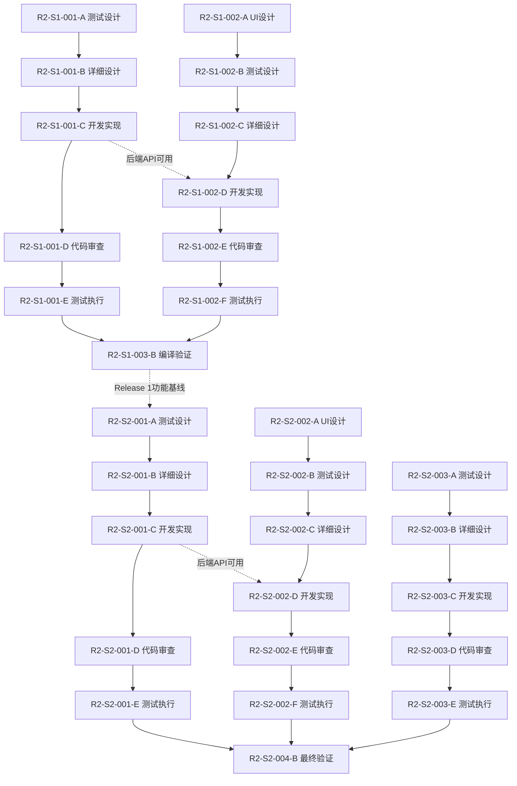

# Release 2 任务分解文档

**版本**: 2.0  
**创建日期**: 2026-05-10  
**适用范围**: Sprint 1-2 (2周)  
**基于**: Release 2 PRD v2.0 (已批准) + 可行性评估报告 v1.0

---

## 文档说明

本文档详细分解了 Release 2 的开发任务。Release 2 的核心目标有两个：
1. **数据分析可视化**：实现时序数据绘图工具
2. **团队协作与程序化访问**：实现团队管理功能和 Python SDK

**任务ID编码规则**:
- `R2-S1-xxx`: Release 2, Sprint 1 任务
- `R2-S2-xxx`: Release 2, Sprint 2 任务
- 每个任务内部包含 TDD 流程子任务：A=测试设计, B=详细设计, C=开发实现, D=代码审查, E=测试执行

---

## Sprint 1: 数据分析与可视化 (Week 1)

**主题**: 完成时序数据绘图工具的端到端实现，让用户能够可视化查看试验数据。

**Sprint 1 总工时**: ~50h | **模块任务数**: 3 个 | **子任务数**: 15 个

---

### 任务 1: HDF5 时序数据查询 API（后端）(R2-S1-001)

**任务描述**: 实现 POST /api/v1/experiments/{id}/data/query 端点，支持按设备/测点/时间范围查询 HDF5 数据，支持 LTTB 降采样。

#### R2-S1-001-A: 测试用例设计
| 字段 | 内容 |
|------|------|
| **任务描述** | sw-mike 设计测试用例：1) 按设备/测点查询测试 2) 时间范围过滤测试 3) 降采样功能测试（验证点数为 downsample 参数值）4) 多测点同时查询测试 5) 试验不存在/无数据错误处理测试 6) 大数据量查询性能测试 7) 响应格式标准包裹层测试 |
| **预估工时** | 2h |
| **依赖任务** | 无 |
| **验收标准** | 1. 测试用例覆盖所有查询场景 2. 测试用例文档保存到 `log/release_2/test/` |
| **分配角色** | sw-mike (测试) |

#### R2-S1-001-B: 详细设计
| 字段 | 内容 |
|------|------|
| **任务描述** | sw-jerry 编写详细设计：1) API 端点详细设计（请求/响应格式、错误码）2) HDF5 文件读取方案（文件路径、数据集结构、时间范围切片）3) LTTB 降采样算法设计（伪代码/Rust 实现方案）4) 与现有 DataService 集成方案 5) 数据模型（查询参数 DTO、响应 DTO） |
| **预估工时** | 2h |
| **依赖任务** | R2-S1-001-A |
| **验收标准** | 1. 详细设计文档保存到 `log/release_2/design/` 2. 包含 LTTB 算法伪代码 |
| **分配角色** | sw-jerry (架构设计) |

#### R2-S1-001-C: 开发实现
| 字段 | 内容 |
|------|------|
| **任务描述** | sw-tom 实现：1) 创建 `experiments/data.rs` handler 模块 2) 实现 HDF5 文件读取（hdf5-rs 按时间范围切片）3) 实现 LTTB 降采样算法（自研，Rust 无成熟 crate）4) 实现查询参数解析和验证 5) 注册 POST /api/v1/experiments/{id}/data/query 路由 6) 响应格式使用标准 ApiResponse 包裹层 7) HDF5 并发读取安全：仅允许查询 `completed` / `error` 状态的试验（`running` 状态返回 409 Conflict） |
| **预估工时** | 8h |
| **依赖任务** | R2-S1-001-B（设计批准） |
| **验收标准** | 1. API 可正确返回试验数据 2. 降采样后点数符合 downsample 参数（原始数据 < downsample 时返回全部数据） 3. `cargo check` 通过 4. `running` 状态试验查询返回 409 |
| **分配角色** | sw-tom (开发) |

#### R2-S1-001-D: 代码审查
| 字段 | 内容 |
|------|------|
| **任务描述** | sw-jerry 审查：1) API 设计合理性 2) HDF5 读取安全性 3) LTTB 算法正确性 4) 错误处理完整性 5) 性能考量 |
| **预估工时** | 1h |
| **依赖任务** | R2-S1-001-C（开发完成并推送） |
| **验收标准** | 1. 审查报告保存到 `log/release_2/review/` 2. 所有问题修复 |
| **分配角色** | sw-jerry (代码审查) |

#### R2-S1-001-E: 测试执行
| 字段 | 内容 |
|------|------|
| **任务描述** | sw-mike 执行：1) 运行后端单元测试 2) 使用模拟试验数据验证 API 3) 降采样精度验证 4) 生成测试报告 |
| **预估工时** | 2h |
| **依赖任务** | R2-S1-001-D（代码审查通过） |
| **验收标准** | 1. 所有测试通过 2. 测试覆盖率 > 80% 3. 测试报告保存到 `log/release_2/test/` |
| **分配角色** | sw-mike (测试) |

---

### 任务 2: 时序图表组件（前端）(R2-S1-002)

**任务描述**: 基于 fl_chart 实现时序数据可视化组件，支持单/多曲线、缩放、平移、光标测量。

#### R2-S1-002-A: UI 原型设计
| 字段 | 内容 |
|------|------|
| **任务描述** | sw-anna 设计分析页面 Figma 原型：1) 分析页面整体布局（控制面板+图表区）2) 图表组件状态（空状态/加载中/数据展示）3) 深色/浅色主题适配 4) 响应式布局（>=1280px 桌面） |
| **预估工时** | 4h |
| **依赖任务** | 无 |
| **验收标准** | 1. Figma 原型保存到 `log/release_2/ui/figma/` 2. 设计规范文档保存到 `log/release_2/ui/specifications/` |
| **分配角色** | sw-anna (UI设计) |

#### R2-S1-002-B: 测试用例设计
| 字段 | 内容 |
|------|------|
| **任务描述** | sw-mike 设计 Widget 测试用例：1) 图表空状态显示测试 2) 单曲线渲染测试 3) 多曲线渲染与图例交互测试 4) 缩放/平移交互测试（模拟手势）5) 光标测量显示测试 6) 主题切换适配测试 7) 数据加载状态测试 |
| **预估工时** | 2h |
| **依赖任务** | R2-S1-002-A |
| **验收标准** | 1. 测试用例覆盖所有 UI 交互 2. 测试用例文档保存到 `log/release_2/test/` |
| **分配角色** | sw-mike (测试) |

#### R2-S1-002-C: 详细设计
| 字段 | 内容 |
|------|------|
| **任务描述** | sw-jerry 编写详细设计：1) 图表组件类图（与 fl_chart 的集成方案）2) 状态管理设计（Riverpod Provider 架构）3) 数据流设计（API 调用 → 数据解析 → 图表渲染）4) 交互事件处理（缩放/平移/光标）5) 性能优化策略（增量加载、数据缓存） |
| **预估工时** | 2h |
| **依赖任务** | R2-S1-002-B |
| **验收标准** | 1. 详细设计文档保存到 `log/release_2/design/` 2. 包含 Mermaid 状态图 |
| **分配角色** | sw-jerry (架构设计) |

#### R2-S1-002-D: 开发实现
| 字段 | 内容 |
|------|------|
| **任务描述** | sw-tom 实现：1) 创建 `features/analysis/` 模块 2) 实现 `TimeSeriesChart` 组件（单/多曲线）3) 实现图表交互（缩放/平移/光标）4) 实现图例交互（点击隐藏/显示）5) 实现数据加载和状态管理 6) 深色/浅色主题适配 7) 添加 `/analysis` 路由 8) 在 `NavigationItem.mainItems` 中添加分析页面入口（图标、标签）9) 更新 `BreadcrumbItem.fromRoute` 处理 `/analysis` 路由 |
| **预估工时** | 12h |
| **依赖任务** | R2-S1-002-C（设计批准）, R2-S1-001-C（后端 API 可用） |
| **验收标准** | 1. 图表可正确显示多曲线 2. 缩放/平移/光标交互正常 3. `flutter build web` 无错误 4. 符合 Figma 设计规范 |
| **分配角色** | sw-tom (开发), sw-anna (UI验证) |

#### R2-S1-002-E: 代码审查
| 字段 | 内容 |
|------|------|
| **任务描述** | sw-jerry 审查：1) Flutter 代码质量 2) 状态管理合理性 3) 性能无泄漏 4) 与后端 API 集成正确性 5) 响应式布局 |
| **预估工时** | 2h |
| **依赖任务** | R2-S1-002-D（开发完成并推送） |
| **验收标准** | 1. 审查报告保存到 `log/release_2/review/` 2. 所有问题修复 |
| **分配角色** | sw-jerry (代码审查) |

#### R2-S1-002-F: 测试执行
| 字段 | 内容 |
|------|------|
| **任务描述** | sw-mike 执行：1) 运行 Widget 测试 2) 手动验证图表交互 3) 验证主题适配 4) 生成测试报告 |
| **预估工时** | 2h |
| **依赖任务** | R2-S1-002-E（代码审查通过） |
| **验收标准** | 1. 所有测试通过 2. 测试报告保存到 `log/release_2/test/` |
| **分配角色** | sw-mike (测试) |

---

### 任务 3: Sprint 1 启动脚本与编译验证 (R2-S1-003)

**任务描述**: 提供 Sprint 1 的一键启动脚本，并完成编译验证。

#### R2-S1-003-A: 启动脚本开发
| 字段 | 内容 |
|------|------|
| **任务描述** | sw-tom 实现：1) `scripts/start-r2s1.sh` — 一键启动后端 + 前端开发服务器 2) `scripts/stop-r2s1.sh` — 优雅停止 3) 脚本检查依赖（Rust toolchain、Flutter、HDF5 库）4) 打印访问地址和快速验证命令 |
| **预估工时** | 2h |
| **依赖任务** | 无 |
| **验收标准** | 1. `start-r2s1.sh` 可成功启动完整开发环境 2. `stop-r2s1.sh` 可优雅停止所有进程 |
| **分配角色** | sw-tom (开发) |

#### R2-S1-003-C: 启动脚本审查
| 字段 | 内容 |
|------|------|
| **任务描述** | sw-jerry 轻量级审查启动脚本：检查多进程管理、错误处理、端口冲突检测 |
| **预估工时** | 0.5h |
| **依赖任务** | R2-S1-003-A |
| **验收标准** | 1. 审查意见记录 2. 关键问题修复 |
| **分配角色** | sw-jerry (代码审查) |

#### R2-S1-003-B: 集成测试与编译验证
| 字段 | 内容 |
|------|------|
| **任务描述** | sw-mike 执行：1) `cargo clippy --all-targets --all-features -- -D warnings` — 零错误零警告 2) `flutter build web --release` — 成功 3) `flutter analyze --fatal-infos` — 无问题 4) 端到端数据流验证（创建试验 → 采集数据 → 分析页面查看图表） |
| **预估工时** | 4h |
| **依赖任务** | R2-S1-001-E, R2-S1-002-F, R2-S1-003-C |
| **验收标准** | 1. 后端编译零错误零警告 2. 前端编译无错误 3. 端到端数据流验证通过 4. 验证报告保存到 `log/release_2/test/` |
| **分配角色** | sw-mike (测试) |

---

## Sprint 2: 团队协作与开发者工具 (Week 2)

**主题**: 实现团队管理功能（端到端）和 Python SDK，支持多用户协作和程序化数据访问。

**Sprint 2 总工时**: ~72h | **模块任务数**: 4 个 | **子任务数**: 20 个

---

### 任务 4: 团队管理后端 (R2-S2-001)

**任务描述**: 实现团队管理后端：数据库 Schema、Migration、REST API、邀请机制、权限检查。

#### R2-S2-001-A: 测试用例设计
| 字段 | 内容 |
|------|------|
| **任务描述** | sw-mike 设计测试用例：1) 团队 CRUD 测试 2) 成员邀请/接受/移除测试 3) 角色权限检查测试（Owner/Admin/Member 边界）4) 邀请码过期测试 5) 团队删除策略测试（非空团队 409）6) 资源隔离测试（团队资源对其他团队不可见）7) 成员主动退出测试 |
| **预估工时** | 2h |
| **依赖任务** | 无 |
| **验收标准** | 1. 测试用例覆盖所有团队生命周期场景 2. 测试用例文档保存到 `log/release_2/test/` |
| **分配角色** | sw-mike (测试) |

#### R2-S2-001-B: 详细设计
| 字段 | 内容 |
|------|------|
| **任务描述** | sw-jerry 编写详细设计：1) 数据库 Schema 设计（teams / team_members / team_invitations）2) Migration 脚本设计（兼容现有数据）：使用 `sqlx migrate add` 创建迁移文件；迁移脚本分三步：(a) 添加列允许 NULL → (b) UPDATE 填充现有数据 → (c) 添加 NOT NULL 约束；应用启动时自动执行 `sqlx::migrate!().run(&pool)` 3) API 端点详细设计 4) `RequireTeamRole` Axum extractor 设计 5) 邀请码生成机制设计（32字符 Base64URL，熵≥192bit）6) 资源隔离方案（owner_type + owner_id 多态外键）7) 团队资源查询 API 方案：扩展现有 `GET /api/v1/workbenches` 增加 `scope` / `team_id` 查询参数（向后兼容，无新参数时行为不变） |
| **预估工时** | 2h |
| **依赖任务** | R2-S2-001-A |
| **验收标准** | 1. 详细设计文档保存到 `log/release_2/design/` 2. 包含数据库 ERD 图 |
| **分配角色** | sw-jerry (架构设计) |

#### R2-S2-001-C: 开发实现
| 字段 | 内容 |
|------|------|
| **任务描述** | sw-tom 实现：1) 创建数据库 Migration 文件（`migrations/` 目录）：teams / team_members / team_invitations 表 + experiments 表 owner_type/owner_id 字段（分步迁移：NULL → UPDATE → NOT NULL）2) 应用启动时自动执行 Migration 3) 实现 Team Service（CRUD + 邀请逻辑）4) 实现 Team API handlers（所有 REST 端点）5) 实现 `RequireTeamRole` middleware 6) 注册新路由 7) 邀请码生成和验证 8) 扩展现有资源列表 API（workbenches/methods/experiments）增加 `scope` / `team_id` 查询参数过滤 |
| **预估工时** | 10h |
| **依赖任务** | R2-S2-001-B（设计批准） |
| **验收标准** | 1. 所有团队 API 端点正常工作 2. Migration 可安全执行（不破坏现有数据） 3. `cargo check` 通过 |
| **分配角色** | sw-tom (开发) |

#### R2-S2-001-D: 代码审查
| 字段 | 内容 |
|------|------|
| **任务描述** | sw-jerry 审查：1) 数据库 Schema 设计合理性 2) Migration 安全性 3) API 设计合规性 4) 权限检查完整性 5) 资源隔离正确性 |
| **预估工时** | 2h |
| **依赖任务** | R2-S2-001-C（开发完成并推送） |
| **验收标准** | 1. 审查报告保存到 `log/release_2/review/` 2. 所有问题修复 |
| **分配角色** | sw-jerry (代码审查) |

#### R2-S2-001-E: 测试执行
| 字段 | 内容 |
|------|------|
| **任务描述** | sw-mike 执行：1) 运行后端单元测试 2) 验证权限边界 3) 邀请码生命周期验证 4) 资源隔离验证 5) 生成测试报告 |
| **预估工时** | 2h |
| **依赖任务** | R2-S2-001-D（代码审查通过） |
| **验收标准** | 1. 所有测试通过 2. 测试覆盖率 > 80% 3. 测试报告保存到 `log/release_2/test/` |
| **分配角色** | sw-mike (测试) |

---

### 任务 5: 团队管理前端 (R2-S2-002)

**任务描述**: 实现团队管理相关的前端页面和组件：团队列表、团队详情/设置、成员管理、团队选择器。

#### R2-S2-002-A: UI 原型设计
| 字段 | 内容 |
|------|------|
| **任务描述** | sw-anna 设计团队管理页面 Figma 原型：1) 团队列表页面 2) 团队详情/设置页面 3) 成员管理页面 4) AppBar 团队选择器组件 5) 资源创建对话框（个人/团队归属选择） |
| **预估工时** | 4h |
| **依赖任务** | 无 |
| **验收标准** | 1. Figma 原型保存到 `log/release_2/ui/figma/` 2. 设计规范文档更新 |
| **分配角色** | sw-anna (UI设计) |

#### R2-S2-002-B: 测试用例设计
| 字段 | 内容 |
|------|------|
| **任务描述** | sw-mike 设计 Widget 测试用例：1) 团队列表显示测试 2) 团队创建表单验证测试 3) 成员列表显示测试 4) 邀请对话框测试 5) 团队切换测试 6) 资源创建时归属选择测试 |
| **预估工时** | 2h |
| **依赖任务** | R2-S2-002-A |
| **验收标准** | 1. 测试用例覆盖所有 UI 交互 2. 测试用例文档保存到 `log/release_2/test/` |
| **分配角色** | sw-mike (测试) |

#### R2-S2-002-C: 详细设计
| 字段 | 内容 |
|------|------|
| **任务描述** | sw-jerry 编写详细设计：1) 前端状态管理设计（当前团队 Riverpod Provider）2) 页面路由设计 3) 团队切换状态管理策略（资源不在新团队时的重定向逻辑）4) 与现有 Auth/User Provider 的集成方案 |
| **预估工时** | 2h |
| **依赖任务** | R2-S2-002-B |
| **验收标准** | 1. 详细设计文档保存到 `log/release_2/design/` 2. 包含状态管理流程图 |
| **分配角色** | sw-jerry (架构设计) |

#### R2-S2-002-D: 开发实现
| 字段 | 内容 |
|------|------|
| **任务描述** | sw-tom 实现：1) 创建 `features/teams/` 模块 2) 实现团队列表页面 3) 实现团队详情/设置页面 4) 实现成员管理页面 5) 实现 AppBar 团队选择器组件（修改 AppShell）6) 实现资源创建时的归属选择 7) 实现团队切换后的页面重定向逻辑（全局状态管理）8) 在 `NavigationItem.mainItems` 中添加团队管理入口 9) 更新 `BreadcrumbItem.fromRoute` 处理团队路由 |
| **预估工时** | 12h |
| **依赖任务** | R2-S2-002-C（设计批准）, R2-S2-001-C（后端 API 可用） |
| **验收标准** | 1. 所有页面可正常访问 2. 团队切换后资源过滤正确 3. `flutter build web` 无错误 4. 符合 Figma 设计规范 |
| **分配角色** | sw-tom (开发), sw-anna (UI验证) |

#### R2-S2-002-E: 代码审查
| 字段 | 内容 |
|------|------|
| **任务描述** | sw-jerry 审查：1) Flutter 代码质量 2) 状态管理合理性 3) 与后端 API 集成正确性 4) 权限前端校验完整性 |
| **预估工时** | 2h |
| **依赖任务** | R2-S2-002-D（开发完成并推送） |
| **验收标准** | 1. 审查报告保存到 `log/release_2/review/` 2. 所有问题修复 |
| **分配角色** | sw-jerry (代码审查) |

#### R2-S2-002-F: 测试执行
| 字段 | 内容 |
|------|------|
| **任务描述** | sw-mike 执行：1) 运行 Widget 测试 2) 端到端验证（创建团队 → 邀请成员 → 切换团队 → 访问团队资源）3) 生成测试报告 |
| **预估工时** | 2h |
| **依赖任务** | R2-S2-002-E（代码审查通过） |
| **验收标准** | 1. 所有测试通过 2. 测试报告保存到 `log/release_2/test/` |
| **分配角色** | sw-mike (测试) |

---

### 任务 6: Python SDK (R2-S2-003)

**任务描述**: 开发 Python 客户端库，提供 REST API 封装、认证、数据下载和 pandas/numpy 集成。

#### R2-S2-003-A: 测试用例设计
| 字段 | 内容 |
|------|------|
| **任务描述** | sw-mike 设计测试用例：1) 登录/登出测试 2) Token 自动刷新测试 3) 设备列表查询测试 4) 测点读取测试 5) 试验数据下载测试 6) HDF5 转 DataFrame 测试 7) HDF5 转 numpy 测试 8) 错误处理测试（认证失败/资源不存在/服务器错误） |
| **预估工时** | 2h |
| **依赖任务** | 无（可在 Sprint 1 末期提前启动，不依赖团队管理功能） |
| **验收标准** | 1. 测试用例覆盖所有 SDK 功能 2. 测试用例文档保存到 `log/release_2/test/` |
| **分配角色** | sw-mike (测试) |

#### R2-S2-003-B: 详细设计
| 字段 | 内容 |
|------|------|
| **任务描述** | sw-jerry 编写详细设计：1) SDK 类结构设计（KayakClient / AuthManager / 各资源模块）2) 认证流程设计（Token 刷新机制）3) 异常体系设计 4) 数据转换设计（HDF5 → pandas/numpy）5) 与现有 `kayak-python-client/` 的集成/替换方案 |
| **预估工时** | 1h |
| **依赖任务** | R2-S2-003-A（可在 Sprint 1 末期提前启动） |
| **验收标准** | 1. 详细设计文档保存到 `log/release_2/design/` 2. 包含类图 |
| **分配角色** | sw-jerry (架构设计) |

#### R2-S2-003-C: 开发实现
| 字段 | 内容 |
|------|------|
| **任务描述** | sw-tom 实现：1) 在 `kayak-python-client/` 目录从零构建 SDK 2) 实现 `KayakClient` 主类（含上下文管理器）3) 实现 `AuthManager`（Token 自动刷新，过期前 5 分钟刷新）4) 实现设备/测点/试验接口模块 5) 实现数据下载模块（HDF5 下载 + pandas/numpy 转换）6) 实现异常体系 7) 编写 `examples/basic_usage.py` 8) 配置 `pyproject.toml`（使用 Poetry）9) **降级策略**：若 Sprint 2 时间压力，优先保证核心认证+设备列表查询，数据下载/转换可移至后续迭代 |
| **预估工时** | 14h |
| **依赖任务** | R2-S2-003-B（设计批准） |
| **验收标准** | 1. SDK 可成功连接后端并认证 2. 数据下载和转换功能正常 3. `pytest` 可运行基础测试 |
| **分配角色** | sw-tom (开发) |

#### R2-S2-003-D: 代码审查
| 字段 | 内容 |
|------|------|
| **任务描述** | sw-jerry 审查：1) Python 代码质量 2) API 封装正确性 3) 认证安全性 4) 错误处理完整性 5) 类型注解完整性 |
| **预估工时** | 1h |
| **依赖任务** | R2-S2-003-C（开发完成并推送） |
| **验收标准** | 1. 审查报告保存到 `log/release_2/review/` 2. 所有问题修复 |
| **分配角色** | sw-jerry (代码审查) |

#### R2-S2-003-E: 测试执行
| 字段 | 内容 |
|------|------|
| **任务描述** | sw-mike 执行：1) 运行 `pytest` 全部测试 2) 验证 Token 自动刷新 3) 验证数据下载和转换 4) 运行示例脚本 5) 生成测试报告 |
| **预估工时** | 4h |
| **依赖任务** | R2-S2-003-D（代码审查通过） |
| **验收标准** | 1. 所有测试通过 2. 测试覆盖率 > 80% 3. 测试报告保存到 `log/release_2/test/` |
| **分配角色** | sw-mike (测试) |

---

### 任务 7: Sprint 2 启动脚本与最终编译验证 (R2-S2-004)

**任务描述**: 提供 Sprint 2 的一键启动脚本，并完成全部编译验证。

#### R2-S2-004-A: 启动脚本开发
| 字段 | 内容 |
|------|------|
| **任务描述** | sw-tom 实现：1) `scripts/start-r2s2.sh` — 一键启动后端 + 前端 + Python 环境检查 2) `scripts/stop-r2s2.sh` — 优雅停止 3) 脚本检查 Python 3.9+、pip、pytest 可用性 |
| **预估工时** | 2h |
| **依赖任务** | 无 |
| **验收标准** | 1. `start-r2s2.sh` 可成功启动完整开发环境 2. `stop-r2s2.sh` 可优雅停止所有进程 |
| **分配角色** | sw-tom (开发) |

#### R2-S2-004-B: 最终集成测试与编译验证
| 字段 | 内容 |
|------|------|
| **任务描述** | sw-mike 执行：1) `cargo clippy --all-targets --all-features -- -D warnings` — 零错误零警告 2) `flutter build web --release` — 成功 3) `flutter analyze --fatal-infos` — 无问题 4) `pytest` (Python SDK) — 全部通过 5) 端到端全流程验证（团队创建 → 邀请 → 共享工作台 → 运行试验 → 分析数据 → Python SDK 下载） |
| **预估工时** | 4h |
| **依赖任务** | R2-S2-001-E, R2-S2-002-F, R2-S2-003-E |
| **验收标准** | 1. 后端编译零错误零警告 2. 前端编译无错误 3. Python SDK 测试全部通过 4. 端到端全流程验证通过 5. 验证报告保存到 `log/release_2/test/` |
| **分配角色** | sw-mike (测试) |

---

## 任务依赖关系

---

## Release 2 任务统计

| Sprint | 模块任务 | 子任务 | 预估工时 | 关键交付物 |
|--------|----------|--------|----------|------------|
| Sprint 1 | 3 | 15 | ~50h | 时序数据绘图工具（可运行） |
| Sprint 2 | 4 | 20 | ~72h | 团队管理 + Python SDK（可运行） |
| **总计** | **7** | **35** | **~122h** | **完整可演示的 Release 2** |

---

## 验收标准汇总

### Sprint 1 验收标准

- [ ] POST /api/v1/experiments/{id}/data/query 正常工作，返回标准格式响应
- [ ] LTTB 降采样算法正确，降采样后点数符合参数
- [ ] 分析页面可显示单/多曲线时序图
- [ ] 图表支持缩放、平移、光标测量
- [ ] 深色/浅色主题自动适配
- [ ] `cargo clippy -D warnings` 通过
- [ ] `flutter build web` 无错误
- [ ] `scripts/start-r2s1.sh` 可一键启动

### Sprint 2 验收标准

- [ ] 团队 CRUD API 正常工作
- [ ] 成员邀请/接受/移除功能正常
- [ ] 角色权限检查正确（Owner/Admin/Member）
- [ ] 团队资源隔离正确（团队资源对其他团队不可见）
- [ ] 前端团队列表/详情/成员管理页面可访问
- [ ] AppBar 团队选择器可切换团队
- [ ] Python SDK 可登录、查询数据、下载 HDF5
- [ ] Python SDK 数据可转换为 pandas DataFrame 和 numpy ndarray
- [ ] `pytest` 全部通过，覆盖率 > 80%
- [ ] 端到端全流程验证通过
- [ ] 所有编译零错误零警告
- [ ] `scripts/start-r2s2.sh` 可一键启动

---

## 文档结束

*本文档基于 Release 2 PRD v2.0 编制，任何变更需同步更新 PRD 和可行性评估报告。*
