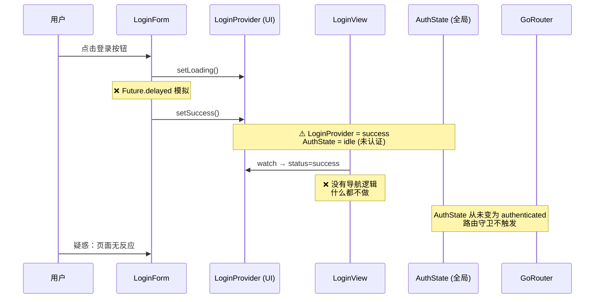
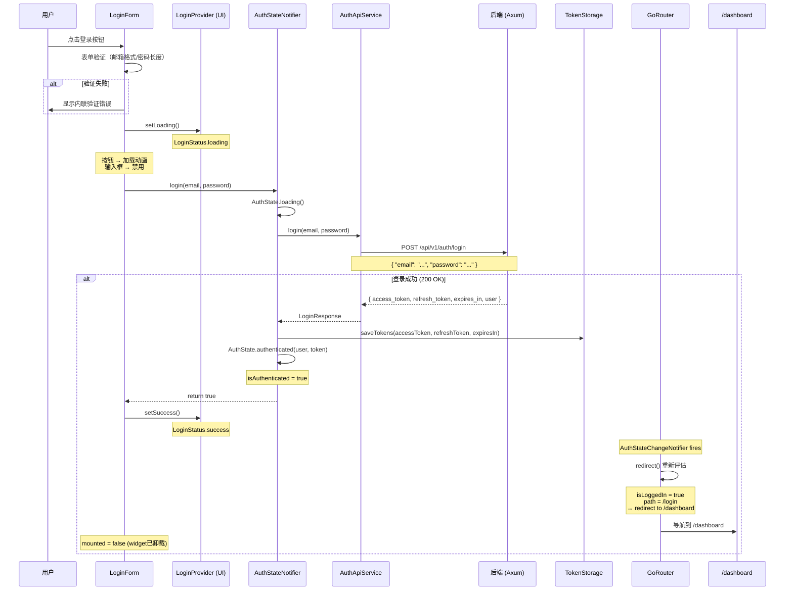
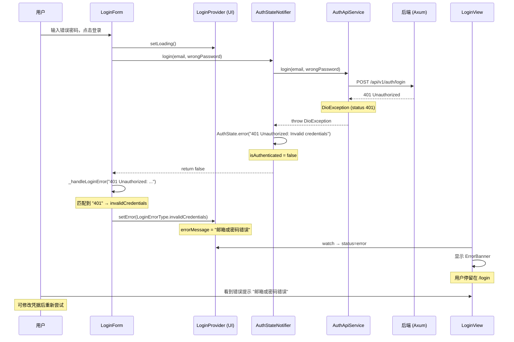
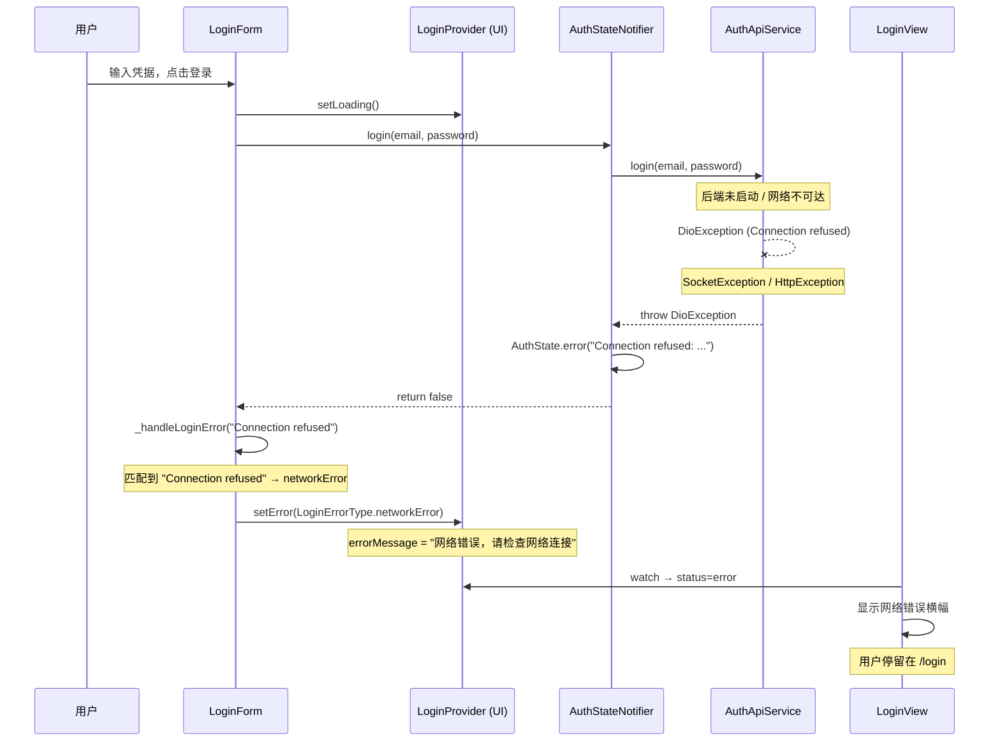

# R3-T1 登录流程修复 — 详细设计文档

**版本**: 1.1  
**日期**: 2026-05-30  
**作者**: sw-tom (开发工程师)  
**关联任务**: [R3-T1: 修复登录流程](../tasks.md#r3-t1-修复登录流程替换模拟登录为真实认证-)  
**关联 PRD**: [FR-AUTH-001](../prd.md)

---

## 目录

1. [Bug 根因分析](#1-bug-根因分析)
2. [现有架构概览](#2-现有架构概览)
3. [修复方案设计](#3-修复方案设计)
4. [详细代码变更](#4-详细代码变更)
5. [流程图：修复后的登录流程](#5-流程图修复后的登录流程)
6. [错误处理策略](#6-错误处理策略)
7. [状态管理交互](#7-状态管理交互)
8. [文件变更清单](#8-文件变更清单)
9. [边界情况与防御性编程](#9-边界情况与防御性编程)
10. [回归测试注意事项](#10-回归测试注意事项)

---

## 1. Bug 根因分析

### 1.1 问题描述

`kayak-frontend/lib/features/auth/widgets/login_form.dart` 第 71-98 行的 `_submitForm()` 方法使用 `Future.delayed` 模拟异步登录，**从未调用** `AuthStateNotifier.login()` 方法，导致全局 `AuthState.isAuthenticated` 永远为 `false`。

### 1.2 断链分析

```
login_form._submitForm()
  └─→ loginProvider.setLoading()
  └─→ Future.delayed(1s) ──→ loginProvider.setSuccess()  // 模拟成功
  └─→ ❌ 没有调用 authStateNotifier.login()               // 缺失！
  
结果:
  loginProvider.status  = success  (UI 层面"成功")
  authStateProvider     = idle     (全局认证状态仍为未认证)
  GoRouter.redirect     → 不触发  (因为 authState.isAuthenticated == false)
  用户                  → 停留在登录页，页面无反应
```

### 1.3 被绕过的完整链路

实际上 `AuthStateNotifier.login()`（`core/auth/auth_notifier.dart` 第 110-139 行）已经实现了完整的登录流程：

1. 调用 `AuthApiService.login()` → `POST /api/v1/auth/login`
2. 成功后通过 `TokenStorage` 保存 `accessToken` + `refreshToken`
3. 创建 `User` 对象并设置 `AuthState.authenticated()`
4. `authStateProvider` 更新为已认证状态
5. `AuthStateChangeNotifier` 通知 GoRouter 重新运行 `redirect`
6. 路由守卫检测到 `isAuthenticated == true` → 重定向到 `/dashboard`

**问题就在于 `login_form._submitForm()` 从未触发步骤 1。**

---

## 2. 现有架构概览

### 2.1 三层 Provider 架构

```
┌─────────────────────────────────────────────────────────────────┐
│                      GoRouter (路由层)                          │
│  ┌───────────────────────────────────────────────────────────┐  │
│  │  redirect: 监听 authStateProvider.isAuthenticated         │  │
│  │  refreshListenable: AuthStateChangeNotifier(authState)    │  │
│  └───────────────────────────────────────────────────────────┘  │
└─────────────────────────────────────────────────────────────────┘
                              ▲
                              │ listens
┌─────────────────────────────────────────────────────────────────┐
│                   authStateProvider (全局认证)                   │
│  ┌───────────────────────────────────────────────────────────┐  │
│  │  AuthStateNotifier                                         │  │
│  │  ├─ login() → AuthApiService → 保存Token → authenticated  │  │
│  │  ├─ logout() → 清除Token → initial                        │  │
│  │  └─ initialize() → 从存储恢复Token → authenticated/initial│  │
│  └───────────────────────────────────────────────────────────┘  │
└─────────────────────────────────────────────────────────────────┘
                              ▲
                              │ uses
┌─────────────────────────────────────────────────────────────────┐
│                   loginProvider (本地 UI 状态)                    │
│  ┌───────────────────────────────────────────────────────────┐  │
│  │  LoginNotifier                                            │  │
│  │  ├─ loading/success/error 状态                            │  │
│  │  ├─ errorType (invalidCredentials/networkError/server)    │  │
│  │  └─ errorMessage (用户可读的消息)                          │  │
│  └───────────────────────────────────────────────────────────┘  │
└─────────────────────────────────────────────────────────────────┘
```

### 2.2 组件职责

| 组件 | 位置 | 职责 | 使用方 |
|------|------|------|--------|
| `LoginForm` | `features/auth/widgets/` | 表单UI + 表单验证 + 提交 | `LoginView` |
| `LoginView` | `features/auth/screens/` | 登录页布局 + 显示错误横幅 | `LoginScreen` |
| `LoginNotifier` | `features/auth/providers/` | 登录UI状态 (loading/success/error) | `LoginForm`, `LoginView` |
| `AuthStateNotifier` | `core/auth/` | 全局认证状态管理 | 路由守卫, API客户端 |
| `AuthApiService` | `core/auth/` | 调用后端认证API | `AuthStateNotifier` |
| `AuthStateChangeNotifier` | `core/router/` | 通知GoRouter刷新路由 | `appRouterProvider` |
| `TokenStorage` | `core/auth/` | 安全存储Token | `AuthStateNotifier` |

### 2.3 数据流现状（有 Bug）



---

## 3. 修复方案设计

### 3.1 修改策略

采用**最小化修改**原则，只修改两个文件：

| 文件 | 修改类型 | 说明 |
|------|----------|------|
| `login_form.dart` | **必须修改** | 替换 mock 为真实 API 调用 |
| `login_view.dart` | **推荐修改** | 添加登录成功后的显式导航监听 |

### 3.2 核心设计思路

1. **`login_form` 负责发起认证**：将 `_submitForm()` 改为 `async`，调用 `authStateNotifier.login()`
2. **`loginProvider` 负责 UI 反馈**：在 `_submitForm()` 中根据 login 结果更新 UI 状态
3. **`authStateProvider` 负责全局状态**：登录成功后自动更新，触发路由守卫
4. **导航完全由 GoRouter 处理**：`login_view` 不添加显式导航监听，避免与 GoRouter redirect 的竞态条件

### 3.3 为什么只依赖路由守卫？

路由守卫 (`GoRouter.redirect`) 通过 `AuthStateChangeNotifier` 监听 `authStateProvider` 变化来触发重定向。这是经过验证的可靠机制：

1. `AuthStateNotifier.login()` 成功后更新 `AuthState` → `authenticated`
2. `AuthStateChangeNotifier` 通过 `refreshListenable` 通知 GoRouter
3. GoRouter 在下一帧调用 `redirect()`，检测到 `isAuthenticated == true` → 重定向到 `/dashboard`

**不在 `login_view` 中添加显式导航监听**：同时使用 `ref.listen` + `context.go()` 和 GoRouter redirect 会在同一帧触发两次导航，导致路由冲突和竞态条件。GoRouter 的 redirect 机制是唯一且可靠的导航路径。

### 3.4 错误信息传递路径

```
AuthApiService.login() throws DioException
  └─→ AuthStateNotifier.login() catches → AuthState.error("消息")
  └─→ login_form._submitForm() 读取 authState.error
  └─→ 映射为 LoginErrorType
  └─→ loginProvider.setError(type)
  └─→ LoginView 渲染 ErrorBanner
```

---

## 4. 详细代码变更

### 4.1 `login_form.dart` — 主要修改

**文件路径**: `kayak-frontend/lib/features/auth/widgets/login_form.dart`

#### 4.1.1 新增导入

```dart
// 新增：引入全局认证 Provider
import '../../../core/auth/providers.dart';
```

#### 4.1.2 修改 `_submitForm()` 方法

将同步的 `void _submitForm()` 改为 `Future<void> _submitForm()`，移除 `Future.delayed` mock，调用真实的认证 API。

**替换前 (第 71-98 行)**:
```dart
void _submitForm() {
    // 验证表单
    final emailError = Validators.validateEmail(_emailController.text);
    final passwordError = Validators.validatePassword(_passwordController.text);

    if (emailError != null) {
      ref.read(emailValidationProvider.notifier).state = emailError;
      return;
    }
    if (passwordError != null) {
      ref.read(passwordValidationProvider.notifier).state = passwordError;
      return;
    }

    // 清除错误
    ref.read(emailValidationProvider.notifier).state = null;
    ref.read(passwordValidationProvider.notifier).state = null;

    // 提交登录
    ref.read(loginProvider.notifier).setLoading();
    // TODO: 调用后端API进行登录
    // 模拟登录成功，直接跳转
    Future.delayed(const Duration(seconds: 1), () {
      if (mounted) {
        ref.read(loginProvider.notifier).setSuccess();
      }
    });
}
```

**替换后**:
```dart
Future<void> _submitForm() async {
    // 验证表单
    final emailError = Validators.validateEmail(_emailController.text);
    final passwordError = Validators.validatePassword(_passwordController.text);

    if (emailError != null) {
      ref.read(emailValidationProvider.notifier).state = emailError;
      return;
    }
    if (passwordError != null) {
      ref.read(passwordValidationProvider.notifier).state = passwordError;
      return;
    }

    // 清除错误
    ref.read(emailValidationProvider.notifier).state = null;
    ref.read(passwordValidationProvider.notifier).state = null;

    // === 以下是修改的核心逻辑 ===
    
    // 设置 UI 加载状态（禁用按钮+输入框，显示加载动画）
    ref.read(loginProvider.notifier).setLoading();

    // 获取全局认证 Notifier
    final authNotifier = ref.read(authStateNotifierProvider);

    try {
      // 调用真实的认证 API
      // authNotifier.login() 内部:
      //   1. 调用 AuthApiService.login() → POST /api/v1/auth/login
      //   2. 成功后保存 Token 到 TokenStorage
      //   3. 设置 AuthState = authenticated(User, accessToken)
      //   4. 返回 true
      final success = await authNotifier.login(
        _emailController.text.trim(),
        _passwordController.text,
      );

      if (success) {
        // 登录成功 → 更新 UI 状态为 success
        // 路由守卫会通过 AuthStateChangeNotifier 检测到
        // authStateProvider.isAuthenticated = true，自动重定向
        ref.read(loginProvider.notifier).setSuccess();
      } else {
        // 登录失败 → 从 authState 获取错误信息并映射为 UI 可读消息
        final authState = ref.read(authStateProvider);
        _handleLoginError(authState.error);
      }
    } catch (e) {
      // 防御性编程：authNotifier.login() 内部已 catch 所有异常
      // 此分支理论上不会执行，但保留以防止意外
      _handleLoginError(e.toString());
    }
}
```

#### 4.1.3 新增错误处理方法

```dart
/// 处理登录错误，将原始错误映射为用户可读的错误类型
void _handleLoginError(String? errorMessage) {
  if (errorMessage == null) {
    ref.read(loginProvider.notifier).setError(LoginErrorType.unknown);
    return;
  }

  // 根据错误消息内容判断错误类型
  if (_containsAny(errorMessage, [
    '401',
    'Invalid credentials',
    'Unauthorized',
    'email or password',
    '邮箱或密码',
  ])) {
    ref.read(loginProvider.notifier).setError(LoginErrorType.invalidCredentials);
  } else if (_containsAny(errorMessage, [
    'Connection refused',
    'SocketException',
    'Network is unreachable',
    'Failed host lookup',
    '连接被拒绝',
    '网络',
  ])) {
    ref.read(loginProvider.notifier).setError(LoginErrorType.networkError);
  } else if (_containsAny(errorMessage, [
    '500',
    '502',
    '503',
    'bad gateway',
    'service unavailable',
    'server error',
    'internal server',
    '服务器错误',
  ])) {
    ref.read(loginProvider.notifier).setError(LoginErrorType.serverError);
  } else {
    ref.read(loginProvider.notifier).setError(LoginErrorType.unknown);
  }
}

/// 检查 errorMessage 是否包含列表中的任一字符串
bool _containsAny(String message, List<String> keywords) {
  final lower = message.toLowerCase();
  return keywords.any((k) => lower.contains(k.toLowerCase()));
}
```

> **设计理由**：错误消息字符串来自 DioException，在不同平台上格式可能不同。使用不区分大小写的关键词匹配比精确匹配更鲁棒。这些关键词覆盖了最常见的错误场景。

<!-- 4.2 已移除：不再在 login_view 中添加导航监听 -->
<!-- GoRouter redirect 是唯一导航路径，避免与 ref.listen 的竞态条件 -->

---

## 5. 流程图：修复后的登录流程

### 5.1 正常登录流程（Happy Path）



### 5.2 错误密码流程（401）



### 5.3 网络错误流程



---

## 6. 错误处理策略

### 6.1 错误类型映射表

| 后端响应 / 异常类型 | 检测方式 | `LoginErrorType` | 用户提示 |
|---------------------|----------|------------------|----------|
| HTTP 401 Unauthorized | 错误消息含 `401` / `Unauthorized` | `invalidCredentials` | "邮箱或密码错误" |
| 连接被拒绝 (后端未启动) | 含 `Connection refused` | `networkError` | "网络错误，请检查网络连接" |
| Socket 异常 (网络断开) | 含 `SocketException` | `networkError` | "网络错误，请检查网络连接" |
| DNS 解析失败 | 含 `Failed host lookup` | `networkError` | "网络错误，请检查网络连接" |
| HTTP 500 服务器错误 | 含 `500` / `Internal server error` | `serverError` | "服务器错误，请稍后重试" |
| HTTP 502 Bad Gateway | 含 `502` / `Bad Gateway` | `serverError` | "服务器错误，请稍后重试" |
| HTTP 503 Service Unavailable | 含 `503` / `Service Unavailable` | `serverError` | "服务器错误，请稍后重试" |
| HTTP 4xx 其他 | 默认兜底 | `unknown` | "发生未知错误，请稍后重试" |
| HTTP 5xx 其他 | 默认兜底 | `serverError` | "服务器错误，请稍后重试" |
| 未知异常 | 未匹配任何关键词 | `unknown` | "发生未知错误，请稍后重试" |

### 6.2 错误分类流程图

```mermaid
flowchart TD
    A[收到登录错误] --> B{检查错误消息}
    B --> C["包含 '401' 或<br/>'Invalid credentials' 等?"]
    C -->|是| D[invalidCredentials<br/>"邮箱或密码错误"]
    C -->|否| E["包含 'Connection refused'<br/>'SocketException' 等?"]
    E -->|是| F[networkError<br/>"网络错误，请检查网络连接"]
    E -->|否| G["包含 '500','502','503',<br/>'Bad Gateway','Server Error' 等?"]
    G -->|是| H[serverError<br/>"服务器错误，请稍后重试"]
    G -->|否| I[unknown<br/>"发生未知错误，请稍后重试"]
```

### 6.3 错误横幅交互

现有的 `ErrorBanner` 组件自动处理：
- 红色 `errorContainer` 背景色
- `Icons.error_outline` 图标
- 关闭按钮（×）→ 调用 `loginProvider.notifier.reset()` 重置状态
- 关闭后用户可再次尝试登录

无需修改 `ErrorBanner` 组件。

---

## 7. 状态管理交互

### 7.1 Provider 关系图

```mermaid
classDiagram
    class LoginNotifier {
        +LoginState state
        +setLoading()
        +setSuccess()
        +setError(LoginErrorType)
        +reset()
    }
    
    class AuthStateNotifier {
        +AuthState state
        +login(email, password) Future~bool~
        +logout() Future~void~
        +initialize() Future~void~
    }
    
    class LoginForm {
        +_submitForm() Future~void~
        +_handleLoginError(String?)
    }
    
    class LoginView {
        +build()
        +redirectPath
    }
    
    class GoRouter {
        +redirect()
        +refreshListenable
    }
    
    LoginForm --> LoginNotifier : ref.read(loginProvider.notifier)
    LoginForm --> AuthStateNotifier : ref.read(authStateNotifierProvider)
    LoginForm --> AuthState : ref.read(authStateProvider)
    
    LoginView --> LoginNotifier : ref.watch(loginProvider)
    
    GoRouter --> AuthState : authStateProvider
    
    note "login_form.dart 协调\n两个 Provider 的状态" as N1
    LoginForm .. N1
```

### 7.2 状态变化时序

```
时间 ────────────────────────────────────────────────────────────────►
                                                                     
loginProvider:    idle ────→ loading ────→ success ──→ idle (重置)
                     │                    (或 error)
authStateProvider:  idle ────→ loading ────→ authenticated
                     │                    (或 error)
GoRouter:          无动作     无动作         重定向到 /dashboard
```

### 7.3 关键交互约束

1. **`LoginForm` 是唯一协调点**：负责调用 `authStateNotifier.login()`，并将结果同步到 `loginProvider`
2. **`LoginNotifier` 保持简单**：不依赖 `AuthStateNotifier`，保持单一职责
3. **`AuthStateNotifier` 不感知 UI**：纯数据层，不依赖任何 UI 状态
4. **单一导航路径**：`authStateProvider` 更新 → `AuthStateChangeNotifier` → GoRouter redirect。不添加任何显式导航，避免竞态条件。

---

## 8. 文件变更清单

### 8.1 文件修改总览

| # | 文件 | 修改类型 | 影响范围 | 风险等级 |
|---|------|----------|----------|----------|
| 1 | `login_form.dart` | **主要修改** | `_submitForm()` 方法 + 新增 `_handleLoginError()` + 新增 imports | 低 |

### 8.2 `login_form.dart` 变更详细

| 变更项 | 原内容 | 新内容 |
|--------|--------|--------|
| 返回值 | `void` | `Future<void>` |
| 第 91-97 行 | `Future.delayed(...)` 模拟 | `await authNotifier.login(email, password)` |
| 新增方法 | 无 | `_handleLoginError(String?)` + `_containsAny(String, List)` |
| 新增导入 | 无 | `import '../../../core/auth/providers.dart'` |
| 状态流转 | `loading` → `success` 固定 | `loading` → `success` (API成功) 或 `error` (API失败) |

### 8.3 `login_view.dart` — 无需修改

`login_view.dart` 不需要任何修改。导航完全由 GoRouter redirect 机制处理，不添加任何显式导航监听以避免竞态条件。

### 8.4 未修改文件的理由

| 文件 | 不修改的理由 |
|------|-------------|
| `login_provider.dart` | `LoginNotifier` 设计合理，无需改动。`setLoading/setSuccess/setError/reset` 方法完整 |
| `login_view.dart` | 不需要修改。导航完全由 GoRouter redirect 机制处理，不添加显式导航以避免竞态条件 |
| `auth_notifier.dart` | `AuthStateNotifier.login()` 已实现完整登录逻辑，无需修改 |
| `auth_api_service.dart` | API 调用逻辑正确，错误抛出机制正常 |
| `providers.dart` | Provider 注册正常，依赖注入链完整 |
| `auth_route_guard.dart` | 路由守卫逻辑正确，`isAuthenticated` 检测按预期工作 |
| `app_router.dart` | 路由配置正确，`AuthStateChangeNotifier` 监听机制正常 |
| `ErrorBanner` | 错误显示逻辑正常，已在 `login_view` 正确使用 |

---

## 9. 边界情况与防御性编程

### 9.1 Widget 卸载时的安全处理

`_submitForm()` 是 `async` 方法，在 API 请求期间 Widget 可能被卸载（例如用户按返回键或路由重定向）：

```dart
final success = await authNotifier.login(...);

// Widget 已卸载，仍可安全调用 ref.read()
// 因为 Provider 状态独立于 Widget 生命周期
if (success) {
  ref.read(loginProvider.notifier).setSuccess();
} else {
  // ...错误处理
}
```

> **注意**：这里不需要 `if (mounted)` 检查，因为 `ref.read()` 对 Provider 的操作在 Widget 卸载后也是安全的。Provider 状态存在于 ProviderContainer 中，独立于 Widget 树。

### 9.2 重复点击处理

当前 `LoginForm.build()` 中使用 `ref.watch(loginProvider).status` 控制按钮和输入框的 `enabled` 状态：

```dart
final isLoading = ref.watch(loginProvider).status == LoginStatus.loading;

// 按钮在 loading 时 onPressed = null
LoginButton(onPressed: isLoading ? null : _submitForm, ...)
// 输入框在 loading 时禁用
EmailField(enabled: !isLoading, ...)
PasswordField(enabled: !isLoading, ...)
```

在 `_submitForm()` 的 async 调用期间，`loginProvider` 已处于 `loading` 状态，按钮和输入框被禁用。这天然防止了重复提交，**无需额外处理**。

### 9.3 Token 存储失败

`AuthStateNotifier.login()` 内部处理 Token 存储异常：
- `_tokenStorage.saveTokens()` 在 `SharedPrefsTokenStorage` 中可能抛出异常
- 异常会被 `AuthStateNotifier.login()` 的 `catch` 块捕获
- `AuthState` 被设置为 `error` 状态
- `login()` 返回 `false`
- `login_form` 根据 `authState.error` 显示通用服务器错误

### 9.4 AuthApiService 中 API 异常分类

`AuthApiService.login()` 使用 Dio，DioException 的 `response?.statusCode` 可获取 HTTP 状态码。但该错误在 `AuthStateNotifier.login()` 的 `catch` 中被转为 `e.toString()` 字符串，丢失了结构化的状态码信息。

**设计取舍**：为保持最小修改原则，使用字符串关键词匹配而非修改 `AuthStateNotifier` 来透传结构化错误。如果需要更精确的错误处理，可在后续迭代中：

1. 定义 `AuthException` 异常类，包含 `statusCode` 和 `message` 字段
2. 修改 `AuthState` 增加 `errorType` 字段
3. 在 `AuthApiService` 中抛出 `AuthException`

### 9.5 用户输入前后空格处理

邮箱在提交前做 `.trim()` 处理，密码不做 trim（密码前后空格有意义）：

```dart
final success = await authNotifier.login(
  _emailController.text.trim(),  // trim 邮箱
  _passwordController.text,       // 密码不 trim
);
```

---

## 10. 回归测试注意事项

### 10.1 需验证的场景

| 场景 | 验证点 | 关联测试用例 |
|------|--------|-------------|
| 正常登录 | 可跳转到 Dashboard，URL 变为 `/dashboard` | TC-R3-T1-001 |
| 错误密码 | 显示"邮箱或密码错误"，停留在 `/login` | TC-R3-T1-002 |
| 后端未启动 | 显示"网络错误，请检查网络连接" | TC-R3-T1-003 |
| 加载状态 | 按钮显示加载动画、不可点击、输入框禁用 | TC-R3-T1-004 |
| 已登录自动跳转 | Token有效时访问 `/login` → 重定向到 `/dashboard` | TC-R3-T1-005 |
| 表单验证 | 空邮箱/密码不发送 API 请求 | TC-R3-T1-006, 007 |
| Token 存储 | localStorage 中有 access_token/refresh_token | TC-R3-T1-008 |
| 页面刷新保持登录 | 刷新后直接进入 Dashboard | TC-R3-T1-009 |
| 错误横幅关闭 | 点击 × 关闭错误横幅，可重新尝试 | TC-R3-T1-010 |
| Token 过期刷新 | 过期后自动刷新，不跳登录页 | TC-R3-T1-011 |

### 10.2 潜在回归风险

| 风险 | 概率 | 缓解措施 |
|------|------|----------|
| `login_form` 新增的 import 导致循环依赖 | 极低 | `core/auth/providers.dart` 不依赖 `features/auth/` |
| 错误消息关键词不匹配 | 中 | 使用宽松的 `_containsAny` + 不区分大小写 |
| TokenStorage Web 端持久化失败 | 中 | 由 R3-T3 修复，本任务不涉及 |
| 路由守卫 redirectPath 被忽略 | 低 | `GoRouter` redirect 是唯一导航路径，已通过 `AuthStateChangeNotifier` 验证可靠 |

### 10.3 自测清单

- [ ] 提供有效凭据登录，验证跳转到 `/dashboard`
- [ ] 提供错误密码登录，验证显示"邮箱或密码错误"
- [ ] 停止后端后登录，验证显示"网络错误，请检查网络连接"
- [ ] 验证登录按钮在加载时不可重复点击
- [ ] 验证邮箱/密码输入框在加载时禁用
- [ ] 验证 localStorage 中有正确的 Token 存储
- [ ] 验证刷新页面后保持登录状态
- [ ] 验证错误横幅的可关闭性

---

## 附录 A：与 R3-T2/R3-T3 的依赖关系

```
R3-T1 (本任务) ──→ R3-T2 (退出登录)
     │                 依赖 R3-T1 完成后可验证
     │
     └──→ R3-T3 (Token 持久化)
           依赖 R3-T1 提供登录功能以测试 Token 存储
```

- R3-T1 本身**不依赖** R3-T2 或 R3-T3
- R3-T1 完成后，基础登录流程可正常工作
- R3-T3 修复 Web Token 持久化后，页面刷新保持登录能力将完善

---

## 附录 B：后端 Login API 期望格式

**请求**:
```http
POST /api/v1/auth/login
Content-Type: application/json

{
  "email": "admin@kayak.local",
  "password": "Admin123"
}
```

**成功响应 (200)**:
```json
{
  "data": {
    "access_token": "eyJhbGciOiJIUzI1NiIs...",
    "refresh_token": "dGhpcyBpcyBhIHJlZnJl...",
    "expires_in": 3600,
    "user": {
      "id": "1",
      "email": "admin@kayak.local",
      "username": "Admin"
    }
  }
}
```

**错误响应 (401)**:
```json
{
  "error": "Invalid credentials",
  "message": "邮箱或密码错误"
}
```
