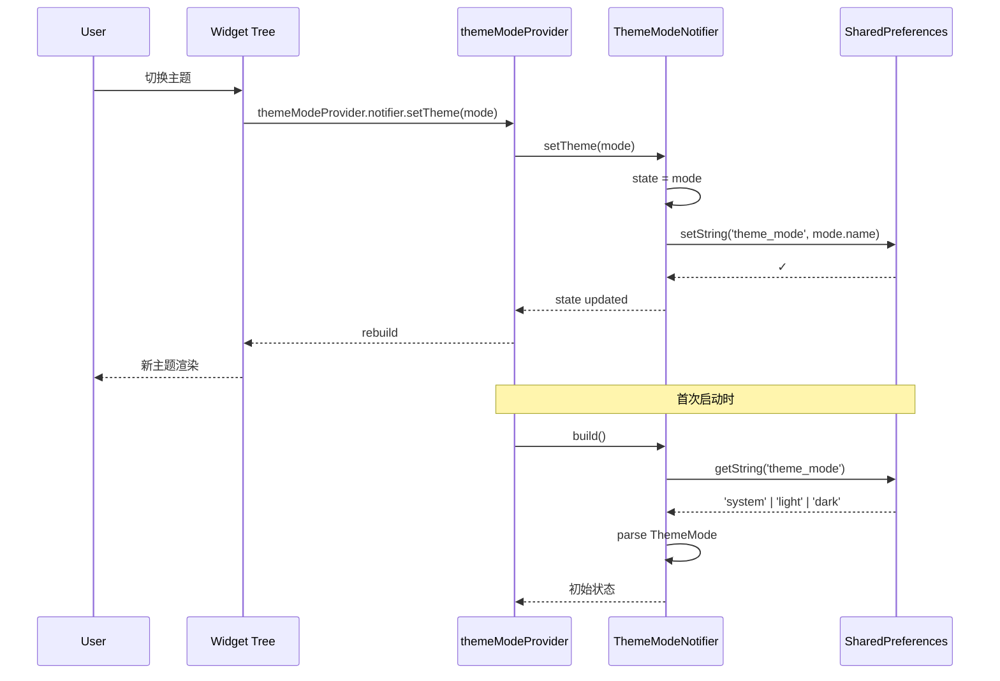
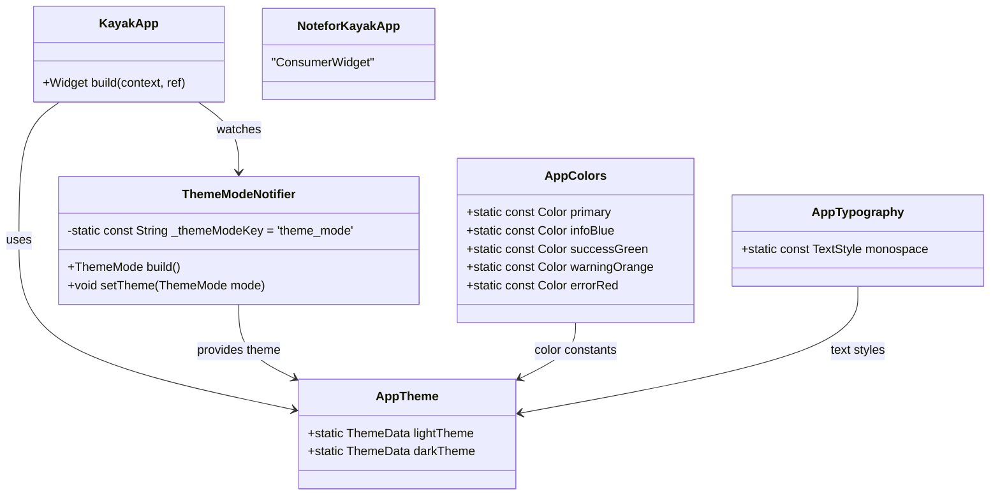

# TASK-005 详细设计 — 主题系统（Material 3）

> **作者**: sw-tom (Developer)
> **日期**: 2026-05-31
> **状态**: Draft
> **关联任务**: TASK-005（主题系统）
> **参考文档**: [tasks.md](../tasks.md), [prd.md](../prd.md), [测试用例](../test/TASK-005_test_cases.md)

---

## 1. 概述

实现 Kayak 前端 Material 3 主题系统，支持浅色/深色/跟随系统三种模式切换。

### 1.1 功能范围

| 功能 | 优先级 | 描述 |
|------|--------|------|
| 浅色主题 | P0 | Material 3 Light ColorScheme |
| 深色主题 | P0 | Material 3 Dark ColorScheme |
| 主题模式切换 | P0 | system/light/dark 三模式切换 |
| 持久化 | P0 | 主题偏好存储到 shared_preferences |
| 组件主题覆盖 | P1 | 按钮、输入框、AppBar、Card、NavigationRail 等 |
| 颜色常量 | P1 | 自定义颜色（补充 ColorScheme） |
| 等宽字体 | P1 | 用于代码/日志区域 |

### 1.2 依赖关系

| 依赖 | 版本 | 用途 |
|------|------|------|
| `flutter_riverpod` | ^3.3.1 | ThemeModeNotifier 状态管理 |
| `shared_preferences` | ^2.5.5 | 主题偏好持久化 |

---

## 2. 架构设计

### 2.1 模块结构

```
lib/
├── theme/
│   ├── colors.dart          # 自定义颜色常量
│   ├── typography.dart      # 文字样式（等宽字体）
│   └── app_theme.dart       # ThemeData 配置（light/dark）
├── providers/
│   └── settings_provider.dart  # ThemeModeNotifier + sharedPreferencesProvider
└── app.dart                 # MaterialApp.router 接入主题

test/
├── theme/
│   ├── app_theme_test.dart         # 主题配置测试
│   ├── colors_test.dart            # 颜色常量测试
│   ├── typography_test.dart        # 文字样式测试
│   ├── theme_notifier_test.dart    # ThemeNotifier 测试
│   └── theme_integration_test.dart # Widget 集成测试
└── helpers/
    └── theme_test_helpers.dart     # 测试辅助函数
```

### 2.2 数据流



### 2.3 组件关系



---

## 3. 接口定义

### 3.1 sharedPreferencesProvider

```dart
/// SharedPreferences 实例 Provider
/// 必须通过 ProviderScope overrides 注入实际实例
final sharedPreferencesProvider = Provider<SharedPreferences>((ref) {
  throw UnimplementedError('Must override sharedPreferencesProvider');
});
```

### 3.2 ThemeModeNotifier

```dart
class ThemeModeNotifier extends Notifier<ThemeMode> {
  static const String _themeModeKey = 'theme_mode';

  @override
  ThemeMode build();

  /// 设置主题模式 (system / light / dark)
  /// 同时持久化到 SharedPreferences
  void setTheme(ThemeMode mode);
}
```

### 3.3 themeModeProvider

```dart
final themeModeProvider = NotifierProvider<ThemeModeNotifier, ThemeMode>(
  ThemeModeNotifier.new,
);
```

### 3.4 AppTheme 接口

```dart
class AppTheme {
  static const Color _seedColor = Color(0xFF1976D2);

  /// 浅色主题
  static ThemeData get lightTheme;

  /// 深色主题  
  static ThemeData get darkTheme;
}
```

### 3.5 AppColors 接口

```dart
class AppColors {
  static const Color primary = Color(0xFF1976D2);
  static const Color infoBlue = Color(0xFF2196F3);
  static const Color successGreen = Color(0xFF4CAF50);
  static const Color warningOrange = Color(0xFFFF9800);
  static const Color errorRed = Color(0xFFE53935);
}
```

### 3.6 AppTypography 接口

```dart
class AppTypography {
  static const TextStyle monospace = TextStyle(
    fontFamily: 'RobotoMono',
    fontFamilyFallback: ['monospace'],
  );
}
```

---

## 4. 数据持久化设计

### 4.1 SharedPreferences Key

| Key | 值类型 | 存储内容 | 默认值 |
|-----|--------|---------|--------|
| `theme_mode` | String | `'system'` / `'light'` / `'dark'` | `'system'` |

### 4.2 序列化/反序列化

```mermaid
stateDiagram-v2
    [*] --> ReadPrefs: build()
    ReadPrefs --> HasValue: getString('theme_mode') != null
    ReadPrefs --> Default: no stored value
    HasValue --> ParseSuccess: valid mode name
    HasValue --> Default: invalid mode name
    ParseSuccess --> Ready: mode set
    Default --> Ready: ThemeMode.system
    Ready --> WritePrefs: setTheme(mode)
    WritePrefs --> Ready: state updated
```

---

## 5. Material 3 主题规格

### 5.1 ColorScheme

| 属性 | 浅色模式 | 深色模式 |
|------|---------|---------|
| Seed Color | `#1976D2` | `#1976D2` |
| Brightness | `Brightness.light` | `Brightness.dark` |
| 生成方式 | `ColorScheme.fromSeed()` | `ColorScheme.fromSeed()` |

### 5.2 组件主题覆盖

| 组件 | 配置项 | 说明 |
|------|--------|------|
| AppBarTheme | backgroundColor, foregroundColor | 使用 surface + onSurface |
| CardTheme | color, elevation, shape | 使用 surfaceContainerHighest |
| ElevatedButtonTheme | backgroundColor, foregroundColor, shape | Material 3 圆角 |
| InputDecorationTheme | border, focusedBorder, labelStyle | ColorScheme outline + primary |
| NavigationRailTheme | indicatorColor, labelTextStyle | primary 指示器 |
| BottomNavigationBarTheme | selectedItemColor, unselectedItemColor | primary 选中色 |

### 5.3 自定义颜色常量

| 颜色 | 值 | 用途 |
|------|-----|------|
| `primary` | `#1976D2` | 品牌主色 |
| `infoBlue` | `#2196F3` | 信息提示 |
| `successGreen` | `#4CAF50` | 成功状态 |
| `warningOrange` | `#FF9800` | 警告状态 |
| `errorRed` | `#E53935` | 错误状态 |

---

## 6. 测试策略

### 6.1 单元测试（TC-001 ~ TC-009, TC-015 ~ TC-023）

- 使用 `ProviderContainer` 隔离 Provider 测试
- `SharedPreferences.setMockInitialValues()` mock 持久化
- 验证 `ColorScheme.fromSeed()` 生成完整调色板

### 6.2 Widget 测试（TC-010 ~ TC-014, TC-024 ~ TC-028）

- 使用 `tester.pumpWidget()` + `MaterialApp` 渲染组件
- 验证浅色/深色模式下组件颜色正确
- 验证 `ThemeMode.system` 跟随 `platformBrightness`

### 6.3 Mock 策略

```dart
// SharedPreferences mock
SharedPreferences.setMockInitialValues({'theme_mode': 'light'});
final prefs = await SharedPreferences.getInstance();

// Provider override
final container = ProviderContainer(overrides: [
  sharedPreferencesProvider.overrideWithValue(prefs),
]);
```

---

## 7. 边界条件处理

| 条件 | 处理方式 |
|------|---------|
| SharedPreferences 不可用 | 回退到 `ThemeMode.system` |
| 存储值无效 | `firstWhere` + `orElse` 回退到 system |
| 快速连续调用 | 同步 Notifier，无竞态 |
| 首次使用无存储 | 默认 `ThemeMode.system` |

---

## 8. 验收标准

| # | 标准 | 测试用例 |
|---|------|---------|
| 1 | 浅色/深色/跟随系统三模式切换 | TC-001, TC-002, TC-005 ~ TC-008 |
| 2 | 切换即时生效 | TC-006, TC-007, TC-008, TC-024 |
| 3 | 所有 Material 3 组件使用统一色板 | TC-001 ~ TC-004 |
| 4 | 持久化到 shared_preferences | TC-009 |
| 5 | 主色 #1976D2 | TC-003 |
| 6 | ThemeModeNotifier 使用 NotifierProvider 管理 | TC-022 |
| 7 | 等宽字体用于代码/日志区域 | TC-017 |
| 8 | 组件主题覆盖（按钮、输入框、卡片等） | TC-025 ~ TC-028 |

---

## 9. 交付物

| 文件 | 功能 |
|------|------|
| `kayak-frontend/lib/theme/colors.dart` | 自定义颜色常量 |
| `kayak-frontend/lib/theme/typography.dart` | 文字样式（等宽字体） |
| `kayak-frontend/lib/theme/app_theme.dart` | 浅色/深色主题配置 |
| `kayak-frontend/lib/providers/settings_provider.dart` | ThemeModeNotifier + Provider |
| `kayak-frontend/lib/app.dart` (修改) | 接入 themeModeProvider |
| `kayak-frontend/lib/main.dart` (修改) | 初始化 SharedPreferences |
