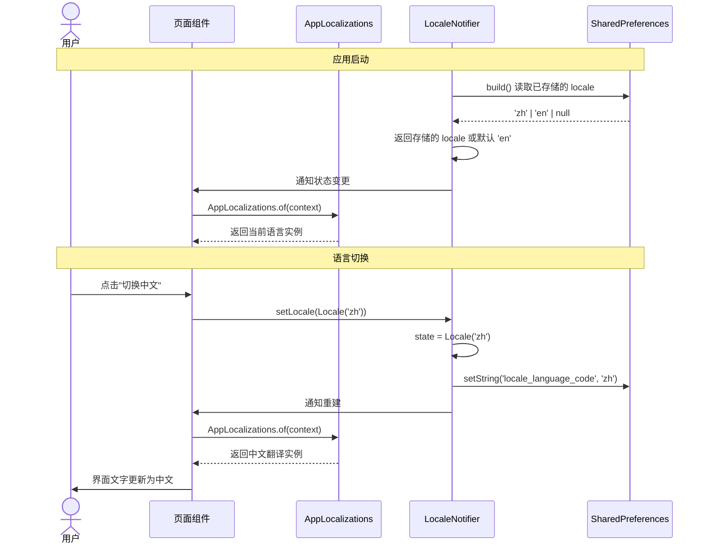

# TASK-006 详细设计 — 国际化框架

> **作者**: sw-tom (Developer)
> **日期**: 2026-05-31
> **版本**: 1.0
> **状态**: Draft

## 1. 概述

### 1.1 目标

为 Kayak 前端应用实现完整的国际化（i18n）框架，基于 Flutter 的 `flutter_localizations` + `intl` 包，使用 ARB（Application Resource Bundle）文件管理翻译资源。支持中英文切换，语言偏好持久化到 `SharedPreferences`。

### 1.2 约束

- 使用 Flutter 内置的 `gen-l10n` 工具生成代码
- 使用 Riverpod 3.x `Notifier` API 管理 locale 状态
- 遵循项目中已有的 `settings_provider.dart` 模式（与 `ThemeNotifier` 同文件）
- **零警告** 策略（`flutter analyze --fatal-infos` 必须通过）
- 所有测试必须通过

### 1.3 验收标准

| # | 标准 | 对应测试用例 |
|---|------|------------|
| 1 | `flutter gen-l10n` 无错误 | TC-001 ~ TC-004 |
| 2 | en 和 zh ARB 文件所有 key 一一对应 | TC-003 |
| 3 | 切换即时生效 | TC-008, TC-009, TC-016, TC-019 |
| 4 | 语言偏好持久化到 SharedPreferences | TC-010, TC-011 |
| 5 | 默认回退语言为 en | TC-007, TC-012, TC-020 |
| 6 | supportedLocales 包含 en 和 zh | TC-014 |
| 7 | localizationsDelegates 正确配置 | TC-015 |

---

## 2. 系统架构

### 2.1 组件关系图

```mermaid
graph TB
    subgraph "ARB 资源文件"
        ARB_EN[app_en.arb]
        ARB_ZH[app_zh.arb]
    end

    subgraph "gen-l10n 生成"
        GEN_CODE[AppLocalizations<br/>+ delegates + locales]
        GEN_EN[AppLocalizationsEn]
        GEN_ZH[AppLocalizationsZh]
    end

    subgraph "状态管理"
        LOCALE_N[LocaleNotifier<br/>extends Notifier&lt;Locale&gt;]
        LOCALE_P[localeProvider<br/>NotifierProvider]
        PREFS[(SharedPreferences)]
    end

    subgraph "应用入口"
        APP[KayakApp<br/>ConsumerWidget]
        MAT[MaterialApp.router]
    end

    subgraph "业务页面"
        PAGES[业务页面组件]
    end

    PREFS -->|读取/写入| LOCALE_N
    LOCALE_N --> LOCALE_P
    LOCALE_P -->|ref.watch| APP
    APP --> MAT
    ARB_EN -->|flutter gen-l10n| GEN_CODE
    ARB_ZH -->|flutter gen-l10n| GEN_CODE
    GEN_CODE --> GEN_EN
    GEN_CODE --> GEN_ZH
    GEN_CODE -->|AppLocalizations.delegate| MAT
    GEN_CODE -->|supportedLocales| MAT
    PAGES -->|AppLocalizations.of(context)| GEN_CODE
```

### 2.2 数据流图



---

## 3. 接口定义

### 3.1 LocaleNotifier（现有文件扩展）

**文件**: `lib/providers/settings_provider.dart`

```
class LocaleNotifier extends Notifier<Locale> {
  static const String _localeKey = 'locale_language_code';

  @override
  Locale build() => ...;         // 从 SharedPreferences 读取，默认 en
  void setLocale(Locale locale); // 更新状态并持久化
}
final localeProvider = NotifierProvider<LocaleNotifier, Locale>(...);
```

### 3.2 ARB 翻译接口

**文件**: `lib/l10n/app_en.arb` (template), `lib/l10n/app_zh.arb` (translation)

**生成代码**: `lib/generated/app_localizations.dart`

**抽象类** `AppLocalizations` 提供 getter 方法供 UI 使用：
```dart
abstract class AppLocalizations {
  static AppLocalizations? of(BuildContext context);
  static const LocalizationsDelegate<AppLocalizations> delegate;
  static const List<Locale> supportedLocales;
  static const List<LocalizationsDelegate<dynamic>> localizationsDelegates;

  String get appTitle;
  String get login;
  String get register;
  // ... 所有其他翻译 key 对应 getter
}
```

### 3.3 MaterialApp 集成

```
MaterialApp.router(
  locale: locale,                           // 从 localeProvider 读取
  supportedLocales: AppLocalizations.supportedLocales,
  localizationsDelegates: AppLocalizations.localizationsDelegates,
);
```

---

## 4. ARB 翻译覆盖范围

### 4.1 Key 清单（31 个）

| 类别 | Key | en 值 | zh 值 |
|------|-----|-------|-------|
| **通用** | `appTitle` | Kayak | Kayak |
| | `save` | Save | 保存 |
| | `cancel` | Cancel | 取消 |
| | `delete` | Delete | 删除 |
| | `confirm` | Confirm | 确认 |
| | `create` | Create | 创建 |
| | `edit` | Edit | 编辑 |
| | `search` | Search | 搜索 |
| | `submit` | Submit | 提交 |
| | `retry` | Retry | 重试 |
| | `loading` | Loading... | 加载中... |
| | `noData` | No data available | 暂无数据 |
| **认证** | `login` | Login | 登录 |
| | `register` | Register | 注册 |
| | `logout` | Logout | 登出 |
| | `email` | Email | 邮箱 |
| | `password` | Password | 密码 |
| | `username` | Username | 用户名 |
| **导航** | `dashboard` | Dashboard | 首页 |
| | `workbenches` | Workbenches | 工作台 |
| | `methods` | Methods | 方法 |
| | `experiments` | Experiments | 试验 |
| | `analysis` | Analysis | 分析 |
| | `settings` | Settings | 设置 |
| **列表** | `workbenchList` | Workbench List | 工作台列表 |
| | `methodList` | Method List | 方法列表 |
| | `experimentList` | Experiment List | 试验列表 |
| **错误** | `loginError` | Invalid email or password | 邮箱或密码错误 |
| | `networkError` | Network error, please check connection | 网络错误，请检查连接 |
| | `sessionExpired` | Session expired, please login again | 会话已过期，请重新登录 |

共 31 个 key，与 tasks.md 要求一致。中文翻译覆盖率 100%。

---

## 5. 文件变更清单

| # | 文件 | 操作 | 说明 |
|---|------|------|------|
| 1 | `lib/l10n/app_en.arb` | 修改 | 从 1 个 key 扩展到 31 个 key，添加元数据 |
| 2 | `lib/l10n/app_zh.arb` | 修改 | 从 1 个 key 扩展到 31 个 key，添加中文翻译 |
| 3 | `lib/providers/settings_provider.dart` | 修改 | 添加 `LocaleNotifier` 和 `localeProvider` |
| 4 | `lib/app.dart` | 修改 | 添加 locale、supportedLocales、localizationsDelegates |
| 5 | `lib/main.dart` | 无需修改 | 已预加载 SharedPreferences |
| 6 | `lib/generated/app_localizations.dart` | **自动生成** | gen-l10n 生成 |
| 7 | `lib/generated/app_localizations_en.dart` | **自动生成** | gen-l10n 生成 |
| 8 | `lib/generated/app_localizations_zh.dart` | **自动生成** | gen-l10n 生成 |

---

## 6. 测试策略

### 6.1 ARB 文件验证
- JSON 格式有效
- en/zh key 一一对应
- 必需 key 全覆盖

### 6.2 LocaleNotifier 单元测试
- 默认语言为 en
- setLocale 更新状态并持久化
- build() 从 SharedPreferences 读取
- SharedPreferences 不可用时优雅回退

### 6.3 MaterialApp 集成测试
- supportedLocales 配置正确
- localizationsDelegates 配置正确
- locale 绑定到 LocaleNotifier

### 6.4 Widget 渲染测试
- 中英文文本正确显示
- 语言切换后 UI 自动更新

---

## 7. 风险与缓解

| 风险 | 影响 | 概率 | 缓解措施 |
|------|------|------|---------|
| gen-l10n 生成代码与现有代码冲突 | 高 | 低 | 使用隔离的 generated 目录 |
| SharedPreferences 异步初始化 | 中 | 低 | main.dart 中 await 初始化 |
| 翻译 key 遗漏 | 高 | 低 | TC-003 自动检查全覆盖 |
| 语言切换后状态未重建 | 中 | 低 | MaterialApp.locale 绑定 Provider |
