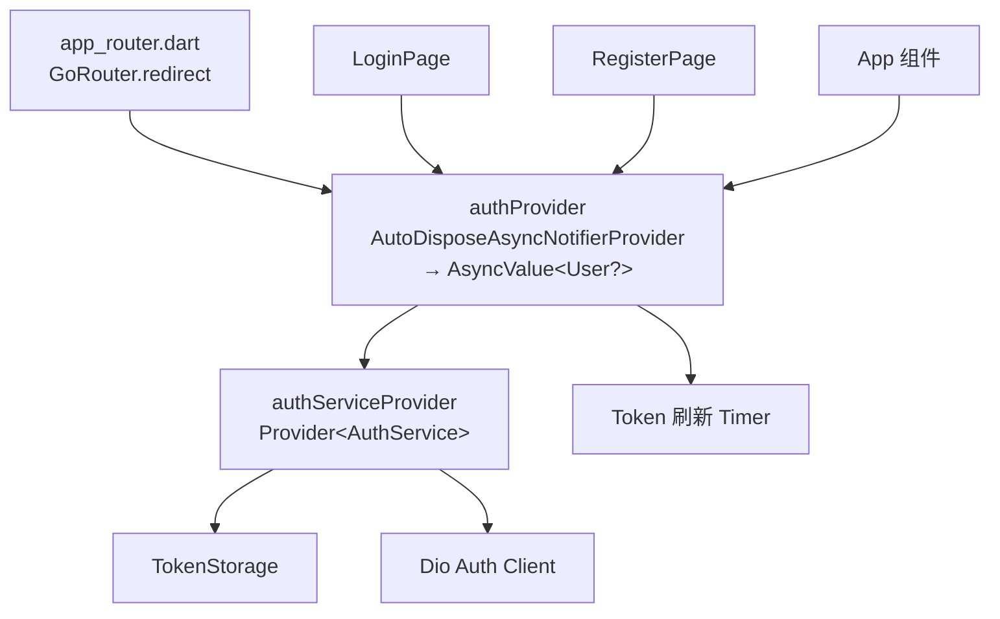
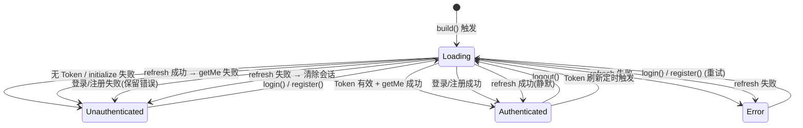
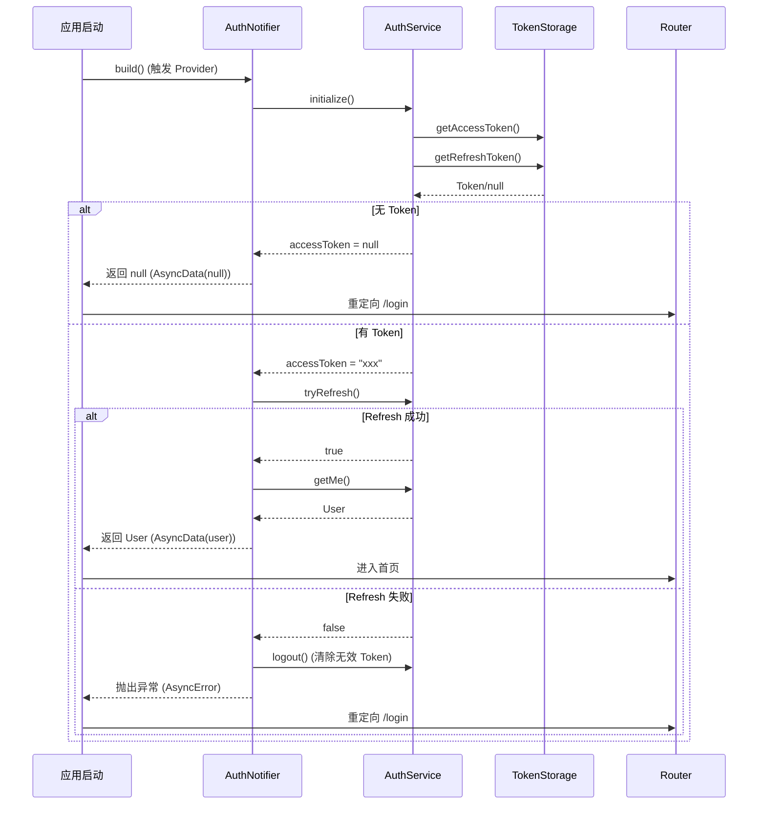

# TASK-008 详细设计 — 认证 Provider

> **作者**: sw-tom (Software Developer)
> **日期**: 2026-05-31
> **状态**: Draft
> **关联任务**: TASK-008（认证 Service + Provider 完善）
> **测试用例**: `log/release_3/test/TASK-008_test_cases.md`（43 项）

---

## 1. 概述

在 TASK-003 已创建的 `AuthService` 之上构建认证状态管理层。本任务使用 **Riverpod 3.x `AutoDisposeAsyncNotifier<User?>`** API，管理全局认证状态，支持会话持久化、Token 自动刷新、应用启动流程。

### 核心状态类型

```dart
// 认证状态通过 AsyncValue<User?> 表达：
// - AsyncLoading<User?>()     — 正在检查会话/登录中/注册中
// - AsyncData<User?>(null)    — 未认证
// - AsyncData<User?>(user)    — 已认证
// - AsyncError<User?>(err,st) — 错误状态
```

---

## 2. 架构图

### 2.1 Provider 依赖关系



### 2.2 AuthNotifier 生命周期



### 2.3 启动流程时序



---

## 3. 文件结构

```
lib/providers/
├── auth_provider.dart       # AuthNotifier + authProvider (新增)
└── services.dart            # authServiceProvider + apiClientProvider (新增)

test/
├── helpers/
│   └── fake_auth_service.dart  # FakeAuthService 测试辅助类 (新增)
└── providers/
    └── auth_notifier_test.dart # 43 个测试用例 (新增)
```

---

## 4. 接口设计

### 4.1 authServiceProvider

```dart
/// AuthService 的 Riverpod Provider
///
/// 提供全局唯一的 AuthService 实例。
/// 在测试中通过 overrideWithValue 注入 FakeAuthService。
final authServiceProvider = Provider<AuthService>((ref) {
  return AuthService(
    baseUrl: 'http://localhost:8080',
    storage: TokenStorage(),
  );
});
```

### 4.2 AuthNotifier

```dart
/// 认证状态管理器
///
/// 使用 Riverpod 3.x AutoDisposeAsyncNotifier<User?> API。
/// 状态通过 AsyncValue<User?> 表达认证生命周期。
class AuthNotifier extends AutoDisposeAsyncNotifier<User?> {
  @override
  Future<User?> build();
  
  /// 登录
  Future<void> login(String email, String password);
  
  /// 注册（注册成功自动登录）
  Future<void> register(String email, String password, [String? username]);
  
  /// 登出
  Future<void> logout();
}

/// Provider 声明
final authProvider = AutoDisposeAsyncNotifierProvider<AuthNotifier, User?>(
  AuthNotifier.new,
);
```

### 4.3 路由守卫

```dart
final routerProvider = Provider<GoRouter>((ref) {
  final authState = ref.watch(authProvider);
  
  return GoRouter(
    initialLocation: '/login',
    redirect: (context, state) {
      final loggedIn = authState.valueOrNull != null;
      final onLogin = state.matchedLocation == '/login';
      final onRegister = state.matchedLocation == '/register';
      
      if (!loggedIn && !onLogin && !onRegister) return '/login';
      if (loggedIn && (onLogin || onRegister)) return '/dashboard';
      return null;
    },
    // ... routes
  );
});
```

---

## 5. 启动流程状态机

| 步骤 | 操作 | 成功 → 状态 | 失败 → 状态 |
|------|------|-------------|-------------|
| 1 | `initialize()` | 继续 | `AsyncData(null)` |
| 2 | `accessToken != null` | 继续 | `AsyncData(null)` |
| 3 | `tryRefresh()` | 继续 | `AsyncError` (并调用 logout) |
| 4 | `getMe()` | `AsyncData(user)` | `AsyncData(null)` |

---

## 6. 错误映射

```dart
String mapError(Object error) {
  if (error is DioException) {
    switch (error.type) {
      case DioExceptionType.connectionTimeout:
      case DioExceptionType.sendTimeout:
      case DioExceptionType.receiveTimeout:
      case DioExceptionType.connectionError:
        return '网络连接失败，请检查网络后重试';
      case DioExceptionType.badResponse:
        return _mapStatusCode(error.response?.statusCode);
      default:
        return '网络异常，请稍后重试';
    }
  }
  return error.toString();
}

String _mapStatusCode(int? statusCode) {
  switch (statusCode) {
    case 401: return '邮箱或密码错误';
    case 409: return '该邮箱已被注册';
    case 422: return '输入数据格式不正确';
    case 500: return '服务暂时不可用，请稍后再试';
    default: return '操作失败，请重试';
  }
}
```

---

## 7. Token 自动刷新

认证成功后，AuthNotifier 使用 `Timer.periodic` 启动 Token 自动刷新：

```dart
Timer? _refreshTimer;

void _startTokenRefresh({int? expiresIn}) {
  final interval = Duration(
    seconds: max((expiresIn ?? 3600) - 300, 60), // 过期前 5 分钟刷新
  );
  
  _refreshTimer?.cancel();
  _refreshTimer = Timer.periodic(interval, (_) async {
    final authService = ref.read(authServiceProvider);
    final refreshed = await authService.tryRefresh();
    if (!refreshed) {
      // Refresh 也过期 → 清除会话
      await logout();
    }
  });
}
```

登出时取消定时器：
```dart
@override
Future<void> logout() async {
  _refreshTimer?.cancel();
  _refreshTimer = null;
  final authService = ref.read(authServiceProvider);
  await authService.logout();
  state = const AsyncData(null);
}
```

dispose 时自动清理：
```dart
@override
void dispose() {
  _refreshTimer?.cancel();
  super.dispose();
}
```

---

## 8. 测试策略

### 8.1 FakeAuthService

`FakeAuthService implements AuthService` 提供完全可控的测试替身：

| 配置参数 | 控制行为 |
|---------|---------|
| `hasToken` | 模拟是否已有 Token |
| `loginFails` | 登录失败 |
| `registerFails` | 注册失败 |
| `refreshFails` | Token 刷新失败 |
| `getMeFails` | 获取用户信息失败 |
| `initializeFails` | 初始化失败 |
| `networkError` | 模拟网络错误 |
| `loginDelay` / `registerDelay` | 模拟延迟 |

### 8.2 测试范围（43 项）

| 类别 | 数 | 用例 ID |
|------|:--:|---------|
| 状态转换 | 4 | TC-001 ~ TC-004 |
| 初始化与会话 | 3 | TC-005 ~ TC-007 |
| login 流程 | 6 | TC-008 ~ TC-013 |
| register 流程 | 4 | TC-014 ~ TC-017 |
| logout 流程 | 3 | TC-018 ~ TC-020 |
| 会话恢复与刷新 | 7 | TC-021 ~ TC-027 |
| Provider API | 2 | TC-028 ~ TC-029 |
| 边界与异常 | 8 | TC-030 ~ TC-037 |
| 集成场景 | 6 | TC-038 ~ TC-043 |

---

## 9. 修改文件清单

| 文件 | 操作 | 说明 |
|------|------|------|
| `lib/providers/auth_provider.dart` | **新建** | AuthNotifier + authProvider |
| `lib/providers/services.dart` | **新建** | authServiceProvider |
| `lib/router/app_router.dart` | **修改** | 路由守卫集成 authProvider |
| `test/helpers/fake_auth_service.dart` | **新建** | 测试辅助类 |
| `test/providers/auth_notifier_test.dart` | **新建** | 43 个测试用例 |

---

## 10. 验证标准

- `flutter analyze --fatal-infos` → 零警告
- `flutter test` → 全部 43 项测试通过
- 路由守卫正确响应认证状态变更
