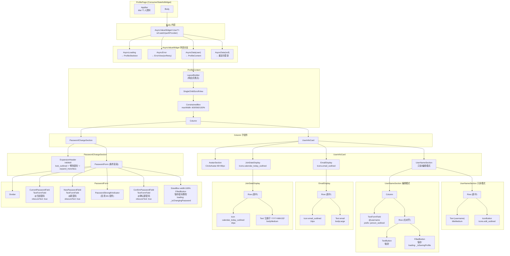
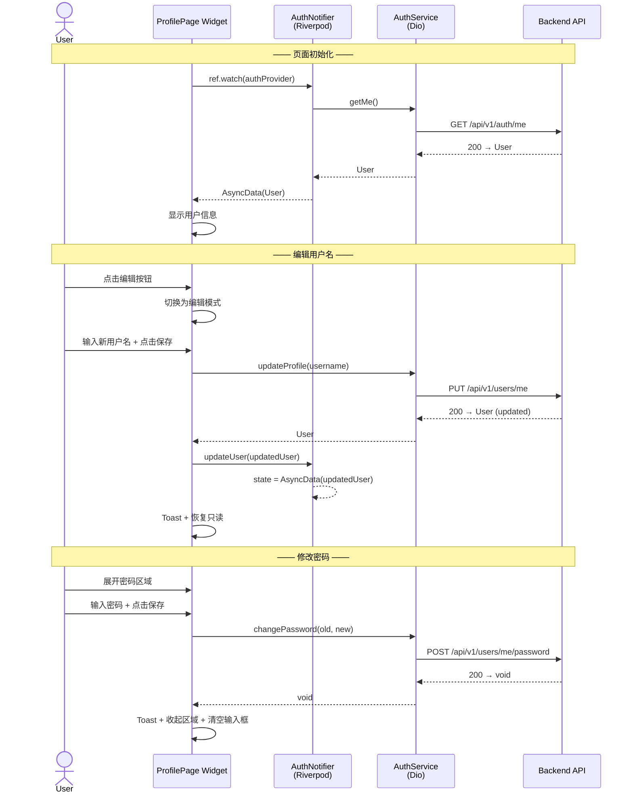

# TASK-011 详细设计 — 个人资料页面

> **作者**: sw-tom (Software Developer)
> **日期**: 2026-05-31
> **状态**: 初稿
> **关联任务**: TASK-011
> **参考文档**: [tasks.md](../tasks.md), [profile_page_spec.md](../ui/specifications/profile_page_spec.md), [reusable_components_spec.md](../ui/specifications/reusable_components_spec.md)
> **上游依赖**: TASK-009（认证状态 TASK-014 合并后）, TASK-007（可复用组件库）

---

## 目录

1. [设计目标](#1-设计目标)
2. [页面状态机](#2-页面状态机)
3. [组件树图](#3-组件树图)
4. [数据流](#4-数据流)
5. [API 依赖](#5-api-依赖)
6. [关键交互逻辑](#6-关键交互逻辑)
7. [文件规划](#7-文件规划)
8. [现有代码差异分析](#8-现有代码差异分析)
9. [验收对照](#9-验收对照)

---

## 1. 设计目标

实现个人资料页面（路由 `/profile`），提供以下功能：

| # | 功能 | 描述 |
|---|------|------|
| 1 | 用户信息展示 | 显示当前用户头像占位、用户名、邮箱、注册时间 |
| 2 | 编辑用户名 | 内联编辑（只读 ↔ 输入框切换），调用 `PUT /api/v1/users/me` |
| 3 | 修改密码 | 可展开区域，输入当前密码 + 新密码 + 确认密码，调用 `POST /api/v1/users/me/password` |
| 4 | 加载/错误处理 | Skeleton 骨架屏、ErrorView 重试、字段级表单验证 |

### 设计原则

- **只读模式为默认**：用户信息卡片以只读方式展示，通过点击编辑按钮切换为编辑模式
- **用户名编辑和密码修改互斥**：同一时间只能进行一个操作（编辑用户名时密码区域禁用，反之亦然）
- **修改密码区域可展开/收起**：默认收起，展开/收起有动画，有未保存修改时收起弹出确认对话框
- **Success/Error 反馈**：操作成功/失败通过 Toast 组件反馈（复用 TASK-007 Toast）
- **响应式**：支持 Mobile / Tablet / Desktop 三档断点

---

## 2. 页面状态机

### 2.1 页面级状态

```
                     ┌──────────┐
                     │  加载中   │
                     └────┬─────┘
                          │ 加载成功
                          ▼
                     ┌──────────┐
              ┌─────▶│  只读    │◀────────────┐
              │      └──┬──┬────┘             │
              │         │  │                  │
              │  编辑用户名│ │展开密码区域       │ 保存成功/取消
              │         │  │                  │
              │         ▼  ▼                  │
              │  ┌──────────┐                 │
              │  │编辑用户名 │  ┌──────────┐   │
              │  │          │  │编辑密码   │   │
              │  └────┬─────┘  └────┬─────┘   │
              │       │             │          │
              │       ▼             ▼          │
              │  ┌──────────┐  ┌──────────┐    │
              │  │ 保存中   │  │ 保存中   │    │
              │  └────┬─────┘  └────┬─────┘    │
              │       │             │           │
              │       ▼             ▼           │
              │  ┌──────────┐  ┌──────────┐     │
              │  │  错误    │  │  错误    │     │
              │  └──────────┘  └──────────┘     │
              │       │             │            │
              └───────┘             └────────────┘
```

| 状态 | 触发条件 | 视觉表现 | 交互限制 |
|------|----------|----------|----------|
| **加载中** | 页面初始化 / authProvider 处于 AsyncLoading | ProfileSkeleton（头像 + 3 行占位 shmmer） | 禁止所有交互 |
| **只读** | 数据加载成功，非编辑/展开状态 | 用户名只读，密码区域收起，编辑按钮可见 | 可点击编辑按钮或展开密码区域 |
| **编辑用户名** | 点击用户名编辑按钮 | 用户名变为 TextFormField，保存/取消按钮出现 | 密码展开按钮禁用 |
| **编辑密码** | 点击密码区域展开按钮 | 密码表单展开，3 个密码输入框 + 强度指示器 + 保存按钮 | 用户名编辑按钮禁用 |
| **保存中（用户名）** | 点击用户名保存按钮 | 保存按钮 CircularProgressIndicator，输入框禁用 | 禁止输入和取消 |
| **保存中（密码）** | 点击密码保存按钮 | 保存按钮 CircularProgressIndicator，所有密码输入框禁用 | 禁止输入 |
| **成功** | API 返回 200 | Toast 成功反馈 → 回到只读状态 | — |
| **错误** | API 返回错误 | 字段错误（输入框下方）/ 全局错误（SnackBar/Toast Error） | 可修正后重试 |

**约束**: 编辑用户名和编辑密码互斥，不允许同时操作。

### 2.2 用户名编辑子状态

```
     ┌─────────┐
     │  初始   │  ← 进入编辑模式，输入框显示当前用户名并全选
     └────┬────┘
          │ 用户输入
          ▼
     ┌──────────┐
     │  输入中   │  ← 实时验证，保存按钮可用性随合法性变更
     └────┬─────┘
          │ 验证失败
          ▼
     ┌──────────┐
     │  无效    │  ← 输入框 Error 状态，底部显示错误文字
     └────┬─────┘
          │ 用户修正
          ▼
     ┌──────────┐     点击保存     ┌──────────┐
     │  输入中   │ ────────────────▶│ 提交中   │
     └──────────┘                  └────┬─────┘
                                        │
                          ┌─────────────┼─────────────┐
                          ▼             ▼             ▼
                    ┌──────────┐   ┌──────────┐  ┌──────────┐
                    │  成功    │   │  失败    │  │  取消    │
                    │ Toast +  │   │ 保留输入  │  │ 恢复只读  │
                    │ 恢复只读  │   │ 显示错误  │  │          │
                    └──────────┘   └────┬─────┘  └──────────┘
                                        │ 用户修正
                                        ▼
                                   ┌──────────┐
                                   │  输入中   │
                                   └──────────┘
```

### 2.3 密码修改子状态

```
   ┌──────────┐  点击展开   ┌──────────┐  展开动画完成  ┌──────────┐
   │  收起    │ ──────────▶│ 展开中   │ ─────────────▶│  展开    │
   └──────────┘             └──────────┘               └────┬─────┘
        ▲                                                     │ 用户输入
        │ 收起动画完成                                         ▼
   ┌──────────┐                                           ┌──────────┐
   │ 收起中   │                                           │  输入中   │
   └────┬─────┘                                           └────┬─────┘
        │                                                      │ 验证失败
        │ 成功自动收起                                          ▼
        │                                               ┌──────────┐
        │                                               │  无效    │
        │                                               └────┬─────┘
        │                                                     │ 用户修正
        │                                                     ▼
        │                                               ┌──────────┐
        │点击收起/有未保存时弹出ConfirmDialog              │  输入中   │
        │◀──────────────────────────────────────────────└────┬─────┘
        │                                                     │ 点击保存
        │                                                     ▼
        │                                               ┌──────────┐
        │                                               │ 提交中   │
        │                                               └────┬─────┘
        │                                          ┌──────────┼──────────┐
        │                                          ▼          ▼          ▼
        │                                    ┌──────────┐ ┌──────────┐ ┌──────────┐
        │                                    │  成功    │ │  失败    │ │  取消    │
        └────────────────────────────────────│ Toast +   │ │ 保留输入  │ │ 关闭动画  │
                                             │ 自动收起  │ │ 显示错误  │ │          │
                                             └──────────┘ └──────────┘ └──────────┘
```

| 子状态 | 触发条件 | 视觉表现 |
|--------|----------|----------|
| **收起** | 默认状态 / 修改密码成功 | 仅显示锁图标 + "修改密码" + 展开箭头 |
| **展开中** | 点击展开头部 | 图标旋转 180° (200ms, ease-out)，内容高度从 0 → auto (200ms, ease-out) |
| **展开** | 动画完成 | 3 个密码输入框可见 |
| **输入中** | 用户输入任意密码框 | 实时验证，强度指示器更新 |
| **无效** | 任一字段不满足验证规则 | 对应输入框 Error 状态 + 错误文字 |
| **提交中** | 点击保存按钮 | 按钮 Loading，所有输入框禁用 |
| **成功** | API 返回 200 | Toast "密码修改成功，请使用新密码登录"，自动收起，清空所有密码框 |
| **失败** | API 返回错误 | 字段级错误（当前密码错误）或全局错误 SnackBar |
| **收起中** | 点击收起 / 保存成功 | 高度 auto → 0 (200ms, ease-in)，图标旋转回 0° |

---

## 3. 组件树图

### 3.1 组件层次结构



### 3.2 组件职责矩阵

| 组件 | 状态量 | 通知量 | 职责 |
|------|--------|--------|------|
| **ProfilePage** | `_isSavingProfile`, `_isChangingPassword`, `_passwordSectionExpanded` | ref.read(authProvider.notifier) | 页面根组件，管理编辑/保存状态 |
| **ProfileSkeleton** | 无 | 无 | shimmer 骨架屏，模拟最终布局 |
| **UserInfoCard** | 无（纯展示） | 无 | 显示用户信息卡片 |
| **AvatarSection** | 无（纯展示） | 无 | 头像占位（后续可扩展头像上传） |
| **UserNameSection** | `_usernameController` (TextEditingController) | `_saveProfile()` | 用户名只读/编辑切换 |
| **PasswordChangeSection** | 三个 password Controller | `_changePassword()` | 密码修改区域展开/收起 |
| **PasswordStrengthIndicator** | 密码强度等级 | 无 | 实时密码强度反馈 |

---

## 4. 数据流

### 4.1 用户操作 → Provider → Service → API

#### 流程 1：页面初始化（加载用户信息）

```
ProfilePage.build()
  │
  ├── ref.watch(authProvider)
  │     │
  │     ├── AsyncLoading
  │     │     └── ProfileSkeleton 显示
  │     │
  │     ├── AsyncData(user) ← AuthNotifier.build()
  │     │     │                      │
  │     │     │                      ├── AuthService.initialize()
  │     │     │                      │     └── TokenStorage.getAccessToken()
  │     │     │                      │
  │     │     │                      ├── AuthService.tryRefresh()
  │     │     │                      │     └── POST /api/v1/auth/refresh
  │     │     │                      │
  │     │     │                      └── AuthService.getMe()
  │     │     │                            └── GET /api/v1/auth/me
  │     │     │                                  → User {id, email, username, createdAt, ...}
  │     │     │
  │     │     └── UserNameSection 显示
  │     │           _usernameController.text = user.username
  │     │
  │     └── AsyncError
  │           └── ErrorView(onRetry: ref.invalidate(authProvider))
  │
  └── 同步 _usernameController（build 中监听）
```

#### 流程 2：编辑用户名

```
User 点击编辑按钮 (Icons.edit_outlined)
  │
  ├── setState: UserNameSection 从只读模式切换为编辑模式
  │     └── TextFormField 自动聚焦 + 全选当前用户名
  │
  ├── User 输入新用户名
  │     └── Form.validate() 实时检查（3-30 字符，字母/数字/_-）
  │           ├── 合法 → 保存按钮可用
  │           └── 非法 → 保存按钮不可用，显示错误文字
  │
  ├── User 点击保存按钮 / 按 Enter
  │     │
  │     ├── Form.validate() → 通过
  │     ├── setState: _isSavingProfile = true
  │     │     └── 保存按钮 → CircularProgressIndicator
  │     │
  │     ├── ref.read(authServiceProvider).updateProfile(username: trimmed)
  │     │     │
  │     │     └── PUT /api/v1/users/me { username: "newName" }
  │     │           │
  │     │           ├── 200 OK → User { ... username: "newName" ... }
  │     │           └── 4xx/5xx → DioException
  │     │
  │     ├── [成功] ref.read(authProvider.notifier).updateUser(updatedUser)
  │     │     └── state = AsyncData(current.copyWith(username: updatedUser.username))
  │     │
  │     ├── [成功] showSuccessToast("用户名修改成功")
  │     ├── [成功] setState: _isSavingProfile = false, 恢复只读模式
  │     │
  │     └── [失败] setState: _isSavingProfile = false
  │           └── showErrorSnackBar(_mapProfileError(e))
  │
  └── User 点击取消按钮 / 按 Escape
        └── setState: 恢复只读模式，不保存
```

#### 流程 3：修改密码

```
User 点击 "修改密码" 展开头部
  │
  ├── setState: _passwordSectionExpanded = true
  │     └── 展开动画 (200ms ease-out)
  │           ├── expand_more → expand_less 旋转
  │           └── 内容高度 0 → auto
  │
  ├── User 输入当前密码 / 新密码 / 确认新密码
  │     ├── 当前密码: 非空验证
  │     ├── 新密码: 长度 ≥ 8, 至少 2 种字符类型
  │     │     └── PasswordStrengthIndicator 实时更新
  │     └── 确认新密码: 必须与新密码一致
  │
  ├── User 点击保存按钮 / 在确认密码框按 Enter
  │     │
  │     ├── _passwordFormKey.currentState!.validate() → 通过
  │     ├── setState: _isChangingPassword = true
  │     │
  │     ├── ref.read(authServiceProvider).changePassword(
  │     │     oldPassword: _oldPasswordController.text,
  │     │     newPassword: _newPasswordController.text,
  │     │   )
  │     │     │
  │     │     └── POST /api/v1/users/me/password
  │     │           { old_password: "...", new_password: "..." }
  │     │           │
  │     │           ├── 200 OK → void
  │     │           └── 4xx/5xx → DioException
  │     │                 ├── 400 → "当前密码不正确"
  │     │                 └── 500 → "服务暂时不可用"
  │     │
  │     ├── [成功]
  │     │     ├── _oldPasswordController.clear()
  │     │     ├── _newPasswordController.clear()
  │     │     ├── _confirmPasswordController.clear()
  │     │     ├── setState: _isChangingPassword = false
  │     │     ├── setState: _passwordSectionExpanded = false (收起动画)
  │     │     └── showSuccessToast("密码修改成功，请使用新密码登录")
  │     │
  │     └── [失败]
  │           ├── setState: _isChangingPassword = false
  │           └── showErrorSnackBar(_mapProfileError(e))
  │
  └── 收起时如果有未保存输入
        └── showConfirmDialog("放弃修改？")
              ├── 确认 → 收起区域，清空输入
              └── 取消 → 保持展开状态
```

### 4.2 数据流方向图



---

## 5. API 依赖

### 5.1 现有 API 端点

| 操作 | HTTP 方法 | 路径 | 当前实现 | 设计建议 |
|------|-----------|------|----------|----------|
| 获取当前用户 | GET | `/api/v1/auth/me` | `AuthService.getMe()` → `User` | 保持现状（通过 `authProvider.build()` 自动调用） |
| 更新用户名 | PUT | `/api/v1/users/me` | `AuthService.updateProfile(username)` → `User` | 保持现状；UI spec 标注为 `PATCH`，但实际为 `PUT`，已适配 |
| 修改密码 | POST | `/api/v1/users/me/password` | `AuthService.changePassword(oldPassword, newPassword)` → `void` | 保持现状；UI spec 标注为 `PATCH`，但实际为 `POST`，已适配 |

### 5.2 请求/响应结构

#### PUT `/api/v1/users/me` — 更新用户名

**请求体**:
```json
{
  "username": "new_username_123"
}
```

**成功响应 (200)**:
```json
{
  "code": 0,
  "message": "ok",
  "data": {
    "id": "uuid-string",
    "email": "user@example.com",
    "username": "new_username_123",
    "avatar_url": null,
    "status": "active",
    "created_at": "2024-01-15T08:00:00Z",
    "updated_at": "2026-05-31T10:00:00Z"
  }
}
```

**错误响应 (422)**:
```json
{
  "code": 422,
  "message": "Username already taken",
  "data": null
}
```

#### POST `/api/v1/users/me/password` — 修改密码

**请求体**:
```json
{
  "old_password": "current_password",
  "new_password": "NewPassword123"
}
```

**成功响应 (200)**:
```json
{
  "code": 0,
  "message": "ok",
  "data": null
}
```

**错误响应 (400)**:
```json
{
  "code": 400,
  "message": "Current password is incorrect",
  "data": null
}
```

**错误响应 (422)**:
```json
{
  "code": 422,
  "message": "New password must be at least 8 characters",
  "data": null
}
```

### 5.3 错误映射

| HTTP 状态码 | 后端消息 | UI 显示文案 | 适用操作 |
|-------------|----------|-------------|----------|
| 400 | Current password is incorrect | "当前密码不正确，请重新输入" | 修改密码 |
| 401 | Unauthorized | "登录已过期，请重新登录" | 两者 |
| 422 | Username already taken | "该用户名已被使用" | 编辑用户名 |
| 422 | 格式错误 | "输入数据格式不正确" | 两者 |
| 500/502/503 | Internal server error | "服务暂时不可用，请稍后重试" | 两者 |
| 超时/断网 | — | "网络连接异常，请检查网络后重试" | 两者 |

---

## 6. 关键交互逻辑

### 6.1 表单验证规则

#### 用户名验证

| 规则 | 条件 | 错误消息 |
|------|------|----------|
| 必填 | `value.trim().isEmpty` | "请输入用户名" |
| 长度 | `value.trim().length < 3 \|\| > 30` | "用户名长度需在 3-30 字符之间" |
| 字符集 | `!RegExp(r'^[a-zA-Z0-9_-]+$').hasMatch(value)` | "用户名仅允许字母、数字、下划线、连字符" |
| 未变更 | `value.trim() == currentUsername` | 不视为错误但禁用保存按钮 |

#### 密码验证

| 字段 | 规则 | 错误消息 |
|------|------|----------|
| 当前密码 | 非空 | "请输入当前密码" |
| 新密码 | 非空 | "请输入新密码" |
| 新密码 | 长度 ≥ 8 | "密码长度至少 8 位" |
| 新密码 | 至少包含字母和数字 | "密码需包含字母和数字" |
| 确认新密码 | 非空 | "请确认新密码" |
| 确认新密码 | 与新密码一致 | "两次输入的密码不一致" |

### 6.2 编辑用户名交互细节

| 操作 | 行为 | 实现方式 |
|------|------|----------|
| **点击编辑按钮** | 从只读切换为编辑模式 | `setState` 切换标志位，AnimatedOpacity 过渡 150ms |
| **输入框自动聚焦** | FocusNode.requestFocus() | 在切换为编辑模式时调用 |
| **全选文本** | TextField 全选 | 在焦点获得后调用 `_usernameController.selection = TextSelection(baseOffset: 0, extentOffset: text.length)` |
| **Enter 提交** | 触发保存 | `onFieldSubmitted: (_) => _saveProfile()` |
| **Escape 取消** | 取消编辑 | FocusNode 监听 KeyEvent.onKeyDown |
| **点击取消** | 恢复只读，不保存 | `setState` 切换标志位，不清除 Controller 内容 |
| **保存按钮可用性** | 输入合法且非原值 | `_isSavingProfile ? null : _saveProfile` + `validator` 控制 |
| **保存成功** | Toast + 恢复只读 | `_showSuccessToast` + `setState` |
| **保存失败** | 保留编辑状态 + 错误 SnackBar | `_showErrorSnackBar`，不切换标志位 |

### 6.3 密码区域交互细节

| 操作 | 行为 | 实现方式 |
|------|------|----------|
| **点击展开** | 切换 `_passwordSectionExpanded` | `setState`，AnimatedCrossFade / AnimatedSize 控制展开 200ms |
| **展开动画** | 图标 180° 旋转 + 内容展开 | `RotationTransition` + `AnimatedSize` |
| **新密码实时验证** | 更新强度指示器 | `_newPasswordController.addListener` → `_updatePasswordStrength` |
| **确认密码实时验证** | 不一致时显示提示 | 比较 `_confirmPasswordController.text == _newPasswordController.text` |
| **保存按钮可用性** | 三个输入框均合法 | 依赖 `_passwordFormKey.currentState!.validate()` 和 `_isChangingPassword` |
| **保存成功** | Toast + 收起 + 清空 | `_oldPasswordController.clear()` + `setState(() => _passwordSectionExpanded = false)` |
| **保存失败** | 保留展开 + 错误提示 | 4xx 字段错误显示在输入框下方，5xx 全局 SnackBar |
| **收起时未保存检查** | 是否有输入内容 | 检查三个 Controller 是否非空 |
| **未保存确认对话框** | 弹出 ConfirmDialog | 复用 TASK-007 ConfirmDialog |
| **Enter 提交** | 对焦在确认密码框时触发 | `onFieldSubmitted: (_) => _changePassword()` |

### 6.4 键盘快捷键

| 按键 | 编辑用户名模式 | 密码编辑模式 | 只读模式 |
|------|---------------|-------------|----------|
| **Enter** | 保存用户名 | 在确认密码框触发保存 | — |
| **Escape** | 取消编辑 | 收起密码区域（如有未保存则弹出确认） | — |
| **Tab** | 输入框 ↔ 取消 ↔ 保存 | 按顺序遍历 4 个输入框 → 保存按钮 | 编辑按钮 → 展开头部 |

### 6.5 响应式断点

```dart
// 复用 M1 认证页断点
static const double breakpointMobile = 600.0;
static const double breakpointTablet = 1024.0;
```

| 属性 | Mobile (< 600px) | Tablet (600-1024px) | Desktop (> 1024px) |
|------|:----------------:|:-------------------:|:------------------:|
| 卡片 maxWidth | 100% | 560px | 600px |
| 卡片内边距 | 24px | 32px | 32px |
| 卡片圆角 | 0 | 12px | 12px |
| 卡片阴影 | 无 | elevation1 | elevation2 |
| 头像尺寸 | 64px | 72px | 80px |
| 页面顶部间距 | 24px | 48px | 48px |

### 6.6 Toast 反馈设计

| 操作 | 类型 | 文案 | 显示时长 |
|------|------|------|----------|
| 编辑用户名成功 | Success | "用户名修改成功" | 3s |
| 编辑用户名失败 | Error | 根据错误类型动态 | 5s |
| 修改密码成功 | Success | "密码修改成功，请使用新密码登录" | 3s |
| 修改密码失败（当前密码错误） | Error | "当前密码不正确，请重新输入" | 5s |
| 修改密码失败（网络错误） | Error | "网络连接异常，请检查网络后重试" | 5s |
| 修改密码失败（服务端错误） | Error | "服务暂时不可用，请稍后重试" | 5s |

---

## 7. 文件规划

### 7.1 新文件

| 文件路径 | 说明 | 优先级 |
|----------|------|--------|
| `lib/pages/profile/profile_page.dart` | 个人资料页面主组件 | P0 |
| `lib/pages/profile/widgets/user_info_card.dart` | 用户信息卡片组件 | P0 |
| `lib/pages/profile/widgets/password_change_section.dart` | 密码修改区域组件 | P0 |
| `lib/pages/profile/widgets/profile_skeleton.dart` | 个人资料骨架屏 | P1 |

### 7.2 修改文件

| 文件路径 | 修改内容 | 说明 |
|----------|----------|------|
| `lib/router/router.dart` | 添加 `/profile` 路由 | 配置路由和导航栏入口 |
| `lib/providers/auth_provider.dart` | 无需修改（已有 `updateUser`） | 复用现有方法 |
| `lib/services/auth_service.dart` | 无需修改（已有 `updateProfile` / `changePassword`） | 复用现有方法 |

### 7.3 路由配置

在 `lib/router/router.dart` 中添加：

```dart
// 个人资料页 — 需要认证
GoRoute(
  path: '/profile',
  name: 'profile',
  builder: (context, state) => const ProfilePage(),
  // 通过 ShellRoute 或 redirect 确保已认证
),
```

导航栏入口（导航栏下拉菜单）:
```dart
// "个人资料" 菜单项 → context.goNamed('profile')
```

---

## 8. 现有代码差异分析

### 8.1 `settings_page.dart` → `profile_page.dart` 迁移要点

当前 `settings_page.dart` 已实现核心功能，重构为 `profile_page.dart` 时需要：

| 当前实现 | 目标设计 | 变更说明 |
|----------|----------|----------|
| 本地 `_isSavingProfile` / `_isChangingPassword` | 保持本地状态 | 不需要 provider 级别状态，本地 setState 即可 |
| SnackBar 反馈 | 复用 TASK-007 Toast 组件 | SnackBar → Toast（可复用组件库规范） |
| 密码区域简单展开/收起 | 密码区域展开/收起动画 + 未保存确认 | 增加 AnimatedCrossFade / AnimatedSize + ConfirmDialog |
| 无 Enter/Escape 键盘处理 | Enter 提交 / Escape 取消 | FocusNode + KeyEvent 监听 |
| 无密码强度指示器 | 密码强度指示器（复用 M1） | 增加 PasswordStrengthIndicator |
| 用户名常驻编辑模式 | 只读/编辑模式切换 | 增加只读用户名显示 + 编辑按钮 |
| 无头像区域 | 头像占位 CircleAvatar | 增加 AvatarSection |
| `_buildInfoRow` 通用组件 | EmailDisplay / JoinDateDisplay 专用组件 | 拆分专用组件 |
| 全局用户名字段同步 | 通过 build 内 ref.listen 同步 | 保持现有模式 |

### 8.2 Service/Provider 复用

| 组件 | 状态 | 操作 |
|------|------|------|
| `AuthService.updateProfile()` | ✅ 可直接复用 | 无变更 |
| `AuthService.changePassword()` | ✅ 可直接复用 | 无变更 |
| `AuthNotifier.updateUser()` | ✅ 可直接复用 | 无变更 |
| `authProvider` (`AsyncNotifierProvider<AuthNotifier, User?>`) | ✅ 可直接复用 | 作为数据源 |

### 8.3 建议保留的现有逻辑

- `_mapProfileError()` 方法（保持完整的 DioException 映射）
- `_saveProfile()` 流程（直接复用，仅将 SnackBar 替换为 Toast）
- `_changePassword()` 流程（直接复用，仅将 SnackBar 替换为 Toast）

---

## 9. 验收对照

| # | 验收项 | 对应实现 | 验证方式 |
|---|--------|----------|----------|
| 1 | 页面加载显示 Skeleton 骨架屏 | `ProfileSkeleton` + `AsyncValueWidget` | 视觉检查 + 慢网络测试 |
| 2 | 加载成功显示用户信息卡片 | `UserInfoCard` (头像/用户名/邮箱/注册时间) | 视觉检查 |
| 3 | 加载失败显示 ErrorView 可重试 | `ErrorView(onRetry: ref.invalidate(authProvider))` | 断网测试 |
| 4 | 用户名只读显示 + 编辑按钮 | `UserNameSection` 只读模式 | 视觉检查 |
| 5 | 点击编辑按钮切换为编辑模式 | `setState` 切换标志位 + AnimatedOpacity | 交互测试 |
| 6 | 编辑模式输入框自动聚焦全选 | `FocusNode.requestFocus()` + `TextSelection` | 交互测试 |
| 7 | 输入框实时验证（长度、字符） | `FormValidator` | 输入测试 |
| 8 | 保存按钮在输入非法时禁用 | `onPressed: _isSavingProfile ? null : _saveProfile` | 边界测试 |
| 9 | Enter 触发送保存 | `onFieldSubmitted` | 键盘测试 |
| 10 | Escape 取消编辑 | `KeyEvent.onKeyDown` | 键盘测试 |
| 11 | 保存成功 Toast + 恢复只读 | `Toast.show(success)` + `setState` | 交互测试 |
| 12 | 保存失败保留编辑状态 | 不切换标志位，显示错误 | 错误场景测试 |
| 13 | 密码区域默认收起 | `_passwordSectionExpanded = false` | 视觉检查 |
| 14 | 展开/收起动画 200ms | AnimatedCrossFade / AnimatedSize | 动效检查 |
| 15 | 密码强度指示器实时更新 | `_newPasswordController.addListener` | 交互测试 |
| 16 | 确认密码实时一致性验证 | 监听器比较两个 Controller | 交互测试 |
| 17 | 密码保存成功 Toast + 自动收起 | `Toast.show(success)` + `setState` | 交互测试 |
| 18 | 当前密码错误时显示明确错误 | `_mapProfileError` 400 映射 | 错误场景测试 |
| 19 | 有未保存输入时收起弹出确认 | `ConfirmDialog` | 交互测试 |
| 20 | 响应式布局（三档断点） | `LayoutBuilder` + `ConstrainedBox` | 缩放窗口测试 |
| 21 | 编辑用户名和修改密码互斥 | 编辑时另一区域按钮禁用 | 交互测试 |
| 22 | `flutter analyze --fatal-infos` 零警告 | 所有文件 | 静态分析 |

---

## 附录：密码强度指示器复用说明

密码强度指示器复用自 M1 认证页面的现有组件。复用方式：

```dart
// 假设 M1 组件路径: lib/widgets/password_strength_indicator.dart
// 使用方式：
const PasswordStrengthIndicator(
  password: _newPasswordController.text,
);

// 或通过继承/扩展
```

如果 M1 组件以函数/Widget 形式存在，直接 import 并在 `NewPasswordField` 下方渲染。
如果 M1 组件不存在或无法直接复用，则在 `password_change_section.dart` 中内联实现简单的三段式强度指示器（弱/中/强）。

**判断标准**：在开发阶段检查 `lib/widgets/` 目录下是否存在密码强度指示器组件。若存在则直接复用；若不存在则在密码区域组件中内联实现。

---

**文档结束**
