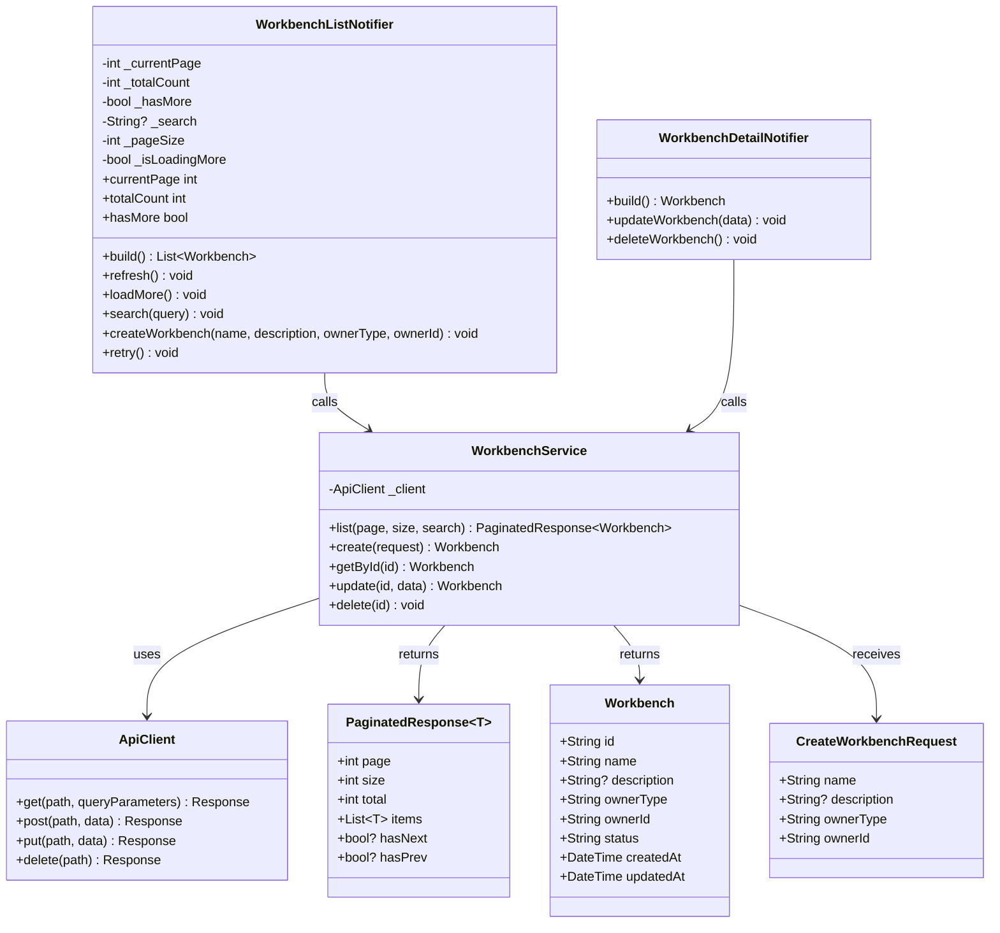
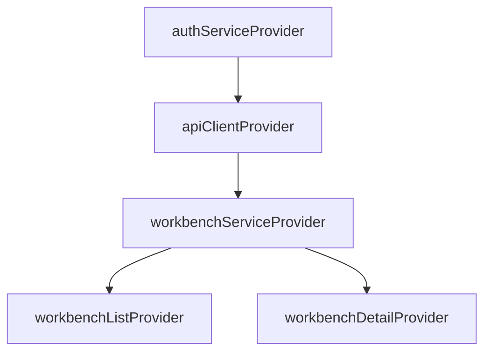
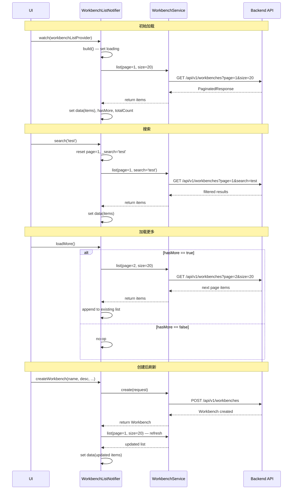
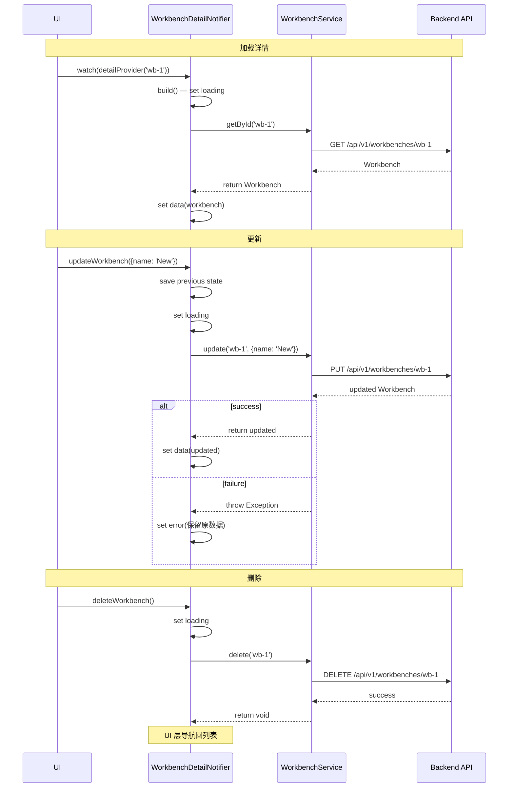

# TASK-012 详细设计：工作台 Service + Provider

## 文档信息

| 属性 | 内容 |
|------|------|
| **任务 ID** | TASK-012 |
| **任务名称** | 工作台 Service + Provider |
| **Sprint** | Sprint 3 — M4 工作台管理 |
| **依赖** | TASK-006 (ApiClient), TASK-007 (ErrorInterceptor), TASK-008 (AuthInterceptor), Workbench 模型 |
| **测试用例** | `log/release_3/test/TASK-012_test_cases.md` (48 项) |
| **后端 API** | `GET/POST /api/v1/workbenches`, `GET/PUT /api/v1/workbenches/{id}`, `DELETE /api/v1/workbenches/{id}` |
| **日期** | 2026-05-31 |
| **状态** | 待评审 |

---

## 1. 设计概述

### 1.1 职责

实现工作台（Workbench）的 Service 层和 Riverpod Provider 层，提供：

| 层 | 职责 |
|----|------|
| **WorkbenchService** | 封装 HTTP 请求，解析 API 响应，返回类型安全的数据模型 |
| **WorkbenchListNotifier** | 管理工作台列表状态：加载、分页、搜索、刷新、错误恢复 |
| **WorkbenchDetailNotifier** | 管理工作台详情状态：加载、更新、删除、错误处理 |
| **Provider** | 通过 Riverpod 3.x Provider 注册，支持依赖注入和测试 override |

### 1.2 类图



---

## 2. WorkbenchService 设计

### 2.1 接口定义

```dart
class WorkbenchService {
  WorkbenchService(this._client);
  final ApiClient _client;

  /// 获取工作台列表（分页）
  /// [page] 页码，从 1 开始
  /// [size] 每页条数，默认 20
  /// [search] 搜索关键字（可选）
  Future<PaginatedResponse<Workbench>> list({
    int page = 1,
    int size = 20,
    String? search,
  });

  /// 创建工作台
  Future<Workbench> create(CreateWorkbenchRequest request);

  /// 获取工作台详情
  Future<Workbench> getById(String id);

  /// 更新工作台
  /// [data] 支持部分更新，只包含需要更新的字段
  Future<Workbench> update(String id, Map<String, dynamic> data);

  /// 删除工作台
  Future<void> delete(String id);
}
```

### 2.2 API 调用映射

| Service 方法 | HTTP 方法 | 路径 | 请求参数 | 返回类型 |
|-------------|-----------|------|---------|---------|
| `list()` | GET | `/api/v1/workbenches` | query: page, size, search | `PaginatedResponse<Workbench>` |
| `create()` | POST | `/api/v1/workbenches` | body: CreateWorkbenchRequest JSON | `Workbench` |
| `getById()` | GET | `/api/v1/workbenches/{id}` | — | `Workbench` |
| `update()` | PUT | `/api/v1/workbenches/{id}` | body: Map<String, dynamic> JSON | `Workbench` |
| `delete()` | DELETE | `/api/v1/workbenches/{id}` | — | `void` |

### 2.3 响应解析

所有 API 响应遵循统一格式：
```json
{
  "code": 200,
  "message": "success",
  "data": { ... }
}
```

分页响应 data 格式：
```json
{
  "page": 1,
  "size": 20,
  "total": 42,
  "items": [...],
  "has_next": true,
  "has_prev": false
}
```

解析流程：
1. 调用 `ApiClient` 方法获取 `Response<dynamic>`
2. 使用 `ApiResponse<T>.fromJson()` 解析外层统一响应
3. 使用 `PaginatedResponse<T>.fromJson()` 或 `Workbench.fromJson()` 解析 data

### 2.4 错误处理

Service 不捕获异常 —— 由 ErrorInterceptor 统一处理：
- 网络错误 → `DioException` (connectionError, timeout)
- HTTP 4xx/5xx → `DioException` (badResponse with statusCode)
- 解析错误 → `FormatException` / `TypeError`

Provider 层负责捕获异常并映射为用户可读错误消息。

---

## 3. Provider 设计

### 3.1 Provider 注册



### 3.2 WorkbenchListNotifier

**状态管理**：
- 类型: `AsyncNotifier<List<Workbench>>`
- 内部维护 `_currentPage`, `_totalCount`, `_hasMore`, `_search`, `_pageSize`
- build() 初始化加载第 1 页

**方法**：

| 方法 | 触发条件 | 行为 | 状态转换 |
|------|---------|------|---------|
| `build()` | Provider 首次创建 | 调用 list(page=1) | loading → data/error |
| `refresh()` | 显式刷新或创建成功后 | 重置 page=1，重新 build | loading → data/error |
| `loadMore()` | 滚动到底部 | page++，追加数据 | data → loading → data |
| `search(query)` | 用户输入搜索 | 重置 page=1，设置 search 参数 | loading → data/error |
| `createWorkbench(...)` | 用户提交创建 | 调用 create() → 成功后 refresh() | loading → data/error |
| `retry()` | 用户点击重试 | 同 refresh() | loading → data/error |

**状态序列图**：



### 3.3 WorkbenchDetailNotifier

**状态管理**：
- 类型: `AsyncNotifierProvider.family<WorkbenchDetailNotifier, Workbench, String>`
- family 参数: 工作台 ID

**方法**：

| 方法 | 触发条件 | 行为 | 状态转换 |
|------|---------|------|---------|
| `build()` | Provider 首次创建 | 调用 getById(arg) | loading → data/error |
| `updateWorkbench(data)` | 用户提交更新 | 调用 update(arg, data) | loading → data/error |
| `deleteWorkbench()` | 用户确认删除 | 调用 delete(arg) | loading → 完成 |

**状态序列图**：



---

## 4. 数据流设计

### 4.1 列表数据流

```
User Action → Widget → Provider Method → Service Method → ApiClient → HTTP
                              ↑                                  ↓
                         AsyncValue                          Response
                              ↑                                  ↓
                         State Update ←—— Data Parsing ←—— JSON
```

### 4.2 测试注入机制

```dart
// 生产环境
final container = ProviderContainer(overrides: []);
final list = await container.read(workbenchListProvider.future);

// 测试环境 — 注入 FakeWorkbenchService
final container = ProviderContainer(overrides: [
  workbenchServiceProvider.overrideWithValue(fakeService),
]);
```

---

## 5. 分页设计

### 5.1 分页状态

| 属性 | 类型 | 说明 | 初始值 |
|------|------|------|--------|
| `_currentPage` | int | 当前页 | 1 |
| `_totalCount` | int | 总记录数 | 0 |
| `_hasMore` | bool | 是否还有更多 | false |
| `_pageSize` | int | 每页大小 | 20 |
| `_search` | String? | 搜索关键字 | null |

### 5.2 页面计算

```dart
// 判断是否有下一页
_hasMore = response.hasNext ?? (response.page * response.size < response.total);

// 追加数据时
_currentPage++;
// 若失败，回滚页码
_currentPage--;
```

### 5.3 并发控制

```dart
// loadMore 防并发
if (_isLoadingMore || !_hasMore) return;
_isLoadingMore = true;
try { ... } finally { _isLoadingMore = false; }

// createWorkbench 防并发 — 通过 AsyncNotifier 自身的 loading 状态
```

---

## 6. API Client Provider 注册

新增 `apiClientProvider` 用于提供全局 ApiClient 实例：

| Provider | 类型 | 依赖 |
|----------|------|------|
| `apiClientProvider` | `Provider<ApiClient>` | `authServiceProvider`, `ErrorInterceptor` |
| `workbenchServiceProvider` | `Provider<WorkbenchService>` | `apiClientProvider` |

```dart
final apiClientProvider = Provider<ApiClient>((ref) {
  final authInterceptor = AuthInterceptor(ref.read(authServiceProvider));
  final errorInterceptor = ErrorInterceptor();
  return ApiClient(
    baseUrl: 'http://localhost:8080',
    authInterceptor: authInterceptor,
    errorInterceptor: errorInterceptor,
  );
});

final workbenchServiceProvider = Provider<WorkbenchService>((ref) {
  return WorkbenchService(ref.read(apiClientProvider));
});
```

---

## 7. 错误映射

Provider 层捕获 `DioException` 并映射为用户可读消息：

| DioException 类型 | HTTP 状态码 | 用户消息 |
|-------------------|-------------|---------|
| connectionTimeout | — | 连接超时，请检查网络 |
| connectionError | — | 网络错误，请检查连接 |
| badResponse | 400 | 请求参数有误，请检查输入 |
| badResponse | 401 | 登录已过期，请重新登录 |
| badResponse | 404 | 请求的资源不存在或已被删除 |
| badResponse | 500 | 服务器内部错误，请稍后重试 |

Provider 层使用 `AsyncValue.guard()` 和 try-catch 模式：

```dart
// 成功路径
state = await AsyncValue.guard(() => _fetchData());

// 错误路径（手动控制）
try {
  final data = await service.method();
  state = AsyncData(data);
} catch (e, st) {
  state = AsyncError(_mapError(e), st);
}
```

---

## 8. 文件结构

```
lib/
├── services/
│   ├── api_client.dart          (已有)
│   ├── auth_interceptor.dart    (已有)
│   ├── auth_service.dart        (已有)
│   ├── error_interceptor.dart   (已有)
│   ├── token_storage.dart       (已有)
│   └── workbench_service.dart   (新增) — WorkbenchService
│
└── providers/
    ├── auth_provider.dart       (已有)
    ├── services.dart            (修改) — 添加 apiClientProvider, workbenchServiceProvider
    ├── settings_provider.dart   (已有)
    └── workbench_provider.dart  (新增) — WorkbenchListNotifier, WorkbenchDetailNotifier
```

---

## 9. 测试策略

| 测试类型 | 使用 Fake | 覆盖范围 |
|---------|-----------|---------|
| Service 单元测试 | FakeWorkbenchService | 14 个 TC (TC-S01 ~ TC-S14) |
| ListNotifier 测试 | FakeWorkbenchService + ProviderContainer | 15 个 TC (TC-P01 ~ TC-P15) |
| DetailNotifier 测试 | FakeWorkbenchService + ProviderContainer | 13 个 TC (TC-P16 ~ TC-P28) |
| 集成测试 | FakeWorkbenchService | 6 个 TC (TC-I01 ~ TC-I06) |

FakeWorkbenchService 实现 WorkbenchService 接口，提供完全可控的行为（成功/失败/延迟/调用计数）。
