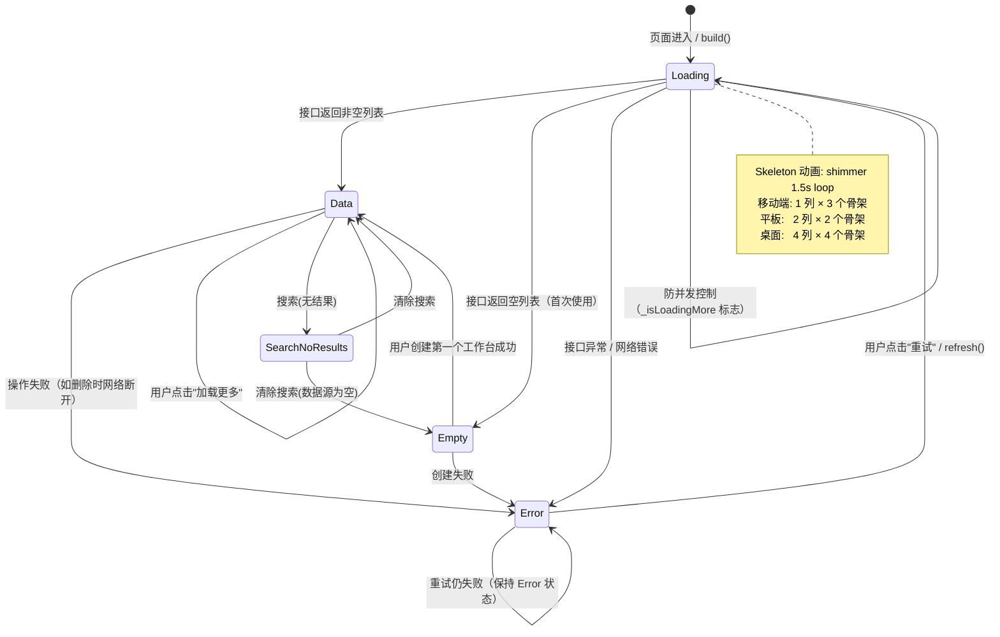
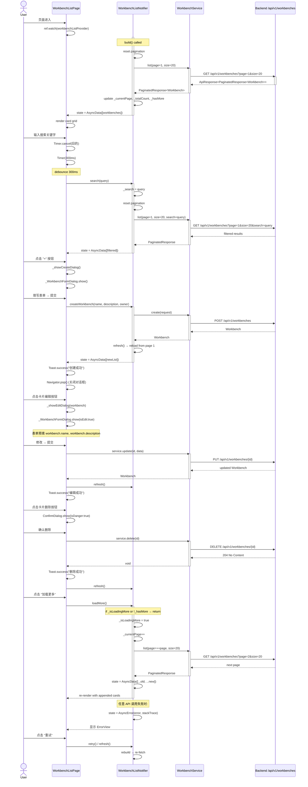
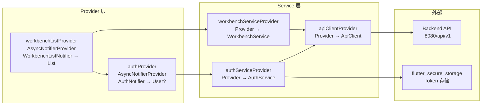
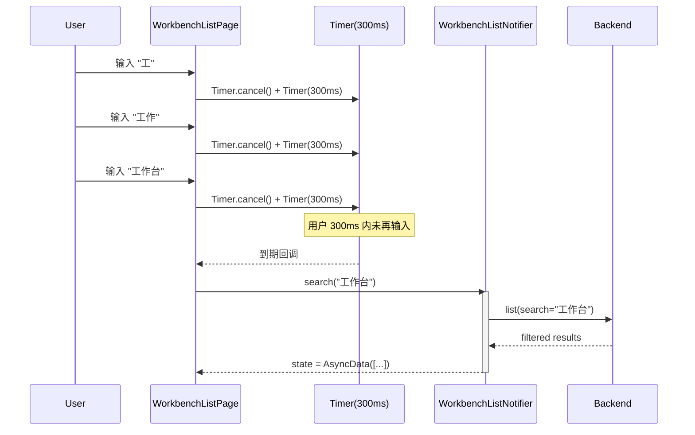
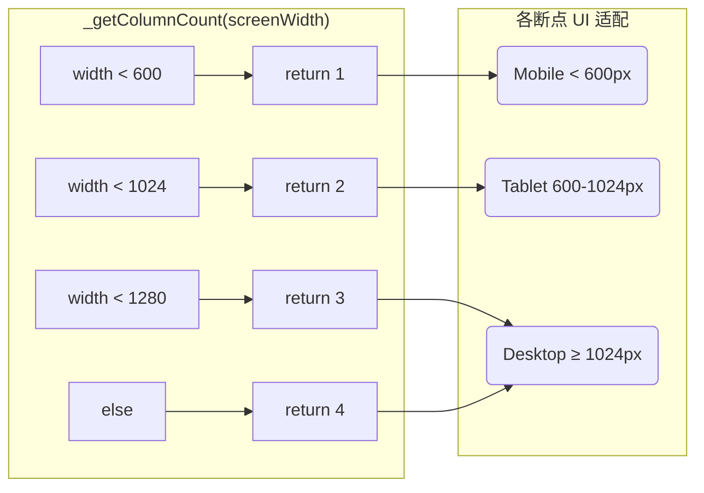

# TASK-013: 工作台列表页面 — 详细设计文档

> **路由**: `/workbenches`  
> **依赖**: TASK-007 (可复用组件库), TASK-012 (工作台 Service + Provider)  
> **设计师**: sw-anna  
> **开发者**: sw-tom  
> **日期**: 2026-05-31  

---

## 1. 页面状态机

### 1.1 状态定义

工作台列表页面的生命周期由 `WorkbenchListNotifier`（基于 Riverpod 3.x `AsyncNotifier`）驱动，状态通过 `AsyncValue<List<Workbench>>` 表达。UI 层消费此状态并映射为 5 种可视化状态：

| 状态 | AsyncValue 映射 | 触发条件 | UI 渲染 |
|------|-----------------|----------|---------|
| **Loading** | `AsyncLoading` | 首次加载 / 搜索中 / 创建后刷新 | 骨架屏网格 (`_WorkbenchCardSkeleton` × N) |
| **Error** | `AsyncError` | 网络异常 / 后端错误 / 超时 | `ErrorView` + 重试按钮 |
| **Empty** | `AsyncData([])` + 搜索关键字为空 | 刚注册用户，没有任何工作台 | `EmptyView` + "创建第一个工作台" |
| **Data** | `AsyncData([...])` + 列表非空 | 有数据返回 | 卡片网格 + 分页栏 |
| **Search No Results** | `AsyncData([])` + 搜索关键字非空 | 搜索关键字无匹配结果 | 搜索无结果空状态 + 清除搜索按钮 |

### 1.2 状态流转图



---

## 2. 组件树

### 2.1 组件层次结构

```mermaid
graph TB
    %% 页面级
    WorkbenchListPage[WorkbenchListPage<br/>ConsumerStatefulWidget]

    %% AppBar
    AppBar[AppBar]
    Title["Title: '工作台'"]
    CreateBtn["+ IconButton<br/>(新建工作台)"]

    %% 主体 Column
    Column_[Column]
    SearchBar_["_SearchBar<br/>(搜索栏)"]
    Expanded_[Expanded<br/>(内容区域)]

    %% 内容区域 - AsyncValue.when 四态
    subgraph ContentArea["内容区域 (AsyncValue.when)"]
        direction TB
        LoadingBranch["loading:<br/>_buildSkeletonGrid"]
        ErrorBranch["error:<br/>ErrorView + retry"]
        DataBranch["data:<br/>_buildContent"]
    end

    %% Data 分支子状态
    subgraph DataBranchSub["_buildContent"]
        direction TB
        SearchEmpty["搜索无结果:<br/>_buildSearchEmptyState"]
        EmptyState["空状态:<br/>_buildEmptyState<br/>(EmptyView)"]
        DataView["有数据:<br/>_buildDataView"]
    end

    %% DataView 内部
    subgraph DataViewSub["_buildDataView"]
        direction TB
        ScrollView["SingleChildScrollView"]
        WrapGrid["Wrap (spacing=16)"]
        SkeletonCard["_WorkbenchCardSkeleton<br/>(骨架屏占位)"]
        Card["_WorkbenchCard<br/>(工作台卡片)"]
        PaginationBar["_PaginationBar<br/>(分页栏)"]
    end

    %% Card 内部结构
    subgraph WorkbenchCard["_WorkbenchCard 内部"]
        direction TB
        MouseRegion_["MouseRegion<br/>(hover/press)"]
        AnimatedContainer_["AnimatedContainer<br/>(150ms ease-out)"]
        Column_Card[Column]
        StatusChip["_StatusChip<br/>(状态标签)"]
        Name["名称 (Title Medium, 1行省略)"]
        Desc["描述 (Body Small, 2行省略)"]
        Divider_["Divider"]
        Row_Bottom[Row]
        DateText["创建时间 (相对时间)"]
        EditBtn["_CardActionButton<br/>(edit)"]
        DeleteBtn["_CardActionButton<br/>(delete)"]
    end

    %% Dialog
    subgraph Dialogs["对话框"]
        CreateDialog["_WorkbenchFormDialog<br/>(创建/编辑)"]
        DeleteConfirm["ConfirmDialog<br/>(删除确认)"]
    end

    %% 连接关系
    WorkbenchListPage --> AppBar
    WorkbenchListPage --> Column_
    AppBar --> Title
    AppBar --> CreateBtn

    Column_ --> SearchBar_
    Column_ --> Expanded_

    Expanded_ --> ContentArea
    ContentArea --> LoadingBranch
    ContentArea --> ErrorBranch
    ContentArea --> DataBranch

    DataBranch --> DataBranchSub
    DataBranchSub --> SearchEmpty
    DataBranchSub --> EmptyState
    DataBranchSub --> DataView

    DataView --> DataViewSub
    DataViewSub --> ScrollView
    ScrollView --> WrapGrid
    WrapGrid --> Card
    DataViewSub --> PaginationBar

    Card --> WorkbenchCard
    Column_Card --> StatusChip
    Column_Card --> Name
    Column_Card --> Desc
    Column_Card --> Divider_
    Column_Card --> Row_Bottom
    Row_Bottom --> DateText
    Row_Bottom --> EditBtn
    Row_Bottom --> DeleteBtn

    %% 事件连接
    CreateBtn -.->|onPressed| CreateDialog
    EditBtn -.->|onTap| CreateDialog
    DeleteBtn -.->|onTap| DeleteConfirm

    %% 搜索无结果中的按钮
    SearchEmpty -.->|"清除搜索"| DataBranch
```

### 2.2 组件责任矩阵

| 组件 | 类型 | 职责 | 状态维护 |
|------|------|------|----------|
| `WorkbenchListPage` | ConsumerStatefulWidget | 页面容器，组合子组件，管理搜索 Controller 和 Debounce Timer | 局部: 搜索文本, focus |
| `_SearchBar` | StatelessWidget | 搜索输入框，显示清除按钮，响应式宽度适配 | 无（纯渲染） |
| `_WorkbenchCard` | StatefulWidget | 单个卡片渲染，处理 hover/press 动画 | 局部: _isHovered, _isPressed |
| `_StatusChip` | StatelessWidget | 根据状态值渲染彩色标签 | 无 |
| `_CardActionButton` | StatelessWidget | 32px 紧凑型 IconButton | 无 |
| `_WorkbenchCardSkeleton` | StatefulWidget | 骨架屏卡片占位，shimmer 动画 | 局部: AnimationController |
| `_PaginationBar` | StatelessWidget | 显示"共 N 个" + "加载更多"按钮 | 无 |
| `_WorkbenchFormDialog` | StatefulWidget | 创建/编辑对话框，响应式 Dialog/BottomSheet | 局部: 表单状态, loading |
| `ConfirmDialog` | StatelessWidget（TASK-007） | 删除二次确认 | 无 |
| `EmptyView` | StatelessWidget（TASK-007） | 空状态引导 | 无 |
| `ErrorView` | StatelessWidget（TASK-007） | 错误显示 + 重试 | 无 |

---

## 3. 数据流

### 3.1 完整数据流图



### 3.2 数据流层次

```
┌──────────┐      ┌───────────────────┐      ┌────────────────┐      ┌───────────┐
│  UI 层   │ ──→  │  Provider 层       │ ──→  │  Service 层    │ ──→  │  API 层  │
│ (Widget) │ ←──  │ (AsyncNotifier)    │ ←──  │ (HTTP Client)  │ ←──  │ (Backend) │
└──────────┘      └───────────────────┘      └────────────────┘      └───────────┘

UI 层:
  - Consumer Widget → ref.watch(workbenchListProvider)
  - state.when(loading, error, data) 各状态渲染
  - 用户操作 → ref.read(workbenchListProvider.notifier).方法()

Provider 层 (WorkbenchListNotifier):
  - 状态: AsyncValue<List<Workbench>>
  - 内部状态: _currentPage, _totalCount, _hasMore, _search, _isLoadingMore
  - 公共方法: build(), refresh(), loadMore(), search(), createWorkbench(), retry()
  - ref.read(workbenchServiceProvider) 获取 Service 实例

Service 层 (WorkbenchService):
  - 纯 HTTP 调用，无状态
  - 方法: list(), create(), getById(), update(), delete()
  - 使用 ApiClient (Dio) 发起请求
  - 不捕获异常（由 ErrorInterceptor 和 Provider 处理）

API 层:
  - GET/POST/PUT/DELETE 到 /api/v1/workbenches
  - 统一响应格式: ApiResponse<PaginatedResponse<Workbench>>
```

### 3.3 Provider 依赖图



---

## 4. 搜索 Debounce 逻辑

### 4.1 实现方案

使用 `dart:async` 的 `Timer` 实现 300ms 防抖。用户每次输入时取消上一个 Timer，然后新建一个 300ms 的 Timer，到期时才触发 Notifier 的 `search()` 方法。

```dart
// WorkbenchListPage 中
final _searchController = TextEditingController();
Timer? _debounceTimer;

void _onSearchChanged(String query) {
  // 取消上一个 Timer
  _debounceTimer?.cancel();
  // 新建 300ms Timer
  _debounceTimer = Timer(const Duration(milliseconds: 300), () {
    // 到期时调用 Notifier 的 search 方法
    ref.read(workbenchListProvider.notifier).search(query);
  });
}
```

### 4.2 时序图



### 4.3 边界情况

| 场景 | 行为 |
|------|------|
| 用户快速打字 | 每次只触发最后一次输入，300ms 后调用 API |
| 用户清除输入 | `_searchController.clear()` + 立即调用 `onChanged('')` → Timer 延迟后 `search('')` → 重置列表 |
| 搜索中用户再次输入 | 前一次搜索未完成时取消，发起新搜索 |
| 空字符串搜索 | Notifier 将 `query.isEmpty` 转为 `_search = null` → 获取完整列表 |
| 组件销毁 | `dispose()` 中 `_debounceTimer?.cancel()` 防止回调 leakage |
| 页面离开时搜索未完成 | dispose 取消 Timer，不再触发 Notifier 调用 |

---

## 5. 响应式断点

### 5.1 断点定义

| 断点名称 | 屏幕宽度 | 网格列数 | 卡片宽度 | 卡片数量/行 |
|----------|----------|:--------:|----------|:----------:|
| Mobile | `< 600px` | 1 | `100% - 32px` | 1 |
| Tablet | `600–1024px` | 2 | `calc(50% - 24px)` | 2 |
| Desktop Small | `1024–1280px` | 3 | `calc(33.33% - 32px)` | 3 |
| Desktop Large | `>= 1280px` | 4 | `calc(25% - 36px)` | 4 |

### 5.2 响应式行为矩阵



### 5.3 适配详情

| 组件/行为 | 移动端 (< 600px) | 平板 (600–1024px) | 桌面 (≥ 1024px) |
|-----------|------------------|-------------------|-----------------|
| **AppBar 新建按钮** | `IconButton(Icons.add)` | `IconButton(Icons.add)` | `IconButton` (可升级为 `FilledButton.icon("+ 新建")`) |
| **搜索栏宽度** | `100%` (全宽) | `60%` (居中或左对齐) | `60%` |
| **搜索栏左右 padding** | `12px` | `16px` | `16px` |
| **内容区域 padding** | `16px` | `16px` | `16px` (内部) |
| **网格列数** | 1 列 | 2 列 | 3 列 (<1280) / 4 列 (≥1280) |
| **卡片尺寸** | 全宽 (自适应) | 每列计算宽度 | 每列计算宽度 |
| **Dialog 样式** | `showModalBottomSheet` (底部 Sheet) | 居中 `Dialog` (480px) | 居中 `Dialog` (480px) |
| **删除确认样式** | `BottomSheet` | 居中 `Dialog` | 居中 `Dialog` |
| **骨架屏数量** | 3 个 | 2 行 × 2 列 = 4 个 | 4 列 × 若干行 |
| **分页栏** | 撑满底部 | 撑满底部 | 撑满底部 |

### 5.4 网格计算逻辑

```dart
// WorkbenchListPage 中 _buildDataView 的宽度计算
int _getColumnCount(double width) {
  if (width < 600) return 1;
  if (width < 1024) return 2;
  if (width < 1280) return 3;
  return 4;
}

// 卡片宽度计算（用于确定 Wrap 中子项宽度）
// const padding = 16.0;
// const spacing = 16.0;
// final availableWidth = screenWidth - padding * 2 - spacing * (columnCount - 1);
// final itemWidth = availableWidth / columnCount;
```

---

## 6. 交互详细设计

### 6.1 卡片交互动画

| 触发 | 属性变化 | 时长 | 缓动 |
|------|---------|:----:|:----:|
| `MouseRegion.onEnter` | `_isHovered = true` | — | — |
| `MouseRegion.onExit` | `_isHovered = false` | — | — |
| Hover 动画 | Elevation: 1→8dp, Border: outline→primary, translateY: 0→-2px | 150ms | ease-out |
| `onTapDown` | `_isPressed = true` | — | — |
| `onTapUp` / `onTapCancel` | `_isPressed = false` | — | — |
| Pressed 动画 | Scale: 1.0→0.98 | 100ms | ease-in-out |

等待使用 `AnimatedContainer` 实现（非手动 AnimationController），当状态改变时自动触发动画过渡。

### 6.2 创建成功高亮

创建成功后，新卡片应在列表中高亮 2 秒。实现方式：

1. `WorkbenchListNotifier.createWorkbench()` 成功后调用 `refresh()` 重新加载列表
2. 新列表中最新创建的卡片（创建时间最新）自动应用 `selected` 样式（Primary Container 背景）
3. 2 秒 Timer 后取消高亮

> **当前简化实现**：直接刷新列表并通过 Toast 反馈成功。高亮可在后续迭代中通过比较前后列表差异实现。

### 6.3 删除确认流程

```
用户点击删除按钮 (onTap)
  → ConfirmDialog.show(
      title: "删除工作台？",
      description: "确定要删除工作台「{name}」吗？...",
      isDanger: true,
      onConfirm: _handleDelete(workbench)
    )
  → 用户确认
  → service.delete(id)
  → 成功: Toast.success("已删除") + Notifier.refresh()
  → 失败: Toast.error(错误消息)
```

### 6.4 创建/编辑对话框流程

```
用户点击 "+" 或编辑按钮
  → _WorkbenchFormDialog.show()
  → 判断 isMobile (<600px) → BottomSheet / Dialog
  → 用户填写表单
  → 客户端验证:
      - 名称: 必填, 长度 ≤ 255
      - 描述: 选填
  → 验证通过 → _submit()
  → 按钮进入 loading 状态 (显示 CircularProgressIndicator)
  → 编辑模式: service.update(id, data) → refresh()
  → 创建模式: Notifier.createWorkbench(name, desc, ownerType, ownerId)
  → 成功: Toast + Navigator.pop()
  → 失败: Toast.error + 按钮恢复
```

---

## 7. 错误处理策略

### 7.1 错误类型及用户消息映射

| 场景 | HTTP / 异常类型 | UI 显示 |
|------|-----------------|---------|
| 网络断开 | `DioExceptionType.connectionError` | "网络连接失败，请检查网络后重试" |
| 连接超时 | `DioExceptionType.connectionTimeout` | "网络连接失败，请检查网络后重试" |
| 请求超时 (30s) | `DioExceptionType.receiveTimeout` | "网络连接失败，请检查网络后重试" |
| 资源不存在 | 404 | "工作台不存在或已被删除" |
| 无权限 | 403 | "没有权限执行此操作" |
| 服务器错误 | 500/502/503 | "服务暂时不可用，请稍后再试" |
| 未知错误 | — | "操作失败，请重试（错误码: {code}）" |

### 7.2 错误恢复路径

| 错误来源 | 用户操作 | 恢复行为 |
|----------|----------|----------|
| 首次加载失败 | 点击 ErrorView 的"重试"按钮 | `Notifier.retry()` → `refresh()` → `build()` |
| 搜索时失败 | 自动重新搜索 | `Notifier.search()` 内部为 `async` guard |
| loadMore 失败 | 保持已有数据，错误记录 | `_currentPage--` 回滚，状态转为 error |
| 创建操作失败 | Toast 显示错误 | 对话框保持打开，可修改后重试 |
| 删除操作失败 | Toast 显示错误 | 列表保持不变 |

---

## 8. 生命周期管理

### 8.1 Widget 生命周期

```
ConsumerStatefulWidget
├── initState()
│   ├── _searchController = TextEditingController()
│   ├── _searchFocusNode = FocusNode()
│   └── _debounceTimer = null
│
├── dispose()
│   ├── _searchController.dispose()
│   ├── _searchFocusNode.dispose()
│   ├── _debounceTimer?.cancel()
│   └── super.dispose()
│
└── build()
    ├── ref.watch(workbenchListProvider) → 自动触发 Notifier.build()
    └── render by state.when()
```

### 8.2 Notifier 生命周期

```
WorkbenchListNotifier.build()
  → 首次访问时自动调用
  → 重置分页状态
  → 返回 _fetchWorkbenches() 的 Future
  → 设置 state = AsyncLoading / AsyncData / AsyncError

WorkbenchListNotifier.dispose()
  → Provider 被销毁时自动调用
  → 清理内部状态（Timer 等）
  → (当前无 Timer，但在 _startRefreshTimer 时需注意)
```

---

## 9. 与 TASK-007 组件的集成

| 组件 | 使用位置 | 参数 |
|------|----------|------|
| `EmptyView` | `_buildEmptyState()` | `icon: Icons.folder_open_outlined`, `title: "您还没有工作台"`, `description: "..."`, `actionButton: FilledButton("创建第一个工作台")` |
| `ErrorView` | `state.when(error:)` | `title: error.toString()`, `onRetry: notifier.retry` |
| `ConfirmDialog` | `_showDeleteConfirm()` | `title: "删除工作台？"`, `description: "确定要删除...？"`, `isDanger: true` |
| `Toast` | 创建/编辑/删除操作后 | `show(context, message, type)` success/error |
| `Skeleton` | 当前页面未直接使用 | 页面使用自定义 `_WorkbenchCardSkeleton`（适配卡片网格布局） |
| `AsyncValueWidget` | 当前页面未直接使用 | — |

> **注意**：当前实现使用手动 `state.when()` 分发，而非 `AsyncValueWidget`。因为需要区分"空状态"和"搜索无结果"两个子状态，单独的 `AsyncValueWidget` 默认 `emptyCondition` 无法区分。同时骨架屏组件使用了自定义的 `_WorkbenchCardSkeleton` 以匹配卡片网格样式。

---

## 10. 性能考虑

| 关注点 | 当前方案 | 说明 |
|--------|----------|------|
| 列表性能 | `Wrap` + `SizedBox` | 不是 `ListView.builder`。当前数据量小（分页 20 条/页），Wrap 足够 |
| 防并发 | `_isLoadingMore` flag | 防止 loadMore 在连续点击时多次加载 |
| 动画性能 | `AnimatedContainer` | 仅在 hover/press 状态切换时触发重建，无持续动画循环 |
| Skeleton 动画 | `AnimationController.repeat()` | shimmer 扫光效果，1.5s 循环，在 dispose 时自动停止 |
| Dialog loading | `_isSubmitting` 标志 | 防止重复提交 |
| 搜索防抖 | `Timer` + `cancel` | 避免每次击键都触发 API 调用 |
| 内存管理 | dispose 清理所有 Controller/Node/Timer | 防止内存泄漏 |

---

## 11. 文件结构

```
lib/pages/workbench/
├── workbench_list_page.dart        # 列表页面 (当前文件，包含所有子组件)

# 可选重构拆分（后续迭代）：
# ├── widgets/workbench_card.dart     # 工作台卡片组件
# ├── widgets/workbench_card_skeleton.dart  # 骨架屏
# ├── widgets/workbench_search_bar.dart     # 搜索栏
# └── widgets/workbench_form_dialog.dart    # 创建/编辑对话框
```

当前实现将所有子组件放在同一文件中（私有类），对 1221 行的规模而言可接受。若后续复杂度增加可拆分。

---

## 12. 与本任务关联的已有接口

### 12.1 WorkbenchService（TASK-012）

```dart
class WorkbenchService {
  WorkbenchService(ApiClient client);
  Future<PaginatedResponse<Workbench>> list({int page, int size, String? search});
  Future<Workbench> create(CreateWorkbenchRequest request);
  Future<Workbench> getById(String id);
  Future<Workbench> update(String id, Map<String, dynamic> data);
  Future<void> delete(String id);
}
```

### 12.2 WorkbenchListNotifier（TASK-012）

```dart
class WorkbenchListNotifier extends AsyncNotifier<List<Workbench>> {
  int get currentPage;
  int get totalCount;
  bool get hasMore;
  String? get searchQuery;
  Future<List<Workbench>> build();
  Future<void> refresh();
  Future<void> loadMore();
  Future<void> search(String query);
  Future<void> createWorkbench({String name, String? description, String ownerType, String ownerId});
  Future<void> retry();
}
```

### 12.3 Workbench 模型（TASK-002）

```dart
class Workbench {
  final String id;
  final String name;
  final String? description;
  final String ownerType;
  final String ownerId;
  final String status;
  final DateTime createdAt;
  final DateTime updatedAt;
}
```

---

## 文档结束
