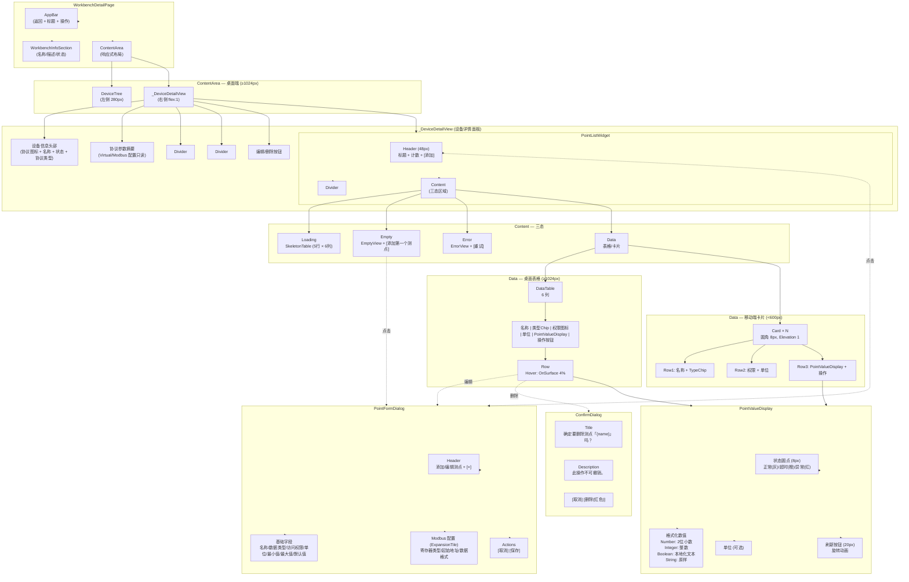
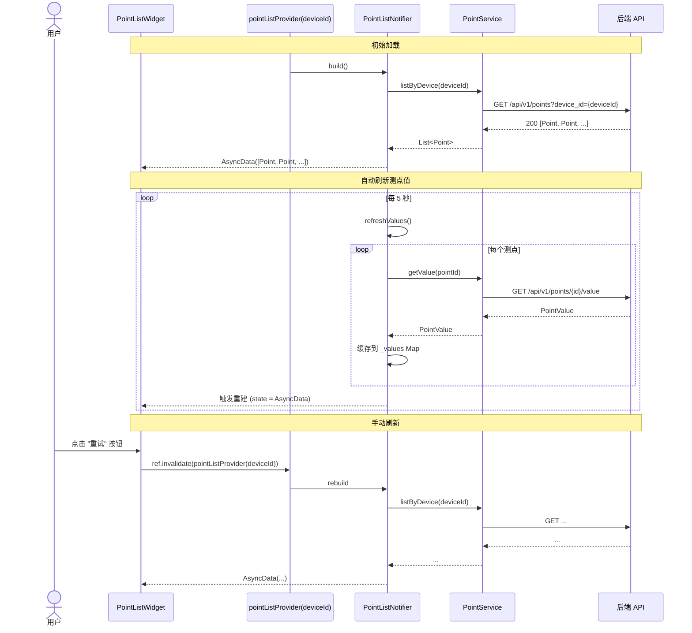
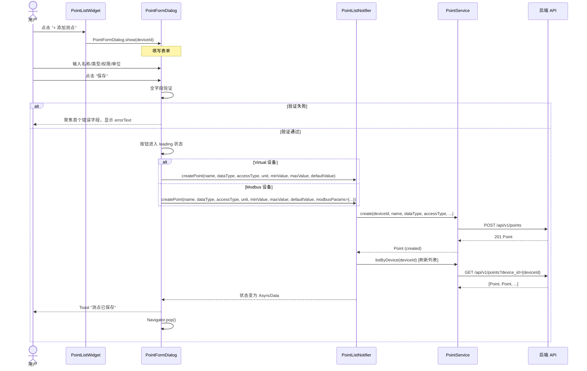
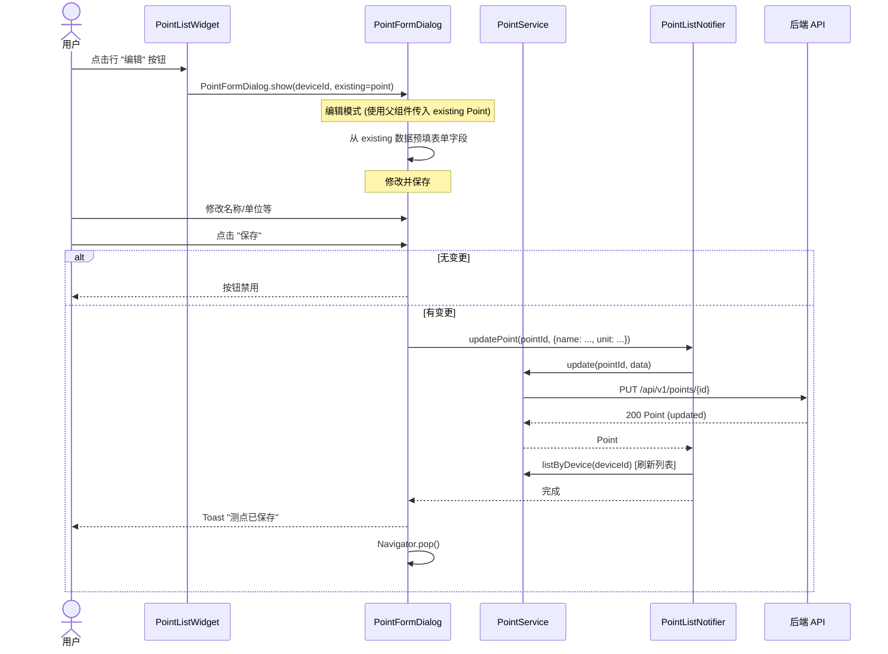
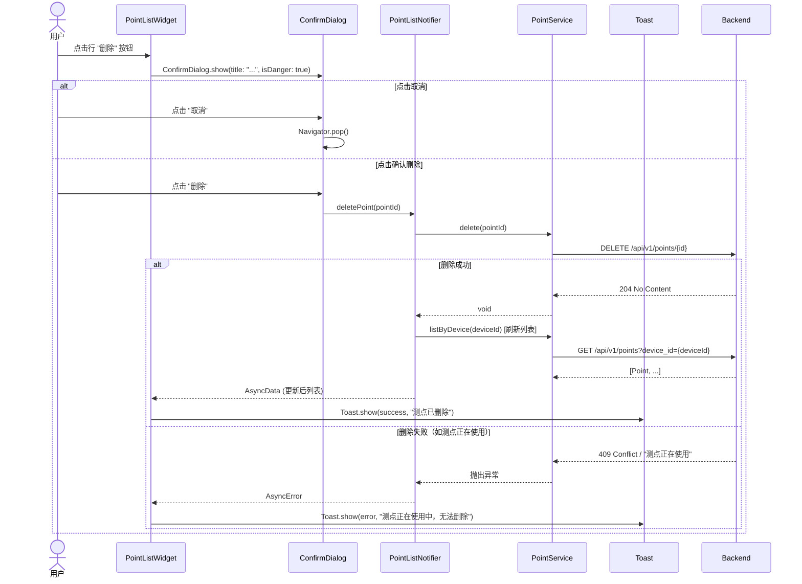
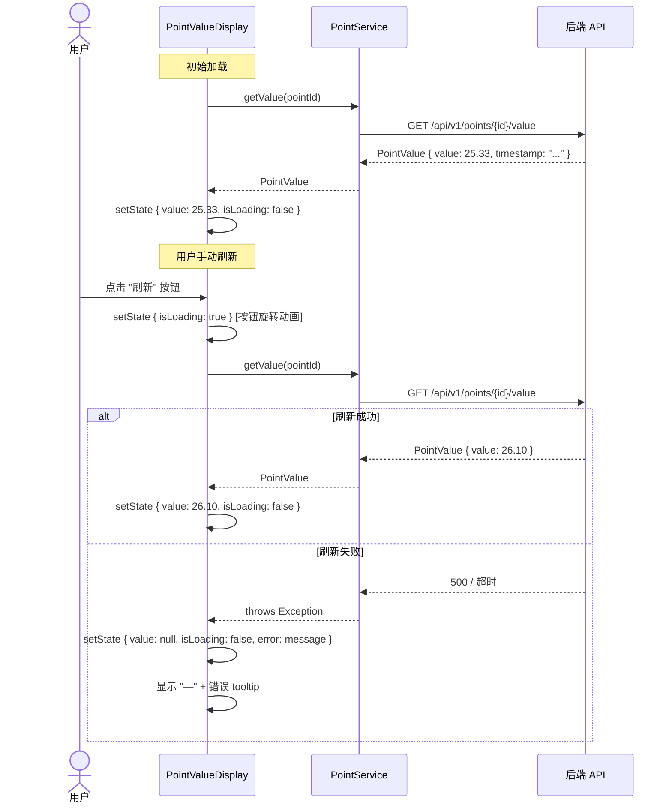

# TASK-018 详细设计文档 — 测点列表/配置 UI

> **作者**: sw-tom (Software Developer)
> **日期**: 2026-06-01
> **版本**: v1.1
> **状态**: 修订中（修正 B-01/B-02，待二次评审）
> **关联任务**: TASK-018（数据层完成）→ TASK-019（UI层，本文档涵盖）
>
> **注意**: 根据 `tasks.md`，TASK-018 是测点 Service + Provider（数据层），TASK-019 是测点列表/配置 UI（UI 层）。但测试用例、UI 设计和评审文件中统一标记为 TASK-018。本文档遵循 `log/release_3/tasks.md` 的命名，但实际覆盖的是 **测点列表/配置 UI**（即 tasks.md 中 TASK-019 的范围）。

---

## 目录

1. [组件树](#1-组件树)
2. [类图与接口定义](#2-类图与接口定义)
3. [数据流图](#3-数据流图)
4. [依赖分析](#4-依赖分析)
5. [Modbus 字段对齐方案（B-02）](#5-modbus-字段对齐方案b-02)
6. [UI 实现计划](#6-ui-实现计划)
7. [国际化 Key 清单](#7-国际化-key-清单)
8. [现有代码修改清单](#8-现有代码修改清单)

---

## 1. 组件树



---

## 2. 类图与接口定义

### 2.1 组件类图

```mermaid
classDiagram
    class PointListWidget {
        +deviceId: String
        +build(context, ref): Widget
        -_buildHeader(l10n): Widget
        -_buildSkeleton(): Widget
        -_buildEmpty(l10n): Widget
        -_buildError(error, l10n): Widget
        -_buildTable(points): Widget
        -_buildCardList(points): Widget
        -_handleAddPoint(context, ref): void
    }
    note for PointListWidget "ConsumerWidget\n响应式: LayoutBuilder → 桌面Table/移动端Card"

    class PointFormDialog {
        +deviceId: String
        +existing: Point?
        +device: Device?
        +isMobile: bool
        +static show(context, ref, deviceId, {Point? existing, Device? device}) Future
        +build(context, ref): Widget
        -_buildForm(): Widget
        -_buildBasicFields(): Widget
        -_buildModbusConfig(): Widget
        -_buildActions(): Widget
        -_handleSave(): void
        -_validate(): bool
    }
    note for PointFormDialog "ConsumerStatefulWidget\n移动端: ModalBottomSheet\n桌面端: AlertDialog"

    class PointValueDisplay {
        +pointId: String
        +pointName: String
        +dataType: DataType
        +unit: String?
        +status: String
        +build(context, ref): Widget
        -_formatValue(raw): String
        -_statusColor(): Color
        -_statusIcon(): IconData
        -_handleRefresh(): void
    }
    note for PointValueDisplay "ConsumerStatefulWidget\n内部管理加载状态(isLoading)\n调用 PointService.getValue() 独立刷新"

    class DataType {
        <<enumeration>>
        number
        integer
        string
        boolean
    }

    class AccessType {
        <<enumeration>>
        ro
        wo
        rw
    }

    class Point {
        +id: String
        +deviceId: String
        +name: String
        +dataType: DataType
        +accessType: AccessType
        +unit: String?
        +minValue: double?
        +maxValue: double?
        +defaultValue: String?
        +status: String
        +createdAt: DateTime
        +updatedAt: DateTime
    }

    class PointValue {
        +pointId: String
        +value: Object?
        +timestamp: String?
    }

    class PointListNotifier {
        +deviceId: String
        +values: Map~String, PointValue~
        +build(): Future~List~Point~~
        +refresh(): void
        +createPoint(name, dataType, accessType, unit?, minValue?, maxValue?, defaultValue?, modbusParams?): void
        +updatePoint(pointId, data): void
        +deletePoint(pointId): void
        +refreshValues(): Future~Map~String, PointValue~~
    }
    note for PointListNotifier "AsyncNotifier<~List~Point~~>\n通过 pointListProvider(deviceId) 暴露"

    class PointService {
        +listByDevice(deviceId): Future~List~Point~~
        +getById(id): Future~Point~
        +create(deviceId, name, dataType, accessType, unit?, minValue?, maxValue?, defaultValue?): Future~Point~
        +update(id, data): Future~Point~
        +delete(id): Future~void~
        +getValue(id): Future~PointValue~
        +setValue(id, value): Future~void~
    }

    class ConfirmDialog {
        +static show(context, title, description, confirmLabel, isDanger, onConfirm): void
    }

    class AppLocalizations {
        +pointListTitle: String
        +addPoint: String
        +pointCount(count): String
        +pointListEmpty: String
        +addFirstPoint: String
        +pointSaveSuccess: String
        +pointDeleteSuccess: String
        +pointDeleteConfirm(name): String
        +pointDeleteWarning: String
        +pointNameRequired: String
        +pointNameTooLong: String
        +pointNameLabel: String
        +pointNameHint: String
        +pointUnitLabel: String
        +pointDataTypeLabel: String
        +pointAccessTypeLabel: String
        +pointModbusConfig: String
        +pointRegisterTypeLabel: String
        +pointAddressLabel: String
        +pointAddressRange: String
        +pointDataFormatLabel: String
        +pointColumnName: String
        +pointColumnType: String
        +pointColumnAccess: String
        +pointColumnUnit: String
        +pointColumnValue: String
        +pointColumnAction: String
        +pointStatusNormal: String
        +pointStatusTimeout: String
        +pointStatusError: String
        +refresh: String
    }

    PointListWidget --> PointListNotifier : ref.watch(pointListProvider(deviceId))
    PointListWidget --> PointFormDialog : opens
    PointListWidget --> ConfirmDialog : opens for delete
    PointListWidget --> PointValueDisplay : embeds in value column
    PointFormDialog --> PointListNotifier : calls createPoint/updatePoint
    PointFormDialog --> PointService : via notifier
    PointValueDisplay --> PointService : calls getValue()
    PointValueDisplay --> PointListNotifier : reads status from Point
    PointListNotifier --> PointService : delegates CRUD
    Point --> DataType : uses
    Point --> AccessType : uses
```

### 2.2 组件接口定义

#### PointListWidget

```dart
/// PointListWidget — 测点列表组件
///
/// 嵌入在 _DeviceDetailView 中，替换现有的 _PointListSection。
/// 使用 [pointListProvider(deviceId)] 获取测点列表数据。
///
/// 响应式设计：
/// - 桌面端 (≥1024px)：完整 DataTable，6 列
/// - 平板端 (600-1024px)：DataTable，可横向滚动
/// - 移动端 (<600px)：Card 列表
///
/// 支持三态：
/// - Loading：SkeletonTable（5 行 × 6 列 shimmer）
/// - Error：错误图标 + 消息 + 重试按钮
/// - Empty：空图标 + 提示 + "添加第一个测点"按钮
/// - Data：表格/卡片列表
class PointListWidget extends ConsumerWidget {
  const PointListWidget({super.key, required this.deviceId});

  /// 所属设备 ID
  final String deviceId;

  @override
  Widget build(BuildContext context, WidgetRef ref);
}
```

#### PointFormDialog

```dart
/// PointFormDialog — 添加/编辑测点对话框
///
/// 支持添加和编辑两种模式。
/// - 添加模式：字段为空/默认值，POST /api/v1/points
/// - 编辑模式：父组件通过 [existing] 参数传入 [Point] 对象预填表单，无需额外 API 调用；PUT /api/v1/points/{id}
///
/// 响应式：
/// - 桌面端 (≥600px)：AlertDialog，宽 560px
/// - 移动端 (<600px)：ModalBottomSheet，100% 宽，maxHeight 90%
///
/// Modbus 设备：额外显示 Modbus 配置区域（ExpansionTile，默认展开）
/// 通过 [deviceDetailProvider(deviceId)] 获取设备信息判断协议类型。
class PointFormDialog extends ConsumerStatefulWidget {
  const PointFormDialog({
    super.key,
    required this.deviceId,
    this.existing,
    this.isMobile = false,
  });

  /// 所属设备 ID
  final String deviceId;

  /// 现有测点（编辑模式时传入）
  final Point? existing;

  /// 是否为移动端布局
  final bool isMobile;

  /// 显示测点配置对话框
  ///
  /// 根据屏幕宽度自动选择样式：
  /// - < 600px：底部 Sheet
  /// - >= 600px：居中 Dialog
  static Future<void> show({
    required BuildContext context,
    required WidgetRef ref,
    required String deviceId,
    Point? existing,
  });
}
```

#### PointValueDisplay

```dart
/// PointValueDisplay — 测点值显示组件
///
/// 显示测点的实时数值和状态指示。
/// 从 [Point] 模型获取 status，从 [PointService.getValue] 获取值。
///
/// 内部维护自己的加载状态（isLoading），刷新时不影响其他行。
/// 自动刷新通过父组件控制（PointListWidget 中的 Timer）。
///
/// 状态指示：
/// - normal：灰色圆点 + 正常颜色数值
/// - timeout：橙色圆点 + 灰色数值
/// - error：红色圆点 + "—"
class PointValueDisplay extends ConsumerStatefulWidget {
  const PointValueDisplay({
    super.key,
    required this.pointId,
    required this.dataType,
    this.unit,
    this.status = 'normal',
  });

  /// 测点 ID
  final String pointId;

  /// 数据类型（用于格式化）
  final DataType dataType;

  /// 单位
  final String? unit;

  /// 测点状态（来自 Point.status）
  final String status;

  @override
  ConsumerState<PointValueDisplay> createState();
}
```

### 2.3 PointListNotifier 接口扩展

`PointListNotifier` 已存在，需新增 `updatePoint()` 方法：

```dart
// PointListNotifier 新增方法

/// 更新测点，更新成功后刷新列表
///
/// [pointId] 要更新的测点 ID
/// [data] 需要更新的字段 Map
Future<void> updatePoint(String pointId, Map<String, dynamic> data) async {
  state = const AsyncLoading();

  try {
    final service = ref.read(pointServiceProvider);
    await service.update(pointId, data);

    // 更新成功后刷新列表
    state = await AsyncValue.guard(build);
  } catch (e, st) {
    state = AsyncError(_mapError(e), st);
  }
}
```

### 2.4 PointValueProvider（新增）

为 PointValueDisplay 的独立刷新提供 Provider：

```dart
/// PointValueProvider — 单个测点值的 Provider
///
/// 通过 [ref.invalidate] 触发刷新。
/// 不维护长期缓存，每次 watch 都调用 API 获取最新值。
final pointValueProvider = FutureProvider.family<PointValue, String>((ref, pointId) async {
  final service = ref.read(pointServiceProvider);
  return service.getValue(pointId);
});
```

---

## 3. 数据流图

### 3.1 测点列表加载流



### 3.2 添加测点流



### 3.3 编辑测点流



### 3.4 删除测点流



### 3.5 单测点值刷新流



---

## 4. 依赖分析

### 4.1 已有依赖

| 依赖 | 文件 | 说明 |
|------|------|------|
| `pointListProvider` | `lib/providers/point_provider.dart` | ✅ 已存在，family provider |
| `PointListNotifier` | `lib/providers/point_provider.dart` | ✅ 已存在，需新增 `updatePoint()` |
| `PointService` | `lib/services/point_service.dart` | ✅ 已存在，接口完整 |
| `Point` | `lib/models/point.dart` | ✅ 已存在，需确认 Modbus 字段 |
| `PointValue` | `lib/models/point.dart` | ✅ 已存在 |
| `Device` | `lib/models/device.dart` | ✅ 已存在，用于判断协议类型 |
| `deviceDetailProvider` | `lib/providers/device_provider.dart` | ✅ 已存在，PointFormDialog 用于获取设备信息 |
| `ConfirmDialog` | `lib/widgets/confirm_dialog.dart` | ✅ 已存在，用于删除确认 |
| `Toast` | `lib/widgets/toast.dart` | ✅ 已存在，用于操作反馈 |
| `AsyncValueWidget` | `lib/widgets/async_value_widget.dart` | ✅ 已存在，可选用于三态 |
| `EmptyView` | `lib/widgets/empty_view.dart` | ✅ 已存在，可在空状态复用 |
| `ErrorView` | `lib/widgets/error_view.dart` | ✅ 已存在，可在错误状态复用 |
| `Skeleton` | `lib/widgets/skeleton.dart` | ⚠️ 已存在，但不支持表格骨架布局（S-03）|
| `AppLocalizations` | `generated/app_localizations.dart` | ⚠️ 需新增 28+ 个 key |
| `DeviceService` | `lib/services/device_service.dart` | ⚠️ B-02 需调用 `DeviceService.update()` 保存 Modbus 配置到 `protocol_params` |

### 4.2 需要新增的 Provider

| Provider | 类型 | 说明 |
|----------|------|------|
| `pointValueProvider(pointId)` | `FutureProvider.family` | 单测点值，用于 PointValueDisplay 独立刷新 |

### 4.3 需要修改的文件

| 文件 | 修改内容 | 优先级 |
|------|----------|:------:|
| `lib/providers/point_provider.dart` | 新增 `updatePoint()` 方法 | P0 |
| ~~`lib/models/point.dart`~~ | ~~新增 `address`/`metadata` 字段~~ | ~~P1 (B-02)~~ 已取消 — B-02 采用 device protocol_params 存储方案 |
| `lib/pages/workbench/workbench_detail_page.dart` | 替换 `_PointListSection` → `PointListWidget` | P0 |
| `lib/l10n/app_en.arb` | 新增 28+ l10n keys | P0 |
| `lib/l10n/app_zh.arb` | 新增 28+ l10n keys | P0 |

### 4.4 需要新建的文件

| 文件 | 职责 |
|------|------|
| `lib/pages/point/point_list_widget.dart` | 测点列表组件（主组件） |
| `lib/pages/point/point_form_dialog.dart` | 添加/编辑测点对话框 |
| `lib/pages/point/point_value_display.dart` | 测点值显示组件 |

### 4.5 可复用 l10n Key（无需新增）

| 设计引用 | 现有 Key | 位置 |
|----------|----------|------|
| `l10n.edit` | `edit` | ✅ 已存在 |
| `l10n.delete` | `delete` | ✅ 已存在 |
| `l10n.save` | `save` | ✅ 已存在 |
| `l10n.cancel` | `cancel` | ✅ 已存在 |
| `l10n.retry` | `retry` | ✅ 已存在 |
| `l10n.deviceDetail` | `deviceDetail` | ✅ 已存在 |
| `l10n.deviceDetailPlaceholder` | `deviceDetailPlaceholder` | ✅ 已存在 |

---

## 5. Modbus 字段对齐方案（B-02）

### 5.1 问题概述

UI 设计规范 §4.5 和 PRD §M6 要求 Modbus 测点支持三个额外字段：

| 字段 | 语法 | 说明 |
|------|------|------|
| 寄存器类型 | `register_type` | Coil / Discrete Input / Holding Register / Input Register |
| 起始地址 | `address` | 0-65535 |
| 数据格式 | `data_format` | uint16 / int16 / float32 / uint32 / int32 |

### 5.2 后端现状分析

通过对后端代码的审查，发现当前**没有任何 DTO/请求结构体**可以承载 Modbus 字段：

| 组件 | 字段支持 | 说明 |
|------|:--------:|------|
| `Point` 实体 (`entities/point.rs`) | ⚠️ 部分 | 有 `metadata: Option<serde_json::Value>` 字段，但**未暴露在 DTO/请求/响应中** |
| `CreatePointRequest` (`entities/point.rs`) | ❌ 无 | 请求体**不包含** `metadata`、`address`、`register_type`、`data_format` |
| `UpdatePointRequest` (`entities/point.rs`) | ❌ 无 | 同上，不包含任何扩展字段 |
| `PointResponse` (`entities/point.rs`) | ❌ 无 | 响应**不包含** `metadata`、`address` |
| `PointDto` (`services/point/types.rs`) | ❌ 无 | 服务层 DTO 不包含 Modbus 字段 |
| `CreatePointEntity` (`services/point/error.rs`) | ❌ 无 | 服务层实体不包含 Modbus 字段 |
| **POINTS 表**（按 migration） | ❌ 无 | 无 `address`、`metadata`、`register_type`、`data_format` 列 |
| **PointRepository INSERT** | ❌ 无 | INSERT 语句仅插入基础字段 |

### 5.3 技术方案

**结论：后端当前无法持久化 Modbus 字段。** 经审查所有可行路径均不可用：

| 尝试路径 | 结果 | 原因 |
|----------|:----:|------|
| `CreatePointRequest` 传 address | ❌ | 请求体无此字段，serde 静默忽略 |
| `CreatePointRequest` 传 metadata | ❌ | 请求体无此字段，serde 静默忽略 |
| `UpdatePointRequest` 传 metadata | ❌ | 请求体无此字段 |
| `PointResponse` 读 address/metadata | ❌ | 响应无此字段 |
| 复用 `default_value` 字段 | 🟡 勉强 | 语义污染，不推荐 |
| `Point` 实体 `metadata` 字段写入 | ❌ | 实体有字段，但 Repository INSERT/DTO 映射均不支持 |

#### 短期方案（本版本 — device protocol_params 存储）

由于 Point 级别的 API 不支持 Modbus 字段，短期采用**设备级 `protocol_params` JSON 字段**承载：

**原理**：`Device` 模型有 `protocol_params: Option<serde_json::Value>` 字段，且 `deviceDetailProvider` 已返回此字段。Modbus 测点配置作为设备协议配置的一部分，持久化到该字段中。

```json
// device.protocol_params 扩展结构
{
  "host": "192.168.1.1",
  "port": 502,
  "points": {
    "<point_id>": {
      "register_type": "holding",
      "address": 300,
      "data_format": "float32"
    }
  }
}
```

**实现方式**：

1. **PointFormDialog** 在保存 Modbus 测点时：
   - 将 `register_type`、`address`、`data_format` 收集为一个 Map
   - 通过 `DeviceService.update()` 更新设备 `protocol_params.points[pointId]`
   - 该操作与创建/更新 Point 本身分离（两个独立 API 调用）

2. **PointListWidget 加载编辑模式**：
   - 从 `deviceDetailProvider(deviceId)` 获取 `device.protocol_params`
   - 解析 `points[pointId]` 回填到 `PointFormDialog` 的 Modbus 字段
   - 编辑完成后，再次调用 `DeviceService.update()` 更新 `protocol_params`

3. **`Point` 模型不做任何字段扩展**。

> **⚠️ 风险警告**: 此方案是**短期妥协**。`protocol_params` 本质是**设备级**配置，在此存储**测点级** Modbus 配置在架构上不合理。主要风险：
> - 设备下所有测点的 Modbus 配置集中在一个 JSON 字段中，并发更新有冲突风险
> - 设备删除时关联的 Modbus 配置一并删除（可通过级联逻辑避免）
> - 如果后续后端在 Point DTO 中正式支持 metadata，需要迁移数据

#### 长期方案（后端 API 扩展后）

后端应在以下位置添加 `metadata: Option<serde_json::Value>` 字段支持：

| 位置 | 修改内容 |
|------|----------|
| `Point` entity | 已存在 `metadata` 字段，无需修改 |
| `CreatePointRequest` | 新增 `metadata: Option<serde_json::Value>` |
| `UpdatePointRequest` | 新增 `metadata: Option<serde_json::Value>` |
| `PointResponse` | 新增 `metadata: Option<serde_json::Value>` |
| `CreatePointEntity` | 新增 `metadata: Option<serde_json::Value>` |
| `UpdatePointEntity` | 新增 `metadata: Option<serde_json::Value>` |
| `PointDto` | 新增 `metadata: Option<serde_json::Value>` |
| Points表 | 新增 `metadata TEXT` 列（JSON 字符串存储） |
| PointRepository INSERT | 增加 metadata 绑定 |

迁移路径：后端支持后，前端从 `device.protocol_params.points[pointId]` 读取 → 改为从 `point.metadata` 读取，删除 `protocol_params` 中的冗余数据。

### 5.4 PointFormDialog Modbus 字段映射

| 表单字段 | 短期存储位置 | 传递路径 |
|----------|-------------|----------|
| register_type | `device.protocol_params.points[pointId].register_type` | `PointFormDialog` → `DeviceService.update()` → `PUT /api/v1/devices/{id}` |
| address | `device.protocol_params.points[pointId].address` | 同上 |
| data_format | `device.protocol_params.points[pointId].data_format` | 同上 |
| 读取回填 | `deviceDetailProvider` → `device.protocol_params.points[pointId].*` | PointFormDialog.initState 时解析 |

### 5.5 新增依赖：DeviceService.update()

为使 Modbus 配置持久化，前端需通过 `DeviceService.update()` 更新 `protocol_params`。此方法已存在：

```dart
// DeviceService 已有方法（检查是否存在）
Future<Device> update(String deviceId, Map<String, dynamic> data);
```

确认路径：`lib/services/device_service.dart` → 已有 `update()` 方法，接受 `Map<String, dynamic>`，含 `protocol_params` 字段。

### 5.6 风险等级评估

| 风险 | 等级 | 影响 | 缓解措施 |
|------|:----:|------|----------|
| protocol_params 并发覆盖 | 🔴 高 | 同时操作多个 Modbus 测点可能丢失配置 | 保存时先读后写（read-modify-write），仅更新 `points[pointId]` 子键 |
| 设备删除丢失配置 | 🟡 中 | 设备删除时 protocol_params 中的点配置丢失 | 与设备级联删除一致，属可接受行为 |
| 数据迁移成本 | 🟡 中 | 后端支持 metadata 后需迁移 | 提供一次性迁移脚本，从 protocol_params 提取到 points.metadata |
| 不影响 Virtual 设备 | 🟢 低 | Modbus 字段仅在 Modbus 设备下展示 | 有条件渲染，Virtual 设备不受影响 |
| PointFormDialog 保存事务性 | 🟡 中 | Point 创建成功但 protocol_params 更新失败 | 显示 Toast 警告但不回滚 Point 创建；提供手动重试机制 |

---

## 6. UI 实现计划

### 6.1 实施步骤

#### 步骤 1：创建 PointListWidget 组件

**文件**: `lib/pages/point/point_list_widget.dart`

**关键实现要点**：

1. **ConsumerWidget**，接受 `deviceId` 参数
2. 使用 `ref.watch(pointListProvider(deviceId))` 获取数据
3. **三态处理**：
   - **Loading**：自定义 5 行 × 6 列骨架表格（参考 spec §3.8 Loading 状态），使用现有 shimmer 动画基础设施
   - **Error**：使用 `ErrorView` 组件（`lib/widgets/error_view.dart`），显示错误消息 + 重试按钮
   - **Empty**：使用 `EmptyView` 组件（`lib/widgets/empty_view.dart`），显示图标 + `l10n.pointListEmpty` + "添加第一个测点"按钮
   - **Data**：`LayoutBuilder` 判断宽度，≥1024px → DataTable，<600px → CardList
4. **表格布局**（桌面端）：
   - 6 列：名称 / 类型 / 访问权限 / 单位 / 当前值 / 操作
   - 列宽分配：名称(flex:2) / 类型(80px) / 权限(80px) / 单位(60px) / 当前值(flex:1.5) / 操作(100px)
   - 类型标签使用彩色 Chip：Number蓝 / Integer紫 / Boolean绿 / String橙
   - 访问权限使用图标：RO(visibility) / WO(edit_off) / RW(sync_alt)
   - 行 Hover 效果：On Surface at 4%
   - 使用 `ListView.builder` 确保 100+ 测点性能
5. **卡片布局**（移动端）：
   - 每个测点独立 `Card`，圆角 8px，间距 16px
   - 名称 + 类型 Chip（右上）/ 权限 + 单位（中间）/ 值 + 操作（底部）
   - "+ 添加测点" 按钮移动到底部全宽显示
6. **操作按钮**：
   - "编辑"：Primary 色 `Icons.edit_outlined`，点击打开 PointFormDialog（编辑模式）
   - "删除"：Error 色 `Icons.delete_outline`，点击打开 ConfirmDialog

#### 步骤 2：创建 PointFormDialog 组件

**文件**: `lib/pages/point/point_form_dialog.dart`

**关键实现要点**：

1. **ConsumerStatefulWidget**，参考 `DeviceConfigDialog` 的实现模式
2. `static show()` 方法根据屏幕宽度选择 Dialog / BottomSheet
3. **编辑模式数据来源**：父组件（`PointListWidget`）在打开 Dialog 时传入 `existing: Point` 参数，Dialog 直接从该对象预填表单，**不额外调用 PointService.getById()**。因为测点列表已通过 `pointListProvider` 完整加载，无需重复请求。
4. **表单字段**：
   - 名称：`TextFormField`，验证 1-255 字符，有字符计数器
   - 数据类型：`DropdownButtonFormField<DataType>`，4 个选项
   - 访问权限：`DropdownButtonFormField<AccessType>`，3 个选项（RO/WO/RW）
   - 单位：`TextFormField`，选填，最长 32 字符
   - 最小值：`TextFormField`，数字键盘，选填
   - 最大值：`TextFormField`，数字键盘，选填，验证 > 最小值
   - 默认值：`TextFormField`，选填
5. **表单验证**：
   - 名称：必填 `pointNameRequired`，最长 255 `pointNameTooLong`
   - 最大值 > 最小值：`pointRangeInvalid`
   - 失焦时触发验证，实时更新保存按钮状态
6. **Modbus 配置区域**（条件显示）— 详见 §5 说明：
   - 通过 `ref.watch(deviceDetailProvider(deviceId))` 获取设备信息
   - 当 `device.protocolType == modbusTcp || modbusRtu` 时显示
   - 区域以 `ExpansionTile` 形式展示，默认展开
   - 三个字段（寄存器类型/起始地址/数据格式）显示为输入区域，但持久化方式受限于后端支持（见 §5.3 短期方案）
7. **保存逻辑**：
   - 按钮点击 → loading 状态（显示 `CircularProgressIndicator` 20px）
   - 新建设置收集 Modbus 字段
   - 调用 `PointListNotifier.createPoint()` 或 `PointListNotifier.updatePoint()`
   - 成功 → Toast → `Navigator.pop(context, true)` （返回 true 表示有变更）
   - 失败 → 保留表单数据，显示错误消息

#### 步骤 3：创建 PointValueDisplay 组件

**文件**: `lib/pages/point/point_value_display.dart`

**关键实现要点**：

1. **ConsumerStatefulWidget**，内部维护 `isLoading` 状态
2. **数据获取**：独立调用 `PointService.getValue(pointId)`，不依赖父组件刷新
3. **格式化逻辑**：
   ```dart
   String _formatValue(Object? value, DataType dataType) {
     if (value == null) return '—';
     switch (dataType) {
       case DataType.number:
         return (value as num).toStringAsFixed(2);
       case DataType.integer:
         return (value as num).toStringAsFixed(0);
       case DataType.boolean:
         return (value == true) ? '开启' : '关闭'; // 通过 l10n
       case DataType.string:
         return value.toString();
     }
   }
   ```
4. **状态指示**：
   - 8px 圆形图标，颜色随状态变化
   - Tooltip 显示状态文本（`l10n.pointStatusNormal` 等）
5. **刷新按钮**：
   - 20px `Icons.refresh`，Primary 色
   - 点击后旋转动画（`AnimationController` 驱动 1s）
   - 调用 `PointService.getValue()` 更新值

#### 步骤 4：集成到 WorkbenchDetailPage

**修改**: `lib/pages/workbench/workbench_detail_page.dart`

1. 在 `_DeviceDetailView._buildDetailContent()` 中：
   - 将 `_PointListSection` 替换为 `PointListWidget`
   - 移除 `_PointListSection` 和 `_PointListItem` 类
   - 添加 PointListWidget 导入
2. 移除硬编码字符串：
   - `'测点列表'` → `l10n.pointListTitle`
   - `'暂无测点'` → `l10n.pointListEmpty`
   - `'Error: $error'` → 使用 ErrorView 或 l10n
   - `CircularProgressIndicator` → skeleton 布局

#### 步骤 5：更新 PointListNotifier

**修改**: `lib/providers/point_provider.dart`

新增 `updatePoint()` 方法（详见 §2.3）

#### 步骤 6：更新 ARB 文件

**修改**: `lib/l10n/app_en.arb` 和 `lib/l10n/app_zh.arb`

新增 28+ l10n keys（详见 §7）

### 6.2 文件修改对照表

| 操作 | 文件 | 变更 |
|:----:|------|------|
| **新建** | `lib/pages/point/point_list_widget.dart` | ~350 行 |
| **新建** | `lib/pages/point/point_form_dialog.dart` | ~450 行 |
| **新建** | `lib/pages/point/point_value_display.dart` | ~180 行 |
| **修改** | `lib/providers/point_provider.dart` | 新增 `updatePoint()` |
| **修改** | `lib/pages/workbench/workbench_detail_page.dart` | 替换 `_PointListSection`，移除旧代码 |
| **修改** | `lib/l10n/app_en.arb` | 新增 28+ keys |
| **修改** | `lib/l10n/app_zh.arb` | 新增 28+ keys |
| ~~**可选**~~ | ~~`lib/models/point.dart`~~ | ~~新增 `address` 和 `metadata` 字段~~ ~~(B-02 — 改用 device protocol_params 方案)~~ |

### 6.3 自检清单（与测试用例对应）

| 测试范围 | 用例数 | P0 | 自检项 |
|----------|:------:|:--:|--------|
| PointListWidget | 16 | 10 | 三态完整、6 列表格、类型标签颜色、访问权限图标、删除确认、响应式切换、错误处理 |
| PointFormDialog | 14 | 9 | 添加/编辑模式、表单验证、必填字段、Modbus 条件显示、保存/取消流程、错误保留数据 |
| PointValueDisplay | 8 | 5 | 状态指示（3 种）、格式化（4 种）、刷新按钮、加载骨架、错误显示 |
| WorkbenchDetailPage 集成 | 8 | 5 | 未选中占位、选中显示详情、l10n 无硬编码、加载骨架、错误视图 |
| 响应式 | 4 | 0 | 桌面/平板/移动端布局适配、移动端底部 Sheet |
| 无障碍 | 3 | 0 | Tooltip、表单标签、键盘导航 |

### 6.4 响应式断点行为

| 断点 | PointListWidget | PointFormDialog | 操作按钮 |
|------|----------------|----------------|----------|
| **桌面** ≥1024px | DataTable，6 列 | AlertDialog 560px | 始终可见 |
| **平板** 600-1024px | DataTable，可横向滚动 | AlertDialog 560px | 始终可见 |
| **移动** <600px | Card 列表 | BottomSheet 全宽 | 卡片内，≥44px |

---

## 7. 国际化 Key 清单

从 UI 设计规范 `point_list_spec.md` 附录 C 获取。以下为 TASK-018 需要新增的全部 l10n key（共计 **31 个**）。

### 7.1 P0 级 Key（17 个）

| Key | English | 中文 | 用途 |
|-----|---------|------|------|
| `pointListTitle` | Points | 测点列表 | PointListWidget 标题 |
| `pointCount` | {count} points | 共 {count} 个测点 | 顶部计数文本 |
| `addPoint` | Add Point | 添加测点 | 添加按钮 |
| `addFirstPoint` | Add First Point | 添加第一个测点 | 空状态引导按钮 |
| `pointListEmpty` | No points for this device | 该设备下暂无测点 | 空状态文本 |
| `pointNameRequired` | Point name is required | 请输入测点名称 | 名称必填验证错误 |
| `pointNameTooLong` | Name must not exceed 255 characters | 名称不能超过 255 个字符 | 名称长度验证错误 |
| `pointSaveSuccess` | Point saved | 测点已保存 | 保存成功 Toast |
| `pointDeleteSuccess` | Point deleted | 测点已删除 | 删除成功 Toast |
| `pointDeleteConfirm` | Delete point "{name}"? | 确定要删除测点「{name}」吗？ | 删除确认框标题 |
| `pointDeleteWarning` | This action cannot be undone. | 此操作不可撤销。 | 删除确认框描述 |
| `pointRangeInvalid` | Max must be greater than min | 最大值必须大于最小值 | 取值范围验证错误 |
| `pointStatusNormal` | Normal | 正常 | 状态 Tooltip |
| `pointStatusTimeout` | Timeout | 超时 | 状态 Tooltip |
| `pointStatusError` | Error | 异常 | 状态 Tooltip |
| `refresh` | Refresh | 刷新 | 刷新按钮 tooltip |
| `retry` | Retry | 重试 | ⚠️ 已存在，无需新增 |

### 7.2 P1 级 Key（14 个）

| Key | English | 中文 | 用途 |
|-----|---------|------|------|
| `pointNameLabel` | Name | 名称 | 表单名称字段标签 |
| `pointNameHint` | Enter point name | 请输入测点名称 | 表单名称字段占位 |
| `pointUnitLabel` | Unit | 单位 | 表单单位字段标签 |
| `pointAccessTypeLabel` | Access | 访问权限 | 表单访问权限字段标签 |
| `pointModbusConfig` | Modbus Configuration | Modbus 配置 | Modbus 区域标题 |
| `pointRegisterTypeLabel` | Register Type | 寄存器类型 | Modbus 字段标签 |
| `pointAddressLabel` | Start Address | 起始地址 | Modbus 字段标签 |
| `pointAddressRange` | Address must be 0-65535 | 起始地址必须在 0-65535 之间 | Modbus 验证错误 |
| `pointDataFormatLabel` | Data Format | 数据格式 | Modbus 字段标签 |
| `pointColumnName` | Name | 名称 | 表头列标题 |
| `pointColumnType` | Type | 类型 | 表头列标题 |
| `pointColumnAccess` | Access | 访问权限 | 表头列标题 |
| `pointColumnUnit` | Unit | 单位 | 表头列标题 |
| `pointColumnValue` | Value | 当前值 | 表头列标题 |
| `pointColumnAction` | Actions | 操作 | 表头列标题 |

### 7.3 数据类型选项 Key（复用现有或新增）

建议新增 4 个数据类型选项 key（或复用已有 `dataType` 相关 key）：

| Key | English | 中文 | 用途 |
|-----|---------|------|------|
| `dataTypeNumber` | Number | 浮点数 | 数据类型下拉选项 |
| `dataTypeInteger` | Integer | 整数 | 数据类型下拉选项 |
| `dataTypeBoolean` | Boolean | 布尔值 | 数据类型下拉选项 |
| `dataTypeString` | String | 字符串 | 数据类型下拉选项 |

### 7.4 访问权限选项 Key

| Key | English | 中文 | 用途 |
|-----|---------|------|------|
| `accessTypeRo` | Read Only | 只读 | 访问权限下拉选项 |
| `accessTypeWo` | Write Only | 只写 | 访问权限下拉选项 |
| `accessTypeRw` | Read & Write | 读写 | 访问权限下拉选项 |

### 7.5 布尔值显示 Key

| Key | English | 中文 | 用途 |
|-----|---------|------|------|
| `booleanTrue` | On | 开启 | Boolean 类型值显示 |
| `booleanFalse` | Off | 关闭 | Boolean 类型值显示 |

### 7.6 需要添加 `@placeholders` 的 Key

```json
"pointCount": "{count} points",
"@pointCount": {
  "placeholders": {
    "count": {}
  }
},

"pointDeleteConfirm": "Delete point \"{name}\"?",
"@pointDeleteConfirm": {
  "placeholders": {
    "name": {}
  }
}
```

---

## 8. 现有代码修改清单

### 8.1 `lib/pages/workbench/workbench_detail_page.dart`

**删除的类**（约 120 行）：
- `_PointListSection`（第 1171-1204 行）
- `_PointListItem`（第 1210-1263 行）

**修改 `_DeviceDetailView._buildDetailContent()`**：
```dart
// 第 1011-1025 行：将 _PointListSection 替换为 PointListWidget
// 修改前：
child: _PointListSection(deviceId: deviceId),

// 修改后：
child: PointListWidget(deviceId: deviceId),
```

**修改硬编码字符串**：
- 第 1016 行：`'测点列表'` → `l10n.pointListTitle`
- 第 1182 行：`'Error: $error'` → use ErrorView
- 第 1188 行：`'暂无测点'` → `l10n.pointListEmpty`

### 8.2 `lib/providers/point_provider.dart`

新增 `updatePoint()` 方法（约 20 行），已在上文 §2.3 中定义。

---

## 附录 A：技术设计决策记录

| 决策 | 选项 | 选择 | 理由 |
|:----:|------|:----:|------|
| D-01: PointFormDialog 获取设备协议类型 | A: 通过 provider 自行查找 / B: 父组件传入 | **A** | 更符合数据驱动原则，组件自治 |
| D-02: 测点值刷新方式 | A: 通过 Notifier 批量刷新 / B: 每个 PointValueDisplay 独立刷新 | **A+B** | 批量轮询用于自动刷新，手动刷新独立 |
| D-03: 表格骨架屏实现 | A: 自定义表格骨架 / B: 使用现有 SkeletonList | **A** | 匹配设计规范精确视觉规格 |
| D-04: 移动端"添加测点"按钮位置 | A: 头部右侧 / B: 底部全宽 | **B** | 跟随 Figma Screen 8 设计 |
| D-05: PointFormDialog 编辑模式加载数据 | A: 通过 PointService.getById / B: 通过父组件传入 Point | **B** | 现有 `Point` 对象已包含编辑所需全部字段，避免额外 API 调用 |
| D-06: Modbus 字段存储方案 | A: 使用 Point.metadata JSON / B: 使用 device protocol_params / C: 暂不存储 | **B** (v1.1 修改) | 后端 Point DTO 暂无 metadata 字段，短期内改用设备级 `protocol_params` 存储。方案 A 为长期目标，等后端扩展后迁移 |

---

## 附录 B：重构建议（S-03, S-07 处理）

### B-01: S-03 表格骨架屏

`AsyncValueWidget` 的 `loading` 回调中返回自定义表格骨架：

```dart
_buildSkeleton() {
  return Column(
    children: List.generate(5, (_) => _buildSkeletonRow()),
  );
}

_buildSkeletonRow() {
  return Padding(
    padding: const EdgeInsets.symmetric(vertical: 8, horizontal: 16),
    child: Row(
      children: [
        _ShimmerPlaceholder(width: 120, flex: 2),  // 名称
        _ShimmerPlaceholder(width: 60, fixed: true),  // 类型
        _ShimmerPlaceholder(width: 60, fixed: true),  // 权限
        _ShimmerPlaceholder(width: 40, fixed: true),  // 单位
        _ShimmerPlaceholder(width: 80, flex: 1.5),  // 当前值
        _ShimmerPlaceholder(width: 80, fixed: true),  // 操作
      ],
    ),
  );
}
```

复用 `widgets/skeleton.dart` 中的 shimmer 动画逻辑（`_ShimmerPlaceholder` 等）。

### B-02: S-07 刷新按钮状态管理

`PointValueDisplay` 内部使用 `StatefulWidget` 管理 `_isLoading` 状态：

```dart
class _PointValueDisplayState extends ConsumerState<PointValueDisplay>
    with SingleTickerProviderStateMixin {
  Object? _latestValue;
  bool _isLoading = false;
  String? _errorMessage;
  late AnimationController _rotationController;

  @override
  void initState() {
    super.initState();
    _rotationController = AnimationController(
      vsync: this,
      duration: const Duration(seconds: 1),
    );
    _loadValue();
  }

  Future<void> _handleRefresh() async {
    if (_isLoading) return;
    setState(() => _isLoading = true);
    _rotationController.repeat();

    try {
      final service = ref.read(pointServiceProvider);
      final pointValue = await service.getValue(widget.pointId);
      if (mounted) {
        setState(() {
          _latestValue = pointValue.value;
          _isLoading = false;
          _errorMessage = null;
        });
        _rotationController.stop();
        _rotationController.reset();
      }
    } catch (e) {
      if (mounted) {
        setState(() {
          _isLoading = false;
          _errorMessage = e.toString();
        });
        _rotationController.stop();
        _rotationController.reset();
      }
    }
  }
}
```

---

## 附录 C：Modbus 配置持久化方案（B-02 相关）

基于 **B-02 的 device protocol_params 存储方案**，Modbus 字段不通过 `PointService.create()` 传递，而是通过 `DeviceService.update()` 持久化到设备级别。

### C-1 PointFormDialog 保存流程（Modbus 设备）

```dart
/// PointFormDialog 保存流程（Modbus 设备）
Future<void> _handleSave() async {
  if (!_formKey.currentState!.validate()) return;

  setState(() => _isSaving = true);

  try {
    // Step 1: 创建或更新 Point（基础字段）
    if (_isEdit) {
      await ref.read(pointListProvider(deviceId).notifier)
          .updatePoint(existing!.id, _collectBasicData());
    } else {
      final newPoint = await ref.read(pointListProvider(deviceId).notifier)
          .createPoint(deviceId: deviceId, ..._collectBasicData());
      
      // Step 2: 保存 Modbus 配置到 device protocol_params
      await _saveModbusConfig(newPoint.id);
    }

    if (mounted) {
      Toast.show(context, l10n.pointSaveSuccess);
      Navigator.pop(context, true);
    }
  } catch (e) {
    if (mounted) {
      Toast.show(context, '${l10n.pointSaveFailed}: $e', type: ToastType.error);
    }
  } finally {
    if (mounted) setState(() => _isSaving = false);
  }
}

/// 保存 Modbus 配置到 device.protocol_params
Future<void> _saveModbusConfig(String pointId) async {
  final deviceService = ref.read(deviceServiceProvider);
  final device = await deviceService.getById(deviceId);
  
  // 读取现有 protocol_params，更新 points 映射
  final protocolParams = Map<String, dynamic>.from(
    device.protocolParams as Map? ?? {},
  );
  final points = Map<String, dynamic>.from(
    protocolParams['points'] as Map? ?? {},
  );
  points[pointId] = {
    'register_type': _registerTypeController.text,
    'address': int.tryParse(_addressController.text),
    'data_format': _dataFormatController.text,
  };
  protocolParams['points'] = points;

  await deviceService.update(deviceId, {
    'protocol_params': protocolParams,
  });
}
```

### C-2 Read-Modify-Write 并发保护

由于多个 Modbus 测点可能同时编辑，`protocol_params` 的更新操作采用 **先读后写** 模式：

1. `DeviceService.getById(deviceId)` 获取当前完整 `protocol_params`
2. 仅修改 `points[pointId]` 子键，保留其他测点配置
3. `DeviceService.update()` 写回完整 JSON

> **注意**：此方案无法保证并发安全（同时编辑不同测点时可能互相覆盖），但在单人操作场景下风险可接受。后端支持 Point.metadata 后应迁移以消除此风险。

---

## 附录 D：修订记录

| 版本 | 日期 | 修订人 | 变更说明 |
|:----:|:----:|--------|----------|
| v1.0 | 2026-06-01 | sw-tom | 初始版本 |
| v1.1 | 2026-06-01 | sw-tom | **B-01 修正**：统一编辑模式数据加载方案为父组件传入 `existing` Point，删除 §3.3/§6.1 中 `getById` 调用；**B-02 修正**：更改 Modbus 字段存储方案为 device `protocol_params`，`Point` 模型不做字段扩展，添加 DeviceService 依赖和并发保护说明；更新 D-06 决策记录。 |
