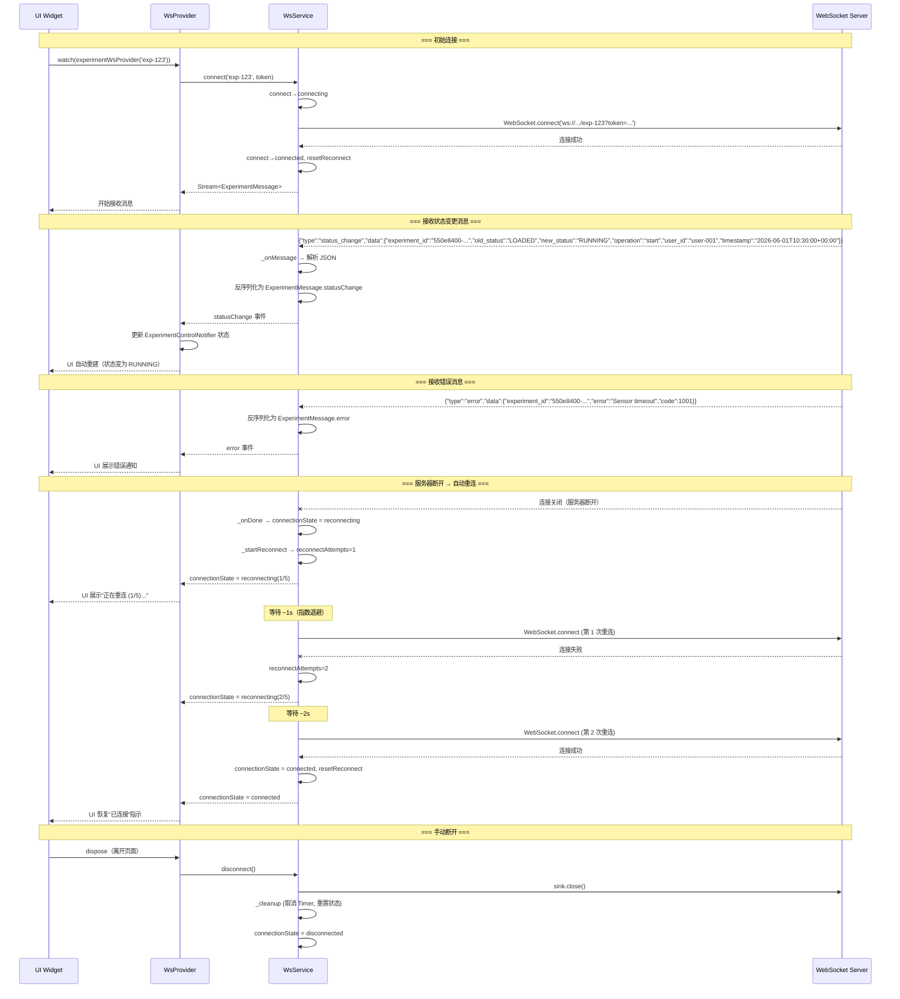
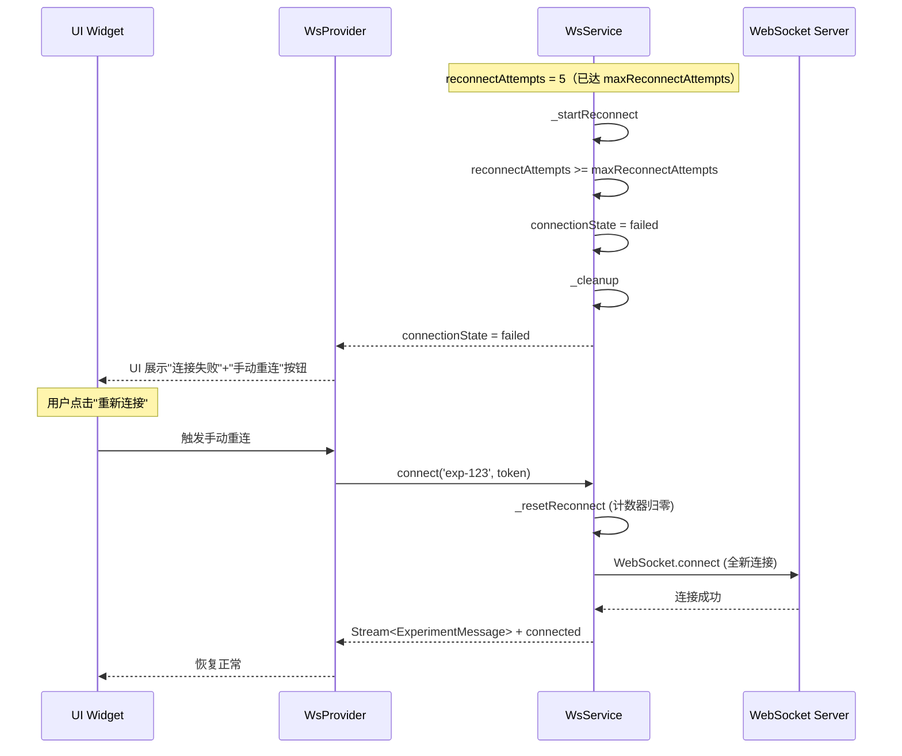
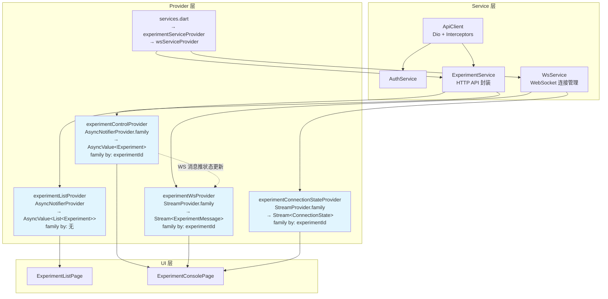
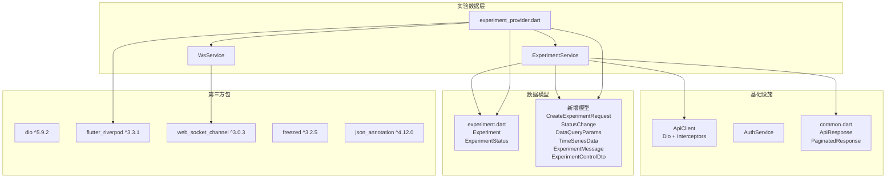

# TASK-020 详细设计 — 试验 Service + Provider + WebSocket 连接管理

> **作者**: sw-tom (Software Developer)
> **日期**: 2026-06-01
> **状态**: Draft
> **关联任务**: TASK-020（试验 Service + Provider + WebSocket）
> **测试用例**: `log/release_3/test/TASK-020_test_cases.md`（82 项）
> **PRD 章节**: M8 试验执行控制台

---

## 1. 概述

构建试验（Experiment）数据层基础设施，包含 3 个核心组件：

| 组件 | 文件 | 职责 |
|------|------|------|
| **ExperimentService** | `lib/services/experiment_service.dart` | HTTP API 封装（CRUD + 控制 + 数据查询） |
| **WsService** | `lib/services/ws_service.dart` | WebSocket 连接管理（连接/断开/重连/消息解析） |
| **ExperimentProvider** | `lib/providers/experiment_provider.dart` | Riverpod 状态管理（列表/详情/WS 流） |

### 1.1 核心状态类型

```dart
// ExperimentListNotifier — AsyncValue<List<Experiment>>
// - AsyncLoading — 初始加载 / 刷新
// - AsyncData — 加载成功（可能为空列表）
// - AsyncError — 加载失败

// ExperimentControlNotifier — AsyncValue<Experiment>
// - AsyncLoading — 加载详情 / 执行控制操作
// - AsyncData — 详情加载成功 / 控制操作完成
// - AsyncError — 操作失败

// ConnectionState — WsService 连接状态枚举
// - disconnected — 已断开
// - connecting — 连接中
// - connected — 已连接
// - reconnecting — 自动重连中
// - failed — 重连达上限，已失败
```

### 1.2 新增数据模型

需要新增以下模型类，均在 `lib/models/` 中：

| 模型 | 来源 | 用途 |
|------|------|------|
| `CreateExperimentRequest` | 新建 | 创建试验请求体 |
| `StatusChange` | 新建 | 状态变更历史记录 |
| `DataQueryParams` | 新建 | 数据查询请求体 |
| `TimeSeriesData` | 新建 | 时序数据响应 |
| `ExperimentMessage` | 新建 | WebSocket 消息（sealed class） |
| `ExperimentControlDto` | 新建 | 控制操作响应 |

---

## 2. 类图

```mermaid
classDiagram
    class ExperimentService {
        -ApiClient _client
        +ExperimentService(ApiClient)
        +list({int page, int size, ExperimentStatus? status, DateTime? createdAfter, DateTime? createdBefore, String? scope}) Future~PaginatedResponse~Experiment~~
        +getById(String id) Future~Experiment~
        +create(CreateExperimentRequest req) Future~Experiment~
        +load(String id, {String methodId}) Future~ExperimentControlDto~
        +start(String id) Future~ExperimentControlDto~
        +pause(String id) Future~ExperimentControlDto~
        +resume(String id) Future~ExperimentControlDto~
        +stop(String id) Future~ExperimentControlDto~
        +getStatus(String id) Future~ExperimentStatusDto~
        +getHistory(String id) Future~List~StatusChange~~
        +queryData(String id, {required String deviceId, DataQueryParams params}) Future~TimeSeriesData~
    }

    class WsService {
        -WebSocketChannel? _channel
        -StreamController~ExperimentMessage~? _controller
        -StreamController~ConnectionState~ _connectionStateController
        -Timer? _reconnectTimer
        -int _reconnectAttempts
        -String? _currentExperimentId
        -bool _disposed
        +static const int maxReconnectAttempts
        +static const Duration maxReconnectDelay
        +WsService()
        +connect(String experimentId, String token) Stream~ExperimentMessage~
        +disconnect() void
        +reconnect() void
        +get connectionState Stream~ConnectionState~
        +get currentConnectionState ConnectionState
        +get reconnectAttempts int
        +get isConnected bool
        -_nextReconnectDelay() Duration
        -_tryConnect(String experimentId, String token) Future~void~
        -_onMessage(dynamic message) void
        -_onDone() void
        -_startReconnect() void
        -_resetReconnect() void
        -_cleanup() void
    }

    class ExperimentListNotifier {
        -int _currentPage
        -int _pageSize
        -int _total
        -ExperimentStatus? _statusFilter
        -DateTime? _createdAfter
        -DateTime? _createdBefore
        -String? _scope
        +ExperimentListNotifier()
        +build() Future~List~Experiment~~
        +refresh() Future~void~
        +loadMore() Future~void~
        +setFilter({ExperimentStatus? status, DateTime? createdAfter, DateTime? createdBefore, String? scope}) Future~void~
        + get total int
        + get hasNext bool
        + get hasPrev bool
    }

    class ExperimentControlNotifier {
        -String _experimentId
        -bool _isOperationInProgress
        +ExperimentControlNotifier(String)
        +build() Future~Experiment~
        +load({required String methodId}) Future~void~
        +start() Future~void~
        +pause() Future~void~
        +resume() Future~void~
        +stop() Future~void~
        +loadHistory() Future~List~StatusChange~~
        +get isOperationInProgress bool
        -_executeControl(String action, Future~ExperimentControlDto~ Function() call) Future~void~
        -_validateStateTransition(String action) bool
        -_mapError(Object) String
    }

    ExperimentService ..> ApiClient : 使用
    ExperimentService ..> PaginatedResponse : 返回
    ExperimentService ..> Experiment : 返回
    ExperimentService ..> ExperimentStatusDto : 返回
    ExperimentService ..> StatusChange : 返回
    ExperimentService ..> TimeSeriesData : 返回

    WsService ..> ExperimentMessage : 产生
    WsService ..> ConnectionState : 暴露

    ExperimentListNotifier ..> ExperimentService : 调用
    ExperimentControlNotifier ..> ExperimentService : 调用
    ExperimentControlNotifier ..> ExperimentStatus : 使用
    ExperimentControlNotifier ..> WsService : 可选依赖
    ExperimentControlNotifier ..> Experiment : 管理

    ExperimentListNotifier --|> AutoDisposeAsyncNotifier : 继承
    ExperimentControlNotifier --|> AutoDisposeAsyncNotifier : 继承
```

---

## 3. Experiment 状态机

```mermaid
stateDiagram-v2
    [*] --> IDLE: 创建
    IDLE --> LOADED: load(methodId)
    LOADED --> RUNNING: start
    RUNNING --> PAUSED: pause
    PAUSED --> RUNNING: resume
    RUNNING --> LOADED: stop
    PAUSED --> LOADED: stop
    note right of IDLE: 初始状态
    note right of LOADED: 方法已载入，准备执行
    note right of RUNNING: 正在执行
    note right of PAUSED: 已暂停，计时停止
    note right of COMPLETED: 正常完成，终态
    note right of ABORTED: 异常终止，终态
```

### 3.1 状态合法性校验矩阵

| 当前状态 \\ 操作 | load | start | pause | resume | stop |
|-----------------|:----:|:-----:|:-----:|:------:|:----:|
| **IDLE** | ✅ | ❌ | ❌ | ❌ | ❌ |
| **LOADED** | ❌ | ✅ | ❌ | ❌ | ❌ |
| **RUNNING** | ❌ | ❌ | ✅ | ❌ | ✅ |
| **PAUSED** | ❌ | ❌ | ❌ | ✅ | ✅ |
| **COMPLETED** | ❌ | ❌ | ❌ | ❌ | ❌ |
| **ABORTED** | ❌ | ❌ | ❌ | ❌ | ❌ |

> 注：`COMPLETED` 和 `ABORTED` 为终态，不支持任何后续操作。`load` 仅在 `IDLE` 状态可用（后端仅允许 `Idle→Loaded` 转换）。

---

## 4. WebSocket 连接管理流程

### 4.1 连接/重连/消息处理时序



### 4.2 重连达到上限流程



---

## 5. Provider 数据流



### 5.1 数据流说明

1. **列表加载流**：
   - `ExperimentListPage` → `watch(experimentListProvider)` → `ExperimentListNotifier.build()` → `ref.read(experimentServiceProvider).list(...)` → HTTP GET → `AsyncData<List<Experiment>>`
   - 筛选/搜索：`notifier.setFilter(...)` → 重置内部参数 → 重新执行 `build()`
   - 更多加载：`notifier.loadMore()` → page+1 → 追加到现有列表

2. **控制台流**：
   - `ExperimentConsolePage` → `watch(experimentControlProvider(experimentId))` → `ExperimentControlNotifier.build()` → HTTP GET detail → `AsyncData<Experiment>`
   - 控制操作：`notifier.start()` → `_executeControl('start', service.start)` → 乐观更新 → HTTP POST → 确认更新
   - WS 订阅：`watch(experimentWsProvider(experimentId))` → WsService.connect → Stream → WS 消息 → 触发 controlProvider 刷新

3. **WebSocket 生命周期**：
   - 进入控制台 → `experimentWsProvider` 自动连接 → `WsService.connect`
   - 离开控制台 → Provider dispose → `WsService.disconnect()` → 自动清理
   - 连接状态变化 → `experimentConnectionStateProvider` → UI 连接指示灯

### 5.2 Provider 定义

```dart
// ============================================================
// Service Provider（在 services.dart 中）
// ============================================================

/// ExperimentService Provider
final experimentServiceProvider = Provider<ExperimentService>((ref) {
  return ExperimentService(ref.read(apiClientProvider));
});

/// WsService Provider（单例）
final wsServiceProvider = Provider<WsService>((ref) {
  return WsService();
});

// ============================================================
// 列表 Provider（在 experiment_provider.dart 中）
// ============================================================

/// 试验列表 Provider
final experimentListProvider = AsyncNotifierProvider<
  AutoDisposeAsyncNotifier<List<Experiment>>,
  List<Experiment>
>(
  ExperimentListNotifier.new,
);

// ============================================================
// 控制 Provider（family by experimentId）
// ============================================================

/// 试验控制 Provider
final experimentControlProvider = AsyncNotifierProvider.family<
  AutoDisposeAsyncNotifier<Experiment>,
  Experiment,
  String
>(
  ExperimentControlNotifier.new,
);

// ============================================================
// WebSocket Stream Provider（family by experimentId）
// ============================================================

/// WebSocket 消息流 Provider（自动连接/断开）
final experimentWsProvider = StreamProvider.family<ExperimentMessage, String>(
  (ref, experimentId) {
    final wsService = ref.read(wsServiceProvider);
    final authService = ref.read(authServiceProvider);
    final token = authService.accessToken ?? '';
    
    final stream = wsService.connect(experimentId, token);
    
    // Provider 销毁时自动断开
    ref.onDispose(() {
      wsService.disconnect();
    });
    
    return stream;
  },
);

/// WebSocket 连接状态 Provider
final experimentConnectionStateProvider = StreamProvider.family<ConnectionState, String>(
  (ref, experimentId) {
    final wsService = ref.read(wsServiceProvider);
    return wsService.connectionState;
  },
);
```

---

## 6. 接口定义

### 6.1 ExperimentService — `lib/services/experiment_service.dart`

遵循 `DeviceService` 的命名参数风格和 `ApiResponse` 解析模式。

```dart
class ExperimentService {
  ExperimentService(this._client);
  
  final ApiClient _client;

  /// 获取试验列表（支持分页、筛选）
  Future<PaginatedResponse<Experiment>> list({
    int page = 1,                    // 页码，从 1 开始
    int size = 10,                   // 每页条数（与后端默认值一致）
    ExperimentStatus? status,        // 状态筛选（单值）
    DateTime? createdAfter,          // 创建时间下限
    DateTime? createdBefore,         // 创建时间上限
    String? scope,                   // 范围: 'personal' | 'team'
  });

  /// 根据 ID 获取试验详情
  Future<Experiment> getById(String id);

  /// 创建试验
  Future<Experiment> create(CreateExperimentRequest request);

  /// 载入试验方法
  Future<ExperimentControlDto> load(String id, {required String methodId});

  /// 开始试验
  Future<ExperimentControlDto> start(String id);

  /// 暂停试验
  Future<ExperimentControlDto> pause(String id);

  /// 继续试验
  Future<ExperimentControlDto> resume(String id);

  /// 停止试验（回到 LOADED 状态）
  Future<ExperimentControlDto> stop(String id);

  /// 获取试验当前状态
  ///
  /// 返回 ExperimentStatusDto（包含 id/name/status/methodId/startedAt/endedAt/updatedAt）
  /// 注意：并非简单的枚举值，而是结构化 DTO
  Future<ExperimentStatusDto> getStatus(String id);

  /// 获取状态变更历史
  Future<List<StatusChange>> getHistory(String id);

  /// 查询试验时序数据
  Future<TimeSeriesData> queryData(
    String id, {
    required String deviceId,
    required DataQueryParams params,
  });
}
```

#### 6.1.1 内部实现要点

```dart
// === list 方法实现模式 ===
Future<PaginatedResponse<Experiment>> list({...}) async {
  final queryParams = <String, dynamic>{};
  
  if (status != null) {
    // 枚举序列化为 UPPER_CASE 字符串
    queryParams['status'] = status.name.toUpperCase();
  }
  if (createdAfter != null) {
    queryParams['created_after'] = createdAfter.toUtc().toIso8601String();
  }
  if (createdBefore != null) {
    queryParams['created_before'] = createdBefore.toUtc().toIso8601String();
  }
  if (scope != null) queryParams['scope'] = scope;
  
  queryParams['page'] = page;
  queryParams['size'] = size;
  
  final response = await _client.get(
    '/api/v1/experiments',
    queryParameters: queryParams,
  );
  
  final apiResponse = ApiResponse<PaginatedResponse<Experiment>>.fromJson(
    response.data as Map<String, dynamic>,
    (json) => PaginatedResponse<Experiment>.fromJson(
      json as Map<String, dynamic>,
      (item) => Experiment.fromJson(item as Map<String, dynamic>),
    ),
  );
  
  return apiResponse.data;
}

// === 控制方法实现模式 ===
// 所有控制操作（load/start/pause/resume/stop）返回完整的 ExperimentControlDto，
// 而非仅状态变更信息。响应示例：
// {
//   "code": 200,
//   "message": "success",
//   "data": {
//     "id": "550e8400-e29b-41d4-a716-446655440000",
//     "name": "Temperature Test",
//     "status": "RUNNING",
//     "method_id": "m-001",
//     "description": "Optional description",
//     "started_at": "2026-06-01T10:30:00+00:00",
//     "ended_at": null,
//     "created_at": "2026-06-01T10:00:00+00:00",
//     "updated_at": "2026-06-01T10:30:00+00:00"
//   },
//   "timestamp": "2026-06-01T10:30:00+00:00"
// }
Future<ExperimentControlDto> start(String id) async {
  final response = await _client.post('/api/v1/experiments/$id/start');
  
  // 控制操作返回 ApiResponse<ExperimentControlDto>
  final apiResponse = ApiResponse<ExperimentControlDto>.fromJson(
    response.data as Map<String, dynamic>,
    (json) => ExperimentControlDto.fromJson(json as Map<String, dynamic>),
  );
  
  return apiResponse.data;
}

// === getStatus 实现模式 ===
// GET /api/v1/experiments/{id}/status 返回 ExperimentStatusDto
// {
//   "code": 200,
//   "message": "success",
//   "data": {
//     "id": "550e8400-e29b-41d4-a716-446655440000",
//     "name": "Temperature Test",
//     "status": "RUNNING",
//     "method_id": "m-001",
//     "started_at": "2026-06-01T10:30:00+00:00",
//     "ended_at": null,
//     "updated_at": "2026-06-01T10:30:00+00:00"
//   },
//   "timestamp": "2026-06-01T10:30:00+00:00"
// }
Future<ExperimentStatusDto> getStatus(String id) async {
  final response = await _client.get('/api/v1/experiments/$id/status');
  
  final apiResponse = ApiResponse<ExperimentStatusDto>.fromJson(
    response.data as Map<String, dynamic>,
    (json) => ExperimentStatusDto.fromJson(json as Map<String, dynamic>),
  );
  
  return apiResponse.data;
}
```

// === getHistory 实现模式 ===
// GET /api/v1/experiments/{id}/history 返回 List<StatusChange>
// 响应示例：
// {
//   "code": 200,
//   "message": "success",
//   "data": [
//     {
//       "id": "log-001",
//       "experiment_id": "550e8400-e29b-41d4-a716-446655440000",
//       "previous_state": "LOADED",
//       "new_state": "RUNNING",
//       "operation": "start",
//       "user_id": "user-001",
//       "timestamp": "2026-06-01T10:30:00+00:00",
//       "error_message": null
//     }
//   ],
//   "timestamp": "2026-06-01T10:30:00+00:00"
// }
Future<List<StatusChange>> getHistory(String id) async {
  final response = await _client.get('/api/v1/experiments/$id/history');
  
  final apiResponse = ApiResponse<List<StatusChange>>.fromJson(
    response.data as Map<String, dynamic>,
    (json) => (json as List<dynamic>)
        .map((e) => StatusChange.fromJson(e as Map<String, dynamic>))
        .toList(),
  );
  
  return apiResponse.data;
}

// === load 方法（需要请求体） ===
// POST /api/v1/experiments/{id}/load  body: {"method_id": "m-001"}
Future<ExperimentControlDto> load(String id, {required String methodId}) async {
  final response = await _client.post(
    '/api/v1/experiments/$id/load',
    data: {'method_id': methodId},
  );
  
  final apiResponse = ApiResponse<ExperimentControlDto>.fromJson(
    response.data as Map<String, dynamic>,
    (json) => ExperimentControlDto.fromJson(json as Map<String, dynamic>),
  );
  
  return apiResponse.data;
}
```

### 6.2 WsService — `lib/services/ws_service.dart`

```dart
/// WebSocket 连接状态
enum ConnectionState {
  disconnected,   // 已断开（初始/手动断开）
  connecting,     // 首次连接中
  connected,      // 已连接
  reconnecting,   // 自动重连中
  failed,         // 重连达到上限
}

/// WsService — WebSocket 连接管理
///
/// 职责：
/// 1. 建立/维护 WebSocket 连接到后端 ws://host/ws/experiments/{id}
/// 2. 自动重连（指数退避：1s, 2s, 4s, 8s, 8s，最多 5 次）
/// 3. 消息解析（JSON tagged union → ExperimentMessage）
/// 4. 连接状态通知
///
/// 使用方式：
/// ```dart
/// final stream = wsService.connect('exp-123', 'jwt-token');
/// stream.listen((msg) { ... });
/// wsService.connectionState.listen((state) { ... });
/// ```
class WsService {
  WsService();
  
  static const int maxReconnectAttempts = 5;
  static const Duration maxReconnectDelay = Duration(seconds: 8);
  
  WebSocketChannel? _channel;
  StreamController<ExperimentMessage>? _controller;
  Timer? _reconnectTimer;
  int _reconnectAttempts = 0;
  String? _currentExperimentId;
  String? _currentToken;
  bool _disposed = false;
  
  final BehaviorSubject<ConnectionState> _connectionStateSubject =
    BehaviorSubject<ConnectionState>.seeded(ConnectionState.disconnected);

  /// 连接 WebSocket，返回消息流
  ///
  /// [experimentId] 试验 ID
  /// [token] JWT Token（作为查询参数传递）
  /// 返回 [Stream]<[ExperimentMessage]> 消息流
  Stream<ExperimentMessage> connect(String experimentId, String token);

  /// 手动断开 WebSocket 连接
  void disconnect();

  /// 手动重新连接（在 failed 状态下调用）
  void reconnect();

  /// 连接状态流
  Stream<ConnectionState> get connectionState;
  
  /// 当前连接状态
  ConnectionState get currentConnectionState;
  
  // ---- 内部方法 ----
  
  /// 计算下次重连延迟（指数退避，上限 8s）
  Duration _nextReconnectDelay();
  
  /// 尝试建立连接
  Future<void> _tryConnect(String experimentId, String token);
  
  /// 收到消息处理
  void _onMessage(dynamic message);
  
  /// 连接关闭处理
  void _onDone();
  
  /// 启动重连流程
  void _startReconnect();
  
  /// 重置重连计数器
  void _resetReconnect();
  
  /// 清理资源
  void _cleanup();
}
```

#### 6.2.1 核心逻辑伪代码

```dart
Stream<ExperimentMessage> connect(String experimentId, String token) {
  // 如果已有连接且 ID 相同，直接返回现有流
  if (_currentExperimentId == experimentId && _channel != null) {
    return _controller!.stream;
  }
  
  // 如果已有连接但 ID 不同，先断开
  if (_channel != null) {
    disconnect();
  }
  
  _currentExperimentId = experimentId;
  _currentToken = token;
  _resetReconnect();
  
  // 创建新的 StreamController（广播模式，支持多订阅）
  _controller = StreamController<ExperimentMessage>.broadcast();
  
  // 开始连接
  _tryConnect(experimentId, token);
  
  return _controller!.stream;
}

Future<void> _tryConnect(String experimentId, String token) async {
  _connectionStateSubject.add(
    _reconnectAttempts > 0 ? ConnectionState.reconnecting : ConnectionState.connecting,
  );
  
  try {
    final uri = Uri.parse('ws://localhost:8080/ws/experiments/$experimentId')
      .replace(queryParameters: {'token': token});
    
    _channel = WebSocketChannel.connect(uri);
    
    // 等待连接建立确认
    await _channel!.ready;
    
    // 连接成功
    _resetReconnect();
    _connectionStateSubject.add(ConnectionState.connected);
    
    // 订阅消息
    _channel!.stream.listen(
      _onMessage,
      onDone: _onDone,
      onError: (error) {
        // 单条消息解析失败不关闭连接
        _controller?.addError(error);
      },
      cancelOnError: false,  // 重要：不让单个错误关闭流
    );
  } catch (e) {
    // 连接失败，触发重连
    _onDone();
  }
}

void _onMessage(dynamic message) {
  if (_controller == null || _controller!.isClosed) return;
  
  try {
    if (message is String) {
      final json = jsonDecode(message) as Map<String, dynamic>;
      final type = json['type'] as String?;
      
      switch (type) {
        case 'status_change':
          final data = json['data'] as Map<String, dynamic>;
          _controller!.add(ExperimentMessage.statusChange(
            StatusChangeData.fromJson(data),
          ));
          break;
        case 'error':
          final data = json['data'] as Map<String, dynamic>;
          _controller!.add(ExperimentMessage.wsError(
            WsErrorData.fromJson(data),
          ));
          break;
        default:
          // 未知类型消息跳过，不崩溃
          break;
      }
    }
  } catch (e) {
    // 解析失败不崩溃，记录日志
    // 不关闭 Stream
  }
}

void _onDone() {
  _channel = null;
  
  if (_disposed) return;
  if (_reconnectAttempts >= maxReconnectAttempts) {
    _connectionStateSubject.add(ConnectionState.failed);
    _controller?.close();
    return;
  }
  
  _reconnectAttempts++;
  _connectionStateSubject.add(ConnectionState.reconnecting);
  
  final delay = _nextReconnectDelay();
  _reconnectTimer = Timer(delay, () {
    _tryConnect(_currentExperimentId!, _currentToken!);
  });
}

Duration _nextReconnectDelay() {
  final seconds = pow(2, _reconnectAttempts - 1).toInt();
  final capped = seconds > maxReconnectDelay.inSeconds 
    ? maxReconnectDelay.inSeconds 
    : seconds;
  return Duration(seconds: capped);
}
```

### 6.3 ExperimentProvider — `lib/providers/experiment_provider.dart`

#### 6.3.1 ExperimentListNotifier

```dart
/// ExperimentListNotifier — 试验列表状态管理器
///
/// 管理试验列表的完整生命周期，包括：
/// 1. 初始加载（build）
/// 2. 筛选（setFilter）
/// 3. 分页加载（loadMore）
/// 4. 刷新（refresh）
///
/// 内部维护：
/// - _currentPage / _pageSize — 当前分页状态
/// - _total — 总记录数
/// - 筛选参数 — 状态、创建时间范围、范围
class ExperimentListNotifier extends AutoDisposeAsyncNotifier<List<Experiment>> {
  int _currentPage = 1;
  int _pageSize = 10;
  int _total = 0;
  ExperimentStatus? _statusFilter;
  DateTime? _createdAfter;
  DateTime? _createdBefore;
  String? _scope;

  @override
  Future<List<Experiment>> build();

  /// 刷新列表（回到第 1 页）
  Future<void> refresh();

  /// 加载更多（下一页）
  Future<void> loadMore();

  /// 设置筛选条件，重置到第 1 页
  Future<void> setFilter({
    ExperimentStatus? status,
    DateTime? createdAfter,
    DateTime? createdBefore,
    String? scope,
  });

  int get total => _total;
  bool get hasNext => _currentPage * _pageSize < _total;
  bool get hasPrev => _currentPage > 1;
}
```

#### 6.3.2 ExperimentControlNotifier

```dart
/// ExperimentControlNotifier — 试验控制状态管理器
///
/// 管理单个试验的详情和控制操作。
/// 使用 family 方式按 experimentId 区分。
///
/// 职责：
/// 1. 加载试验详情（build）
/// 2. 执行生命周期控制操作（load/start/pause/resume/stop）
/// 3. 状态合法性校验（防误操作）
/// 4. 防重复提交
/// 5. 加载状态历史
class ExperimentControlNotifier extends AutoDisposeAsyncNotifier<Experiment> {
  ExperimentControlNotifier(this._experimentId);
  
  final String _experimentId;
  bool _isOperationInProgress = false;

  @override
  Future<Experiment> build();

  /// 载入试验方法
  Future<void> load({required String methodId});

  /// 开始试验
  Future<void> start();

  /// 暂停试验
  Future<void> pause();

  /// 继续试验
  Future<void> resume();

  /// 停止试验
  Future<void> stop();

  /// 获取状态变更历史
  Future<List<StatusChange>> loadHistory();

  bool get isOperationInProgress => _isOperationInProgress;
  
  // 内部方法
  void _validateStateTransition(String action);
  Future<void> _executeControl(String action, Future<ExperimentControlDto> Function() call);
  String _mapError(Object error);
}
```

#### 6.3.3 控制操作通用流程

```dart
/// 控制操作通用执行模式
///
/// 1. 校验状态合法性（前端快速校验）
/// 2. 防重复提交检测
/// 3. 设置 loading 状态
/// 4. 调用 ExperimentService
/// 5. 成功后更新本地状态（Experiment 的 status 字段）
/// 6. 失败后恢复为之前的状态
Future<void> _executeControl(
  String action,
  Future<ExperimentControlDto> Function() call,
) async {
  // 1. 状态校验
  _validateStateTransition(action);
  
  // 2. 防重复提交
  if (_isOperationInProgress) {
    throw StateError('操作正在进行中，请稍后重试');
  }
  
  _isOperationInProgress = true;
  final previousState = state;
  state = const AsyncLoading();
  
  try {
    final controlDto = await call();
    
    // 3. 使用控制操作返回的 DTO 更新本地状态
    //    ExperimentControlDto 包含完整的试验字段（全量），
    //    但 Provider 仅需从其中提取 status 和 startedAt 更新本地 Experiment 对象。
    if (state.hasValue) {
      final current = state.valueOrNull;
      if (current != null) {
        // 注意：controlDto.status 是字符串（如 "RUNNING"），
        // 需要映射回 ExperimentStatus 枚举
        final newStatus = ExperimentStatus.values.firstWhere(
          (e) => e.name.toUpperCase() == controlDto.status,
          orElse: () => current.status,
        );
        state = AsyncData(current.copyWith(
          status: newStatus,
          startedAt: controlDto.startedAt != null
              ? DateTime.tryParse(controlDto.startedAt!) ?? current.startedAt
              : current.startedAt,
        ));
      }
    }
  } catch (e, st) {
    // 4. 失败恢复
    state = AsyncError(_mapError(e), st);
  } finally {
    _isOperationInProgress = false;
  }
}
```

---

## 7. 新增数据模型

### 7.1 CreateExperimentRequest

```dart
/// 创建试验请求
@JsonSerializable()
class CreateExperimentRequest {
  final String name;
  @JsonKey(name: 'method_id')
  final String? methodId;
  final String? description;

  const CreateExperimentRequest({
    required this.name,
    this.methodId,
    this.description,
  });

  factory CreateExperimentRequest.fromJson(Map<String, dynamic> json) =>
      _$CreateExperimentRequestFromJson(json);
  Map<String, dynamic> toJson() => _$CreateExperimentRequestToJson(this);
}
```

### 7.2 StatusChange

```dart
/// 状态变更记录
///
/// 对应后端 StateChangeLogDto：
/// - id, experiment_id, previous_state, new_state, operation
/// - user_id, timestamp, error_message（可选）
@JsonSerializable()
class StatusChange {
  final String id;
  @JsonKey(name: 'experiment_id')
  final String experimentId;
  @JsonKey(name: 'previous_state')
  final String previousState;                // e.g. "LOADED" (UPPERCASE)
  @JsonKey(name: 'new_state')
  final String newState;                     // e.g. "RUNNING" (UPPERCASE)
  final String operation;
  @JsonKey(name: 'user_id')
  final String userId;
  final String timestamp;                    // RFC 3339 string
  @JsonKey(name: 'error_message')
  final String? errorMessage;

  const StatusChange({
    required this.id,
    required this.experimentId,
    required this.previousState,
    required this.newState,
    required this.operation,
    required this.userId,
    required this.timestamp,
    this.errorMessage,
  });

  factory StatusChange.fromJson(Map<String, dynamic> json) =>
      _$StatusChangeFromJson(json);
  Map<String, dynamic> toJson() => _$StatusChangeToJson(this);

  /// 便利方法：获取枚举形式的旧/新状态
  ExperimentStatus get previousStatusEnum => _parseStatus(previousState);
  ExperimentStatus get newStatusEnum => _parseStatus(newState);

  static ExperimentStatus _parseStatus(String s) =>
      ExperimentStatus.values.firstWhere(
        (e) => e.name.toUpperCase() == s,
        orElse: () => ExperimentStatus.idle,
      );
}
```

### 7.3 DataQueryParams

```dart
/// 数据查询参数
@JsonSerializable()
class DataQueryParams {
  final List<String> pointIds;
  @JsonKey(name: 'start_time')
  final DateTime? startTime;
  @JsonKey(name: 'end_time')
  final DateTime? endTime;
  final int? downsample;

  const DataQueryParams({
    required this.pointIds,
    this.startTime,
    this.endTime,
    this.downsample,
  });

  factory DataQueryParams.fromJson(Map<String, dynamic> json) =>
      _$DataQueryParamsFromJson(json);
  Map<String, dynamic> toJson() => _$DataQueryParamsToJson(this);
}
```

### 7.4 TimeSeriesData

```dart
/// 时序数据响应
@JsonSerializable()
class TimeSeriesData {
  final String deviceId;
  final List<DateTime> timestamps;
  final Map<String, List<double?>> values;  // pointId → values[]

  const TimeSeriesData({
    required this.deviceId,
    required this.timestamps,
    required this.values,
  });

  factory TimeSeriesData.fromJson(Map<String, dynamic> json) =>
      _$TimeSeriesDataFromJson(json);
  Map<String, dynamic> toJson() => _$TimeSeriesDataToJson(this);
}
```

### 7.5 ExperimentMessage（Sealed Class）

```dart
/// WebSocket 消息（tagged union）
///
/// 使用 freezed 实现 sealed class：
/// - ExperimentMessage.statusChange(StatusChangeData data) — 状态变更
/// - ExperimentMessage.wsError(WsErrorData data) — 错误消息
///
/// 使用 freezed 的 when/ map 方法进行模式匹配。
@Freezed(unionKey: 'type')
sealed class ExperimentMessage with _$ExperimentMessage {
  const factory ExperimentMessage.statusChange({
    @FreezedUnionValue('status_change')
    required StatusChangeData data,
  }) = StatusChangeMessage;

  const factory ExperimentMessage.wsError({
    @FreezedUnionValue('error')
    required WsErrorData data,
  }) = WsErrorMessage;
}

/// 状态变更数据
///
/// 对应后端 WsMessage::StatusChange:
/// ```json
/// {
///   "type": "status_change",
///   "data": {
///     "experiment_id": "550e8400-...",
///     "old_status": "LOADED",
///     "new_status": "RUNNING",
///     "operation": "start",
///     "user_id": "user-001",
///     "timestamp": "2026-06-01T10:30:00+00:00"
///   }
/// }
/// ```
@Freezed()
class StatusChangeData with _$StatusChangeData {
  const factory StatusChangeData({
    @JsonKey(name: 'experiment_id') required String experimentId,
    @JsonKey(name: 'old_status') required String oldStatus,
    @JsonKey(name: 'new_status') required String newStatus,
    required String operation,
    @JsonKey(name: 'user_id') required String userId,
    required String timestamp,
  }) = _StatusChangeData;

  factory StatusChangeData.fromJson(Map<String, dynamic> json) =>
      _$StatusChangeDataFromJson(json);
}

/// WebSocket 错误数据
///
/// 对应后端 WsMessage::Error:
/// ```json
/// {
///   "type": "error",
///   "data": {
///     "experiment_id": "550e8400-...",
///     "error": "Sensor timeout",
///     "code": 1001
///   }
/// }
/// ```
@Freezed()
class WsErrorData with _$WsErrorData {
  const factory WsErrorData({
    @JsonKey(name: 'experiment_id') required String experimentId,
    required String error,
    required int code,
  }) = _WsErrorData;

  factory WsErrorData.fromJson(Map<String, dynamic> json) =>
      _$WsErrorDataFromJson(json);
}
```

### 7.6 ExperimentControlDto

```dart
/// 控制操作响应 DTO
///
/// 在控制操作（load/start/pause/resume/stop）成功后返回。
/// 注意：后端返回的是**完整的试验实体**（全量字段），而非仅状态变更信息。
/// 与 Experiment 模型的区别：所有字段均为 String 类型（日期已序列化）。
@JsonSerializable()
class ExperimentControlDto {
  final String id;
  final String name;
  final String status;                       // e.g. "RUNNING" (UPPERCASE)
  @JsonKey(name: 'method_id')
  final String? methodId;
  final String? description;
  @JsonKey(name: 'started_at')
  final String? startedAt;
  @JsonKey(name: 'ended_at')
  final String? endedAt;
  @JsonKey(name: 'created_at')
  final String createdAt;
  @JsonKey(name: 'updated_at')
  final String updatedAt;

  const ExperimentControlDto({
    required this.id,
    required this.name,
    required this.status,
    this.methodId,
    this.description,
    this.startedAt,
    this.endedAt,
    required this.createdAt,
    required this.updatedAt,
  });

  factory ExperimentControlDto.fromJson(Map<String, dynamic> json) =>
      _$ExperimentControlDtoFromJson(json);
  Map<String, dynamic> toJson() => _$ExperimentControlDtoToJson(this);

  /// 将字符串状态映射为 ExperimentStatus 枚举
  ExperimentStatus get statusEnum => ExperimentStatus.values.firstWhere(
    (e) => e.name.toUpperCase() == status,
    orElse: () => ExperimentStatus.idle,
  );

  /// 便利方法：将 status 映射为枚举并判断是否匹配
  bool get isRunning => status == 'RUNNING';
  bool get isPaused => status == 'PAUSED';
  bool get isLoaded => status == 'LOADED';
  bool get isIdle => status == 'IDLE';
  bool get isCompleted => status == 'COMPLETED';
  bool get isAborted => status == 'ABORTED';
}
```

> **重要说明**：`ExperimentControlDto` 的字段与 `Experiment` 实体几乎相同，但区别在于所有日期值以字符串形式返回（RFC 3339 格式），而 `Experiment` 会解析为 `DateTime` 对象。Provider 层可通过 `controlDto.status` 读取状态字符串，或使用 `statusEnum` 转换为枚举进行比较。

### 7.7 ExperimentStatusDto

```dart
/// 状态查询 GET /api/v1/experiments/{id}/status 响应 DTO
///
/// 对应后端 ExperimentStatusDto，是 ExperimentControlDto 的子集：
/// - 包含 id, name, status, method_id, started_at, ended_at, updated_at
/// - 不包含 description, created_at
@JsonSerializable()
class ExperimentStatusDto {
  final String id;
  final String name;
  final String status;                       // e.g. "RUNNING" (UPPERCASE)
  @JsonKey(name: 'method_id')
  final String? methodId;
  @JsonKey(name: 'started_at')
  final String? startedAt;
  @JsonKey(name: 'ended_at')
  final String? endedAt;
  @JsonKey(name: 'updated_at')
  final String updatedAt;

  const ExperimentStatusDto({
    required this.id,
    required this.name,
    required this.status,
    this.methodId,
    this.startedAt,
    this.endedAt,
    required this.updatedAt,
  });

  factory ExperimentStatusDto.fromJson(Map<String, dynamic> json) =>
      _$ExperimentStatusDtoFromJson(json);
  Map<String, dynamic> toJson() => _$ExperimentStatusDtoToJson(this);
}
```

---

## 8. 依赖关系

### 8.1 依赖图



### 8.2 现有代码的复用

| 现有组件 | 文件 | 复用方式 |
|----------|------|----------|
| `ApiClient` | `lib/services/api_client.dart` | ExperimentService 通过构造函数注入 |
| `ApiResponse<T>` | `lib/models/common.dart` | 解析所有 HTTP 响应的外层包装 |
| `PaginatedResponse<T>` | `lib/models/common.dart` | 列表接口的返回类型 |
| `Experiment` | `lib/models/experiment.dart` | 核心实体（现有，已含 status/status 枚举） |
| `ExperimentStatus` | `lib/models/experiment.dart` | 状态枚举（现有，已完整） |
| `authServiceProvider` | `lib/providers/services.dart` | WS 连接获取 Token |
| `apiClientProvider` | `lib/providers/services.dart` | ExperimentService 依赖 |

### 8.3 services.dart 新增注册

```dart
// 在 lib/providers/services.dart 中添加：

/// ExperimentService Provider
final experimentServiceProvider = Provider<ExperimentService>((ref) {
  return ExperimentService(ref.read(apiClientProvider));
});

/// WsService Provider（无状态单例，内部管理连接状态）
final wsServiceProvider = Provider<WsService>((ref) {
  return WsService();
});
```

---

## 9. 与现有代码的一致性说明

### 9.1 遵循的既有模式

| 模式 | 现有代码 | 本设计 |
|------|----------|--------|
| Service 构造注入 ApiClient | `DeviceService(ApiClient)` | `ExperimentService(ApiClient)` |
| 命名参数风格 | `deviceService.create({required name, ...})` | `experimentService.list({int page, ...})` |
| ApiResponse 解析 | `ApiResponse<T>.fromJson(data, fromJsonT)` | 完全相同 |
| 控制操作返回 void | `deviceService.connect(id)` → `Future<void>` | 控制操作返回 `ExperimentControlDto` |
| AsyncNotifierProvider.family | `deviceTreeProvider(String)` | `experimentControlProvider(String)` |
| 防重复提交 | `_isOperationInProgress` + `StateError` | 完全相同 |
| 错误映射 | `_mapError()` + `_mapStatusCode()` | 完全相同 |
| 筛选刷新模式 | `refresh()` → state = AsyncLoading → build | 完全相同 |
| AutoDispose | `AutoDisposeAsyncNotifier` | 完全相同 |

### 9.2 差异说明（有明确理由）

| 差异点 | 现有模式 | 本设计理由 |
|--------|----------|------------|
| 控制操作返回 DTO 而非 void | `connect()` 返回 void | 后端将控制操作视为"状态变更"，返回**完整的试验实体**（`ExperimentControlDto`），包含全量字段（status/startedAt/updatedAt 等），前端从中提取 `status` 和 `startedAt` 更新本地状态 |
| WsService 为独立 Service | 无对应模式 | WebSocket 是长连接，需要独立生命周期管理，不适合封装在常规 Service 中 |
| 使用 `web_socket_channel` | 无 | 后端 WebSocket 协议基于标准 RFC 6455 |
| 列表使用 `PaginatedResponse` | 设备是平铺列表 | 后端 API 规范要求分页 |

### 9.3 目录结构变更

```
lib/
├── models/
│   ├── experiment.dart          # 已存在（仅需补全 copyWith 和 startedAt）
│   ├── experiment.g.dart        # 已存在
│   ├── create_experiment_request.dart    # 新增
│   ├── create_experiment_request.g.dart # 新增
│   ├── status_change.dart               # 新增
│   ├── status_change.g.dart             # 新增
│   ├── data_query_params.dart           # 新增（建议合并写入一次）
│   ├── time_series_data.dart            # 新增（建议合并写入一次）
│   ├── experiment_message.dart          # 新增（freezed sealed class）
│   ├── experiment_message.freezed.dart  # 生成
│   ├── experiment_message.g.dart        # 生成
│   └── experiment_control_dto.dart      # 新增
├── services/
│   ├── experiment_service.dart   # 新增
│   └── ws_service.dart           # 新增
├── providers/
│   ├── services.dart             # 修改（新增 provider 注册）
│   └── experiment_provider.dart  # 新增
```

---

## 10. 状态表达实验 (Experiment) 模型变化

现有 `Experiment` 模型需要添加 `startedAt` 字段（已在构造参数中存在但可能不完整），并确保 `copyWith` 可用。确认现有模型：

```dart
// 现有 Experiment 已包含：
// - id, userId, methodId?, name, description?, status (ExperimentStatus)
// - ownerType, ownerId, startedAt?, endedAt?, createdAt, updatedAt
// - copyWith() — 已实现 ✅
// - fromJson/toJson — 已实现 ✅

// 不修改现有模型，仅在 Provider 控制操作中使用 copyWith 更新 status。
```

---

## 11. WebSocket URL 构建细节

```dart
// 后端 WebSocket 端点格式：
// ws://localhost:8080/ws/experiments/{experiment_id}?token={jwt_token}

// 构建方式：
final uri = Uri.parse('ws://localhost:8080/ws/experiments/$experimentId')
    .replace(queryParameters: {
  'token': token,
});

// 注意：
// 1. 使用 ws:// 而非 wss://（开发环境）
// 2. token 作为查询参数传递（后端解析方式）
// 3. 生产环境应使用 wss://（但当前阶段不需要）
```

---

## 12. 附录：新/修改文件清单

| 操作 | 文件 | 说明 |
|------|------|------|
| **新增** | `lib/models/create_experiment_request.dart` | 创建试验请求 DTO |
| **新增** | `lib/models/status_change.dart` | 状态变更历史记录 |
| **新增** | `lib/models/data_query_params.dart` | 数据查询参数 |
| **新增** | `lib/models/time_series_data.dart` | 时序数据响应 |
| **新增** | `lib/models/experiment_message.dart` | WS 消息 sealed class（freezed） |
| **新增** | `lib/models/experiment_control_dto.dart` | 控制操作响应 DTO |
| **新增** | `lib/services/experiment_service.dart` | 试验 HTTP API 封装 |
| **新增** | `lib/services/ws_service.dart` | WebSocket 连接管理 |
| **新增** | `lib/providers/experiment_provider.dart` | 试验状态管理 |
| **修改** | `lib/providers/services.dart` | 新增 2 个 Provider 注册 |

---

---

## 13. 修订记录

| 日期 | 版本 | 修订人 | 修订说明 |
|------|------|--------|----------|
| 2026-06-01 | v1.0 | sw-tom | 初稿 |
| 2026-06-01 | v1.1 | sw-tom | P0-1: 移除 `complete()`/`abort()` (后端无对应端点)；P0-2: 修正状态验证矩阵对齐后端状态机；P0-3: 列表查询参数 `startedAfter`/`endedBefore` → `createdAfter`/`createdBefore`，移除 `search`；P0-4: `StatusChangeData` 补充 `experimentId` 字段；P0-5: 统一类图控制操作返回类型为 `Future<ExperimentControlDto>` |
| 2026-06-01 | v2.0 | sw-tom | **后端 API 对齐修正**：① `ExperimentControlDto` 改为完整试验实体（id/name/status/methodId/description/startedAt/endedAt/createdAt/updatedAt），移除 `experimentId`/`newStatus`/`operation`/`timestamp`；② 新增 `ExperimentStatusDto` 模型（status 查询子集）；③ `StatusChange` 字段对齐后端 `StateChangeLogDto`（id/experimentId/previousState/newState/operation/userId/timestamp/errorMessage）；④ WS 消息字段补充 `experimentId`/`userId`/`timestamp`；⑤ `getStatus()` 返回 `ExperimentStatusDto` 而非枚举；⑥ `_executeControl` 使用 `controlDto.status`（字符串）映射枚举；⑦ 所有控制操作返回 `ExperimentControlDto` 非 void；⑧ 移除 `search`/`setSearchQuery`（后端无对应参数） |

*设计终稿 v2.0 — 2026-06-01 — sw-tom*
