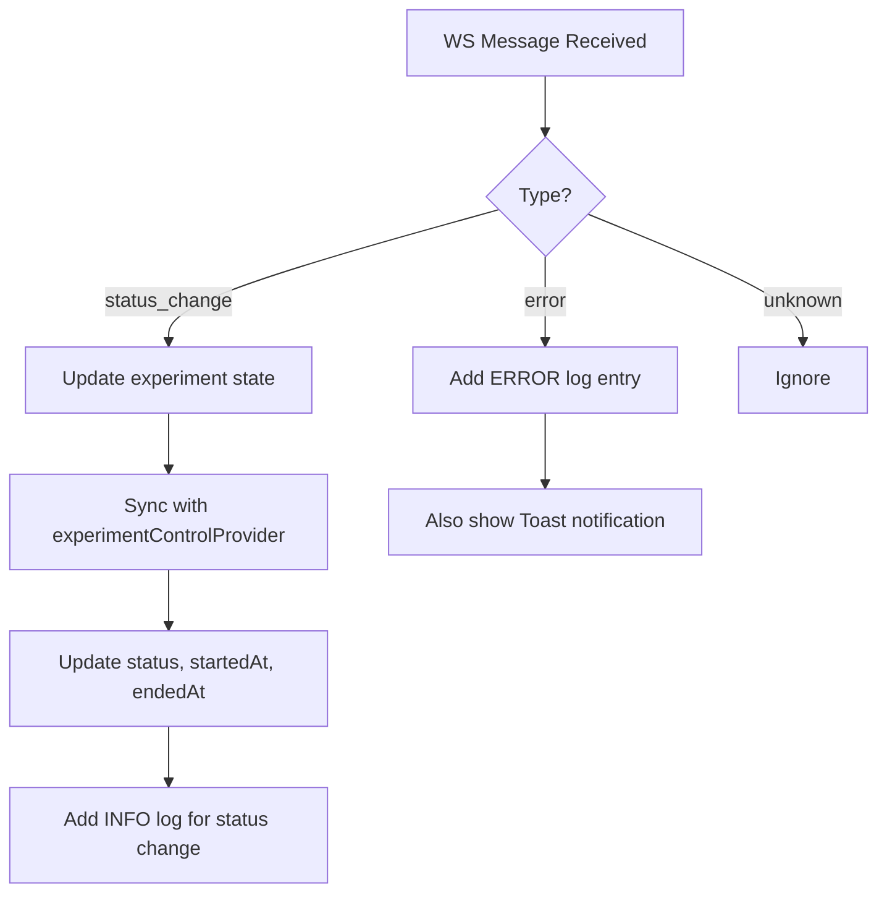

# TASK-023: 试验控制台 — 详细设计文档

> **设计者**: sw-tom
> **日期**: 2026-06-02
> **状态**: 待评审
> **路由**: `/experiments/:id`

---

## 目录

1. [组件树](#1-组件树)
2. [数据流](#2-数据流)
3. [状态管理](#3-状态管理)
4. [接口定义](#4-接口定义)
5. [关键算法](#5-关键算法)
6. [组件设计](#6-组件设计)
7. [响应式布局策略](#7-响应式布局策略)
8. [动画设计](#8-动画设计)

---

## 1. 组件树

```
ExperimentConsolePage (ConsumerStatefulWidget)
├── AppBar (56px, with bottom border)
│   ├── BackButton (Icons.arrow_back → /experiments)
│   ├── ExperimentName (Title Medium, ellipsis)
│   ├── StatusBadge (using status_badge.dart)
│   └── WsConnectionIndicator
│       ├── Dot (10px circle, animated)
│       ├── Text (connection status)
│       └── [optional] ReconnectButton
├── Content Area (flex: 1, responsive Row/Column)
│   ├── ControlPanel (Surface, radiusLarge)
│   │   ├── InfoCard (Surface Container Low)
│   │   │   ├── Workbench Row (Label/Value)
│   │   │   ├── Divider
│   │   │   ├── Method Row (Label/Value)
│   │   │   ├── Divider
│   │   │   └── Created Row (Label/Value)
│   │   ├── ControlButtons
│   │   │   ├── Row1: [Load] [Start] [Pause]
│   │   │   └── Row2: [Resume] [Stop (danger)]
│   │   ├── StatusDisplay (centered)
│   │   │   ├── Label: "Status"
│   │   │   ├── StatusText (large, colored)
│   │   │   └── Subtitle (for terminal states)
│   │   ├── TimerSection (centered)
│   │   │   ├── Label: "Elapsed"
│   │   │   └── TimerValue (monospace HH:MM:SS)
│   │   └── CompletedInfo (for terminal states)
│   │       ├── StartTime Row
│   │       ├── EndTime Row
│   │       ├── TotalDuration Row
│   │       └── [optional] ErrorMessage Row
│   └── LogViewer (Surface, radiusLarge, flex: 1)
│       ├── LogListArea (ScrollController, ListView.builder)
│       │   ├── [Empty] EmptyState
│       │   └── [Has logs] LogEntry × N
│       │       ├── LevelTag ("[INFO]", colored)
│       │       ├── Timestamp ("HH:MM:SS")
│       │       └── Message (monospace, word-wrap)
│       ├── FloatingNewLogsButton (conditional)
│       └── LogControlBar (48px, Surface Container Low)
│           ├── LevelFilter (DropdownButton)
│           └── ClearButton (TextButton)
└── StopConfirmDialog (conditional overlay)
```

---

## 2. 数据流

### 2.1 数据源

| 数据 | 来源 | 方式 |
|------|------|------|
| Experiment 详情 | `experimentControlProvider(id)` | AsyncNotifier (Riverpod) |
| WebSocket 消息 | `experimentWsProvider(id)` | StreamProvider |
| WS 连接状态 | `experimentConnectionStateProvider(id)` | StreamProvider |
| 日志历史 | `ExperimentService.getHistory(id)` | REST API 轮询 (2s interval) |
| 方法名称 | `MethodService.getById(methodId)` | 一次性 HTTP 调用 |

### 2.2 数据流图

```
                   ┌──────────────────────┐
                   │   experimentControl   │
                   │    Provider (family)  │
                   └──────────┬───────────┘
                              │ AsyncValue<Experiment>
                              ▼
                   ┌──────────────────────┐
                   │  ExperimentConsole   │
                   │      Page Widget     │
                   ├──────────────────────┤
                   │ Local State:         │
                   │  - logs[]            │
                   │  - logFilter         │
                   │  - timer Tick        │
                   │  - operationLoading  │
                   │  - isAtBottom        │
                   │  - newLogCount       │
                   │  - methodName        │
                   └──────────────────────┘
                              ▲
                   ┌──────────┴───────────┐
                   │   WS Stream Provider │
                   │  (connection state)  │
                   └──────────────────────┘
                              ▲
                   ┌──────────┴───────────┐
                   │   WS Stream Provider │
                   │  (experiment messages)│
                   └──────────────────────┘
```

### 2.3 WS 消息处理



### 2.4 日志轮询

由于 WebSocket 不支持 `log` 消息类型，采用 REST API 轮询：

```mermaid
flowchart TD
    A[Page Init / RUNNING/PAUSED] --> B[Start Polling Timer]
    B --> C[Every 2s: getHistory(id)]
    C --> D{Has new entries?}
    D -->|Yes| E[Deduplicate + Append]
    D -->|No| F[Wait for next poll]
    E --> G[Auto-scroll if at bottom]
    G --> F
    F --> C
```

---

## 3. 状态管理

### 3.1 本地状态 (ConsumerStatefulWidget)

| 状态变量 | 类型 | 初始值 | 说明 |
|----------|------|--------|------|
| `_logs` | `List<ExperimentLogEntry>` | `[]` | 日志条目列表 |
| `_logFilter` | `LogLevel?` | `null` (全部) | 日志级别筛选 |
| `_elapsed` | `Duration` | `Duration.zero` | 计时器当前值 |
| `_isTimerRunning` | `bool` | `false` | 计时器是否运行 |
| `_timer` | `Timer?` | `null` | 计时器实例 |
| `_activeOperation` | `String?` | `null` | 当前进行的操作 |
| `_scrollController` | `ScrollController` | `ScrollController()` | 日志滚动控制 |
| `_isAtBottom` | `bool` | `true` | 滚动条是否在底部 |
| `_newLogCount` | `int` | `0` | 未读新日志计数 |
| `_methodName` | `String?` | `null` | 缓存的方法名称 |
| `_methodNameLoading` | `bool` | `false` | 方法名称加载状态 |

### 3.2 Provider 监听

```dart
// 监听试验详情
ref.listen(experimentControlProvider(id), (prev, next) {
  next.whenData((experiment) {
    _syncTimerState(experiment);
    _loadMethodName(experiment.methodId);
  });
});

// 监听 WS 消息
ref.listen(experimentWsProvider(id), (prev, next) {
  next.whenData((message) => _handleWsMessage(message));
});

// 监听 WS 连接状态
ref.listen(experimentConnectionStateProvider(id), (prev, next) {
  next.whenData((state) => _updateConnectionState(state));
});
```

### 3.3 操作 Loading 状态

`_activeOperation` 跟踪当前正在执行的操作：
- `null` → 无操作进行中
- `'load'` → 载入中
- `'start'` → 开始中
- `'pause'` → 暂停中
- `'resume'` → 继续中
- `'stop'` → 停止中

当 `_activeOperation != null` 时，所有控制按钮禁用。

---

## 4. 接口定义

### 4.1 ExperimentLogEntry

```dart
enum LogLevel { debug, info, warn, error }

class ExperimentLogEntry {
  const ExperimentLogEntry({
    required this.level,
    required this.timestamp,
    required this.message,
  });

  final LogLevel level;
  final String timestamp;   // "HH:MM:SS"
  final String message;
}
```

### 4.2 StatusChange 状态标识

| 属性 | 方法 | 返回 |
|------|------|------|
| 是否为终态 | `_isTerminal(ExperimentStatus)` | `completed` 或 `aborted` |
| 是否可操作 | `_isActive(ExperimentStatus)` | `running` 或 `paused` |
| 状态颜色 | `statusColor(status, isDark)` | 对应颜色 |
| 状态背景色 | `statusBgColor(status, isDark)` | 带透明度 |

### 4.3 格式化工具

```dart
String formatDuration(Duration d) => '${_pad(d.inHours)}:${_pad(d.inMinutes.remainder(60))}:${_pad(d.inSeconds.remainder(60))}';
String formatDateTime(DateTime dt, {bool use24Hour = true}) → "YYYY-MM-DD HH:mm"
```

---

## 5. 关键算法

### 5.1 计时器算法

```
RUNNING:
  Timer.periodic(1s):
    elapsed = DateTime.now() - experiment.startedAt
    setState → _elapsed = elapsed

PAUSED:
  timer.cancel()
  _elapsed 保持在暂停时刻的值

COMPLETED/ABORTED:
  timer.cancel()
  if startedAt && endedAt:
    _elapsed = endedAt - startedAt
  else:
    _elapsed = Duration.zero

IDLE/LOADED:
  timer.cancel()
  不显示计时器区域
```

### 5.2 日志过滤

```dart
List<ExperimentLogEntry> get _filteredLogs {
  if (_logFilter == null) return _logs;
  return _logs.where((log) => log.level == _logFilter).toList();
}
```

### 5.3 滚动行为

```dart
// 监听滚动位置
_scrollController.addListener(() {
  final isAtBottom = _scrollController.position.pixels >=
      _scrollController.position.maxScrollExtent - 50;
  if (isAtBottom != _isAtBottom) {
    setState(() => _isAtBottom = isAtBottom);
  }
});

// 追加日志时
void _addLog(ExperimentLogEntry entry) {
  setState(() { _logs.add(entry); });
  if (_isAtBottom) {
    _scrollToBottom();
  } else {
    setState(() => _newLogCount++);
  }
}

// 点击浮动按钮
void _scrollToBottom() {
  _scrollController.animateTo(
    _scrollController.position.maxScrollExtent,
    duration: Duration(milliseconds: 200),
    curve: Curves.easeOut,
  );
  setState(() { _newLogCount = 0; _isAtBottom = true; });
}
```

### 5.4 日志去重轮询

```dart
Timer.periodic(Duration(seconds: 2), (_) async {
  if (!_shouldPoll) return;
  try {
    final history = await ref.read(experimentServiceProvider).getHistory(id);
    final existingIds = _processedChangeIds;
    for (final change in history) {
      if (!existingIds.contains(change.id)) {
        _processedChangeIds.add(change.id);
        _logs.add(ExperimentLogEntry(
          level: _statusChangeToLogLevel(change),
          timestamp: _formatTime(change.timestamp),
          message: '${change.previousState} → ${change.newState} (${change.operation})',
        ));
      }
    }
    if (_isAtBottom) _scrollToBottom();
  } catch (_) {}
});
```

### 5.5 按钮状态矩阵

```dart
bool _isButtonEnabled(String buttonName) {
  if (_activeOperation != null) return false;
  final exp = state.value; // experiment
  if (exp == null) return false;
  switch (exp.status) {
    case ExperimentStatus.idle:
      return buttonName == 'load';
    case ExperimentStatus.loaded:
      return buttonName == 'start';
    case ExperimentStatus.running:
      return buttonName == 'pause' || buttonName == 'stop';
    case ExperimentStatus.paused:
      return buttonName == 'resume' || buttonName == 'stop';
    case ExperimentStatus.completed:
    case ExperimentStatus.aborted:
      return false;
  }
}
```

---

## 6. 组件设计

### 6.1 ExperimentConsolePage

```dart
class ExperimentConsolePage extends ConsumerStatefulWidget {
  final String id;
  // ...
}

class _ExperimentConsolePageState extends ConsumerState<ExperimentConsolePage> {
  // 状态变量 (见 §3.1)
  
  @override
  void initState() {
    super.initState();
    _scrollController = ScrollController();
    _scrollController.addListener(_onScroll);
  }
  
  @override
  void dispose() {
    _timer?.cancel();
    _pollTimer?.cancel();
    _scrollController.removeListener(_onScroll);
    _scrollController.dispose();
    super.dispose();
  }
  
  @override
  Widget build(BuildContext context) {
    final experimentAsync = ref.watch(experimentControlProvider(widget.id));
    return Scaffold(
      appBar: _buildAppBar(),
      body: AsyncValueWidget(
        value: experimentAsync,
        dataBuilder: (exp) => _buildContent(exp),
        loadingBuilder: const ExperimentConsoleSkeleton(),
        onRetry: () => ref.invalidate(experimentControlProvider(widget.id)),
      ),
    );
  }
}
```

### 6.2 LogViewerWidget

独立的 widget，虽然存在 `log_viewer.dart` 文件，但为简化实现，直接内联在 console page 中（可通过后续重构提取）。

### 6.3 WsConnectionIndicator

AppBar 右侧的连接状态组件：
- 10px 圆形点 + 文本
- 连接中：黄色 + 闪烁
- 重连中：黄色 + 闪烁 + 计数
- 已连接：绿色
- 断开：红色
- 失败：红色 + 重连按钮

---

## 7. 响应式布局策略

| 断点 | 宽度 | 布局 |
|------|------|------|
| Desktop | ≥1200px | Row 左右分栏 (38:62) |
| Tablet | 600-1200px | Row 左右分栏 (40:60) |
| Mobile | <600px | Column 上下堆叠 |

实现方式：使用 `LayoutBuilder` 根据 `constraints.maxWidth` 切换布局。

---

## 8. 动画设计

| 元素 | 动画 |
|------|------|
| RUNNING 状态徽章 | 脉冲 (opacity+scale, 1500ms loop) |
| 连接中点 | 闪烁 (opacity 0.4→1.0, 1000ms loop) |
| 新日志追加 | 无额外动画 (ListView 虚拟滚动) |
| 浮动按钮出现 | Slide from bottom + Fade (200ms) |
| 停止确认对话框 | 系统默认 Dialog 动画 |

---

## 9. 已知限制

1. Experiment 模型无 `workbenchId`，Info Card 不显示工作台名称
2. WebSocket 无 log 消息类型，日志通过 `getHistory()` REST API 轮询
3. 部分操作可能因为无 `methodId` 而受限制（load 需要 methodId）
4. 最大日志数量限制为 1000 条，超出则移除最旧的
