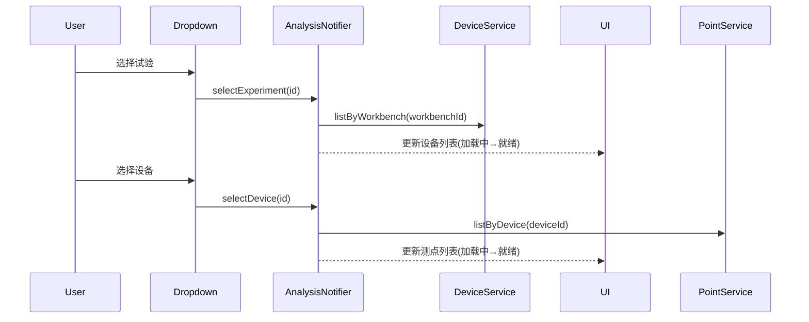
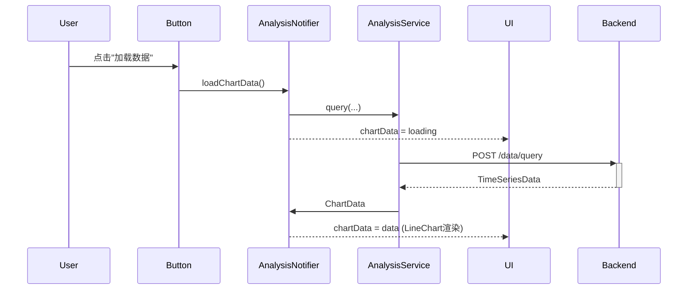

# TASK-026 数据分析与可视化 UI — 实现设计文档

> **任务**: TASK-026 — M9 数据分析与可视化
> **开发者**: sw-tom
> **日期**: 2026-06-08
> **路由**: `/analysis`
> **技术栈**: Flutter + Riverpod + fl_chart 1.2.0
> **依赖**: TASK-020 (Provider/WebSocket), TASK-005 (主题), TASK-007 (可复用组件)

---

## 1. 架构概览

### 1.1 分层架构

```
┌─────────────────────────────────────────────────────────────────────┐
│  UI Layer (Pages + Widgets)                                         │
│  ┌──────────────┐    ┌───────────────────────────────────────────┐  │
│  │ ControlPanel │    │ ChartArea                                  │  │
│  │  ┌──────────┐│    │  ┌──────────────┐  ┌───────────────────┐  │  │
│  │  │ExpDropdown││    │  │ ChartLegend  │  │ TimeSeriesChart   │  │  │
│  │  │DevDropdown││    │  └──────────────┘  │ (fl_chart)        │  │  │
│  │  │PointCheck ││    │                     └───────────────────┘  │  │
│  │  │TimeSelect ││    │  ┌───────────────────────────────────────┐ │  │
│  │  │Downsample ││    │  │ DataTablePanel (可选)                  │ │  │
│  │  │ActionBtns ││    │  └───────────────────────────────────────┘ │  │
│  │  └──────────┘│    └───────────────────────────────────────────┘  │
│  └──────────────┘                                                   │
├─────────────────────────────────────────────────────────────────────┤
│  State Layer (Riverpod Providers)                                   │
│  ┌──────────────────────────────────────────────────────────────┐   │
│  │ analysisProvider (AnalysisNotifier)                           │   │
│  │  ┌──────────┐ ┌──────────┐ ┌──────────┐ ┌────────────────┐  │   │
│  │  │experiment│ │  device  │ │  points  │ │  chartData     │  │   │
│  │  │ selection│ │ selection│ │ selection│ │  + status      │  │   │
│  │  └──────────┘ └──────────┘ └──────────┘ └────────────────┘  │   │
│  └──────────────────────────────────────────────────────────────┘   │
├─────────────────────────────────────────────────────────────────────┤
│  Service Layer                                                       │
│  ┌──────────────────────────────────────────────────────────────┐   │
│  │ AnalysisService → ExperimentService.queryData()              │   │
│  │ APiClient (Dio)                                              │   │
│  └──────────────────────────────────────────────────────────────┘   │
└─────────────────────────────────────────────────────────────────────┘
```

### 1.2 数据流

```
用户选择试验 → Provider 更新 selectedExperimentId → 级联加载设备列表
用户选择设备 → Provider 更新 selectedDeviceId → 级联加载测点列表
用户勾选测点 → Provider 更新 selectedPointIds
用户配置时间/降采样 → Provider 更新 timeRange/downsample
用户点击"加载数据" → Provider 调用 loadChartData()
  → AnalysisService.queryData() → 后端 POST /data/query
  → 更新 chartData (AsyncValue)
  → UI 渲染 LineChart/DataTable
```

### 1.3 状态管理（AnalysisNotifier）

使用 `AsyncNotifier<AnalysisState>` 模式，AnalysisState 是不可变数据类：

```dart
class AnalysisState {
  final AsyncValue<List<Experiment>> experiments;  // 试验列表
  final String? selectedExperimentId;
  final List<Device>? availableDevices;              // 根据所选试验加载
  final String? selectedDeviceId;
  final List<Point>? availablePoints;               // 根据所选设备加载
  final Set<String> selectedPointIds;
  final TimeRangePreset timePreset;
  final DateTime? customStart;
  final DateTime? customEnd;
  final int downsample;                             // 100-10000
  final AsyncValue<ChartData?> chartData;           // 图表数据
  final bool showDataTable;
  final bool isLoadingData;
}
```

---

## 2. 文件结构

### 2.1 新增/修改文件清单

| # | 文件 | 说明 | 状态 |
|---|------|------|------|
| 1 | `lib/services/analysis_service.dart` | 分析服务（封装数据查询） | 新增 |
| 2 | `lib/providers/analysis_provider.dart` | 分析页面状态管理 | 新增 |
| 3 | `lib/pages/analysis/analysis_page.dart` | 分析页主页面（重写） | 修改 |
| 4 | `lib/pages/analysis/widgets/control_panel.dart` | 控制面板容器 | 新增 |
| 5 | `lib/pages/analysis/widgets/experiment_dropdown.dart` | 试验下拉框 | 新增 |
| 6 | `lib/pages/analysis/widgets/device_dropdown.dart` | 设备下拉框 | 新增 |
| 7 | `lib/pages/analysis/widgets/point_checkbox_list.dart` | 测点复选框列表 | 新增 |
| 8 | `lib/pages/analysis/widgets/time_range_selector.dart` | 时间范围选择器 | 新增 |
| 9 | `lib/pages/analysis/widgets/downsample_slider.dart` | 降采样滑块 | 新增 |
| 10 | `lib/pages/analysis/widgets/chart_area.dart` | 图表区域容器 | 新增 |
| 11 | `lib/pages/analysis/widgets/chart_legend.dart` | 图表图例 | 新增 |
| 12 | `lib/widgets/time_series_chart.dart` | 时序折线图组件 | 新增 |
| 13 | `lib/pages/analysis/widgets/data_table_panel.dart` | 数据表格 | 新增 |

### 2.2 复用组件

| 组件 | 来源 | 用途 |
|------|------|------|
| `AsyncValueWidget` | `widgets/async_value_widget.dart` | 三态分发 |
| `ErrorView` | `widgets/error_view.dart` | 错误展示 |
| `EmptyView` | `widgets/empty_view.dart` | 空状态引导 |
| `Skeleton` | `widgets/skeleton.dart` | 加载占位 |
| `Toast` | `widgets/toast.dart` | 操作反馈 |

---

## 3. 数据模型

### 3.1 ChartData (新增)

```dart
/// 图表渲染数据
class ChartData {
  final List<ChartPointData> points;
  final bool isEmpty;  // 是否有数据

  DateTime get minTimestamp => points.first.timestamps.first;
  DateTime get maxTimestamp => points.first.timestamps.last;
}

/// 单个测点的图表数据
class ChartPointData {
  final String pointId;
  final String pointName;
  final String unit;
  final List<DateTime> timestamps;  // 毫秒时间戳
  final List<double?> values;       // 可能包含 null
  final Color color;                // 曲线颜色
}
```

---

## 4. 核心组件设计

### 4.1 TimeSeriesChart (fl_chart 1.2.0)

**配置要点：**
- `LineChartData` 使用 `FlGridData` 显示网格线
- X 轴：时间轴，格式 `HH:mm:ss` 或 `MM-dd HH:mm`
- Y 轴：自动范围，带单位标注
- 多曲线叠加，每曲线独立 `LineChartBarData`
- `LineTouchData` 支持多点悬停
- 缩放/平移通过 `minX`/`maxX` 控制

**缩放/平移实现：**
```dart
class TimeSeriesChart extends StatefulWidget {
  // 通过 minX/maxX 控制可见范围
  // 滚轮事件 → 调整比例
  // 拖拽 → 平移
  // 双击/重置 → 恢复初始
}
```

### 4.2 ControlPanel

- 宽度: 350px (Desktop), 280px (Tablet), 100% (Mobile)
- 可垂直滚动
- 使用 Divider 分隔各组

### 4.3 ChartArea

- flex: 1 剩余空间
- 包含图例 (ChartLegend) + 图表 + 状态切换
- 三态：EmptyView → Loading → Chart/Error

### 4.4 DataTablePanel

- 高度 250px，可切换显示
- sticky 表头
- 列：时间戳 + 各测点数值
- AnimatedSize 展开收起

---

## 5. 响应式布局策略

| 断点 | 布局 | 控制面板宽度 |
|------|------|-------------|
| Desktop (>1200px) | 左右分栏 | 350px 固定 |
| Tablet (600-1200px) | 左右分栏 | 280px 固定 |
| Mobile (<600px) | 上下堆叠 | 100% |

使用 `LayoutBuilder` + `MediaQuery` 判断断点。

---

## 6. 颜色方案

测点颜色（固定分配，用于曲线和图例）：

| 索引 | Light | Dark | 用途 |
|------|-------|------|------|
| 0 | #E53935 | #EF5350 | 第1条曲线 |
| 1 | #43A047 | #66BB6A | 第2条曲线 |
| 2 | #1E88E5 | #42A5F5 | 第3条曲线 |
| 3 | #FB8C00 | #FFA726 | 第4条曲线 |
| 4 | #8E24AA | #AB47BC | 备用 |
| 5 | #00ACC1 | #26C6DA | 备用 |

---

## 7. 关键交互实现

### 7.1 级联选择


### 7.2 加载数据


### 7.3 图表交互
- 滚轮缩放：监听 `Listener` 的 onPointerSignal，调整 minX/maxX
- 拖拽平移：使用 `GestureDetector` 的 onPanUpdate
- 图例切换：维护 `Set<String> hiddenPointIds`，动态过滤 LineChartBarData

---

## 8. 测试策略

参考 `log/release_3/test/TASK-026_test_cases.md`，覆盖：
1. **单元测试**: AnalysisService 请求构造、错误映射
2. **Widget 测试**: 各控件渲染、交互、三态
3. **集成测试**: 完整数据流

---

## 9. 性能考虑

- 超过 500 数据点隐藏 dot
- fl_chart 的 `preventCurveOverShooting` 防止过冲
- 降采样默认 1000 点
- 骨架屏 shimmer 使用 1.5s 循环动画
- 图表使用 `ClipRect` 防止溢出重绘

---

## 10. 风险与缓解

| 风险 | 影响 | 缓解措施 |
|------|------|----------|
| fl_chart 多Y轴支持有限 | 无法同时显示不同量级数据 | 统一Y轴 + 后续重构 |
| 大数据集合渲染卡顿 | 用户体验差 | 降采样 + 隐藏数据点 |
| 主题切换时图表闪烁 | 视觉不佳 | 使用 `AnimatedSwitcher` |
