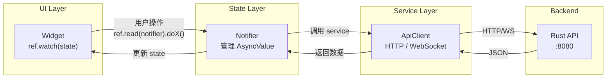

# Kayak 前端重写 — 架构设计方案

> **作者**: sw-jerry (Software Architect)
> **日期**: 2026-05-31
> **状态**: 提案 — 待用户审核
> **Release**: 3

---

## 0. 核心理念

> **界面是数据的投影，操作是向数据发送指令。**

- 所有 UI 状态来自单一数据源（后端 API 返回的 State）
- 用户操作 → 更新 State → UI 自动响应——不存在 `setState`、不存在 `controller.text = xxx`、不存在本地状态副本
- 每一层职责单一，拒绝过度抽象

---

## 1. 架构总览

### 1.1 分层架构（三层）

```
┌────────────────────────────────────────────────────────────────────┐
│                        UI Layer (纯展示)                            │
│   Widget 只做两件事：                                               │
│   1. ref.watch(provider) — 读取 State，渲染界面                      │
│   2. ref.read(provider.notifier).action() — 发送用户操作指令         │
│   ❌ 不调用 API、不维护本地状态、不写业务逻辑                          │
├────────────────────────────────────────────────────────────────────┤
│                       State Layer (状态管理)                         │
│   Notifier/Provider 只做三件事：                                     │
│   1. 接收 UI 的用户操作指令                                          │
│   2. 调用 Service 层执行 API 请求                                    │
│   3. 将结果更新到 State，触发 UI 重建                                │
│   ❌ 不直接操作 Widget、不持有 BuildContext                         │
├────────────────────────────────────────────────────────────────────┤
│                       Service Layer (通信)                           │
│   Service 只做一件事：                                               │
│   1. 封装 HTTP 请求 / WebSocket 连接 / 本地存储读写                   │
│   ❌ 不管理 State、不持有 Provider 引用                             │
└────────────────────────────────────────────────────────────────────┘
│                       Data Layer (模型)                              │
│   纯数据结构定义（DTO / Domain Models）                              │
└────────────────────────────────────────────────────────────────────┘
```

### 1.2 数据流



**关键约束**：数据流永远是单向的——Widget 永远不绕过 Notifier 直接调用 Service，Service 永远不直接修改 State。

---

## 2. 分层设计

### 2.1 UI Layer

**职责**：纯展示，无业务逻辑

```dart
// ✅ 正确做法：Widget 只读取 State
class WorkbenchListPage extends ConsumerWidget {
  Widget build(BuildContext context, WidgetRef ref) {
    final state = ref.watch(workbenchListProvider);
    return state.when(
      loading: () => const SkeletonList(),
      error: (e, _) => ErrorView(message: e.toString(), onRetry: () {
        ref.read(workbenchListProvider.notifier).load();
      }),
      data: (workbenches) => workbenches.isEmpty
        ? const EmptyView(message: 'No workbenches yet')
        : ListView.builder(...),
    );
  }
}

// ✅ 正确做法：操作通过 notifier 发送
onPressed: () {
  ref.read(workbenchListProvider.notifier).delete(id);
}

// ❌ 错误：直接操作 Controller
controller.text = 'xxx';

// ❌ 错误：setState 改局部状态
setState(() { _localData = ... });

// ❌ 错误：Widget 里直接调 API
final data = await ApiClient.getWorkbenches();
```

**三态原则**：每个数据驱动的界面区域必须有三种状态的可视呈现：

| 状态 | 表现 |
|------|------|
| **Loading** | 骨架屏 / 加载动画 |
| **Error** | 错误描述 + 重试按钮 |
| **Data (空)** | 友好的空状态引导 |
| **Data (有数据)** | 正常内容渲染 |

### 2.2 State Layer

**职责**：接收操作、调用 Service、更新 State

使用 **Riverpod** 的 `AsyncNotifier`（或 `StateNotifier` + `AsyncValue`）：

```dart
// 每个业务域一个 Notifier
class WorkbenchListNotifier extends AsyncNotifier<List<Workbench>> {
  Future<List<Workbench>> build() => _load();

  Future<List<Workbench>> _load() async {
    final service = ref.read(workbenchServiceProvider);
    return service.list();
  }

  Future<void> create(CreateWorkbenchRequest req) async {
    final service = ref.read(workbenchServiceProvider);
    state = const AsyncLoading();
    state = await AsyncValue.guard(() async {
      await service.create(req);
      return _load();  // 创建后重新加载列表
    });
  }

  Future<void> delete(String id) async {
    final service = ref.read(workbenchServiceProvider);
    state = await AsyncValue.guard(() async {
      await service.delete(id);
      return _load();
    });
  }
}

// Provider 定义
final workbenchListProvider =
    AsyncNotifierProvider<WorkbenchListNotifier, List<Workbench>>(
  WorkbenchListNotifier.new,
);
```

**State 设计原则**：
- **不可变**：State 使用 `freezed` 或 `equatable` 确保不可变性
- **单一数据源**：同一份数据只有一个 Provider，避免重复请求
- **AsyncValue**：统一处理 loading/error/data 三态

### 2.3 Service Layer

**职责**：封装 HTTP 请求和 WebSocket 通信

```dart
// Service 是纯函数式的——输入参数，返回 Future/Stream
class WorkbenchService {
  final ApiClient _client;

  WorkbenchService(this._client);

  Future<List<Workbench>> list({int page = 1, int size = 10}) async {
    final response = await _client.get(
      '/api/v1/workbenches',
      queryParameters: {'page': page, 'size': size},
    );
    final data = ApiResponse.fromJson(response.data, Workbench.listFromJson);
    return data.data;
  }

  Future<Workbench> create(CreateWorkbenchRequest req) async {
    final response = await _client.post('/api/v1/workbenches', data: req.toJson());
    final data = ApiResponse.fromJson(response.data, Workbench.fromJson);
    return data.data;
  }

  Future<void> delete(String id) async {
    await _client.delete('/api/v1/workbenches/$id');
  }
}
```

### 2.4 Data Layer

**职责**：纯数据结构定义

```dart
// 使用 freezed 生成不可变数据类
@freezed
class Workbench with _$Workbench {
  const factory Workbench({
    required String id,
    required String name,
    String? description,
    required String status,
    required DateTime createdAt,
  }) = _Workbench;

  factory Workbench.fromJson(Map<String, dynamic> json) =>
      _$WorkbenchFromJson(json);
}
```

**重要**：不引入 Repository 层——Service 直接返回 DTO，避免不必要的抽象。

---

## 3. 状态管理方案

### 3.1 选择 Riverpod（`flutter_riverpod`）

**为什么是 Riverpod？**

| 对比项 | Provider | Bloc | Riverpod |
|--------|----------|------|----------|
| 编译时安全 | ❌ 运行时 | ✅ | ✅ |
| 独立于 BuildContext | ❌ | ✅ | ✅ |
| 组合 Provider | ❌ | 复杂 | ✅ (`ref.watch`) |
| 自动 dispose | ❌ 手动 | ✅ | ✅ 自动 |
| 测试友好 | 一般 | 好 | 极好 |
| 学习曲线 | 低 | 中 | 中低 |
| 与数据驱动理念匹配 | 一般 | 好 | **最佳** |

### 3.2 使用方式

```
Provider 类型选择：

AsyncNotifierProvider → 有异步加载 + 刷新操作（列表、详情） ✅ 主力
NotifierProvider       → 有纯同步操作（主题、语言切换）
StreamProvider         → WebSocket 实时数据                     ✅ WebSocket
Provider               → 只读依赖注入（Service 实例）
```

**Provider 文件组织**：

```
lib/providers/
├── workbench_provider.dart    # 工作台相关所有 Provider
├── device_provider.dart       # 设备相关
├── experiment_provider.dart   # 试验相关
├── auth_provider.dart         # 认证
├── team_provider.dart         # 团队
├── settings_provider.dart     # 主题/语言
└── services.dart              # Service 实例（Provider 依赖注入）
```

### 3.3 Provider 设计原则

1. **一个 Provider 只管理一种数据**（单一职责）
2. **父子 Provider 通过 `ref.watch` 通信**（组合）
3. **所有异步 State 必须使用 `AsyncValue`**（统一三态处理）
4. **Service 通过 Provider 注入**（方便测试 mock）
5. **所有业务 State 都来自后端**（不维护本地副本）

---

## 4. 目录结构

```
kayak-frontend/lib/
├── main.dart                     # 入口：ProviderScope + KayakApp
├── app.dart                      # MaterialApp.router 配置
│
├── models/                       # 数据模型（纯 Dart 类，freezed）
│   ├── workbench.dart
│   ├── device.dart
│   ├── point.dart
│   ├── method.dart
│   ├── experiment.dart
│   ├── team.dart
│   ├── user.dart
│   └── common.dart               # ApiResponse<T>、分页模型
│
├── services/                     # Service 层（HTTP/WS 通信）
│   ├── api_client.dart           # Dio 实例 + 拦截器
│   ├── auth_service.dart
│   ├── workbench_service.dart
│   ├── device_service.dart
│   ├── point_service.dart
│   ├── method_service.dart
│   ├── experiment_service.dart
│   ├── team_service.dart
│   ├── user_service.dart
│   └── ws_service.dart           # WebSocket 连接管理
│
├── providers/                    # State 层（Riverpod Providers）
│   ├── auth_provider.dart        # AuthNotifier
│   ├── workbench_provider.dart   # WorkbenchListNotifier + WorkbenchDetailNotifier
│   ├── device_provider.dart
│   ├── point_provider.dart
│   ├── method_provider.dart
│   ├── experiment_provider.dart
│   ├── team_provider.dart
│   ├── settings_provider.dart    # ThemeNotifier + LocaleNotifier
│   └── services.dart             # Service 实例注入
│
├── pages/                        # UI 层（页面）
│   ├── auth/
│   │   ├── login_page.dart
│   │   └── register_page.dart
│   ├── dashboard/
│   │   └── dashboard_page.dart
│   ├── workbench/
│   │   ├── workbench_list_page.dart
│   │   └── workbench_detail_page.dart
│   ├── device/
│   │   └── device_tree_page.dart
│   ├── point/
│   │   └── point_list_page.dart
│   ├── method/
│   │   ├── method_list_page.dart
│   │   └── method_edit_page.dart
│   ├── experiment/
│   │   ├── experiment_list_page.dart
│   │   └── experiment_console_page.dart
│   ├── analysis/
│   │   └── analysis_page.dart
│   ├── team/
│   │   ├── team_list_page.dart
│   │   └── team_detail_page.dart
│   └── settings/
│       └── settings_page.dart
│
├── widgets/                      # 可复用组件
│   ├── app_shell.dart            # 应用外壳（导航栏 + 内容区）
│   ├── async_value_widget.dart   # 统一三态 Widget
│   ├── error_view.dart           # 错误 + 重试
│   ├── empty_view.dart           # 空状态
│   ├── skeleton.dart             # 骨架屏
│   ├── confirm_dialog.dart       # 确认对话框
│   └── toast.dart                # 操作反馈
│
├── theme/
│   ├── colors.dart
│   ├── typography.dart
│   └── app_theme.dart            # lightTheme() + darkTheme()
│
├── router/
│   └── app_router.dart           # go_router 路由配置
│
├── l10n/                         # 国际化
│   ├── app_en.arb
│   └── app_zh.arb
│
└── utils/
    ├── date_format.dart
    └── error_handler.dart        # 后端错误码 → 用户可读消息
```

**目录设计原则**：
- 按**功能**分组（auth、workbench、experiment...），不是按类型（screens、widgets...）
- 每个功能域下有 `page`，不拆分过多的子目录
- `widgets/` 和 `utils/` 放的是跨域的共享组件

---

## 5. 关键技术决策

### 5.1 路由方案：`go_router`

**选择理由**：声明式路由 + 深层链接支持 + Web 兼容

```dart
final routerProvider = Provider<GoRouter>((ref) {
  final authState = ref.watch(authStateProvider);

  return GoRouter(
    initialLocation: '/dashboard',
    redirect: (context, state) {
      final loggedIn = authState.isLoggedIn;
      final onLogin = state.matchedLocation == '/login';

      if (!loggedIn && !onLogin) return '/login';
      if (loggedIn && onLogin) return '/dashboard';
      return null;
    },
    routes: [
      GoRoute(path: '/login', builder: (_, __) => const LoginPage()),
      GoRoute(path: '/register', builder: (_, __) => const RegisterPage()),
      ShellRoute(
        builder: (_, __, child) => AppShell(child: child),
        routes: [
          GoRoute(path: '/dashboard', builder: (_, __) => const DashboardPage()),
          GoRoute(
            path: '/workbenches',
            routes: [
              GoRoute(path: '/', builder: (_, __) => const WorkbenchListPage()),
              GoRoute(path: '/:id', builder: (_, s) =>
                WorkbenchDetailPage(id: s.pathParameters['id']!)),
            ],
          ),
          // ... 其他路由
        ],
      ),
    ],
  );
});
```

### 5.2 HTTP 客户端：`dio`

**选择理由**：拦截器机制（Token 自动附加 + 401 自动刷新 + 错误统一处理）

```dart
class ApiClient {
  late final Dio _dio;

  ApiClient({required AuthService authService}) {
    _dio = Dio(BaseOptions(baseUrl: 'http://localhost:8080'));
    _dio.interceptors.addAll([
      AuthInterceptor(authService),   // 自动附加 Token
      ErrorInterceptor(),              // 统一错误处理
      LogInterceptor(),               // 调试日志
    ]);
  }
}
```

### 5.3 WebSocket 管理

```dart
class WsService {
  WebSocketChannel? _channel;

  // 返回 Stream，UI 层通过 StreamProvider 消费
  Stream<ExperimentMessage> connect(String experimentId) {
    _channel = WebSocketChannel.connect(
      Uri.parse('ws://localhost:8080/ws/experiments/$experimentId'),
    );
    return _channel!.stream
        .map((data) => ExperimentMessage.fromJson(jsonDecode(data)));
  }

  void disconnect() {
    _channel?.sink.close();
    _channel = null;
  }
}
```

### 5.4 本地存储

| 存储需求 | 技术 | 理由 |
|----------|------|------|
| Token（敏感） | `flutter_secure_storage` | 加密存储 |
| 主题/语言设置 | `shared_preferences` | 简单键值对 |

**注意**：不做业务数据本地缓存——每次操作后从后端重新拉取最新状态，避免状态不一致。

### 5.5 国际化方案：`flutter_localizations` + ARB

- 使用 Flutter 官方推荐的 `flutter_localizations` + `intl` + ARB 文件
- 翻译文件：`lib/l10n/app_en.arb`、`lib/l10n/app_zh.arb`
- 通过 `LocaleNotifier` 管理语言切换，设置持久化到 `shared_preferences`

### 5.6 响应式布局策略

不使用第三方响应式库，使用 Flutter 内置机制：

```dart
// 用 LayoutBuilder + 断点常量决定布局
class ResponsiveLayout extends StatelessWidget {
  Widget build(BuildContext context) {
    return LayoutBuilder(
      builder: (context, constraints) {
        if (constraints.maxWidth < 600) return mobileLayout;
        if (constraints.maxWidth < 1200) return tabletLayout;
        return desktopLayout;
      },
    );
  }
}
```

断点定义：
- **Mobile**: < 600px → 单栏，底部导航
- **Tablet**: 600-1200px → 双栏，侧边栏可折叠
- **Desktop**: > 1200px → 双栏/三栏，固定侧边栏

### 5.7 技术栈汇总

| 类别 | 技术 | 版本 | 用途 |
|------|------|------|------|
| 框架 | Flutter | 3.19+ | UI |
| 语言 | Dart | 3.3+ | 编程语言 |
| 状态管理 | flutter_riverpod | 2.x | Provider/Notifier |
| 路由 | go_router | 13.x | 声明式路由 |
| HTTP | dio | 5.x | API 请求 |
| WebSocket | web_socket_channel | 2.x | 实时通信 |
| 安全存储 | flutter_secure_storage | 9.x | Token 存储 |
| 配置存储 | shared_preferences | 2.x | 主题/语言 |
| 序列化 | freezed + json_annotation | 2.x | 不可变数据类 |
| 国际化 | flutter_localizations + intl | - | i18n |
| 图表 | fl_chart | 0.x | 数据可视化 |

**不做过度依赖**：不引入 `dartz`（Either 类型加重泛型复杂度）、不引入 `flutter_bloc`（比 Riverpod 更重）、不引入 ORM/数据库（不做本地缓存）。

---

## 6. 与后端的对接原则

### 6.1 API 响应统一处理

后端返回格式：
```json
{
  "code": 200,
  "message": "success",
  "data": { ... },
  "timestamp": "2026-05-31T10:00:00Z"
}
```

前端统一解析：
```dart
@freezed
class ApiResponse<T> with _$ApiResponse<T> {
  const factory ApiResponse({
    required int code,
    required String message,
    required T data,
    String? timestamp,
  }) = _ApiResponse<T>;

  factory ApiResponse.fromJson(
    Map<String, dynamic> json,
    T Function(dynamic) fromJsonT,
  ) => _$ApiResponseFromJson(json, fromJsonT);
}
```

### 6.2 错误处理

```dart
class ErrorInterceptor extends Interceptor {
  void onError(DioException err, ErrorInterceptorHandler handler) {
    final userMessage = _toUserMessage(err);
    // 统一弹出错误提示
    handler.next(DioException(
      requestOptions: err.requestOptions,
      message: userMessage,  // 用户可读的错误信息
    ));
  }

  String _toUserMessage(DioException err) {
    switch (err.response?.statusCode) {
      case 400: return '请求参数有误，请检查输入';
      case 401: return '登录已过期，请重新登录';
      case 403: return '您没有权限执行此操作';
      case 404: return '请求的资源不存在或已被删除';
      case 409: return '资源冲突，可能已存在相同名称的记录';
      case 422: return '数据验证失败，请检查输入';
      case 500: return '服务器内部错误，请稍后重试';
      default:
        if (err.type == DioExceptionType.connectionTimeout) {
          return '连接超时，请检查网络';
        }
        return '网络错误，请检查连接';
    }
  }
}
```

### 6.3 认证/Token 管理

```dart
class AuthInterceptor extends Interceptor {
  final AuthService _authService;

  void onRequest(RequestOptions options, RequestInterceptorHandler handler) {
    final token = _authService.accessToken;
    if (token != null) {
      options.headers['Authorization'] = 'Bearer $token';
    }
    handler.next(options);
  }

  void onError(DioException err, ErrorInterceptorHandler handler) async {
    if (err.response?.statusCode == 401) {
      // 尝试刷新 Token
      final success = await _authService.tryRefresh();
      if (success) {
        // 重试原请求
        final retryOptions = err.requestOptions;
        retryOptions.headers['Authorization'] =
            'Bearer ${_authService.accessToken}';
        final retryResponse = await Dio().fetch(retryOptions);
        return handler.resolve(retryResponse);
      }
      // 刷新失败，跳转登录
      _authService.logout();
    }
    handler.next(err);
  }
}
```

### 6.4 WebSocket 重连策略

```
断开 → 等待 2s → 重连
再次断开 → 等待 4s → 重连
再次断开 → 等待 8s → 重连
最大重试 5 次，超过显示"连接已断开"
```

---

## 7. 测试策略

### 7.1 单元测试（Service + Provider）

```dart
// Provider 测试：mock Service，验证 State 变化
test('workbenchListProvider loads data successfully', () async {
  final container = createContainer(
    overrides: [
      workbenchServiceProvider.overrideWithValue(MockWorkbenchService()),
    ],
  );

  final notifier = container.read(workbenchListProvider.notifier);
  await notifier.load();

  final state = container.read(workbenchListProvider);
  expect(state.value, isNotEmpty);
});

// Error 状态测试
test('workbenchListProvider shows error on failure', () async {
  final container = createContainer(
    overrides: [
      workbenchServiceProvider
          .overrideWithValue(MockFailingWorkbenchService()),
    ],
  );

  final notifier = container.read(workbenchListProvider.notifier);
  await notifier.load();

  final state = container.read(workbenchListProvider);
  expect(state.hasError, true);
});
```

### 7.2 Widget 测试（配截图）

```dart
testWidgets('WorkbenchListPage shows empty state', (tester) async {
  await tester.pumpWidget(
    ProviderScope(
      overrides: [
        workbenchListProvider.overrideWith((ref) => AsyncData([])),
      ],
      child: const MaterialApp(home: WorkbenchListPage()),
    ),
  );

  expect(find.text('No workbenches yet'), findsOneWidget);

  // 截图
  await tester.pumpAndSettle();
  await _takeScreenshot(tester, 'workbench_list_empty');
});
```

**截图要求**：每个关键页面的每种状态（loading/empty/error/data）都需要截图。

### 7.3 集成测试

```dart
testWidgets('Full login flow', (tester) async {
  // 启动完整 App
  await tester.pumpWidget(const KayakApp());
  await tester.pumpAndSettle();

  // 1. 应该显示登录页
  expect(find.text('Email'), findsOneWidget);

  // 2. 输入凭据
  await tester.enterText(find.byType(TextFormField).at(0), 'admin@kayak.local');
  await tester.enterText(find.byType(TextFormField).at(1), 'Admin123');
  await tester.tap(find.text('Login'));
  await tester.pumpAndSettle();

  // 3. 应该跳转到仪表盘
  expect(find.text('Dashboard'), findsOneWidget);
});
```

### 7.4 测试覆盖要求

| 测试类型 | 覆盖内容 | 必须截图？ |
|----------|----------|:---------:|
| 单元测试 | Service、Provider 逻辑 | 否 |
| Widget 测试 | 各页面状态渲染 | **是** |
| 集成测试 | 关键用户旅程 | 是 |

---

## 8. 为什么这个架构是简洁且数据驱动的

### 8.1 简洁

1. **只有三层**：UI → State → Service。没有 Repository、没有 UseCase、没有多余的抽象层。
2. **每个文件职责单一**：一个文件要么是 Widget（UI）、要么是 Notifier（State）、要么是 Service（通信）、要么是 Model（数据）。
3. **Provider 文件不拆分到子目录**：每个域的 Provider 一个文件解决，不搞三层嵌套。
4. **依赖最小化**：仅引入 Riverpod + Dio + go_router + freezed + 图表库。没有 Bloc、没有 dartz、没有本地数据库。

### 8.2 数据驱动

1. **一切数据来自 Provider**：Widget 通过 `ref.watch(provider)` 获取数据，`provider.state` 的变化自动触发 UI 重绘。
2. **一切操作通过 Notifier**：`ref.read(provider.notifier).doSomething()` → Notifier 调用 Service → Service 调用 API → 更新 State → UI 自动响应。
3. **没有 `setState`**：不维护任何局部可变状态，所有可变状态都在 State Layer 中。
4. **没有 `controller.text = xxx`**：文本输入通过回调更新 Provider，然后 Provider 驱动的 UI 自动更新。
5. **单一数据源**：同一份数据（如工作台列表）只有一个 Provider。不同 Widget 消费同一个 Provider，数据天然一致。

---

## 附录：与后端 API 的对应关系

| 前端 Provider | 后端端点 |
|---------------|----------|
| `authProvider` | POST login, POST register, POST refresh, GET me |
| `userProvider` | GET/PUT /users/me |
| `workbenchListProvider` | GET/POST /workbenches |
| `workbenchDetailProvider` | GET/PUT/DELETE /workbenches/:id |
| `deviceTreeProvider` | GET/POST /devices, GET/PUT/DELETE /devices/:id |
| `pointListProvider` | GET/POST /points, GET/PUT/DELETE /points/:id |
| `methodListProvider` | GET/POST /methods |
| `methodDetailProvider` | GET/PUT/DELETE /methods/:id |
| `experimentListProvider` | GET /experiments |
| `experimentControlProvider` | POST start/pause/resume/stop |
| `experimentWsProvider` | WS /ws/experiments/:id |
| `experimentDataProvider` | GET /experiments/:id/data, GET /experiments/:id/data/download |
| `teamListProvider` | GET/POST /teams |
| `teamDetailProvider` | GET/PUT/DELETE /teams/:id, GET /teams/:id/members |
| `settingsProvider` | 本地（主题/语言持久化） |

---

> **请用户审核以上架构方案，确认后我将进入详细设计阶段。**
